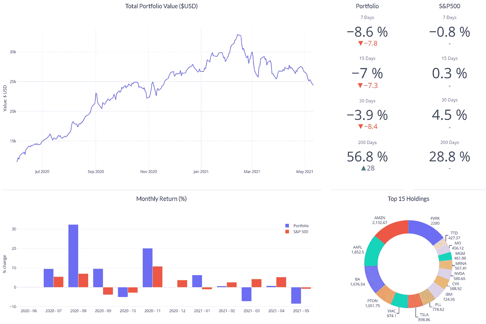
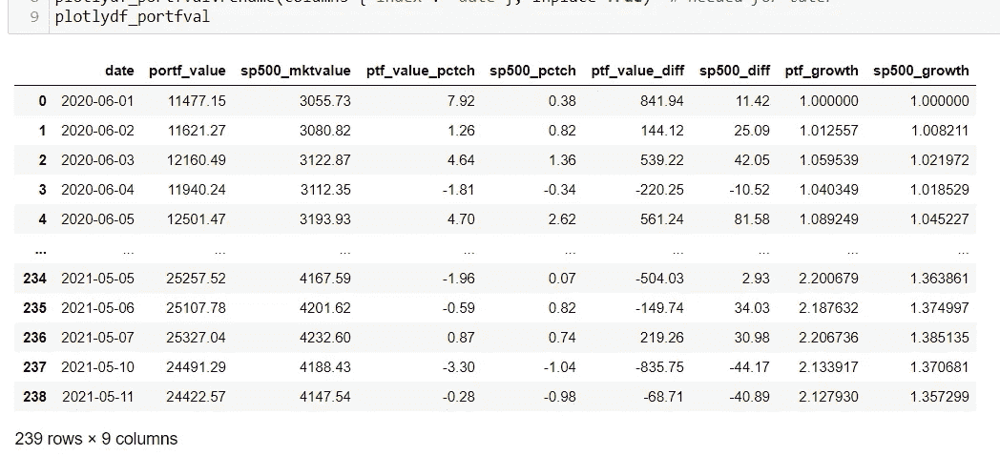
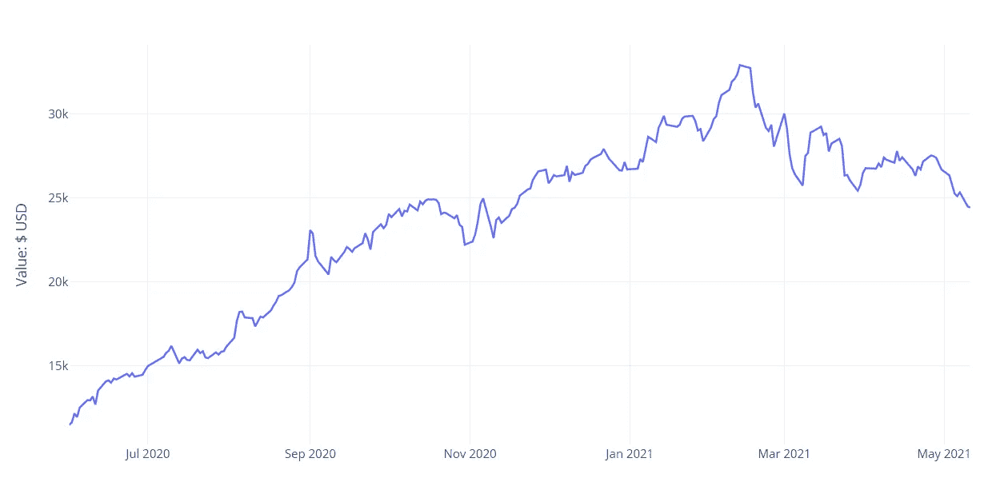
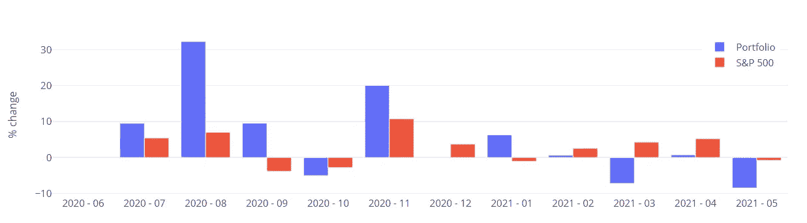
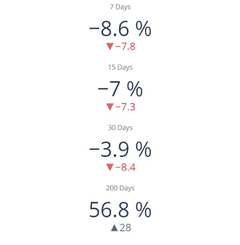
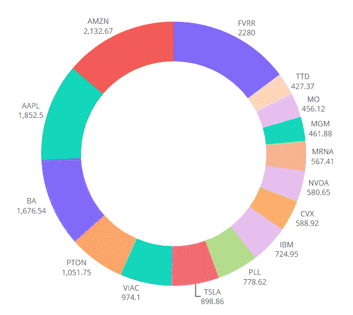
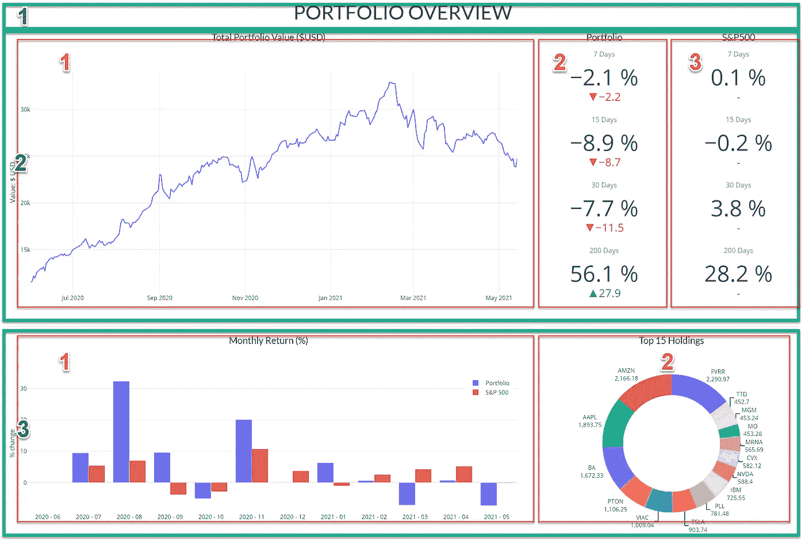
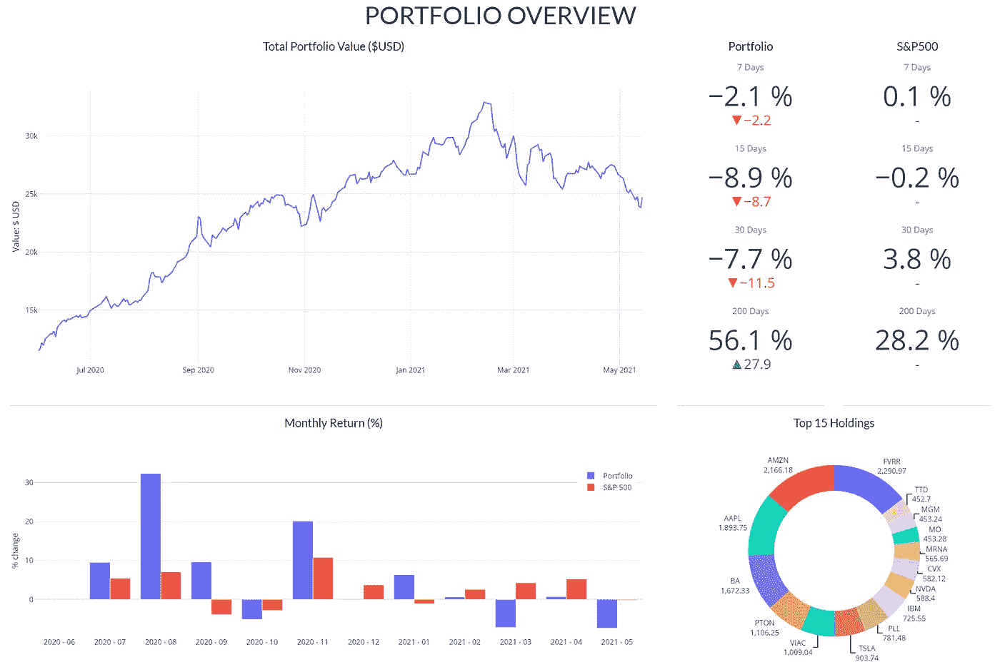

# 创建一个仪表板来跟踪任何与 Plotly 和 Dash

> 原文：<https://towardsdatascience.com/create-a-dashboard-to-track-anything-with-plotly-and-dash-f9a5234d548b?source=collection_archive---------1----------------------->

## 或者“我如何停止使用第三方应用程序来跟踪我的投资”！自己的模板真的很容易上手。

剧透警告:这不是我的实际投资组合！

# 早期的探索

自从我开始投资我的血汗钱，我就痴迷于拥有某种仪表板或工具，让我能够快速了解事情的进展。

我对 Excel 并不陌生，我曾经有一个交易日志，很快就变得太无聊而无法填写…还有一些工作涉及到标准化来自我当时使用的两个经纪人的交易数据，这没有帮助。

所以在浪费了一些时间尝试定制一些有趣的仪表盘和在线模板后，我得出结论: **Python** 是我的最佳选择！

> **请注意:**投资组合数据仅仅是一个例子，但是**我们将创建的模板可以非常容易地适应其他数据—** 我将向您展示如何实现。本文中的任何内容都不应被视为财务建议！

我已经知道我想要看到什么样的指标和图表，所以这帮助我在头脑中已经有了几个目标的情况下开始这个项目。从一开始，我就设想在我的仪表板上至少有两页纸。主页面会给我一个投资组合总价值的视图，而第二个页面会让我浏览每只股票的进出情况。

> 我能想到十几个这样的应用程序，但通常你必须付费才能使用这些很酷的功能…

那么，为什么不构建您自己的仪表盘并根据您的需求进行定制呢？我将帮助你开始布局和基本功能，我们将看看我们如何能发展它。在跳到仪表板之前，我们需要做一些预处理，但我保证这是值得的！

可以跟着**笔记本里面的** [**资源库**](https://github.com/fnneves/portfolio_tracker_medium) 一起看。我还**录制了一个教程**，在那里我可能会更详细地解释一些部分。

*如果你想要一个更高级的仪表盘来分析你的投资组合，我推荐你参加* [*高级课程*](https://skl.sh/3Lne3uw) *！*

*如果你是 Python 和 Plotly 的新手，我有自己的* [*免费 Plotly 速成班*](https://bit.ly/3pRICk4) *让你快速上手！*

# 准备我们有史以来最好的仪表板

对于这个项目，我决定混合使用 Plotly、Dash 和一些引导主题。有了 Python 的一些基本概念，您应该能够很快理解并构建自己的仪表板！我现在将把重点放在主页上，因为已经做了很多工作。

以下是我们今天的目标:

*   准备交易和股票价格
*   我们全球投资组合价值随时间变化的图表
*   对比我们与 S&P500 的回报
*   多个 KPI，如 7D/15D/30D/YTD 绩效
*   我们投资组合中的顶级股票
*   用 Dash 和 Plotly 创建我们仪表板的第一个版本

为了获得所有这些信息，我们需要我们的交易历史和我们交易的股票的历史价格。

<https://medium.com/@fneves/membership>  

## 交易—2.0 版

我们首先从我们的代理导出交易历史(希望您也能以 CSV 格式获得它)。然后，我们需要获取该表并计算一些额外的列。大多数情况下，您会看到常见的“日期、股票、买入/卖出、价格、价值”列，我会添加其他列，如股票的累计头寸和累计成本、交易损益等。

这些计算是一个独立项目的一部分，我有一个 python 脚本来完成它。代码有点难解释，但是我已经把它作为我准备的整个项目的**课程的一部分。[稍后会有更多信息](https://fneves.podia.com/dashboards-plotly-dash)。**

尽管如此，我还是在 [**存储库**](https://github.com/fnneves/portfolio_tracker_medium) 中包含了一个改进的事务历史的工作示例。您可以使用它来帮助您计算自己的增强数据集。

因此，从存储库中获取代码，首先确保您拥有所有必需的包并导入它们。

## 收集价格

第二部分相对简单，我将向您展示如何快速获得任何股票的价格历史。你甚至可以保存价格，以后再用，或者你可以进行一次强迫症的冒险，开始用 1 分钟蜡烛建立你自己的数据库！

这部分我准备用一个在其他文章里看到很多的知名包！它叫 [yfinance](https://pypi.org/project/yfinance/) ，真的很好用，还有[熊猫 datareader](https://pypi.org/project/pandas-datareader/) 。在用下面的日期变量定义了我们分析的开始之后，我们可以创建并运行函数 *get_prices* ，如下所示。

我建议从一两年前开始，然后尝试从 1920 年开始每天都点蜡烛。你交易历史中的股票越多，提取它们的时间就越长，但通常很快。

完成后，您将获得一个名为 *all_data* 的变量，它本质上是一个数据框架，包含每个股票及其日线图的多索引。

我们会马上把它变成一本字典，使它更容易与我们的交易历史信息合并。

## “团结”和征服

这是我们把头寸规模和股价放在一起的部分。这使我们能够获得全球**投资组合价值**和其他重要指标。

关于 Python **字典**的一个很酷的事情是，你可以创建一个循环来给它们提供几个数据帧，这非常方便，因为你可以稍后只使用 mega_dict['AAPL']调用一个特定的 ticker。下面，我将遍历过滤后的报价器列表中的每一个报价器，并在没有交易的日子里填补空白。

看看那本词典中的任何一个关键词，看看有什么信息。每个列名都以 ticker 开头，所以我们以后可以使用它。

我们还需要包含“mktvalue”的每一列来计算我们投资组合的总价值**。出于这个原因，我们还需要一个漂亮的数据框架，其中包含每个股票的所有列。你猜对了——它叫 *mega_df* ！**

## 有价值的专栏

为了获得代表每只股票在任何给定日期的市场价值的每一列，我们使用一个过滤器，然后**对每行**中的所有值求和。“portf_value”列现在是您的全球投资组合价值。

获取 S&P500 的价格也很简单，我们可以将它与之前的数据框架结合起来。我们已经可以计算一些有用的东西，比如每日百分比变化，以及价值差异。

我在下面添加了一些额外的指标，我计划稍后在我们的仪表板上使用，作为我们指标部分的一部分。

# 用 Plotly 绘制我们自己的图表

如果你有使用 matplotlib 的经验，Plotly 可能看起来很奇怪。对我来说是，当我开始的时候！但事实是，您可以创建交互式图表，然后将它们与 Dash 这样的框架结合起来，以生成真正强大的仪表板。

Dash 使用 Flask 做后端(在你的电脑上创建一个本地服务器，用 dashboard 本身托管一个“页面”)，所以如果你已经了解 Flask，你肯定有优势。对 HTML 如何工作的一些基本理解可能也会派上用场。

但在我看来，这个项目最棒的部分是这个布局可以回收用于不同的项目。当我在做这个的时候，我实际上做了一些调整，以便能够跟踪我的加密组合。如果你感兴趣，请在评论中告诉我！

对于 Seaborn 的粉丝来说，Plotly 乍一看可能显得过于简单和局限。不要让他们网站上的 3 行示例欺骗了你…有很多你可以定制的。为了供您参考，我将留下一些我经常使用的设置，您应该有一个很好的起点来尝试这些设置。

## 投资组合价值

我喜欢让代码保持整洁，所以我将创建一个新的数据框架，我们可以参考这个特定的图表。我还将定义一个开始日期，以使图表更加清晰。

不要害怕评论和编辑这些参数。您可以简单地按照逻辑顺序分解更新**。**我留下了几行，在那里我改变了布局边距，或者布局高度，以及其他。

解决这个问题的一个好方法是记住每个图表都是以一个**图形**对象开始的。一旦你声明了那个变量，你就向它添加了元素，比如图表。您还可以添加新的行来添加更多的内容，包括对其格式的更改。完成定制后，运行“show()”方法来显示图表。

现在看起来有点“赤裸裸”，但我更喜欢以后将标题作为 HTML 元素添加进去。当我们开始冲刺时，我会告诉你怎么做。随意取消示例中标题更新的注释(第 30 行)，看看它是如何显示的。使用这段代码，我们刚刚创建了第一个仪表板图表。检查如何交互式地选择图表的特定部分！

我希望代码中的**注释**容易理解，但是如果你迷路了，或者想尝试更高级的东西，一定要去他们的[网站](https://plotly.com/python/)。他们有大量的例子供你探索！

## 对比我们与 S&P500 的增长

对于我们的第二个图表，我们将**比较我们的月收益和 S & P500 收益**。我打算在这里使用日线时间框架，但是如果你有超过几个月的交易，柱线会变得很小。因此，我不得不为这个图表设计一个新的列，并进行一些操作来为我们的下一个 Plotly 图表获得正确的格式。

一旦我们得到了新的数据框架，就很容易创建一个条形图。如果你花一些时间浏览代码，请注意我们正在做和以前一样的事情。首先，我们声明一个 Figure 对象变量。

然后我们给它添加两条迹线，这将是我们图表中的系列。然后，我们用一些额外的线条使图表看起来更好。不要忘记使用“barmode”作为*组*(第 27 行)。

在 X 轴上使用“时间周期”变量

## KPI 卡

这部分将给你的仪表板一个非常漂亮的触感。我希望能够看到我的投资组合相对于标准普尔的表现。我将在下一个数字中添加四个元素。这些被称为指示器，如果你喜欢仪表和速度计，文档中也有一些。

请注意，底部的数字是“百分点”

这四个要素将包含我们投资组合在 7、15、30 和 200 天内的表现。

另外，我将为每个元素添加一个 delta 参数，参考标准普尔指数相同的时间框架表现。

如果您使用“数字+增量”模式，我们的指示器将显示我们的性能，并与我们的参考进行比较。

出于本文的目的，我将添加与 S&P 性能相同的四个元素，但是这里没有增量。这两列稍后将并排显示在我们的仪表板上！

## 我们投资组合中的顶级股票

这篇文章已经有点长了，但是我觉得我还需要给你看一样东西！根据你持有的股票数量，你可能想看看你持有的最多的股票是什么。这是我们主页的另一个很酷的功能，但是我们必须获得**当前价格**才能计算我们的**当前头寸**。

出于多样性的考虑，我将分享一种不同的获取股票信息的方法——这次是“常规市场价格”。这是一个简单的循环，使用了 *yfinance* 包，但这不是最有效的方法，因为它在返回我们需要的信息之前，为每个股票获取了大量信息。

尽管如此，请随意使用它进行试验，并获取更多的信息，如部门和行业信息，我将在下一篇文章中介绍。

> 如果你想让这个仪表板更上一层楼，我准备的课程可能会让你感兴趣。[在此查看更多详情](https://fneves.podia.com/dashboards-plotly-dash)！

快速提示:如果你和我一样，只是不能忍受饼图，我决定给这个一个转折，把它变成一个甜甜圈。你可以用参数“孔”来达到这个效果。不客气！

# 用破折号组合所有元素

*快到了！*

现在，我们已经拥有了仪表板第一部分所需的所有图表，并准备将它们放入 Dash 应用程序中。

如果你是 Dash 的新手，就把它想象成一个在你的电脑上运行的服务器，它**在那个服务器上托管一个网页**，上面有你发送到那里的*信息*。您可以通过您最喜欢的浏览器访问它，运行方法"**"时它会提供链接。run_server()** ”。

使该页面看起来像仪表板的最简单的方法是使用 [Bootstrap](https://hellodash.pythonanywhere.com/) 模板(带有许多样式选项的预建模板)，并将 Plotly 图表添加到 Dash 应用程序中。您将能够像编写网页一样编写代码，向其中添加组件，采用块结构—就像 HTML 一样。

我在 [**视频**](https://youtu.be/wYvx8K-nzg4) 中回顾了一些技术方面的内容**，但你需要记住的主要事情是，我们仪表盘上的所有组件都在一个**容器**内。**

这个容器可以有行和列。每行和每列都可以包含多个组件(HTML、Dash 核心组件(dcc)、Dash 引导组件(dbc))。最后，一个组件可以是一个简单的文本段落，或者一个标题，一个图表(像 plotly 图表)，一个下拉菜单，以及许多其他东西。

这将是我们的网格。绿色的三个主要行，以及第 2 行和第 3 行的一些列

Dash 甚至允许您使用回调函数，这将使仪表板**对用户输入做出响应**，如选择日期、切换、下拉菜单中的项目以及许多其他事情。**这些特性将在下一篇文章**中添加，因此用户可以更改日期，例如选择特定的股票进行分析。

再看一下我们正在创建的网格，然后看看下面的代码。你应该很容易找到这三行(第 5 行、第 7 行和第 31 行)。

这是告诉您**行在**列之前的最佳时机。如果你反过来做，你会得到一些错误！

如果这是你的第一个 Dash 教程，我知道这可能是一个令人生畏的代码片段！如果你不能理解每一句话，试着去读每一行**甚至**。如果你能把它和我放在上面的仪表盘或布局图并排比较，会有所帮助。

如果你喜欢黑暗模式，你可以很快改变主题。在第 1 行，我使用 Bootstrap 的内置 FLATLY 主题。这个网站有一个很酷的方式来查看所有可用的主题。你只需要把名字改成你想尝试的(比如 MINTY，SLATE 等。)—但为此您需要[dash _ bootstrap _ components](https://dash-bootstrap-components.opensource.faculty.ai/)。

# 下一步是什么？

我们现在有了自己的仪表板，可以快速查看我们的全球投资组合。在下一篇文章中，我们将使这个页面**与**交互，并且**添加一个侧边栏**以便能够移动到我们的**第二个页面**。我提到我还想**查看每只股票**并获得一些关于其表现的指标，所以我们会处理好的。最后，我希望获得有关行业和部门的信息，以便能够分别绘制图表。

如果你想更多地了解 Dash，并学习如何基于这个项目建立一个仪表板， [**留下你的电子邮件**](https://fneves.podia.com/dashboards-plotly-dash) **，我会让你知道我的新课程何时准备好**。我正在录制视频和创建代码的痛苦过程中，但这将是一个有很多例子和我自己的预处理功能(如交易数据集的额外列)的**完整项目**。

> 我确信在发布之前我需要一些反馈，所以有机会我会请你们中的一些人来回顾一下**！**

如果一切按计划进行，我会添加如下功能:

*   为交互性添加日期选择器
*   该仪表板的新页面，我们可以在其中选择一只股票
*   关键指标，如 PnL、累计损益、真实值。/不真实。等等
*   烛台价格图表显示交易和我们的平均成本线
*   **烛台模式识别**和回溯测试——这太棒了！

我希望你喜欢这个教程，甚至可能在你自己的项目中使用这个模板。

如果你对这里的任何部分感到困惑，不要忘记观看视频教程[！](https://youtu.be/wYvx8K-nzg4)

*感谢您的阅读！一如既往，我欢迎反馈和建设性的批评。如果你想取得联系，可以在这里联系我*<https://www.linkedin.com/in/fabioneves/>*[***推文***](https://twitter.com/fnsnows)*或者回复下面的文章。**