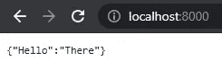

# 用 FastAPI(第 1 部分)用 5 行代码创建一个快速自动记录、可维护且易于使用的 Python API

> 原文：<https://towardsdatascience.com/create-a-fast-auto-documented-maintainable-and-easy-to-use-python-api-in-5-lines-of-code-with-4e574c00f70e?source=collection_archive---------11----------------------->

## 非常适合只需要一个完整、有效、快速和安全的 API 的(没有经验的)开发人员


构建和使用我们的 API 就像使用这台自动售货机一样简单(图片由詹娜·哈姆拉在[像素](https://www.pexels.com/photo/red-and-white-coca-cola-vending-machine-899786/)上拍摄)

你有一个很棒的 python 程序，你想把它公之于众。使用 FastAPI，您可以快速创建一个超快速的 API，让其他用户可以使用您的 Python 代码。

在这篇文章中，我们将用 **5 行代码**创建一个 API。什么？五行？！没错；FastAPI 不叫 FastAPI，因为它比 Django 或 Flask 之类的框架快很多倍；设置起来也超级简单快捷。

在我们创建了我们的初始 API 之后，我们将在下一部分扩展它，展示创建一个全功能、超快、生产就绪的 API 所需的所有必要知识。我们来编码吧！

## FastAPI 简介

让我们先快速浏览一下我们的框架。FastAPI 是一个现代的、开源的、快速的、高性能的 Python web 框架，用于构建 Web APIs。在 uvicon 下运行的应用程序被列为最快的 Python 框架之一，仅次于 Starlette 和 uvicon 本身(由 FastAPI 内部使用)。听起来不错吧？让我们不再浪费时间，看看如何使用它。

## 装置

安装非常简单。我们将首先用 PIP 安装 FastAPI。然后我们还需要安装 Uvicorn。这是运行 FastAPI 的 web 服务器。

```
pip install fastapi uvicorn
```

建议在虚拟环境中安装 Python 依赖项。这样你就可以让你的项目不再混乱。查看本文 了解如何使用虚拟环境的简单说明。

## 创建我们的 API

所有必要的工具都已安装，让我们在根处创建一个 API，在 ***的五个*** 行中。我们将创建一个名为`main.py`的文件:这个文件将是我们应用程序的主要入口点，并将定义我们的 API。插入下面的代码:

```
from fastapi import FastAPI
app = FastAPI()
@app.get("/")
def simple_route():
    return {"Hello": "There"}
```

看到这有多简单了吗？我们正在导入`fastapi`，创建一个新的实例，我们将把它存储在`app`变量中。这是我们已经定义的 API！在最后三行中，我们定义了一条路线。API 已创建！


我们的 API 已经设置好，可以运行了。3, 2, 1..开始！(图片由 [Andrea Piacquadio](https://www.pexels.com/@olly) 在[像素](https://www.pexels.com/photo/strong-sportsmen-ready-for-running-on-stadium-3764011/)上拍摄)

## 启动我们的 API

是时候启动我们的 API 了。打开终端，导航到上一步中的`main.py`文件所在的文件夹(如果您没有使用终端的经验，请查看本文[](https://mikehuls.medium.com/terminals-consoles-command-line-for-absolute-beginners-de7853c7f5e8)**)。执行以下命令:**

```
uvicorn main:app --reload
```

**这将调用 Uvicorn 并告诉它运行位于`main.py`文件中的`app`(上一步中定义的变量)。如果我们为了加速开发而保存更改，那么`--reload`标志会重新加载；我们不必为了看到变化而手动停止和启动 API。**

**如果您使用虚拟环境，请确保首先激活它。另一种称呼乌维科恩的方式是`python -m uvicorn main:app --reload`。这完全一样，只是你可以指定一个特定的 python.exe，例如:**

```
c:/mike/myProj/venv/scripts/python.exe -m uvicorn main:app --reload
```

## **测试我们的路线**

**如果一切正常，您将看到“应用程序启动完成”。如果你没有另外指定，那么 uvicorn 运行在你的本地主机上，端口 8000。于是打开浏览器，对着`localhost:8000`。您应该看到以下内容:**

****

**API 上/ route 的返回值(图片由作者提供)**

## **自动文档**

**关于使用 FastAPI，我最喜欢的一个特性是，它会自动生成如何使用该 API 的说明和概述；有哪些路线，如何调用的例子，你甚至可以测试路线，看看返回值！在`localhost:8000/docs`或`localhost:8000/redoc`检查一下。这些是相同文档的不同样式。**

****

**那是一场又短又快的比赛！(图片由[在](https://www.pexels.com/@runffwpu)[像素](https://www.pexels.com/photo/man-ripping-finish-line-strap-2524739/)上运行 4 个 FFWP**

# **结论**

**在大约 5 分钟的时间里，我们已经完成了一个简单的 API，在根上只有一条路由。但是还没有太多的互动性。我们想连接我们的 API，这样它应该能够接收和发送一些消息！**

**在 [**的下一部分**](https://mikehuls.medium.com/create-a-fast-auto-documented-maintainable-and-easy-to-use-python-api-crud-routes-and-routing-7e8f35ebda46) 中，我们将了解如何接收查询参数和主体。此外，我们将在 API 中创建更多的路由，并以智能的方式组织这些路由。稍后，我们将关注使用 Docker 的数据验证、安全性和部署。**

**如果你有建议/澄清，请评论，以便我可以改进这篇文章。同时，看看我的[关于各种编程相关话题的其他文章](https://mikehuls.medium.com/)。**

**编码快乐！**

**—迈克**

**页（page 的缩写）学生:比如我正在做的事情？[跟我来](https://mikehuls.medium.com/membership)！**