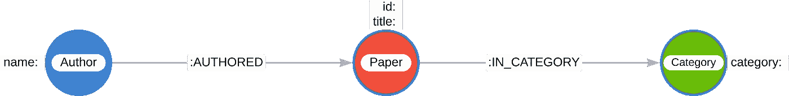
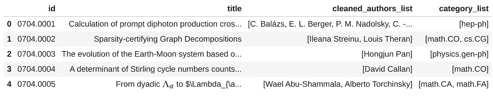
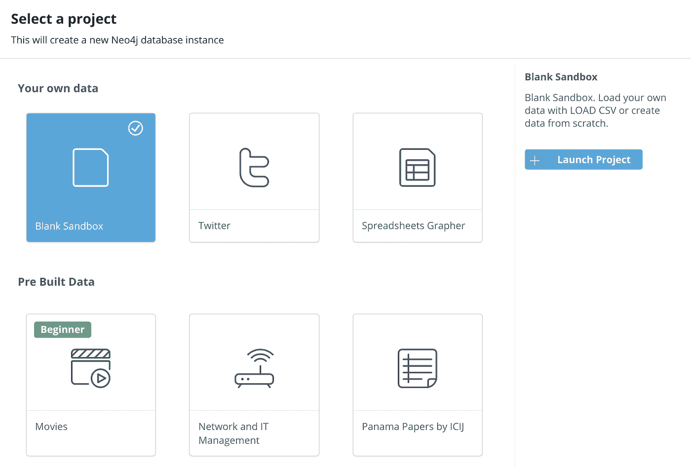
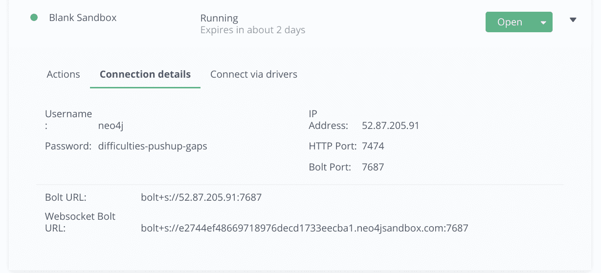
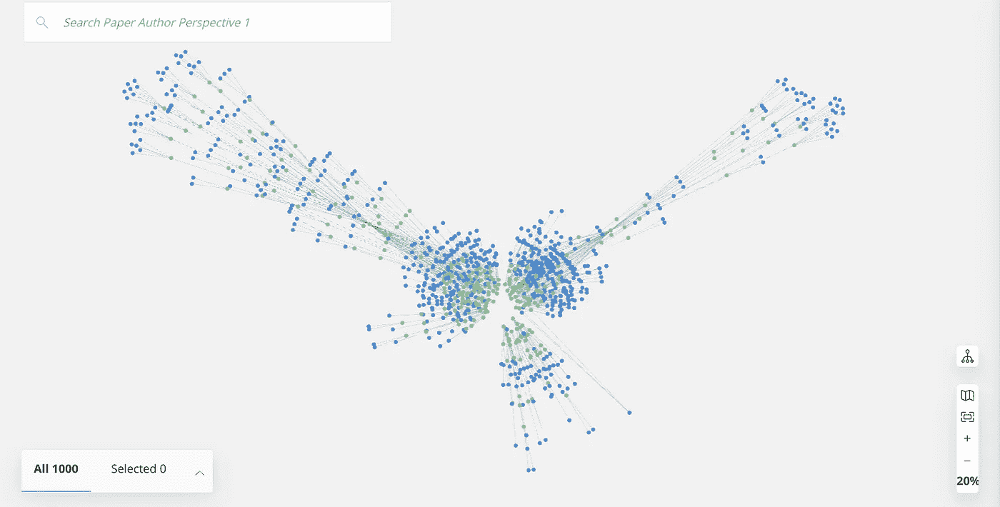
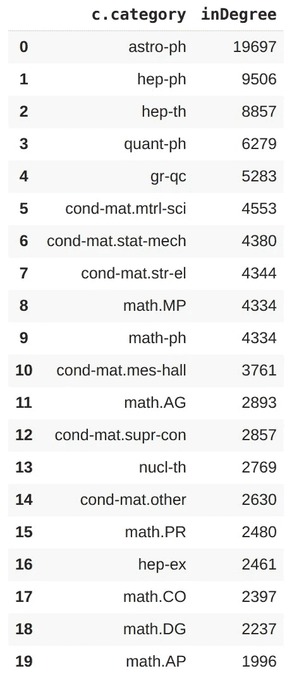
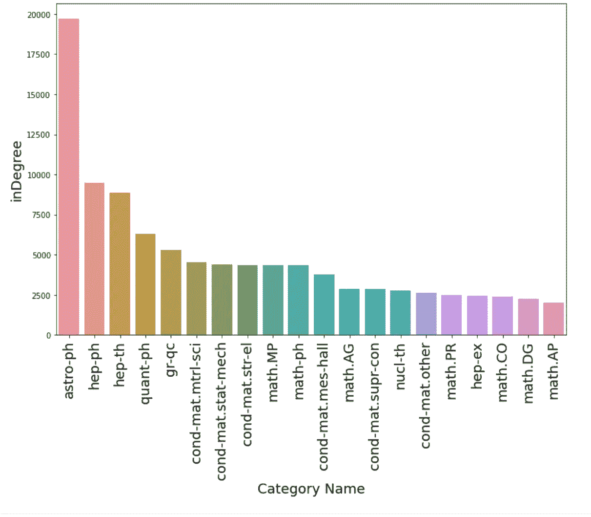

# 使用 Python 在 Neo4j 中创建图形数据库

> 原文：<https://towardsdatascience.com/create-a-graph-database-in-neo4j-using-python-4172d40f89c4?source=collection_archive---------0----------------------->

## [实践教程](https://towardsdatascience.com/tagged/hands-on-tutorials)

## 从数据清理到图形填充


[马丁·格兰让，CC BY-SA 4.0](https://creativecommons.org/licenses/by-sa/4.0) ，通过维基共享

数据科学家第一次使用 Neo4j 研究图形时，最常问我的一个问题是如何将数据放入数据库。在[之前的一篇文章](/importing-csv-files-in-neo4j-f3553f1a76cf)中，我展示了如何使用通过 Docker 设置的 Neo4j 浏览器 UI 以几种不同的方式之一来实现这一点。在这篇文章中，我将展示如何使用 Python 生成的数据来填充数据库。我还将通过 [Neo4j 沙箱](https://sandbox.neo4j.com/)向您展示如何使用不同的 Neo4j 数据库设置。

有这篇文章代码的 Google Colab 笔记本可以在这里找到。(笔记本上有如何将 Colab 连接到 Kaggle 以便更快下载数据的说明。)

## 必要的工具

1.  Neo4j [Python 驱动](https://neo4j.com/docs/api/python-driver/current/)(撰写本文时版本为 4.2)
2.  [Jupyter 笔记本/实验室](http://jupyter.org)或 [Google Colab 笔记本](https://colab.research.google.com/notebooks/intro.ipynb#recent=true)(可选)
3.  [熊猫](https://pandas.pydata.org/)

# 用 Python 清理数据


照片由[奥利弗·黑尔](https://unsplash.com/@4themorningshoot?utm_source=medium&utm_medium=referral)在 [Unsplash](https://unsplash.com?utm_source=medium&utm_medium=referral) 拍摄

现在我们实际上可以开始用 Python 做一些数据管理了。为了这篇文章，我们将使用 Kaggle 上的 arXiv 数据集，它包含了超过 170 万篇学术 STEM 论文。(写这篇帖子的时候，是在 18 版。)您应该继续将数据下载到您本地机器上。

现在转到您的笔记本，我们可以开始考虑我们的数据。我已经通过以下方式加载了数据:

(你不必使用`tqdm`，但我发现知道文件大小超过 1.79M 条目对检查我的进度很有帮助。)

您可以通过`df.dtypes`看到我们的数据结构如下:

```
id                object
submitter         object
authors           object
title             object
comments          object
journal-ref       object
doi               object
report-no         object
categories        object
license           object
abstract          object
versions          object
update_date       object
authors_parsed    object
```

假设我们想用这个数据框架构建一个图表，我们想知道哪些作者发表了哪些论文，这些论文属于什么类别。然后，我们希望有三种不同的节点类型与之对应:作者、论文和类别。每个节点类型都有一两个属性。对于作者来说，我们知道他们的名字是有意义的。报纸可以有他们的 ID 和他们的标题。最后，类别拥有自己的名称也是有意义的。我们也有一些关系:作者作者论文和论文在某些类别中。

因此，我们的目标是拥有以下数据模型(用 [arrows.app](https://arrows.app) 绘制):



数据模型。(图片由作者提供。)

有几个专栏会对我们有用。例如，我计划保留`id`,这样我们就可以用它作为每篇论文的唯一索引。之后，我想得到每个作者的个性化列表。此外，`authors_parsed`列给了我们一个更清晰的所有作者的列表。我们肯定会将`title`专栏作为报纸的主要属性。最后，我想保留`categories`列。

下一步是稍微清理一下我们的数据，这样数据帧的每一行都有一个作者，每一行都有一个类别。例如，我们看到`authors_parsed`列给出了一个列表，其中每个条目的名称后面都有一个多余的逗号。如果我们简单地将它导入到数据库中，我们将得到这样的作者节点(如一个小示例所示):

```
╒════════════════════════════════════╕
│"n"                                 │
╞════════════════════════════════════╡
│{"name":["Balázs","C.",""]}         │
├────────────────────────────────────┤
│{"name":["Berger","E. L.",""]}      │
├────────────────────────────────────┤
│{"name":["Nadolsky","P. M.",""]}    │
├────────────────────────────────────┤
│{"name":["Yuan","C. -P.",""]}       │
├────────────────────────────────────┤
│{"name":["Streinu","Ileana",""]}    │
└────────────────────────────────────┘
```

由于这不是一件令人愉快的事情(并且将导致不是最优雅的查询)，我们需要稍微清理一下。我们还看到`categories`列可以有一个类别，也可以有几个不是传统列表格式的类别(如本示例的最后一行所示):

```
╒═══════════════════════════════════╕
│"c"                                │
╞═══════════════════════════════════╡
│{"category":"hep-ph"}              │
├───────────────────────────────────┤
│{"category":"math.CO cs.CG"}       │
├───────────────────────────────────┤
│{"category":"physics.gen-ph"}      │
├───────────────────────────────────┤
│{"category":"math.CO"}             │
├───────────────────────────────────┤
│{"category":"math.CA math.FA"}     │
└───────────────────────────────────┘
```

我们可以在 Cypher 中这样做，但是为了这篇文章的缘故，我们将在 Python 中进行清理，以便希望说明我们可以使用 Python 做我们想做的或多或少的事情。

让我们创建几个助手函数来清理这两列:

我们得到的数据帧现在看起来像这样:



已清理的数据帧。(图片由作者提供。)

现在我们有可以利用的东西了！

# 创建 Neo4j 沙盒


由[马库斯·斯皮斯克](https://unsplash.com/@markusspiske?utm_source=medium&utm_medium=referral)在 [Unsplash](https://unsplash.com?utm_source=medium&utm_medium=referral) 上拍摄的照片

Neo4j 沙盒是一个很好的、免费的修补 Neo4j 的方式。您可以启动一个将持续 3 天的实例并开始工作！

出于本文的目的，当您进入沙箱时，您将创建一个基本的空白沙箱，如下所示:



创建空白沙盒。(图片由作者提供。)

正如您在创建窗口中看到的，还有许多其他有用的沙箱，但我们将选择此选项，因为我们将使用自己的数据填充数据库。坐几分钟，让它自己创造。一旦发生这种情况，您将获得您的连接信息，如下所示:



我们的沙箱的 Web 连接信息。(图片由作者提供。)

这个窗口有一些你需要的东西。首先，您将注意到 Bolt URL，以及它的端口号。您将需要它来通过 Python 建立连接。接下来，你还需要密码(这里是“困难-俯卧撑-缺口”)。这将需要在此实例中进行身份验证。我要指出的是，当这个实例被关闭 3 天后，这些信息就不再有效了，所以不要担心试图抓取我的沙盒和它的数据！

## 连接到 Neo4j 并填充数据库

现在我们需要在本地机器(或者任何有 Python 代码的地方)和沙盒数据库之间建立连接。这就是那些 BOLT URL 和密码的用武之地。

为此，我创建了一个助手类，它从[这篇中篇文章](/neo4j-cypher-python-7a919a372be7)稍微修改了一下:

酷毙了。现在我们可以开始填充数据库了。我们首先在数据库中创建一些约束，以确保节点不是重复的，同时还设置一些索引:

现在，我们创建三个函数来为 category 和 author 节点创建数据帧，我们将使用这三个函数分别将它们填充到数据库中:

这些函数将每一列放入变量`$rows`中，这些列是列表格式的。`UNWIND`命令获取列表中的每个实体，并将其添加到数据库中。在此之后，我们使用一个辅助函数以批处理模式更新数据库，这在您处理超过 50k 的上传时会很有帮助。

加载这些节点后，我们将添加纸张节点以及与以下函数的所有关系:

因此，以类似于类别和作者节点的方式，我们创建每篇论文，然后通过数据帧的每一行的`:AUTHORED`或`:IN_CATEGORY`关系将其连接起来(根据需要使用`UNWIND`列表)。请注意，在这个函数中有更多的数据通过管道传输，因此减小批处理大小可能有助于防止超时错误。

此外，对于这一步，我们可能会尝试在完整的数据帧上使用类似`explode.()`的方法，为每个列表的每个元素获取一行，并以这种方式将整个数据帧处理到数据库中。这是可行的，这正是我们将在下面对少量数据做的事情，如在`categories`和`authors`数据帧中的已删除重复的类别和作者节点列表。然而，对于较大的数据集，将数据加载到 Neo4j 中并不是一种非常有效的方式。因为 Neo4j 是一个事务数据库，我们将创建一个事务数据库，并在数据帧的每一行执行一条语句，这将导致加载过程非常缓慢。它也可能超出可用内存。沙盒实例大约有 500 MB 的堆内存和 500 MB 的页面缓存。因此，这进一步推动了以批处理方式更新数据库。

执行所有这些函数来填充图形，我们得到:

太好了！我们现在有了一个填充的数据库！该图的子样本应该是这样的(通过`MATCH (a:Author)-[:AUTHORED]->(p:Paper)-[:IN_CATEGORY]->(c:Category) RETURN a, p, c LIMIT 300`获得):



图表的子示例，在带有 Neo4j Bloom 的沙盒中可视化。蓝色节点是作者，绿色节点是论文，粉色节点是类别。(图片由作者提供。)

让我们确保它里面有我们想要的东西…

# 查询数据库以获得一些答案

这里有一个提示:当您有一个填充的数据库时，您应该让 Neo4j 处理尽可能多的计算，然后再将答案返回到 Python 中(如果您需要的话)。在这种情况下，假设我们要计算每个类别的入度，并返回前 20 个类别的类别。显然，我们可以用 Python 来做这件简单的事情，但是让我们用 Neo4j 来做吧。在某些时候，您可能想要进行更复杂的计算(比如节点中心性、路径查找或社区检测)，这些都可以而且应该在 Neo4j 中完成，然后再将这些结果下载回 Python。

要在 Cypher 中做到这一点，我们可以使用多种方法，但这里有一种快速有效的方法:

这应该会给我们:



按入度排名的前 20 个类别。(图片由作者提供。)

上述数据子集的入度分布如下所示:



图的子样本的入度分布。(图片由作者提供。)

这显示了数据库已经被填充，以及我们如何能够得到结果。值得一提的是，以列表形式返回相同结果的另一种方法是:

# 摘要

我们已经展示了如何从 Python 连接到 Neo4j 沙箱，并在我们确信数据包含我们想要的内容时上传数据。像编码中的其他事情一样，有许多不同的方法可以做到这一点，我们鼓励感兴趣的用户探索主要用 Cypher 而不是 Python 来做上面的演示。但是通过使用 Neo4j Python 连接器，可以很容易地在 Python 和 Neo4j 数据库之间来回切换，就像对任何其他主要数据库一样。这将开启数据科学和机器学习中各种令人兴奋的可能性，如自动节点分类、链接预测和节点聚类。请继续关注未来关于这些主题的博客帖子！

*特别感谢* [*迈克尔饥饿*](https://medium.com/u/3865848842f9?source=post_page-----4172d40f89c4--------------------------------) *和* [*马克李约瑟*](https://medium.com/u/68584b0be0fb?source=post_page-----4172d40f89c4--------------------------------) *对本帖的协助！*