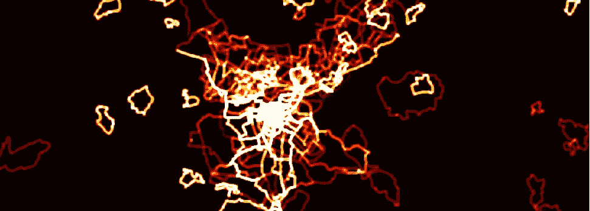
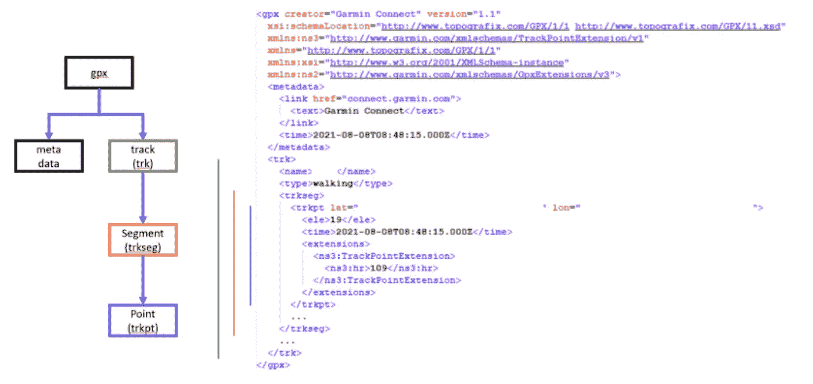
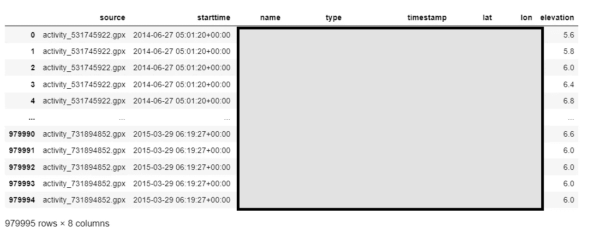
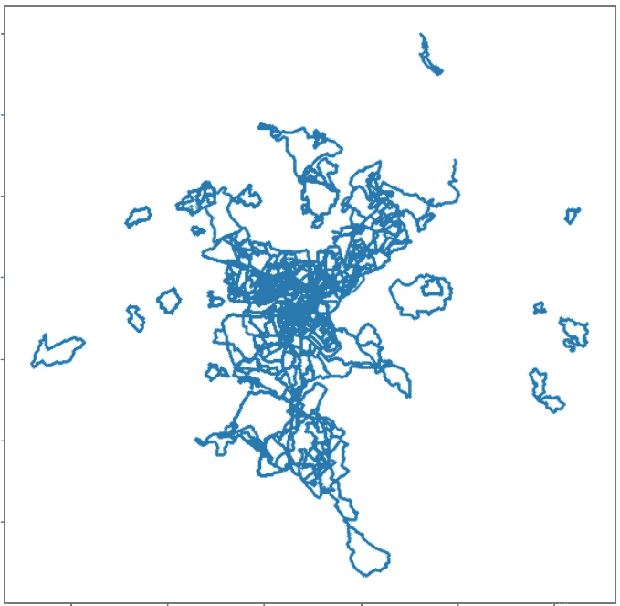
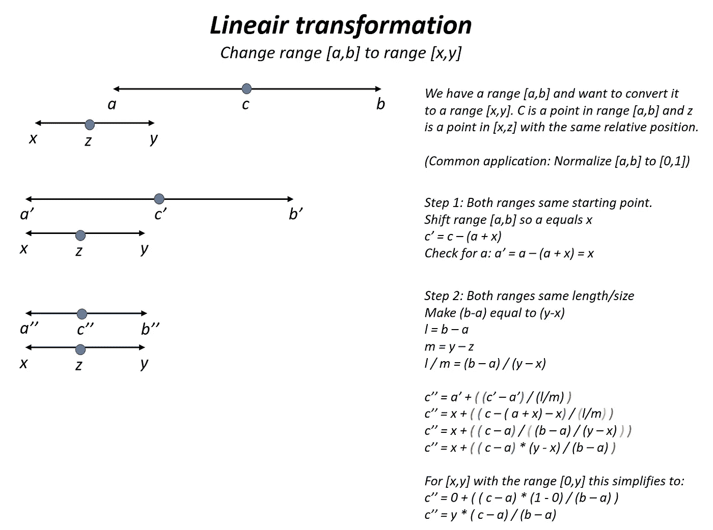
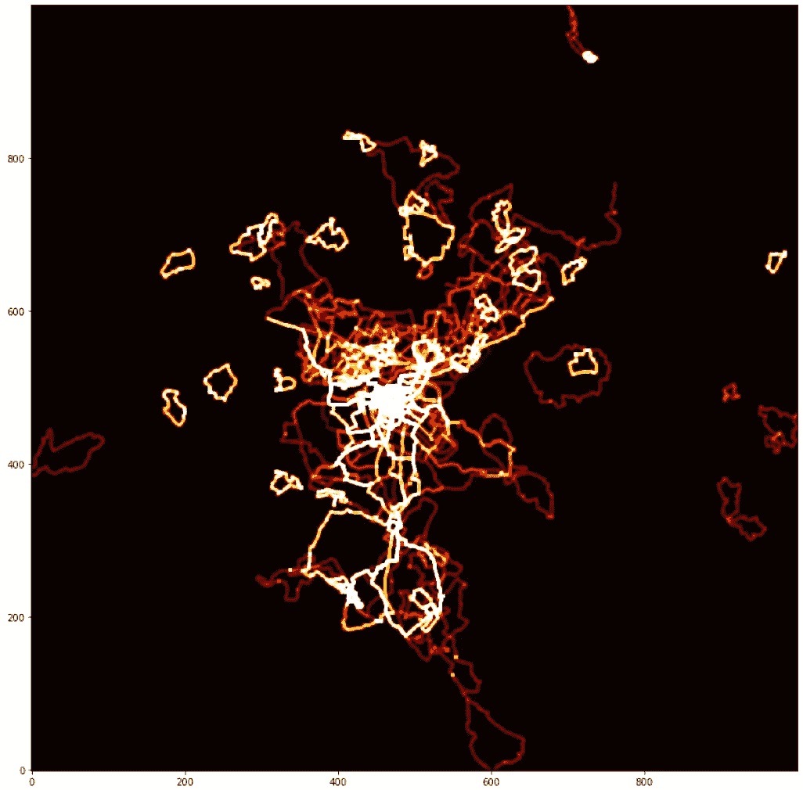

# 从你的活动跟踪器的日志中创建一个热图

> 原文：<https://towardsdatascience.com/create-a-heatmap-from-the-logs-of-your-activity-tracker-c9fc7ace1657?source=collection_archive---------25----------------------->

## 如何使用 Python 从应用程序和设备导入数据并从 GPX 文件创建热图。



热图(图片由作者提供)

我的电脑里有 7 年的步行记录。这些年来，从独立的 GPS 接收器，到 SportsTracker，再到 Garmin，这些都是通过几种设备和应用程序收集的。幸运的是，他们都有一个共同点，那就是记录的路线是 GPX 格式的。获取这些文件可能没有那么简单困难。

## 什么是 GPX？

GPS 交换格式(GPX)是 XML 格式的 GPS 数据格式。它是一种开放的、免许可的格式，描述了路点、轨迹和路线。它被广泛采用，因此是交换位置数据的绝对标准。位置以经度-纬度(十进制度数)对的形式存储，并可选择使用海拔(米)、时间(UTC)和供应商特定信息进行扩展。



GPX 格式的音轨(图片由作者提供)

上面的例子是 Garmin 存储的轨迹，例如 SportsTracker 和 Fitbit 存储的轨迹具有相同的结构，但细节不同。

根元素是 ***gpx*** 。它包含一个 ***元数据*** 元素和一个 ***trk*** 元素。 ***元数据*** 指定文件的来源和创建时间。 ***trk*** 元素包含存储的音轨。一个轨迹由一个或多个片段组成，每个片段存储在一个 ***trkseg*** 元素中。在曲目级别，有些字段包含曲目的名称和类型。该规范允许更多的字段，但这些字段并未被 Garmin 等公司使用。

***trkseg*** 段元素包含一个轨迹点列表( ***trkpt*** )。线段是一组连续的点。如果跟踪被中断，例如失去连接或电源故障，应该创建一个新的段。

一个 ***trkpt*** 有强制属性 ***lat*** 和 ***lon*** 来指定位置。有时间( ***时间*** )和标高( ***ele*** )等可选字段。元素 ***扩展*** 允许每个设备/应用添加额外的信息，如心率(上面 Garmin 示例中的 ***hr*** )、速度或路线(Garmin 不使用)。

使用 SportsTracker 创建的轨迹包括经度/纬度属性以及时间和海拔元素。他们没有像 Garmin 那样的扩展。假设以下数据结构用于解析 GPX 文件:

```
<gpx>
  <metadata>
    <name>02-01-20 13:29</name>
  </metadata>
  <trk>
    <trkseg>
      <trkpt lat="52.12345" lon="6.31235">
        <ele>71.1</ele>
        <time>2021-08-02T12:29:18Z</time>
      </trkpt>
    </trkseg>
  </trk>
</gpx>
```

## 导入 GPX 文件

为了读取 GPX 文件，有几个 Python 库可用，比如 [gpxpy](https://github.com/tkrajina/gpxpy) 。但是出于教育目的，提供了一个实现。这个实现利用了 Python 中默认 XML 实现的`ElementTree`。要从目录中读取所有 gpx 文件:

这段代码从目录`data`中检索所有文件，并解析扩展名为`.gpx`的所有文件(来自第 18 行)。从文档中检索根元素(第 19 行)，在本例中是`<gpx>`元素。所有元素都位于第 6 行定义的名称空间中。

跟踪日志的开始时间存储在元素`<metadata>`的子元素`<time>`中。然后(第 21 行)选择音轨，在这种情况下使用`.find()`方法。这将查找具有指定名称的元素的第一个匹配项。这就足够了，因为我的 GPX 文件中没有一个包含多个音轨，甚至是多个片段。在多轨道的情况下，可以通过迭代`.findAll()`的结果来替换`.find()`。track 元素包含元素`name`和`type`，这两个元素包含活动的名称和活动的类型(例如步行)(第 22–23 行)。

从轨道中选择第一个(也是唯一的)片段(第 24 行)。该段包含所有记录的位置，因此通过迭代该段，所有记录的位置都被解析(第 25 行)。点(元素`trkpnt`)包含纬度和经度(26–27)两个属性，以及日志条目的时间戳和海拔(第 28–31 行)两个子元素。高程可能不存在，因此我们需要在转换之前检查它的存在(第 31 行)。

所有信息都被添加到一个数组中，该数组在第 33 行被转换成一个数据帧。最后，两个时间字段都被转换为时间戳对象，因此我们最终得到以下数据帧(在本例中有将近一百万个位置):



GPX 所有记录位置的数据框(图片由作者提供)

大部分的活动日志是在我居住的地方，在假期有少量的。过滤我家周围的位置可以得到热图的第一个概念。

```
df[(df.lat > LAT_MIN) & (df.lat < LAT_MAX) & 
   (df.lon > LON_MIN) & (df.lon < LON_MAX)]. \
   plot.scatter('lon', 'lat', figsize=(10,10), s=0.1)
```

在`(x,y)`坐标系中，经度为`x`，纬度为`y`。



跟踪的活动(作者图片)

## 创建热图

最初的图给出了所有活动的一个很好的概述，但是没有提供大多数访问区域的洞察力。为此，我们将创建一个热图。我们会从头开始做这个。

热图将在大小为`<size_x, size_y>`的 **numpy** 数组中创建。所以首先我们要把经纬度转换成这个维度；最小经度到`0`，最大经度到`size_x`，纬度也一样。

首先，删除经度/纬度范围之外的所有位置。然后为`x`和`y`创建新的列，并使用线性转换为其分配适当的值。这些值被转换成整数，因为我们将使用它们来寻址 numpy 矩阵中的点。

对于那些感兴趣的人来说，线性回归背后的数学:



线性回归解释(图片由作者提供)

下一步是创建一个用所需大小的零填充的矩阵。每个被跟踪的点将被添加到这个矩阵中。不仅添加了确切的位置，还添加了围绕它的正方形(基于`width`)。这对于高分辨率图像特别有用，在这种图像中，宽度为一个像素的线条几乎看不见。

我们可以迭代`df2`并逐个添加每个点。但是我们通过首先对`(x,y)`进行分组并计算出现的次数来优化它。当相同的位置出现例如 7 次时，它仅被添加一次而不是 7 次。由于宽度的使用，仍然需要加法(第 8 行)而不是赋值。由于宽度的使用，相邻的位置会累加起来。

由于宽度增加的附加效应，使用频率高的路线会变亮。为了防止他们丢弃较少使用的路线，计数被最大化(第 11 行)为数据集中路线的数量。可以添加一个因子来优化最终结果(第 10 行)。

现在我们已经用每个`<x,y>` 的出现次数填充了数组，我们可以把它转换成一个色标。将这些值标准化后，将应用 matplotlib 色彩映射表。在这种情况下，使用'`hot`'色图，因为它在黑色背景下工作良好(从等于黑色的数组中的零开始)。

最后一步是使用 matplotlib 绘制图像:

`origin=”lower”`是必需的，因为图像的零点在左下角，但默认是左上角。我们努力的结果:



生成的热图(图片由作者提供)

这是我们自己的热图。可以通过添加高斯模糊来使图片看起来更友好。但是现在，我对结果很满意。

## 最终世界

我们已经看到从任何来源导入 GPX 文件是多么简单。根据这些数据，我们创建了一个热图来直观显示游览地点。通过给图像添加模糊或者甚至添加一张地图作为背景，改进是可能的(很多工作，但是值得)。

在下一篇文章中，我将向你展示如何计算指标，如行驶距离、速度和方位。

我希望你喜欢这篇文章。要获得更多灵感，请查看我的其他文章:

*   [用 Python 删除文本中的个人信息](/remove-personal-information-from-text-with-python-232cb69cf074)
*   [Python 中字符串的并排比较](/side-by-side-comparison-of-strings-in-python-b9491)
*   [用 Python 实现并行 web 请求](/parallel-web-requests-in-python-4d30cc7b8989)
*   [所有公共交通工具都通向乌得勒支，而不是罗马](/all-public-transport-leads-to-utrecht-not-rome-bb9674600e81)
*   [使用 OTP 和 QGIS 可视化行程时间](/visualization-of-travel-times-with-otp-and-qgis-3947d3698042)

*免责声明:本文包含的观点和看法仅归作者所有。*