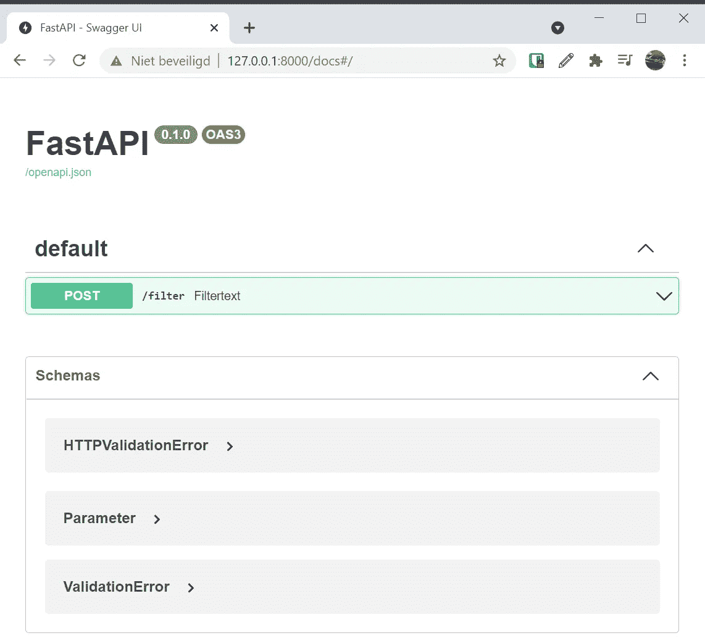
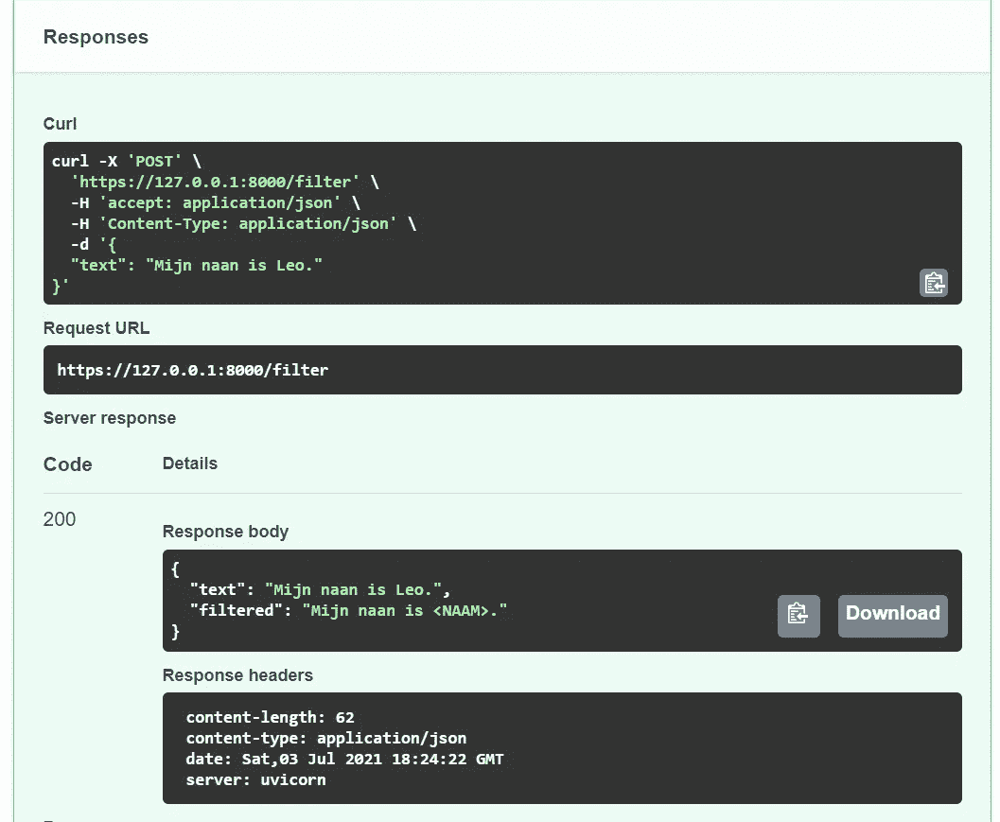
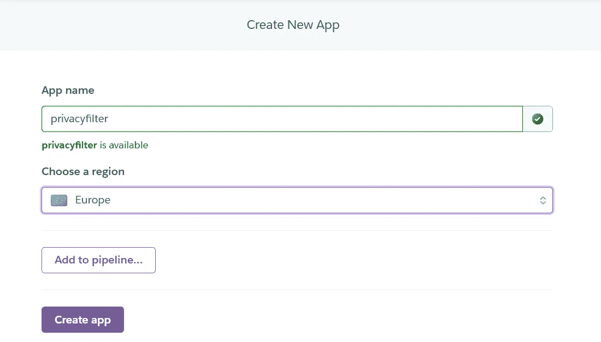
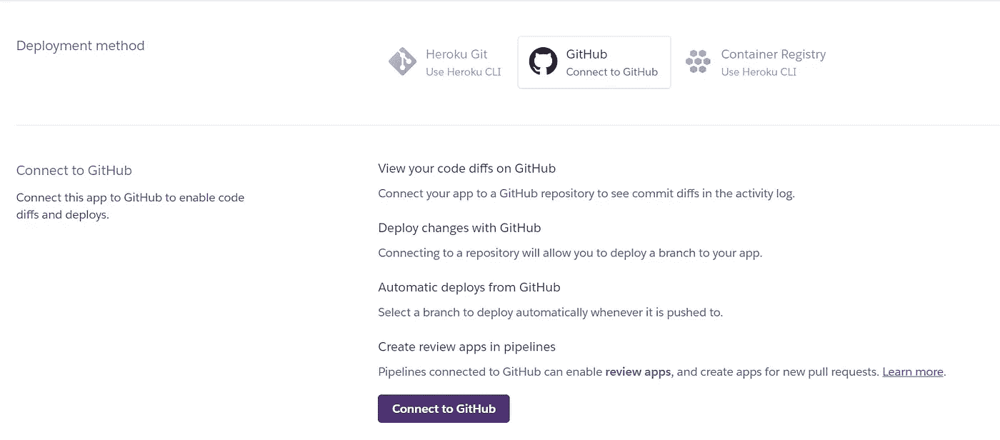
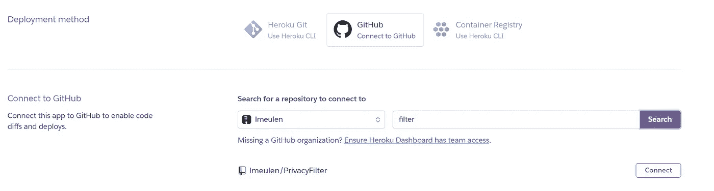
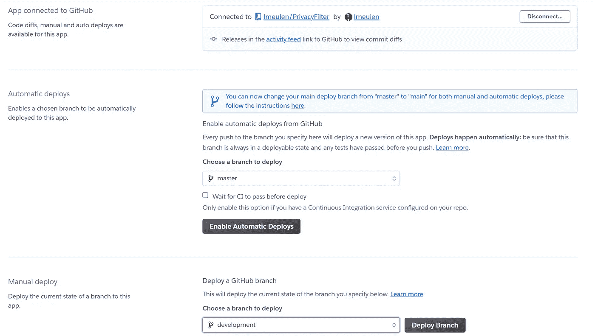

# 用 FastAPI 和 Heroku 创建一个隐私过滤器 Web 服务

> 原文：<https://towardsdatascience.com/create-a-privacy-filter-webservice-with-fastapi-and-heroku-4755ef1ccb25?source=collection_archive---------27----------------------->

## 如何使您的 PII 删除服务易于使用，增加使用率，从而提高隐私保护。

西蒙·马格 ( [Unsplash](https://unsplash.com) )摄影

在我的[上一篇文章](/remove-personal-information-from-text-with-python-232cb69cf074)中，我展示了如何构建一个 Python 类来过滤掉自由文本中的个人身份信息。在本文中，我们将使用 FastAPI 构建一个基于该类的 web 服务，并使其可用于 Heroku。

## 创建 API

用 [FastAPI](https://fastapi.tiangolo.com/) 创建一个 API 很简单，它使你能够为你的代码创建一个 REST API。首先，您需要安装 FastAPI，如果您想在本地运行它，还需要安装[uvicon](https://www.uvicorn.org/)。Uvicorn 是一个轻量级、超快的异步 web 服务器实现。它将用于运行 FastAPI 服务器的本地副本。

现在，我们准备好了！

要运行 FastAPI 服务器，需要一个*FastAPI*-对象。可以使用方法标记添加该对象的终结点。一个简单的例子:

第 3 行创建了 FastAPI 对象，第 5 行添加了一个端点。端点的名称为“*/过滤器*”。当被调用时，它返回值“< PRIVATE >”。

要测试端点，需要一个 web 服务器。FastAPI 应用程序可以从命令行或 main 方法启动。使用最后一种方法，其工作方式如下:

PrivacyFilterAPI 是 python 源文件的名称，privacyFilterApp 是指在上一步中创建的 FastAPI 对象。运行 Python 脚本启动一个具有可用端点的 Uvicorn 服务器。Uvicorn 的 *reload=True* 参数允许在检测到源代码更改时重新加载应用程序。从编辑器中保存源代码足以在 Uvicorn 中重新加载应用程序，无需在代码更改后重启服务器。

在浏览器中打开[http://127 . 0 . 0 . 1:8000/filter](http://127.0.0.1/filter)应该会得到 JSON 响应:

下一步是用文本 tot 过滤器向 API 添加一个参数。输入文本将作为 POST 请求的请求正文发送。使用 POST 是用参数调用 REST 服务的首选方式。参数作为请求体发送。定义请求体一个 [Pydantic](https://pydantic-docs.helpmanual.io/) 模型。

通过从 Pydantic 扩展 *BaseModel* 来创建参数类。这个类保存一个变量，*文本*和方法的输入文本。方法签名被更改为 post(第 12 行),并有一个类型为*参数*的输入参数*项*。*条目*是一个 Python 字典，可以进行相应的访问。

最后，通过添加 *PrivacyFilter* 类，webservice 就完成了:

当 web 服务启动时， *PrivacyFilter* 类的一个实例被实例化和初始化。这个实例将用于每次调用*过滤器*方法。 */filter* 端点返回包含原始文本和过滤文本的字典。

启动 web 服务后，文档可从 [http://127.0.0.1:8000/docs 获得。](http://127.0.0.1:8000/docs.)这些 swagger 页面由 FastAPI 自动生成:

FastAPI 生成的 API 文档(图片由作者提供)

通过点击绿色的*/过滤器*部分，然后点击“试用”按钮，可以向 API 发送请求。这些参数在请求正文部分指定:

尝试 API(图片由作者提供)

按“执行”发送 post 请求并显示结果:

请求结果(图片由作者提供)

在响应中，原始文本和过滤后的文本都被返回。在这种情况下，我的名字被标记<naam>代替，标记表示一个名字(Naam 是荷兰语的名字)。这表明我们有一个隐私过滤器 API 的操作实现。</naam>

## 确保服务安全

通过 HTTP 发送隐私信息不是个好主意，所以我们需要将 REST API 升级到 HTTPS。为此，我们需要一个密钥文件和一个认证文件。我们可以用 openSSL 创建这些文件:

这会产生两个文件，一个包含密钥，另一个包含证书。确保*通用名称*与 API 将在生产中运行的 URL 相匹配。我们可以通过指定密钥和证书文件在 HTTPS 模式下启动 Uvicorn 服务器:

该服务现在在地址[https://127 . 0 . 0 . 1:8000/filter](https://127.0.0.1:8000/filter.)上可用，并且请求由 SSL 保护。

## 在 Heroku 上运行服务

Heroku 是一个支持 Python(以及其他)的云平台。在虚拟化的 Linux 容器中部署您的应用程序是可能的。你可以一个月免费运行 500 个小时集装箱。30 分钟不活动后，容器进入睡眠状态。如果你的账户里有一个容器，它可以免费运行 67%的时间。

要在 Heroku 上运行 FastAPI 服务，需要两个文件。首先， *requirements.txt* 文件需要是最新的。该文件指定了所有必需的 python 库。Heroku 使用这个文件创建一个能够运行应用程序的 Python 环境。如果不存在，您可以按如下方式创建该文件:

该命令将捕获所有已安装的模块及其版本，并将这些信息写入 *requirements.txt* 文件。

Heroku 需要的第二个文件是部署配置文件，名为 *Procfile* (没有扩展名)。Heroku 使用该文件来确定启动应用程序时要执行的操作。

这个 *Procfile* 告诉 Heroku 启动一个 web 应用程序并启动 Uvicorn。Uvicorn 启动指定的 API 应用程序。应用程序被指定为类似于本地运行。注意，Heroku 需要主机指定一个端口来连接到 Uvicorn 服务器。

导航到[heroku.com](https://heroku.com)并创建一个免费账户。在此帐户中，创建一个应用程序:

Heroku 应用创建(作者截图)

为应用程序取一个易于识别的名称，然后单击“创建应用程序”按钮。不需要将其添加到管道中。

Heroku 将从 Github 获取应用程序，因此下一步是连接 Gihub。单击 connect 按钮，按照在线流程连接到 GitHub OAuth 接口。

将 Heroku 连接到 GitHub(作者截图)

当 Heroku 成功连接到 GitHub 时，可以将 GitHub 存储库连接到 Heroku 应用程序。在搜索字段中键入存储库名称的一部分，然后按“搜索”。从搜索结果中选择适当的存储库。

连接 GitHub 库(作者截图)

当存储库连接成功时，可以在 Heroku 上部署一个分支。向下滚动到“手动部署”，选择正确的分支并点击“部署分支”按钮。

在 Heroku 上部署分支(作者截图)

这将启动构建过程，根据需求文件创建 Python 环境。第一次这将花费一些时间，但是连续的构建将使用缓存的环境(直到需求改变)。

检查应用程序日志(右上角的“更多”按钮)并等待构建成功的消息。该应用程序现已在 https://privacyfilter.herokuapp.com/[发布。我们现在可以使用/docs 入口点在本地实例上运行相同的 API 测试。](https://privacyfilter.herokuapp.com/)

恭喜你，你有一个隐私过滤器启动并运行！

请注意，Heroku 的免费版本仅限于 500MB 的容器。运行完整的隐私过滤器需要更多的空间，因此需要从 Heroku 订阅爱好。为了能够在免费版本中运行，我从过滤器中删除了街道名称，因为它们占用了大部分空间。

这个项目的所有源代码都可以在 GitHub 上找到: [PrivacyFilter](https://github.com/lmeulen/PrivacyFilter) 。

我希望你喜欢这篇文章。要获得灵感，请查看我的其他文章:

*   [用 Python 删除文本中的个人信息](/remove-personal-information-from-text-with-python-232cb69cf074)
*   [用 Python 实现并行 web 请求](/parallel-web-requests-in-python-4d30cc7b8989)
*   [所有公共交通工具都通向乌得勒支，而不是罗马](/all-public-transport-leads-to-utrecht-not-rome-bb9674600e81)
*   [使用开放数据和开普勒](/visualization-of-crowdedness-for-dutch-trains-with-kepler-f55057a3ba24)可视化荷兰火车的拥挤程度
*   [使用 OTP 和 QGIS 可视化行程时间](/visualization-of-travel-times-with-otp-and-qgis-3947d3698042)

*免责声明:本文包含的观点和看法仅归作者所有。*