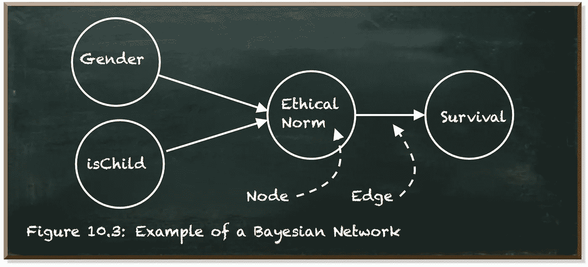
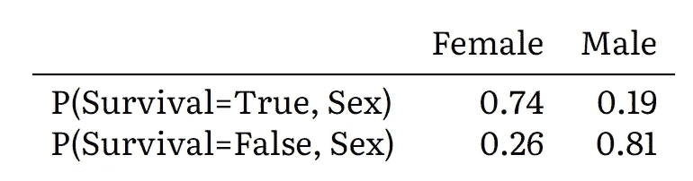
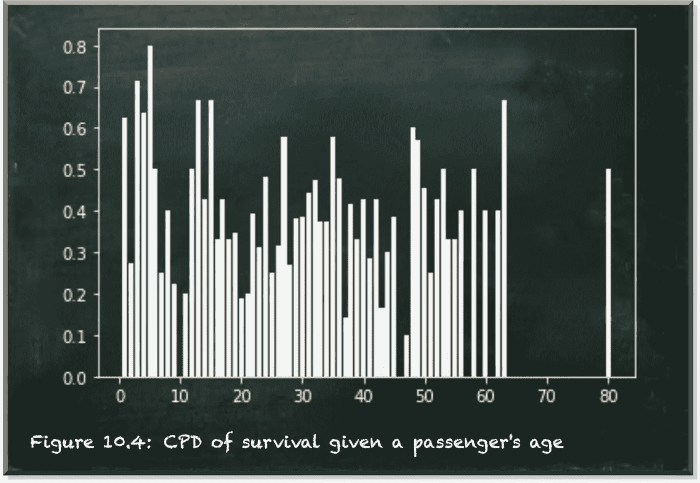
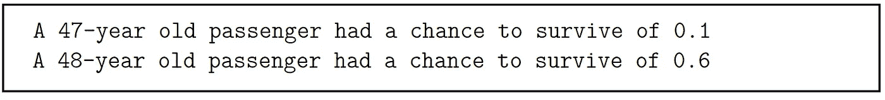
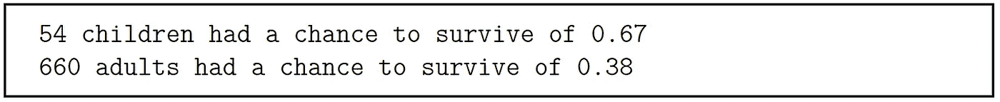
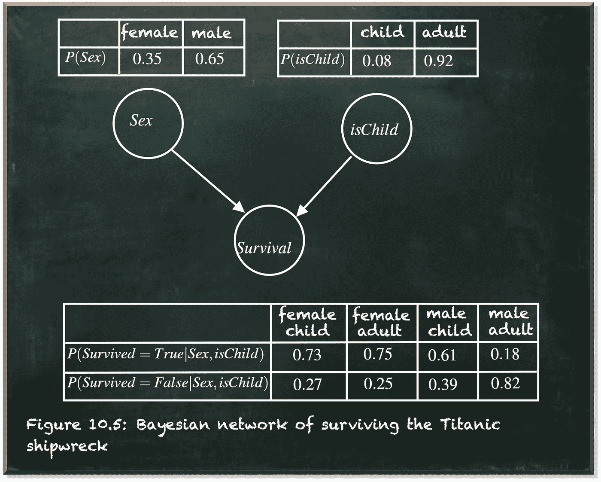
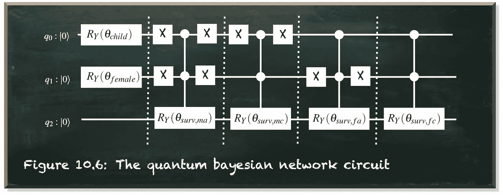
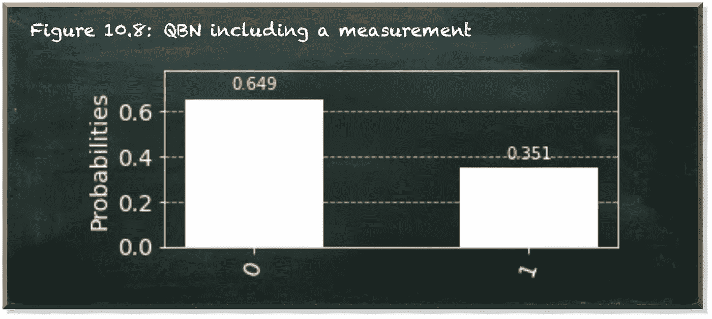

# 创建量子贝叶斯网络

> 原文：<https://towardsdatascience.com/create-a-quantum-bayesian-network-d26d7c5c4217?source=collection_archive---------29----------------------->

## 实用指南

本帖是本书的一部分: [**用 Python 动手做量子机器学习**](https://www.pyqml.com/page?ref=medium_qbn&dest=/) **。**

贝叶斯网络是对不确定领域的知识进行建模的概率模型。例如泰坦尼克号上一名乘客的生还。

贝叶斯网络建立在与朴素贝叶斯分类器相同的直觉上。但是与朴素贝叶斯相比，贝叶斯网络并不局限于只表示独立的特征。它们允许我们包含尽可能多的在当前环境下看起来合理的相互依赖。

贝叶斯网络被表示为具有节点和边的有向无环图。

作者弗兰克·齐克特的图片

这些节点代表随机变量，如乘客的性别或他/她是否是个孩子。

边缘对应于一个变量对另一个变量的直接影响。换句话说，边定义了两个变量之间的关系。箭头的方向也很重要。连接到箭头尾部的节点是父节点。连接到头部的节点是子节点。子节点依赖于父节点。

我们使用离散变量的条件概率表(CPT)和连续变量的条件概率分布(CPD)来量化这种依赖性。

下表描述了给定乘客性别(`Sex`)的后验生存概率。

女性乘客比男性乘客有更好的生存机会。

虽然只有两种性别(在我们的数据集中)，但有许多不同年龄的乘客。从技术上讲，作为一个离散变量，将年龄建模为一个连续变量似乎更合适。下图描述了给定乘客的`Age`后验生存概率的 CPD。

作者弗兰克·齐克特的图片

乍一看，似乎乘客的年龄对生还的机会没有明显的影响。更糟糕的是，在随后的几个年龄段中，存活的几率相差很大。例如，一名 47 岁的乘客有 0.1 的生存机会，而一名 48 岁的乘客有 0.6 的生存机会。

这种变化似乎不合理。

相反，如果我们考虑作为一个孩子的特点(`isChild`)而不是一个乘客的`Age`。8 岁或以下的儿童比成人有更大的生存机会。

让我们考虑具有三个节点的贝叶斯网络。变量`Sex`和 a `Child`表示父节点。这些节点本身没有父节点。它们是根节点。他们的 CPT 以一组空的变量为条件。因此，它们等于边际(或先验)概率。注意，这些不是存活的概率，而是各自特征出现的概率。

`Survival`泰坦尼克号沉船的子节点。此 CPT 取决于父节点的值，如下图所示。

作者弗兰克·齐克特的图片

给定这样一组 CPT，我们可以计算生存的边际概率。

由于节点`Sex`和`isChild`之间的独立性(它们的值是独立的，因为我们没有建模任何依赖性，但是它们对`Survival`的影响不是独立的)，乘客具有某个`Sex`和`isChild`的联合概率可以计算为 p(sex,ischild)=p(sex)⋅p(ischild).

因此，给定某个`Sex`和`isChild`的生存条件概率是 p(survival)=p(survival|sex,ischild)⋅p(sex)⋅p(ischild).

首先，贝叶斯网络是一种数据结构。首先，它代表了条件独立性假设的集合。没有通过边连接的任何两个节点都被认为是相互独立的。第二，贝叶斯网络以紧凑和分解的方式包含概率表和分布。

这种数据结构使我们能够推断人口的特性。贝叶斯网络支持正向和反向推理。例如，我们可以通过对子节点的分布进行积分来计算总的生存机会(正向推理)。并且，给定关于乘客生存的知识，我们可以推断出某些特征在多大程度上促成了他或她的生存。例如，如果我们查看子节点的图表，我们可以看到乘客的性别非常重要，除非乘客是孩子。按照妇孺优先的标准，他们并没有重男轻女。`Sex`和`isChild`之间的这种相互依赖性不能包含在朴素贝叶斯分类器中。

这种数据结构，贝叶斯网络图，可以用两种不同的方法创建。给定依赖关系的足够知识，它可以由开发者预先设计。或者，也可以由机器自己学习。

在我们通往量子机器学习的道路上，我们将双管齐下。我们从一个我们自己建模的小型量子贝叶斯网络(QBN)开始。然后，我们让机器从数据中学习。

# 电路实现

我们从目前为止我们的例子的实现开始，一个乘客的`Sex`和作为一个孩子的`isChild`对泰坦尼克号沉船的`Survival`的影响。

贝叶斯网络中的每个节点都由一个量子位表示。因为我们所有的节点都是二进制的(`Sex`、`isChild`、`Survival`)，每个节点一个量子位就足够了。如果我们有更多的离散态或连续分布，我们将需要更多的量子位。量子位状态代表相应变量的边际(对于根节点)和条件(对于`Survival`节点)概率幅度。

|0⟩代表男性乘客或成年人。|1⟩是女性还是儿童。量子位的叠加表示任一状态的概率

我们通过绕 Y 轴旋转来初始化这两个量子位。

我们计算成为孩子(第 21 行)和女性(第 25 行)的概率。我们使用 RY 门让量子位 q0(第 31 行)和 q1(第 34 行)代表这些边际概率。

接下来，我们将`Survial`的 CPT 添加到电路中。这是一个多一点的工作。

父节点值有四种不同的组合，`Sex`和`isChild`。他们是，一个成年男性(|00⟩)，一个男孩(|01⟩)，一个成年女性(|10⟩)和一个女孩(|11⟩).)因此，我们有四个旋转角度，每个父节点组合一个。

对于这些组合中的每一个，我们使用一个受控的 RYRY-gate (CCRY)来指定`Survival`的概率。如果有 n 个父节点，那么我们将实现一个 CnRY-gate。

如下图所示，我们将每个旋转封装到 X-gate 中。对于一个 CCRY-gate 来说，如果两个控制量子位都处于|1⟩状态，则只对控制量子位应用旋转，领先的 x-gate 选择相应的组合，而尾随的 x-gate 反转该选择。

例如，要应用一个成年男性(|00⟩)的条件概率，我们需要翻转两个量子位。这就是我们的工作。在应用具有相应角度的 CCRY-gate 后，我们将量子位翻转回初始状态。

作者弗兰克·齐克特的图片

在 Qiskit，没有 CCRY-gate。但是我们在这篇文章中学习了如何创建一个。函数`ccry`(第 1-6 行)为我们的电路增加了这样一个门。

在下面的代码中，我们计算了四种情况下的条件概率。我们分离人群，例如，女性儿童(第 3 行)，分离其中的幸存者(第 4 行)，用幸存者人数除以乘客中女性儿童总数(第 5 行)计算他们的生存概率。

我们对女性成人(第 8-10 行)、男性儿童(第 13-16 行)和男性成人(第 19-21 行)也是如此。

接下来，我们选择代表这些乘客组的状态，并以相应的概率应用 CCRY-gate。

我们现在准备运行电路。让我们看一看。

作者弗兰克·齐克特的图片

我们可以看到八种不同的状态。这些属于四个组的受害者(量子位 q2=0)和幸存者(q2=1)。因此，幸存的总边际概率是量子位 q2=1 的所有状态的总和。

为了避免手动添加，让我们在电路中加入一个测量值。我们在电路中加入了一个`ClassicalRegister`。

然后，我们需要应用所有的门(为简洁起见，跳过)。我们添加一个度量(第 3 行)。这里，我们对量子位 q2q2 感兴趣。

最后，我们选择合适的后端(`qasm_simulator`)并运行电路几次(这里是 1000 次)(第 9 行)。

结果显示我们接近 0.38 的实际生存概率。实际结果略有不同，因为我们没有计算，而是根据经验模拟这一结果。

作者弗兰克·齐克特的图片

# 结论

对于一组二进制状态变量，量子贝叶斯网络的实现是直接的，因为我们可以用单个量子位来表示每个变量。即使我们有两个以上状态的变量，结构也不会改变。我们仍然会通过 X 门激活每个状态，并应用相应的受控旋转。但是，我们将不得不应付更多的州。

本帖是本书的一部分: [**动手用 Python 学习量子机器**](https://www.pyqml.com/page?ref=medium_qbn&dest=/) **。**

免费获取前三章[这里](https://www.pyqml.com/page?ref=medium_qbn&dest=/)。