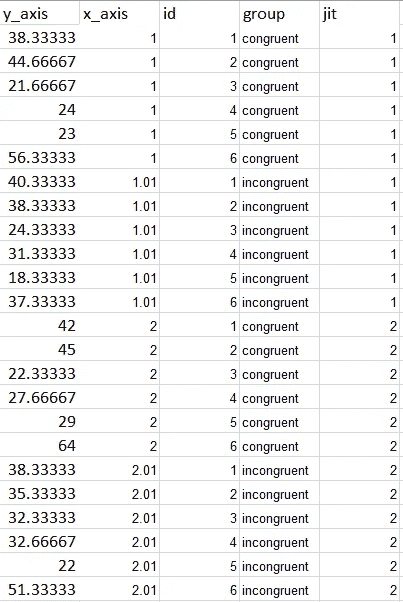
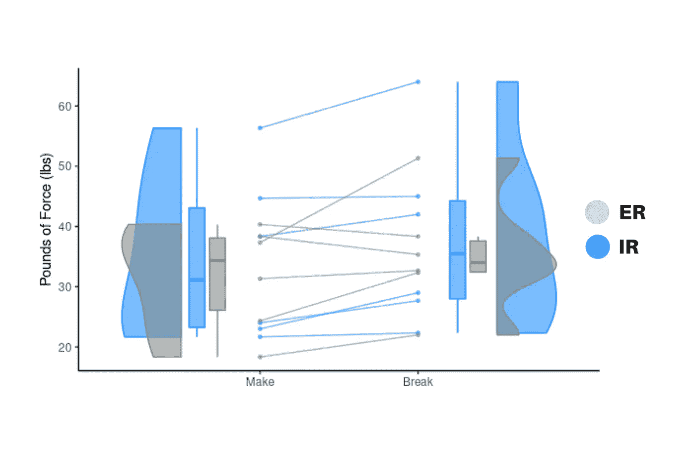

# 创建重复测量的雨云

> 原文：<https://towardsdatascience.com/create-a-repeated-measures-raincloud-96c6c9b33e81?source=collection_archive---------36----------------------->

## 用 R 可视化组间差异的有效方法


图片由[梅格·杰拉德](https://unsplash.com/@mappingmegantravel)在 [Unsplash](https://unsplash.com) 拍摄

## 雨云图

Raincloud 图将抖动的数据点与半小提琴和箱形图结合起来，给出了给定数据集的综合图。在[的上一篇文章](/making-it-rain-with-raincloud-plots-496c39a2756f)中，我介绍了使用 python 绘制雨云图。多亏了 Jordy van Langen 和他的同事们的工作，雨云图在 r。

R 中的 jorvlan raincloudplots 包展示了一种创建分组和重复测量数据的简单可视化的方法。此外，它提供了独立链接的重复测量可视化，这为许多主题间/主题内设计添加了细节和丰富性。下面，我们探索创建一个类似蝴蝶外观的 2 x 2 (2 个条件，2 组)重复测量图。

在此阅读有关 jorvlan/raincloudplots 知识库的更多信息:

[](https://github.com/jorvlan/raincloudplots) [## GitHub - jorvlan/raincloudplots:创建 raincloudplots 的简单方法

### 如果你的研究使用了这个包，请引用它，谢谢。论文-艾伦，硕士，波吉亚利，博士，惠特克，K…

github.com](https://github.com/jorvlan/raincloudplots) 

关于雨云地块的进一步阅读，请查看原始出版物:

[](https://wellcomeopenresearch.org/articles/4-63) [## 威康开放研究文章:雨云图:稳健数据的多平台工具…

### Allen M，Poggiali D，Whitaker K 等。雨云图:一种用于稳健数据可视化的多平台工具[第 2 版…

wellcomeopenresearch.org](https://wellcomeopenresearch.org/articles/4-63) 

## 装置

从 jorvlan 的存储库中安装 raincloudplots 包。

```
if (!require(remotes)) {
    install.packages("remotes")
}
remotes::install_github('jorvlan/raincloudplots')

library(raincloudplots)
```

## 输入数据

本教程使用代表两种不同运动类型(内旋、外旋)的两种不同临床测试(进行、断开)的数据集，使我们的数据集成为 2x2 设计。通断测试通常由康复从业者进行，例如物理治疗师或运动训练师。在进行测试期间，*患者*施加力量对抗*医师的*手的阻力。在断裂测试期间，*医师*对*患者的*前臂施力。两项测试都评估了肩关节的内旋和外旋。力(磅 lbs)由专业人员用手持设备测量。

*以下数据集展示了作者创建的示例数据，并不代表真实的患者数据。*

```
df_2x2 <- read.csv(file = 'make_break.csv')
```



示例数据—由作者创建

*   每个患者的力(磅)列在 y 轴栏中
*   组分配列在 x 轴上
*   参与者分配列在 id 列中
*   一致性列在“组”列中
*   jit 列中列出了抖动值

## 创造情节

绘制重复测量雨云。

```
raincloud_2x2 <- raincloud_2x2_repmes(
  data = df_2x2,
  colors = (c('dodgerblue', 'azure4', 'dodgerblue', 'azure4')),
  fills = (c('dodgerblue', 'azure4', 'dodgerblue', 'azure4')),
  size = 1,
  alpha = .6,
  spread_x_ticks = FALSE) +scale_x_continuous(breaks=c(1,2), labels=c("Make", "Break"), limits=c(0, 3)) + 
  ylab("Pounds of Force (lbs)") +
  theme_classic()raincloud_2x2
```



蝴蝶般的雨云情节——作者创作

*   `data_2x2`创建 2 x 2 重复测量雨云所需的长格式数据帧
*   `color` dodgerblue 和 azure4 区分群——内旋(IR)和外旋(ER)
*   `labels`连接两个组标签的字符串——接通和断开
*   `spread_x_ticks`2 个 x 轴刻度为假-同时显示两组

## 结论

本文概述了如何使用 jorvlan/raincloudplots 存储库来创建链接的重复测量可视化。如果你有兴趣了解更多用 R 创建 raincloud plots 的方法，请查看 JOR VLAN/rain cloud plots[github](https://github.com/jorvlan/raincloudplots)页面(也在上面列出)。

**感谢您的阅读！**

作者的相关文章—

[](/making-it-rain-with-raincloud-plots-496c39a2756f) [## 用雨云图让它下雨

### 使用 python 实现 ptitprince 库以实现健壮的数据可视化

towardsdatascience.com](/making-it-rain-with-raincloud-plots-496c39a2756f) [](/a-quick-introduction-into-stream-graphs-with-python-33ff4493ccc) [## Python 流图快速入门

### 使用 altair 可视化库

towardsdatascience.com](/a-quick-introduction-into-stream-graphs-with-python-33ff4493ccc)