# 使用 Neo4j 从节点属性创建相似性图

> 原文：<https://towardsdatascience.com/create-a-similarity-graph-from-node-properties-with-neo4j-2d26bb9d829e?source=collection_archive---------12----------------------->

*本文的原始版本和附带的视频使用的 Neo4j 沙盒版本已经过时。我已经更新了代码，以使用 GDS 2.0.1 和 Neo4j 沙盒的版本，该版本是 2022 年 7 月的版本。*

[聚类分析](https://en.wikipedia.org/wiki/Cluster_analysis)帮助我们发现隐藏在数据中的结构。我们可以使用无监督的机器学习算法将数据项分组到聚类中，以便项与其聚类内的其他项比与其聚类外的项有更多的共同点。

当我们将数据集组织成相似项目的子集时，诸如[客户细分](/working-with-neo4j-rfm-analysis-using-e-commerce-data-721f5bd5c851)、[推荐](/building-a-photo-based-personalized-recommendations-application-27029418d65e)和[异常检测](https://neo4j.com/blog/financial-fraud-detection-graph-data-science-analytics-feature-engineering/)等任务变得更加容易。

***相似度*** 的概念是聚类分析的核心。Neo4j Graph 数据科学库为我们提供了工具，用于根据节点的属性 ***发现数据集中节点之间的相似性，即使我们的数据*** 中不存在预先存在的关系。

然后[布鲁姆图可视化应用](https://neo4j.com/product/bloom)允许用户以一种可访问的、可解释的方式交互地探索相似性。这可以帮助无监督的机器学习*远离黑盒魔法*的领域，成为商业用户使用的直观工具。[图形数据科学库](https://neo4j.com/product/graph-data-science/)随后允许我们基于相似性关系找到密切相关的节点集群。

对于这个例子，我使用了美国人口普查局提供的 [2019 年美国社区调查五年估计值](https://www.census.gov/data/developers/data-sets/acs-5year.html)中关于大都市统计区域 (MSAs)的 ***数据。***

我选择了**四个**人口统计特征来描述每个 MSA:

*   人口，
*   中等家庭收入，
*   房价中位数，以及
*   25 岁以上拥有学士学位的人口比例。

在本教程中，我们将使用相似性算法根据四个人口统计特征来识别相似的 MSA 对。然后，我们将使用相似性关系来识别 MSA 的聚类。


麦肯齐·韦伯在 [Unsplash](https://unsplash.com?utm_source=medium&utm_medium=referral) 上的照片

你可以和我一起创建一个[免费的 Neo4j 沙箱](https://neo4j.com/sandbox/)。选择创建“空白沙盒—图形数据科学”，因为我们会加载自己的数据。然后点击“打开”按钮，启动 Neo4j 浏览器开始使用。

在加载数据之前，我们将为 MSA 的名称创建一个唯一的约束。

```
CREATE CONSTRAINT msa_name ON (m:MSA) ASSERT m.name IS UNIQUE
```

使用此命令从 GitHub 上的 CSV 文件加载 MSA 数据。

```
LOAD CSV WITH HEADERS FROM "[https://raw.githubusercontent.com/smithna/datasets/main/CensusDemographicsByMetroArea.csv](https://raw.githubusercontent.com/smithna/datasets/main/CensusDemographicsByMetroArea.csv)" AS rowWITH row WHERE row.name CONTAINS 'Metro'MERGE (m:MSA {name:row.name})
SET m.population = toInteger(row.population),
m.medianHouseholdIncome = toInteger(row.medianHouseholdIncome),
m.medianHomePrice = toInteger(row.medianHomePrice),
m.percentOver25WithBachelors = toFloat(row.percentOver25WithBachelors)
RETURN m
```

注意，`LOAD CSV`实用程序将每个字段视为一个字符串，所以我们使用`toInteger()`和`toFloat()`函数将数值转换为适当的数据类型。运行该命令后，您应该看到已经创建了 MSA 节点。

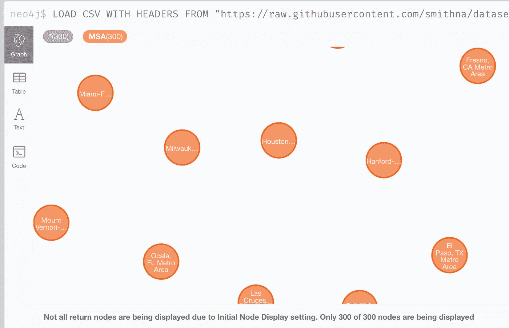

代表大都市地区的节点。图片作者。

与大多数 Neo4j 项目不同，*我们在开始时没有任何关系*要加载。相反，我们将使用图形数据科学库来发现相似的节点，并在它们之间创建关系。

我们将根据 ***欧氏距离*** 来定义相似度。欧几里德距离公式是勾股定理的延伸，勾股定理说的是直角三角形斜边长度的平方等于其他两条边的平方之和。

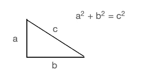

勾股定理。图片作者。

在我们的例子中，我们是沿着四个维度而不是两个维度比较 MSA，但是概念是相似的。两个 MSA 之间的欧几里德距离是每个人口统计指标的平方差总和的平方根。

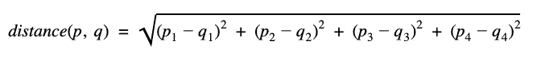

欧几里德距离公式

在计算距离之前，我们希望四个属性从最小值到最大值的范围大致相同。如果范围差异大，则范围大的属性将主导距离计算；范围较小的属性几乎不会影响距离计算。所以我们需要把它们都归一化到相同的范围。

运行这个查询来查看我们加载的四个属性的值的范围。

```
MATCH (n)
WITH n, 
["population", "medianHouseholdIncome", "medianHomePrice", "percentOver25WithBachelors" ] AS metrics
UNWIND metrics as metric
WITH metric, n[metric] AS value
RETURN metric, min(value) AS minValue,
percentileCont(value, 0.25) AS percentile25, 
percentileCont(value, 0.50) AS percentile50, 
percentileCont(value, 0.75) AS percentile75, 
max(value) AS maxValue
```

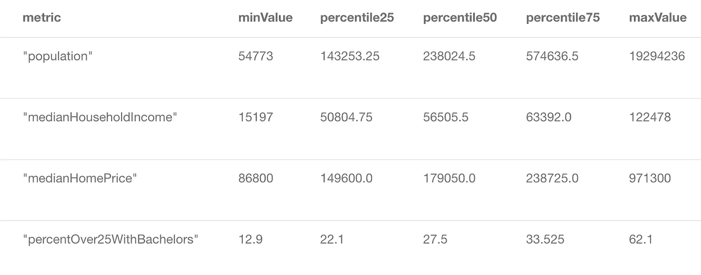

显示每个属性的值范围的表。图片作者。

人口范围从 54，773 人到 19，294，236 人。这与 25 岁以上拥有大学学位的人的百分比范围(从 12.9%到 67.4%)有着巨大的差异。

我们还可以看到，第 50 和第 75 百分位人口(336，612 名公民)之间的差异要比第 25 和第 50 百分位人口(94，771.25 名公民)之间的差异大得多。我下载了数据，并用标准刻度和对数刻度绘制了直方图，以检查分布情况。

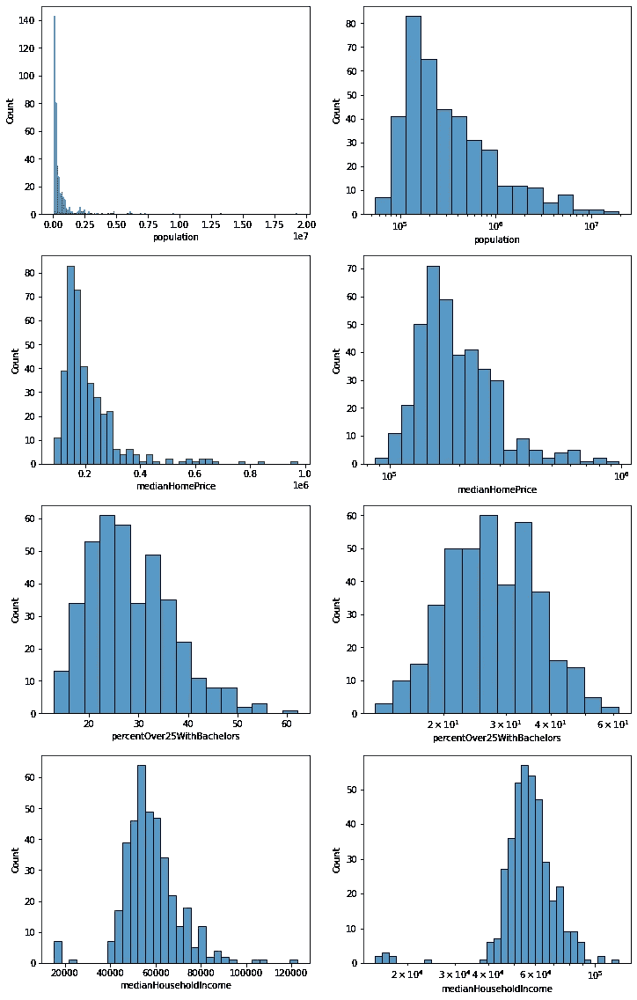

单位和对数标度的度量直方图。图片作者。

如果我们应用对数变换，我们所有的指标看起来更接近正态分布。当我考虑到在一个拥有 60，000 人口的 MSA 中增加 10，000 名居民会对都会区的特征产生很大的改变，但是在一个拥有 1，900 万人口的 MSA 中增加 10，000 名居民产生的影响要小得多时，这在直觉层面上对我来说是有意义的。另一方面，在任何规模的 MSA 中，10%的人口变化都是显而易见的。

运行以下命令，将对数变换应用于人口、中值房价和 25 岁以上拥有学士学位的人口百分比。

```
MATCH (m:MSA)
SET 
m.logPopulation = log(m.population),
m.logMedianHouseholdIncome = log(m.medianHouseholdIncome),
m.logMedianHomePrice = log(m.medianHomePrice),
m.logPercentOver25WithBachelors = log(m.percentOver25WithBachelors)
```

t [he 图形数据科学库](https://neo4j.com/docs/graph-data-science/current/alpha-algorithms/scale-properties/#algorithms-scale-properties-minmax)中的`MinMax`缩放器将应用下面的公式来 ***重新缩放每个属性值*** 。最小值设置为 0，最大值设置为 1，所有其他值根据它们在原始数据集中的位置成比例地落在 0 和 1 之间。

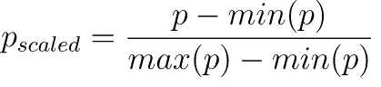

最小最大标量公式

我们将创建一个名为“metro-graph”的 ***内存图*** 来一次有效地在所有节点上执行缩放计算。我们将把标签为`MSA`的所有节点加载到内存图中。由于我们的图中还没有任何关系，我们将使用一个`*`通配符作为占位符。

```
CALL gds.graph.project('msa-graph', 
'MSA', 
'*', 
{nodeProperties:["logPopulation", "logMedianHouseholdIncome", "logMedianHomePrice", "logPercentOver25WithBachelors"]})
```

运行下面的命令，在内存图中创建一个名为`scaledProperties`的新属性。新的属性将是一个由四个值组成的 ***vector*** (有序列表):population、medianHouseholdIncome、medianHomePrice、percentOver25WithBachelors。在将属性添加到 vector 之前，将对每个属性应用`MinMax`缩放器，以便所有值都在范围[0，1]内。

```
CALL gds.alpha.scaleProperties.mutate('msa-graph', 
{nodeProperties: ["logPopulation", "logMedianHouseholdIncome", "logMedianHomePrice", "logPercentOver25WithBachelors"], 
scaler:"MinMax",
mutateProperty: "scaledProperties"}) 
YIELD nodePropertiesWritten
```

我们可以使用刚刚创建的`scaledProperties`来计算节点之间的距离。欧几里德距离公式告诉我们*在四维空间中*MSA 相距多远。*距离值越高，两个 MSA 越不相似*。我们对 MSA 之间的相似性感兴趣，所以我们将使用一种将距离转换为相似性的算法。


欧几里德相似公式

*属性`similarity`的值*越高，*两个 MSA 越相似*。

[K-Nearest Neighbors 算法](https://neo4j.com/docs/graph-data-science/current/algorithms/knn/)将根据欧几里德相似性公式在我们的图中创建从每个节点到其最近邻居的关系。`topK`参数告诉算法创建从每个节点到其最近的 15 个邻居*的关系`IS_SIMILAR`。在 write 模式下运行算法之前，让我们在 stats 模式下运行它，并检查相似性得分的分布。*

```
*CALL gds.knn.stats("msa-graph",
   {
      nodeProperties:{scaledProperties:"EUCLIDEAN"},
      topK:15,
      sampleRate:1,
      randomSeed:42,
      concurrency:1
   }
) YIELD similarityDistribution 
RETURN similarityDistribution-----------------------------------{
  "p1": 0.8350143432617188,
  "max": 0.9999847412109375,
  "p5": 0.9390525817871094,
  "p90": 0.996307373046875,
  "p50": 0.9895782470703125,
  "p95": 0.9975738525390625,
  "p10": 0.9621849060058594,
  "p75": 0.9938201904296875,
  "p99": 0.998992919921875,
  "p25": 0.9813117980957031,
  "p100": 0.9999847412109375,
  "min": 0.77587890625,
  "mean": 0.9814872709261316,
  "stdDev": 0.027092271447973864
}*
```

*我们可以看到，99%的关系相似度得分在 0.835 以上，最小相似度在 0.776 左右。当我们用相似性关系更新内存中的图时，我们将使用`similarityThreshold` 参数来排除相似性分数在倒数 1%的关系。*

```
*CALL gds.knn.mutate("msa-graph",
               {nodeProperties: {scaledProperties: "EUCLIDEAN"},
               topK: 15,
               mutateRelationshipType: "IS_SIMILAR",
               mutateProperty: "similarity",
               similarityCutoff: 0.8350143432617188,
               sampleRate:1,
               randomSeed:42,
               concurrency:1}
              )*
```

*在 mutate 模式下运行 KNN 在内存图形投影中创建了`IS_SIMILAR`关系。现在[将它们写到 Neo4j 图](https://neo4j.com/docs/graph-data-science/current/graph-catalog-relationship-ops/#_syntax)中，这样就可以用 Cypher 查询它们，并在 Bloom 中可视化。*

```
*CALL gds.graph.writeRelationship(
    "msa-graph",
    "IS_SIMILAR",
    "similarity"
)*
```

*让我们给`IS_SIMILAR`关系添加一个`rank`属性，这样我们就可以过滤每个节点排名靠前的关系。*

```
*MATCH (m:MSA)-[s:IS_SIMILAR]->()
WITH m, s ORDER BY s.similarity DESC
WITH m, collect(s) as similarities, range(0, 11) AS ranks
UNWIND ranks AS rank
WITH rank, similarities[rank] AS rel
SET rel.rank = rank + 1*
```

*现在让我们看看 Bloom graph 可视化应用程序中的图表。返回 Neo4j 沙盒主页，选择“打开 Bloom”*

**

*启动 Bloom。图片作者。*

*使用您的沙盒凭据登录。因为这是我们第一次使用 Bloom 处理这个数据集，所以点击“创建透视图”然后，单击“生成透视图”让 Bloom 为您设置一个透视图。最后，点击你新生成的视角进入绽放场景。*

**

*单击“使用视角”以使用您的新 Bloom 视角。图片作者。*

*让我们配置“IS_SIMILAR”关系的显示，以便线宽对应于节点的相似性。单击屏幕右侧面板上的“关系”,然后单击“IS_SIMILAR”关系旁边的线条。*

*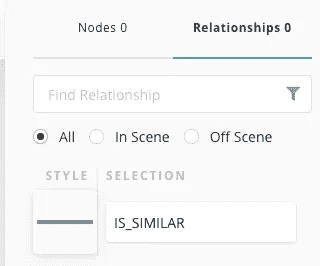*

*单击 IS_SIMILAR 旁边的行。图片作者。*

*在出现的弹出菜单中，选取“基于规则”然后，单击加号添加新的基于规则的样式。*

*从属性键下拉列表中选择“相似性”。选择“范围”的单选按钮单击“大小”按钮创建一条控制线宽的规则。切换按钮以应用大小规则。*

*在最小点框中，输入 0.83 并将最小大小设置为 0.25 倍。在最大点框中，输入 1 并将最大大小设置为 4 倍。您的配置应该如下图所示。*

*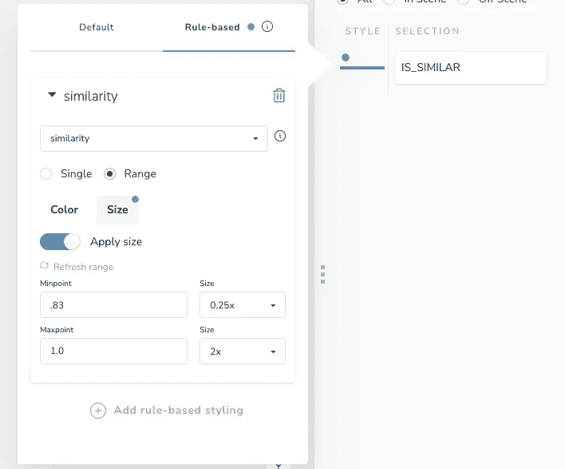*

*基于规则的样式配置。作者图片*

*现在，让我们使用 Bloom 来搜索 MSA 及其最接近的对等体。如果你开始在 Bloom 搜索框中键入“纽约”，Bloom 的自动完成应该会建议“纽约-纽瓦克-泽西城，NY-NJ-PA 都会区。”按 tab 键接受建议。一旦你有了纽约 MSA 的一个节点，Bloom 会自动建议涉及该节点的模式。选择从具有 IS_SIMILAR 关系的纽约节点扩展的模式，然后按 enter 键。*

*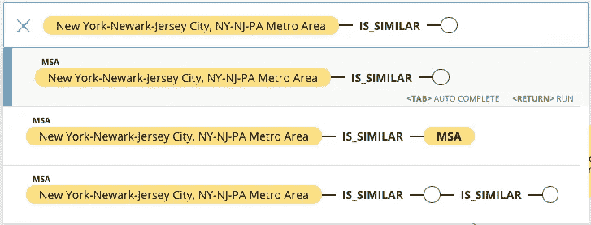*

*Bloom 搜索框。图片作者。*

*Bloom 将返回一个可视化结果，显示纽约 MSA 及其 15 个最相似的 MSA，基于我们使用的四个人口统计指标。*

*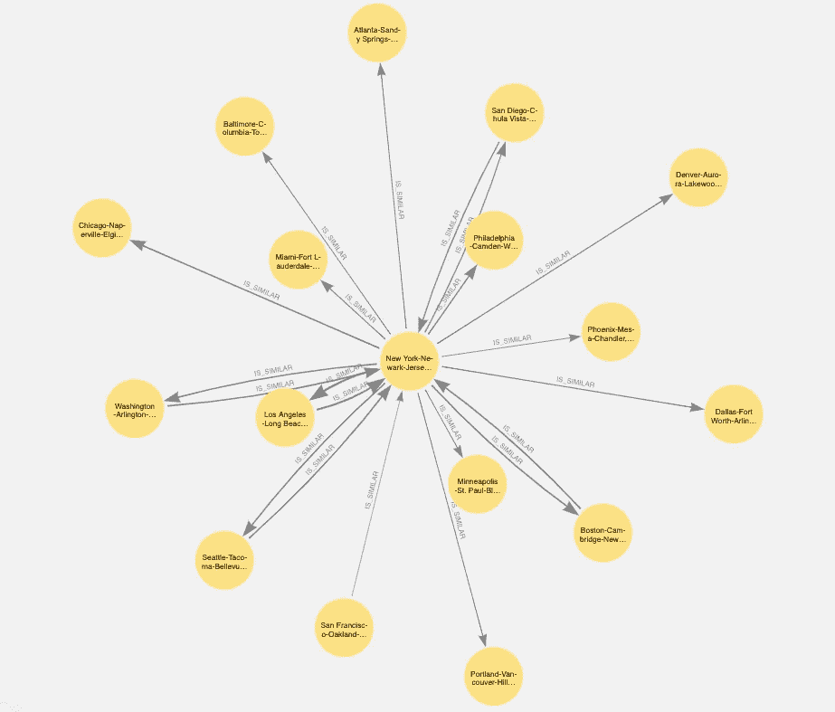*

*与纽约最相似的管理服务协议。图片作者。*

*基于出站箭头的粗细，我们可以看到洛杉矶是与纽约最相似的 MSA。*

*我们可能会惊讶地发现，有往来于纽约和洛杉矶、圣地亚哥、波士顿、华盛顿和西雅图的关系，但没有可视化中的其他城市。我们告诉欧几里德距离算法为每个节点的前 15 个最近的 MSA*创建关系。如果我列出离纽约最近的 15 个 MSA，亚特兰大包括在内。然而，如果我列出离亚特兰大最近的 12 个 MSA，纽约没有入选。这就是为什么有从纽约到亚特兰大的关系，但没有从亚特兰大到纽约的关系。**

*让我们过滤显示内容，查看与纽约最相似的前 5 个城市。单击 Bloom 屏幕左侧的漏斗图标以展开过滤器面板。在下拉列表中选择 IS_SIMILAR。选择“等级”属性。选择“小于或等于”条件，并将值设置为 5。切换“应用过滤器”以突出显示纽约的前 5 个最强相似性关系。*

*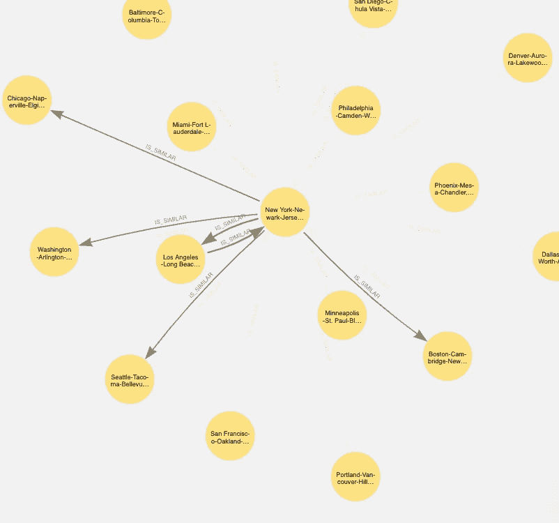*

*过滤关系。作者图片*

*我们研究了单个 MSA 的邻居。现在让我们来看一下全局。右键单击 Bloom 画布并从上下文菜单中选择“清除场景”。在搜索框中，输入“MSA”并按 tab 键。选择(MSA)-IS_SIMILAR-()模式，然后按 enter 键。我们会看到完整的 MSA 图。*

*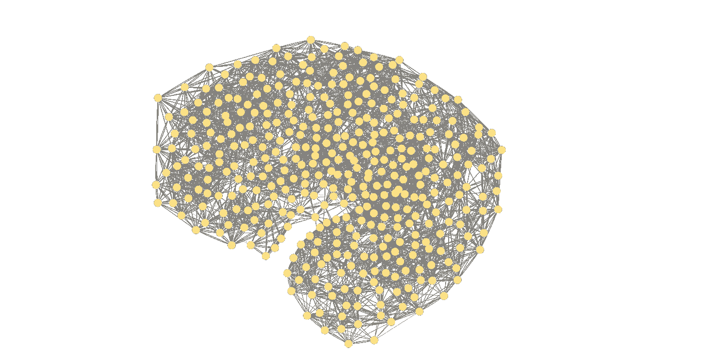*

*完整的 MSA 相似图。图片作者。*

*再次打开过滤器面板。为大于或等于 0.96 的“相似性”在 IS_SIMILAR 关系上创建新过滤器。切换“应用过滤器”，然后单击面板底部的“消除过滤的元素”按钮。我们开始看到一些岛屿和半岛从主节点群中分化出来。有三个离群节点，其中它们的 15 个最相似的邻居没有一个具有大于 0.96 的相似性。我们将使用社区检测算法进一步探索图的结构。*

*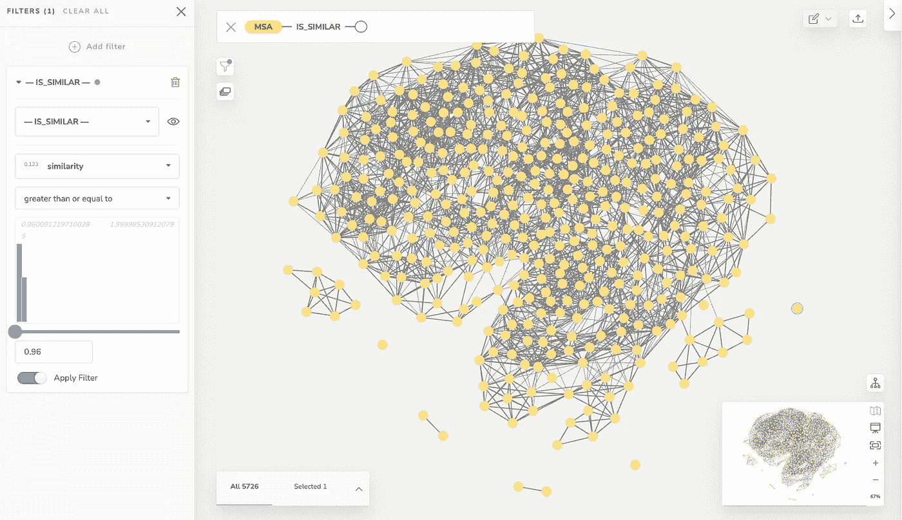*

*过滤 MSA 相似图。作者图片*

*返回 Neo4j 浏览器，运行以下命令进行社区检测。我们将针对内存中的图形执行 [Louvain 社区检测算法](https://neo4j.com/docs/graph-data-science/current/algorithms/louvain/)，并将社区 id 写回到主 Neo4j 图形中。我们告诉算法使用`similarity`属性来加权节点之间的关系。通过将`consecutiveIds`参数设置为 true，我们告诉算法我们希望生成的`communityId`属性的值是连续的整数。*

```
*CALL gds.louvain.write('msa-graph',{relationshipTypes: ["IS_SIMILAR"],
relationshipWeightProperty:"similarity",
 writeProperty:"communityId"})YIELD communityCount, modularities
RETURN communityCount, modularities*
```

*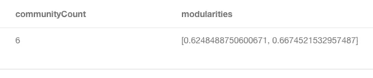*

*社区检测结果。图片作者。*

*输出显示我们检测到了 6 个社区。算法的连续迭代将社区分区的模块性从 0.625 增加到 0.667。*

*运行下面的查询来收集关于我们定义的社区的汇总统计信息。除了统计数据之外，我们还通过列出每个社区中与同一社区中的其他 MSA 具有最高相似性的三个 MSA 来添加上下文。这些管理服务协议应该是其社区的典型范例，而其他管理服务协议的社区内关系可能更少或更弱。*

```
*MATCH (m:MSA)
WITH m 
ORDER BY apoc.coll.sum([(m)-[s:IS_SIMILAR]->(m2) 
WHERE m.communityId = m2.communityId | s.similarity]) desc
RETURN m.communityId as communityId,
count(m) as msaCount, 
avg(m.population) as avgPopulation,
avg(m.medianHomePrice) as avgHomePrice,
avg(m.medianHouseholdIncome) as avgIncome,
avg(m.percentOver25WithBachelors) as avgPctBachelors,
collect(m.name)[..3] as exampleMSAs
ORDER BY avgPopulation DESC*
```

*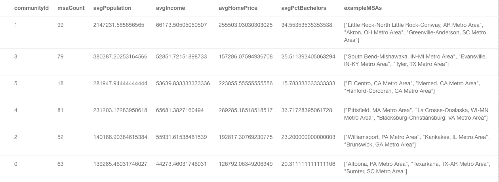*

*汇总社区功能的表格。图片作者。*

*knn 和 Louvain 算法是 id 81 社区中 MSAs 人口最多的社区，平均人口接近 200 万。社区 54 也有很高的 MSA 人口，但是收入和房价低于社区 81。社区 234 和 330 非常相似，但 234 人口更多，330 房价更高。与人口规模相似的社区相比，社区 75 拥有受过高等教育的公民。社区 264 有少量的 MSA。385 社区有低收入管理事务协议。*

*让我们给社区起一个比自动生成的 id 更人性化的名字。*

```
*MATCH (m:MSA) 
  SET m.communityName = CASE m.communityId 
  WHEN 54 THEN "Large mid-cost metros"
  WHEN 75 THEN "College towns"
  WHEN 81 THEN "Large high-cost metros"
  WHEN 234 THEN "Mid-size metros"
  WHEN 264 THEN "Small metros"
  WHEN 330 THEN "Mid-price metros"
  WHEN 385 THEN "Low-income metros"
  END
return m.communityName, m.communityId, count(*)*
```

*要使 communityName 属性在 Bloom 中可搜索，请在该属性上创建一个索引。*

```
*CREATE INDEX msa_community_name IF NOT EXISTS
FOR (m:MSA)
ON (m.communityName)*
```

*让我们来看看 Bloom 中的结果。我们将配置透视图以反映我们添加的新社区。单击屏幕左上角的图标打开透视图面板。然后，单击数据库图标来刷新透视图，以包含我们添加到数据库中的新的`communityName`属性。*

*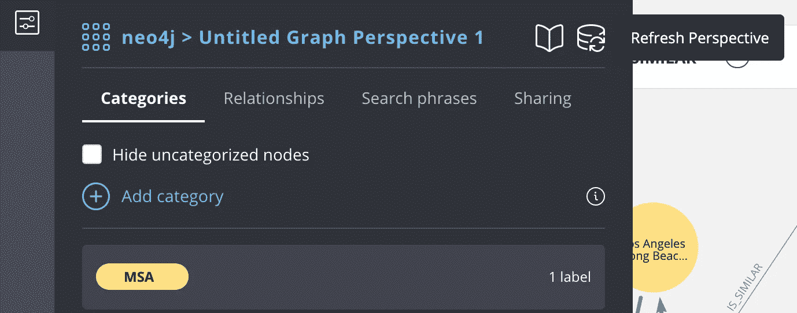*

*刷新 Bloom 透视图以在数据库中包含新属性。图片作者。*

*在屏幕右侧的面板中，单击 MSA 旁边的圆圈来设置 MSA 节点的样式。在出现的弹出菜单中，选取“基于规则”然后，单击加号添加新的基于规则的样式。从属性键下拉列表中选择“communityName”。选择“唯一值”的单选按钮切换按钮以应用颜色规则。*

**

*communityName 的基于规则的样式配置。图片作者。*

*让我们添加第二个条件样式来根据人口设置节点的大小。单击加号添加新的基于规则的样式规则。*

*从属性键下拉列表中选择“人口”。选择“范围”的单选按钮单击“大小”按钮创建控制节点大小的规则。切换按钮以应用大小规则。*

*在“最小点”框中，输入 55000 并将最小大小设置为 1x。在 Maxpoint 框中，输入 19000000，并将最大大小设置为 4x。您的配置应该如下图所示。*

*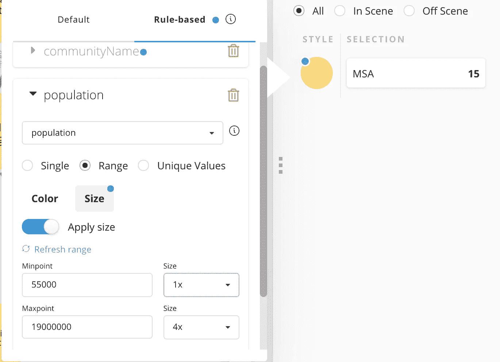*

*基于规则的群体样式。图片作者。*

*现在右键单击并从上下文菜单中选择“清除场景”。在搜索框中，键入“大学城”，然后按 enter 键。返回的结果包括州立大学、PA Metro、Ithaca、NY Metro、Champaign-Urbana、IL Metro 和 Charlottesville、VA Metro。这些大都市区是宾夕法尼亚州立大学、康奈尔大学、伊利诺伊大学和弗吉尼亚大学的所在地。根据我们对这些大都市地区的了解，该算法似乎已经发现了一些明显的共性。*

*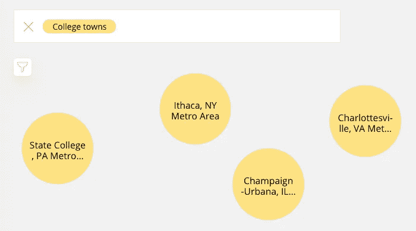*

*一些 MSA 通过搜索“大学城”返回。图片作者。*

*我们来看看还有哪些大都市和大学城最相似。点按 Command-A 以选择所有节点。然后右键单击其中一个节点，并从上下文菜单中选择 Expand:*

*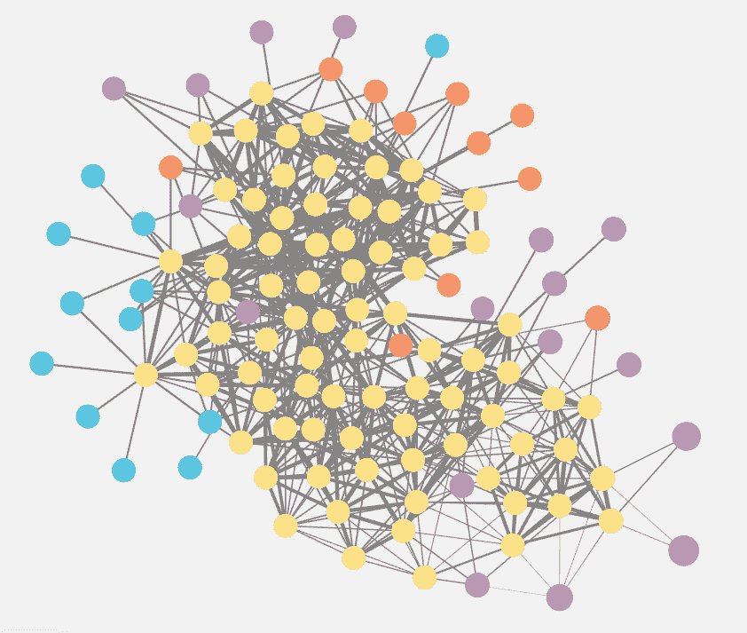*

*最像大学城的城市。图片作者。*

*当我缩小时，我可以看到我们添加了几个大型地铁区域(紫色)、中型地铁区域(橙色)、小型中等收入区域(青色)和一个中型高成本地铁区域(红色)。双击节点或放大以查看节点详细信息。我们增加的几个 MSA，如麦迪逊、威斯康星大都会区和北卡罗莱纳州的达勒姆-查佩尔山恰好是主要大学的所在地。*

*使用该数据集进行实验，以进一步探索相似性图表。运行`gds.alpha.similarity.euclidean`时，通过减少`topK`参数或设置`similarityThreshold`参数来减少相似性关系的数量，将会在运行`gds.louvain`时产生更多的社区。运行`gds.alpha.scaleProperties`时，尝试除`MinMax`之外的缩放器。*

*图形数据科学库支持其他几种[相似度算法](https://neo4j.com/docs/graph-data-science/current/algorithms/similarity/)。[K-最近邻](https://neo4j.com/docs/graph-data-science/current/algorithms/knn/)算法提供了一种基于[余弦相似度](https://en.wikipedia.org/wiki/Cosine_similarity)生成链接的有效方法。*

*Louvain 社区检测是几个[社区检测算法](https://neo4j.com/docs/graph-data-science/current/algorithms/community/)中的一个选项。通过运行[标签传播](https://neo4j.com/docs/graph-data-science/current/algorithms/label-propagation/)算法，查看您的结果有何不同。*

*GitHub 上的数据 CSV 除了大都市统计区域外，还包括小城市统计区域。从`LOAD CSV`脚本中移除`WHERE row.name INCLUDES 'Metro'`来加载这些节点并探索它们的属性。*

*您会发现*图实际上无处不在*，即使一开始关系在数据模型中并不明显。*