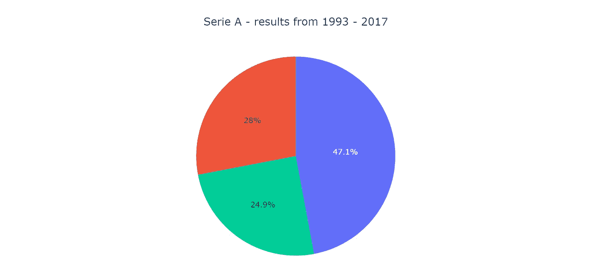
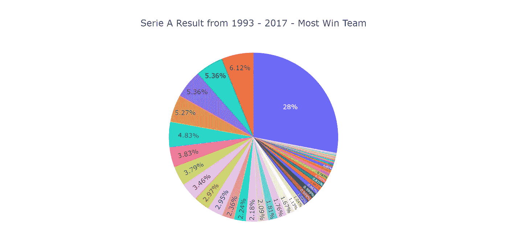
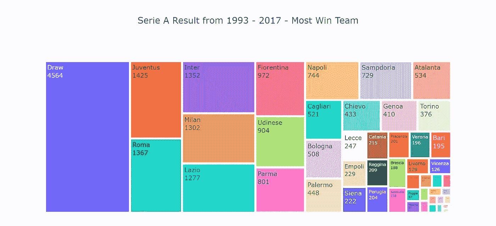
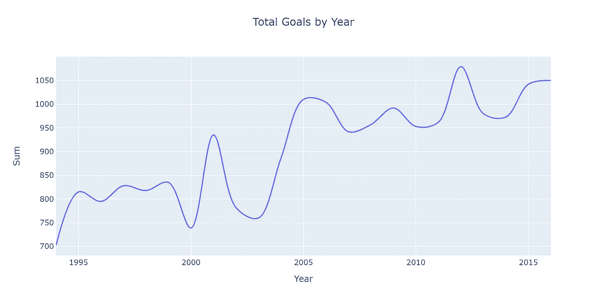
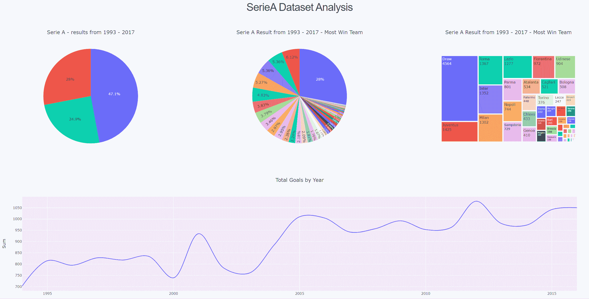

# 意甲(足球)——带有 Plotly 和 Dash 的简单仪表盘

> 原文：<https://towardsdatascience.com/create-a-simple-dashboard-with-plotly-dash-8f385ba1dd6d?source=collection_archive---------27----------------------->

自从上次我使用意甲数据并用 Plotly 创建了一些图表(通过下面的链接查看文章)，我想我应该更进一步，尝试创建一个仪表板，这样我就可以在一个页面上显示所有有趣的图表——这就是今天更新的开始。

[](/visualise-serie-a-football-league-data-with-pandas-and-plotly-3d26bcf26f2d) [## 可视化与熊猫和 Plotly 意甲(足球联赛)数据

### 上次我用意甲数据比赛，试图了解更多关于米兰德比的信息。然后我在想…

towardsdatascience.com](/visualise-serie-a-football-league-data-with-pandas-and-plotly-3d26bcf26f2d) 

照片由[达维德·扎维亚](https://unsplash.com/@davealmine?utm_source=unsplash&utm_medium=referral&utm_content=creditCopyText)在 [Unsplash](https://unsplash.com/s/photos/dashboard?utm_source=unsplash&utm_medium=referral&utm_content=creditCopyText) 上拍摄

# 先决条件:

类似前面文章提到的步骤，玩数据前的第一件和两件事是:**获取数据**和**清理数据。**

当前项目使用的数据来自 Kaggle，提供 [Massimo Belloni](https://www.kaggle.com/massibelloni) 。[https://www.kaggle.com/massibelloni/serie-a-19932017](https://www.kaggle.com/massibelloni/serie-a-19932017)

运行几行代码来组合来自不同 csv 文件的所有数据:

```
# Import the packages for data cleaning:
import pandas as pd
import glob
import numpy as np# Setup the file path & get all files
path = r'....\SerieA'
all_files = glob.glob(path + "/*.csv")table = []for filename in all_files:
    data = pd.read_csv(filename, index_col=None, header=0)
    table.append(data)frame = pd.concat(table, axis=0, ignore_index=True)#Only use the first eight columns
df = frame.iloc[:,0:7]
```

我还为接下来的可视化添加了几列:

```
# Identify the winner:
df['Winner'] = np.where(df['FTR'] == 'H',df['HomeTeam'],
                          np.where(df['FTR'] == 'A', df['AwayTeam'], "Draw"))# Identify if the winner is home team or away team:
df['Result'] = np.where(df['FTR'] == 'H','HomeTeamWin',
                          np.where(df['FTR'] == 'A', 'AwayTeamWin', "Draw"))# The year of the match:
df['Year']=pd.DatetimeIndex(df['Date']).year
```

我将清理后的数据保存到文件夹中，这样我下次就可以轻松地使用它，而不用再次运行上面的代码:

```
df.to_csv('seriearaw.csv')
```

# 准备好图表:

对于这个控制面板，我希望有四个图表—两个饼图、一个树状图和一个折线图。

```
# get the right package:
import plotly.express as pxchart1 = px.pie(df, values =df.groupby('Result')['Result'].count(),
               title='Serie A - results from 1993 - 2017',
                height = 500)
chart1.update(layout=dict(title=dict(x=0.5)))
```



图 1

```
chart2 = px.pie(df, values = df.groupby('Winner')['Winner'].count(),title = "Serie A Result from 1993 - 2017 - Most Win Team", height = 500)chart2.update(layout=dict(title=dict(x=0.5)))
chart2.update_traces(textposition='inside', textinfo='percent')
```



图 2

```
chart3 = px.treemap(df, path=['Winner'], values = 'TotalGoal',height = 500, title = "Serie A Result from 1993 - 2017 - Most Win Team")chart3.update(layout=dict(title=dict(x=0.5)))
chart3.update_traces(textinfo = 'label + value')
```



图 3

```
# Create a different dataframe for chart4:
total_goal =df.groupby('Year')['TotalGoal'].agg('sum').reset_index(name ='Sum')
total_goal = total_goal[(total_goal.Year != 2017) & (total_goal.Year != 1993)]chart4 = px.line(data_frame = total_goal, x ='Year', y = 'Sum', title = 'Total Goals by Year',
              line_shape = 'spline',height=500)
chart4.update(layout=dict(title=dict(x=0.5)))
chart4
```



图 4

# 设置仪表板:

**包**:构建仪表板需要三个包:

```
import dash# html is used to set up the layout, and dcc is used to embed the graphs to the dashboard:
import dash_core_components as dcc
import dash_html_components as html
```

**样式**:当前仪表板采用了外部表的样式。我的理解是，你非常欢迎创造自己的风格，但为了使起点更容易，有一些模板可用。

```
# Setup the style from the link:
external_stylesheets = ['https://codepen.io/chriddyp/pen/bWLwgP.css']# Embed the style to the dashabord:
app = dash.Dash(__name__, external_stylesheets=external_stylesheets)
```

**嵌入图表**:为了将我们刚刚创建的四个图表嵌入 dash，我们使用 dash_core_components 包。我们还在这里设置了这些图表的布局。

请不要在这里使用“ *className* ”，它用于定义图表看起来有多大。想象一下，一个仪表板页面可以平均分为 12 列，如果一个图形等于“四列”，这意味着该图形将是仪表板的三分之一(4/12)宽。在下面的代码中，我们用 graph 1–3 表示 4 列，用 graph4 表示 12 列。猜猜仪表盘长什么样？

```
graph1 = dcc.Graph(
        id='graph1',
        figure=chart1,
        className="four columns" 
    )graph2 = dcc.Graph(
        id='graph2',
        figure=chart2,
        className="four columns"
    )graph3 = dcc.Graph(
        id='graph3',
        figure=chart3,
        className="four columns"
    )graph4 = dcc.Graph(
        id='graph4',
        figure=chart4,
        className="twelve columns"
    )
```

定义每个图表的样式后，我们定义这些图表在仪表板中的位置。从上面的代码中，您可能会发现，我们将把 graph1、2 和 3 放在一行，而把 graph4 放在另一行:

```
# setup the header
header = html.H2(children="SerieA Dataset Analysis")# setup to rows, graph 1-3 in the first row, and graph4 in the second:
row1 = html.Div(children=[graph1, graph2, graph3],)
row2 = html.Div(children=[graph4])# setup & apply the layout
layout = html.Div(children=[header, row1, row2], style={"text-align": "center"})
app.layout = layout
```

酷，我们已经创建了图表并设置了仪表板布局，最后一步是运行应用程序，看看您的仪表板看起来如何:

```
if __name__ == "__main__":
    app.run_server()
```

请注意，我在这个项目中使用的是 jupyter notebook，这些代码可以很好地使用它。当我在看其他一些文章时，他们用“app.run_serviver(debug = True)”来运行仪表板，但这对我不起作用。

这就是这个简单仪表板的最终外观！玩得开心！



*参考:*[*https://coderzcolumn . com/tutorials/data-science/build-dashboard-using-python-dash-plotly-and-deploy-online-python anywhere*](https://coderzcolumn.com/tutorials/data-science/build-dashboard-using-python-dash-plotly-and-deploy-online-pythonanywhere)