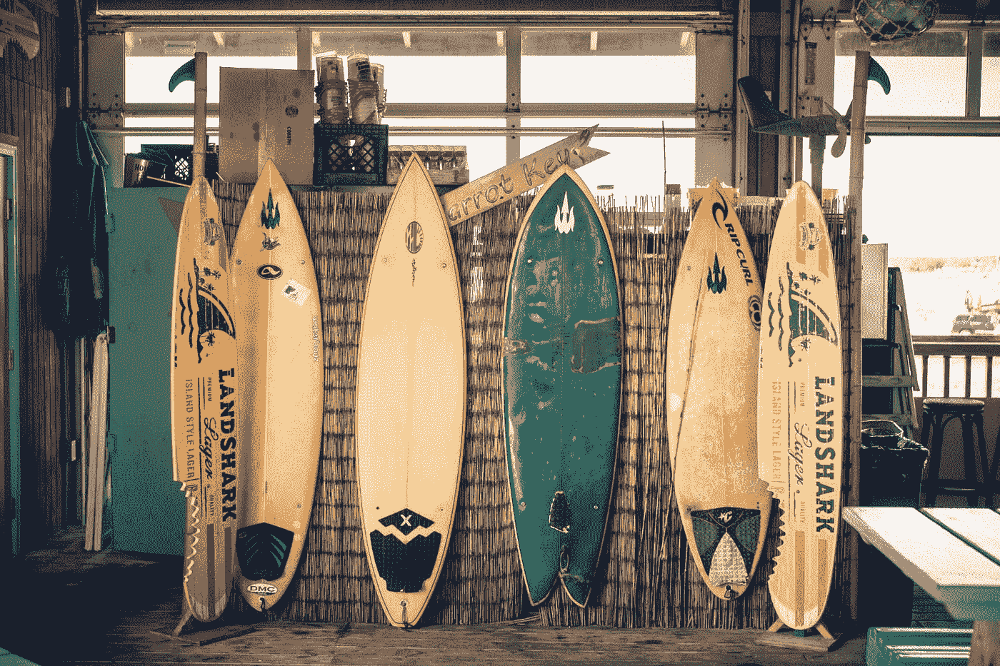
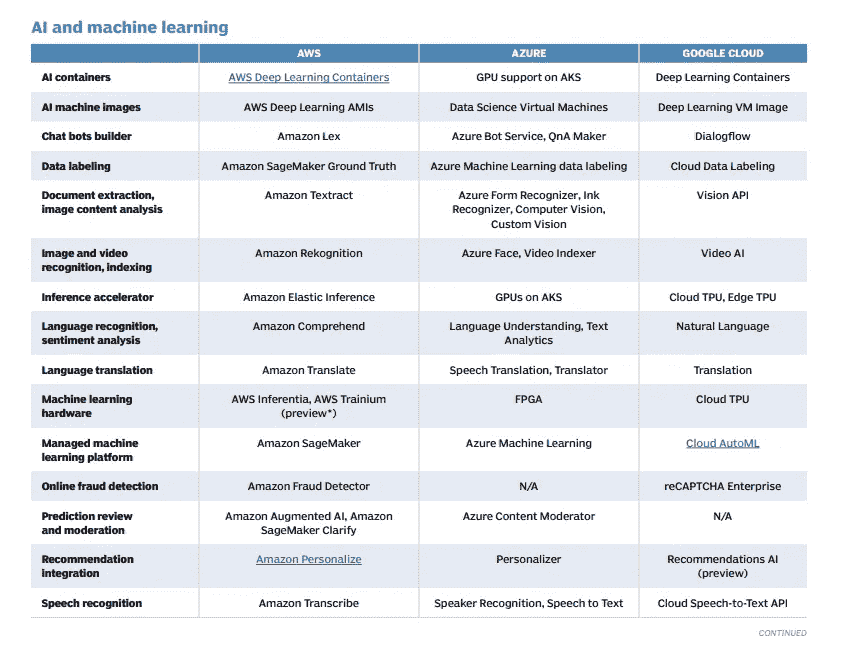
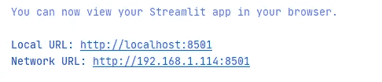
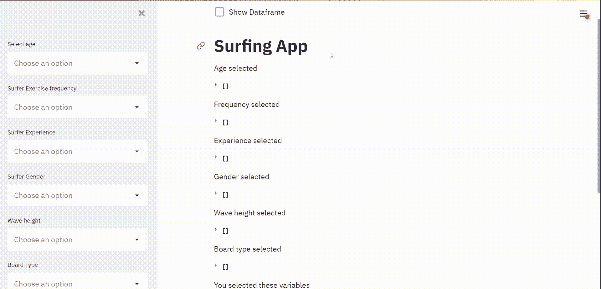

# 创建一个网上冲浪应用程序

> 原文：<https://towardsdatascience.com/create-a-surfing-web-app-34da6201f57e?source=collection_archive---------34----------------------->

## python 如何帮助你找到完美的冲浪板



在 [Unsplash](https://unsplash.com?utm_source=medium&utm_medium=referral) 上由 [NICO BHLR](https://unsplash.com/@nicobhlr?utm_source=medium&utm_medium=referral) 拍摄的照片

企业支付天文数字的数据，以确保他们领先竞争对手一步。有了免费的数据集，特别是关于最理想的冲浪板，冲浪就意味着商业，对吗？

# 什么是 Python Web App？

Python web 应用程序是一个网页，其中的指令/动作是使用 Python 编程创建的。例如，以下代码片段创建了一个下拉选项，用户可以在其中选择多个波高作为过滤器:

```
wave_height = st.sidebar.multiselect(**"Wave height"**, df[**'wave_height'**].unique())
st.write(**"Wave height selected"**, wave_height)
```

这是一种创造性的方式来展示您的 python 脚本可以做什么，而不需要其他人在他们的计算机上安装 python-他们所需要的只是互联网连接。

虽然 python 有助于定义您在 web 应用程序上的操作，但 web 框架会处理细节。这就是 [**细流**](https://streamlit.io/) 的用武之地。 **Streamlit** 为您设计仪表板。

> “Streamlit 可在几分钟内将数据脚本转化为可共享的 web 应用。
> 全部用 Python。全部免费。不需要前端经验。”— [细流公司，2021 年](https://streamlit.io/)

本教程将使用 **Streamlit** 作为 web 框架的选择，但是，理解其他选择也是有好处的

# Web 框架

用于使用基于 Python 的编程来构建 web 应用的流行 web 框架包括: [**Dash**](https://plotly.com/dash/) **，**[**Streamlit**](https://docs.streamlit.io/en/stable/)**，**[**Voila**](https://pypi.org/project/viola/)**，**[**Flask**](https://flask.palletsprojects.com/en/2.0.x/)**和**[**Django**](https://www.djangoproject.com/)**。**

**Flask** 是一个没有数据分析能力的 web 框架。它更像是一个*“从零开始建造”*的工程工具，允许更多的定制。它更擅长构建较小的定制应用和网站，如 Reddit 和 Airbnb。而 **Django** 则致力于帮助创建流量更大的复杂网站，如 Spotify 和 Instagram。

在 **Flask** 是一个 web 框架的情况下， **Streamlit** 和 **Dash** 将例如在 **Flask** 上运行，因为它们被认为是*“仪表板工具”。* **Streamlit** 是向利益相关者展示“价值证明”的绝佳方式，而 **Dash** 则是在您需要将仪表板投入生产并供公司使用的情况下。

如果你在 Jupyter Notebook 中编写代码，并希望在网页上显示你的发现，那么你可以使用像 **Viola** 这样的插件。Streamlit 还不能在 Jupyter 笔记本上使用，但是可以运行你的*。例如 PyCharm 中的 py* 文件。

在选择了最适合的 web 框架之后，你还需要选择一个 web 服务器来托管你的网站，这里有各种免费和付费的选项。

一个流行的例子是[谷歌应用引擎](https://cloud.google.com/appengine/docs/standard/python3)，它是在你的谷歌云项目下创建的。其他受欢迎的云提供商包括[亚马逊网络服务(AWS)](https://aws.amazon.com/what-is-aws/) 和[微软 Azure](https://azure.microsoft.com/en-us/overview/what-is-azure/) 。

[这里的](https://cdn.ttgtmedia.com/rms/pdf/A_cloud_services_cheat_sheet_for_AWS_Azure_and_Google_Cloud_PDF.pdf)是比较这三种云服务的备忘单:



(崔佛·琼斯，2020，[来源](https://cdn.ttgtmedia.com/rms/pdf/A_cloud_services_cheat_sheet_for_AWS_Azure_and_Google_Cloud_PDF.pdf))

# 工作示例

## 数据

你可以从 [kaggle](https://www.kaggle.com/loureiro85/surfing) (作者:[**【洛雷罗】**](https://www.kaggle.com/loureiro85) ****)** 下载我在这个工作示例中使用的公开可用的数据集。 *df_surf.csv* 数据集是由冲浪者回答的在线调查。每一行代表一个单独的冲浪者，每一列代表回答的问题。这些问题涉及冲浪板、波浪、冲浪者、操作和冲浪者的表现。**

## **创建您的项目**

**通过在 PyCharm 中创建新项目，它将为您创建一个*‘main . py’*文件。将 *df_surf.csv* 保存在与此 *main.py* 文件相同的位置。您可以重命名。py 文件，但是要确保修改我的代码来导入您重命名的文件。**

**在 PyCharm 终端中，安装以下软件包:**

```
pip install streamlit
pip install pandas
pip install numpy
```

**在 *main.py* 脚本中，插入以下代码，并查看我的注释。如果你是 Streamlit 的新手，[这里的](https://share.streamlit.io/daniellewisdl/streamlit-cheat-sheet/app.py #streamlit #python)是一张可以在 [streamlit 网站](https://streamlit.io/)上找到的备忘单，由 [Daniel Lewis](https://github.com/daniellewisDL) 于 2021 年创建。**

```
#import the packagesimport pandas as pd
import numpy as np
import streamlit as st*#import the dataset and create a checkbox to shows the data on your website*
df1 = pd.read_csv(**"df_surf.csv"**)
if st.checkbox(**'Show Dataframe'**):
    st.write(df1)#Insert some sentences in markdown format**'''
# Surfing App
'''**#Read in data again, but by using streamlit's caching aspect. Our whole app re-runs every time we make small changes, which is infeasible the more complicated our code becomes. So this is the recommended way to import the data.df = st.cache(pd.read_csv)(**"df_surf.csv"**)#create side bars that allow for multiple selections:age = st.sidebar.multiselect(**"Select age"**, df[**'surfer_age'**].unique())
st.write(**"Age selected"**, age)weekly_surfs = st.sidebar.multiselect(**"Surfer Exercise frequency"**, df[**'surfer_exercise_frequency'**].unique())
st.write(**"Frequency selected"**, weekly_surfs)surfer_experience = st.sidebar.multiselect(**"Surfer Experience"**, df[**'surfer_experience'**].unique())
st.write(**"Experience selected"**, surfer_experience)surfer_gender = st.sidebar.multiselect(**"Surfer Gender"**, df[**'surfer_gender'**].unique())
st.write(**"Gender selected"**, surfer_gender)wave_height = st.sidebar.multiselect(**"Wave height"**, df[**'wave_height'**].unique())
st.write(**"Wave height selected"**, wave_height)board_type = st.sidebar.multiselect(**"Board Type"**, df[**'board_type'**].unique())
st.write(**"Board type selected"**, board_type)#create a sidebar to select the variable output you want to see after making your multiple selectionsvariables = st.sidebar.multiselect(**"Select what you want to see for your selection"**, df.columns)
st.write(**"You selected these variables"**, variables)# return the sub-set data  of variables you want to seeselected_data = df[(df[**'surfer_age'**].isin(age))]
subset_data = selected_data[variables]
data_is_check = st.checkbox(**"Display the data of selected variables"**)
if data_is_check:
    st.write(subset_data)
```

**在您的终端中，您将运行以下命令:**

```
streamlit run main.py
```

**终端中将出现以下内容:**

****

**作者图片**

**单击本地主机链接，您的 web 应用程序将在浏览器中打开:**

****

**作者图片**

**这就是了。您自己的网络应用程序，探索棋盘类型和策略。**

# **结论**

**通过观察向这些冲浪者提出的一系列问题，你可以对实现特定动作所使用的冲浪板类型以及冲浪者的类型有所了解。一个从未在 5 英尺浪上做过削减的专业人士，还是一个用他/她的长板偷走所有乐趣的初学者？**

**本教程只是一个入门，但你可以添加更多的数据，可视化，甚至视频剪辑来丰富你的故事。但在那之前，现在是时候去得到那个完美的波浪了。**

****

**[奥斯汀·尼尔](https://unsplash.com/@arstyy?utm_source=medium&utm_medium=referral)在 [Unsplash](https://unsplash.com?utm_source=medium&utm_medium=referral) 上拍摄的照片**