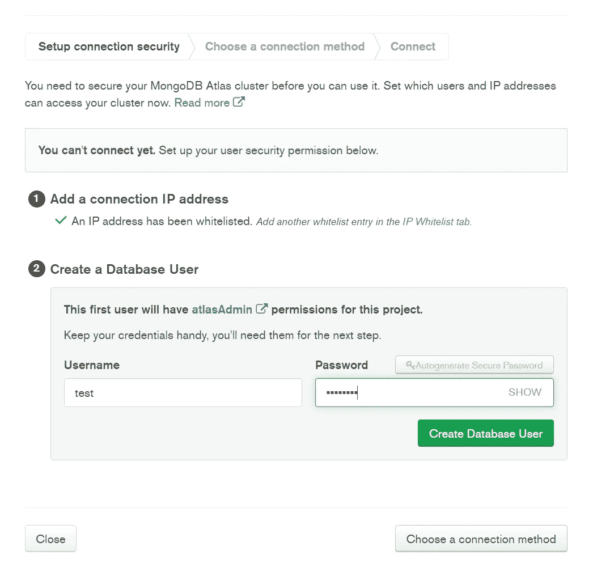

# 使用 Streamlit、MongoDB 和 Heroku 在 30 分钟内创建一个 Web 应用程序

> 原文：<https://towardsdatascience.com/create-a-web-app-in-under-thirty-minutes-with-streamlit-mongodb-and-heroku-41f211953786?source=collection_archive---------5----------------------->

## 快速开发和部署可伸缩 web 应用程序的有志全栈开发人员指南


克里斯里德在 [Unsplash](https://unsplash.com?utm_source=medium&utm_medium=referral) 上的照片

曾几何时，创建 web 应用程序还是像马克·扎克伯格和埃隆·马斯克这样的神童的工作。或者，你可以进入一所名牌大学，用你生命中最好的四年时间(和你父母的退休储蓄)学习编程，然后最终开发出低于 90 年代风格的网络应用程序。从那以后我们已经走了很长一段路。随着开源工具和云基础设施的泛滥，开发和部署非凡的应用程序在很大程度上已经大众化了。老实说，做一名开发人员可能从来没有这么简单过，你所需要的只是一堆正确的工具，而且你可以胜任大多数工作。

我将向您介绍三个主要工具，我自己曾大量使用它们来开发前端用户界面、提供服务器端基础设施，以及最终将所有优点部署到 web 服务器上。在本教程中，我们将创建一个简单的工作推荐应用程序。用户将选择他们希望工作的国家，然后上传他们的简历。随后，该应用程序将分析上传的文件中的关键词，并将搜索公司数据库以找到最相似的匹配。在我们继续之前，我假设你已经精通 Python 和它的一些包，比如 Pandas 和 NLTK，并且你有一个 GitHub 帐户。

# 1.细流

[Streamlit](https://www.streamlit.io/) 是一个全新的 web 框架，它几乎填补了 Python 开发者的 web 开发空白。以前，人们必须使用 Flask 或 Django 将应用程序部署到 web 上，这需要对 HTML 和 CSS 有很好的理解。幸运的是，Streamlit 是一个纯粹的 Python 包，学习曲线非常浅，将开发时间从数周减少到了数小时，真的。虽然它被标榜为机器学习和数据科学应用程序的框架，但我发现这相当不光彩；事实上，许多人(包括我自己)已经使用 Streamlit 来炫耀令人眼花缭乱的通用应用程序。

在本节中，我将向您展示如何实时安装、构建和运行 Streamlit 应用程序。首先，在您的环境中安装 Anaconda 和 Streamlit。或者，您可以在 Anaconda 提示符下运行以下命令。

```
pip install streamlit
```

一旦解决了这个问题，继续打开您选择的 Python IDE，并在您刚刚下载 Streamlit 的环境中打开它。现在让我们创建一个简单的界面，用户可以选择他们想要工作的国家，也可以上传他们的简历。最初，我们需要导入所有包，如下所示:

除了 Streamlit 和 Pandas，我们还需要 pdfplumber 和 PyPDF2 来处理我们上传的简历。rake_nltk、nltk 和它们的相关单词库需要从简历文本中解析关键短语，io 需要将二进制简历文件转换成 Python 可读的解码形式。

随后，我们创建用户界面，为国家/地区添加文本输入，为简历添加文件上传程序，并通过多选单词框选择获得的关键短语，如下所示:

上面调用的函数“keyphrases”通过使用 nltk 库来分析简历文本以发现相关的关键字。该功能如下所示:

最后，我们将 Python 脚本保存在我们环境的目录中，并在 Anaconda 提示符下执行以下命令，以在本地运行我们的 Streamlit 应用程序:

```
streamlit run *file_name.py*
```

您会注意到 web 应用程序将被转发到您的本地主机端口:

```
[http://localhost:8501](http://localhost:8501)
```

现在，您应该看到以下内容:


简化页面。图片作者。

继续上传您的简历，生成如下所示的关键短语:


关键短语生成。图片作者。

Streamlit 的美妙之处在于，您可以实时更新您的代码，并即时观察您的更改。因此，您可以随时进行尽可能多的修改。

# 2.MongoDB

没有服务器端组件的 web 应用程序是不完整的，还有什么比 MongoDB 更好的学习与数据库交互的方法呢？虽然在这种情况下，我们的数据集是结构化的，并且使用像 MongoDB 这样的非关系数据库架构是多余的，但与所有可扩展的应用程序一样，在某种程度上，您可能会最终处理大量的非结构化数据，所以最好在一开始就进入正确的生态系统。更不用说 MongoDB 必须提供的一系列特性，比如全文索引和模糊匹配。

对于这个应用程序，我从 kaggle.com 下载了一个全球公司的公共数据集。我已经删除了它的一些属性，将数据集的总大小减少到 100 兆字节；请记住，MongoDB 提供了一个高达 512 兆存储的免费层集群。接下来，继续开设 MongoDB Atlas 帐户，然后注册一个组织和一个项目。随后在 AWS 的 US-East-1 区域建立一个名为“M0 沙盒”的免费层集群。这将确保我们有最小的延迟，因为我们的 Heroku web 服务器也将托管在同一地区。


构建 MongoDB 集群。图片作者。


选择 MongoDB 自由层集群。图片作者。


选择 MongoDB 集群区域。图片作者。

创建集群后，MongoDB 需要几分钟的时间来配置服务器。配置完成后，您需要将用于连接到集群的 IP 地址列入白名单。虽然出于明显的安全原因，我不推荐这样做，但是为了简单起见，您可以将所有 IP 地址列入白名单。从“安全”菜单中选择“网络访问”，如下所示:


配置 MongoDB 集群的网络访问。图片作者。

随后，选择“允许从任何地方访问”，并选择所需的时间范围，如下所示:


将 MongoDB 集群的 IP 地址列入白名单。图片作者。

接下来，您需要设置一个连接字符串来远程连接到您的集群。从“数据存储”菜单中选择“集群”,然后单击集群窗口上的“连接”,如下所示:


正在设置 MongoDB 连接。图片作者。

输入将用于连接到该群集的用户名和密码，如下所示:



为 MongoDB 集群访问选择用户名和密码。图片作者。

创建用户后，单击“选择连接方法”继续下一步，您应该选择“连接您的应用程序”，如下所示:


正在为 MongoDB 集群创建连接字符串。图片作者。

出现提示时，选择“Python”作为驱动程序，选择“3.6 或更高版本”作为版本。将为您创建一个连接字符串，如下所示:


MongoDB 连接字符串。图片作者。

您的连接字符串和完整的驱动程序代码应该是:

```
client = pymongo.MongoClient("mongodb+srv://test:<password>[@cluster0](http://twitter.com/cluster0).nq0me.mongodb.net/<dbname>?retryWrites=true&w=majority")
db = client.test
```

复制该字符串并用您在前面步骤中创建的实际密码替换'<password>'部分。</password>

现在我们已经了解了 MongoDB 的所有逻辑，让我们加载数据集吧！选择集群中的“收藏”，然后点击“添加我自己的数据”。


将数据加载到 MongoDB 集群中。图片作者。

出现提示时，输入数据库和集合的名称以继续加载数据。请注意，MongoDB 中的“集合”与任何其他数据库中的表同义；同样,“文档”与其他数据库中的行相同。有多种方法可以将数据集加载到新创建的数据库中；最简单的方法是使用 MongoDB Compass 桌面应用程序，你可以在这里下载[。下载并安装后，使用之前生成的连接字符串继续连接到集群，如下所示:](https://www.mongodb.com/try/download/compass)


MongoDB 指南针桌面应用程序。图片作者。


MongoDB 指南针数据库。图片作者。

连接后，您应该能够找到您在前面的步骤中创建的数据库和集合。继续并点击“导入数据”将您的数据集上传到您的收藏中。一旦加载了数据，就需要创建一个全文索引，以便以后查询数据。全文索引实际上是对数据库中的每个单词进行索引；这是一种非常强大的索引形式，非常类似于搜索引擎所使用的。为此，您需要在互联网上导航回您的 MongoDB 集群，并在您的集合中选择“搜索索引”选项卡，如下所示:


在 MongoDB 中创建全文索引。图片作者。

单击“创建搜索索引”。这将通过以下窗口提示您，您可以在其中修改索引，但是，您可以通过单击“创建索引”继续使用默认条目。


在 MongoDB 中创建全文索引。图片作者。

既然已经配置了数据库、加载了数据集并创建了索引，您就可以在 Python 中创建查询函数，使用用户输入从数据库中提取记录，如下面的函数所示:

上面代码片段中的第一行建立了到数据库中集合的连接；请确保输入您的密码。或者，您可以将您的密码存储在一个[配置文件](https://medium.com/@t.rosen2101/how-to-create-a-gitignore-file-to-hide-your-api-keys-95b3e6692e41)中，并在您的代码中作为一个参数调用它，如果您希望更安全地处理密码的话。

为了查询您的 MongoDB 集合，您需要使用“聚合”特性，它只是 MongoDB 中的一个过滤管道。管道的第一阶段($search)是利用我们的全文索引的部分；这里，我们使用模糊匹配来匹配我们先前生成的简历关键短语和数据集中的“行业”属性。下一阶段($project)使用文档排名来按照分数降序排列匹配的查询。第三阶段($match)过滤掉不包含用户指定的国家的文档。最后一个阶段($limit)只是将返回结果的数量限制为 10 个。

既然我们已经整理了查询函数，我们需要在我们的 Streamlit 页面代码中再添加几行代码，以添加一个执行查询并显示搜索结果的搜索按钮，如下所示:


求职推荐网站。图片作者。

# 3.赫罗库

如果你已经做到了这一步，那么你会很高兴地知道你离完成只有几下鼠标的距离。多亏了 Heroku，将一个网络应用程序部署到云端只需点击几下鼠标。值得一提的是，Streamlit 开发了自己的[【一键部署】](https://www.streamlit.io/sharing)选项，您可以将 GitHub 存储库与 Streamlit 集成，并免费部署您的应用。然而，问题是您的存储库需要是公共的，直到 Streamlit 发布其企业部署版本来迎合私有存储库，然后对许多人来说这将是一个交易破坏者。

在我们继续之前，您需要创建四个将与您的源代码一起部署的文件。

## 1.requirements.txt

您需要一个 requirements.txt 文件，其中包含 Heroku 需要为您的应用程序安装的所有软件包。这可以使用“pipreqs”包生成。在 Anaconda 提示符下键入以下命令来安装 pipreqs:

```
pip install pipreqs
```

然后把你的目录换成一个文件夹，只有**和**包含你的源代码，其他什么都没有。

```
cd C:/Users/..../folder/
```

然后键入以下内容:

```
pipreqs
```

将使用以下软件包生成 requirments.txt 文件:

```
pymongo[tls,srv]==3.6.1
lxml==4.5.2
nltk
pdfplumber==0.5.24
pymongo==3.11.0
pandas==1.0.5
rake_nltk==1.0.4
streamlit==0.69.2
PyPDF2==1.26.0
```

## 2.setup.sh

setup.sh 文件告诉 Heroku 如何配置 Streamlit 应用程序，可以使用文本编辑器如 [Atom](https://atom.io/) 创建，并且必须以. sh 扩展名保存。

## 3.Procfile

类似地，Procfile 是一个配置文件，它告诉 Heroku 在启动时运行我们的源代码。它也可以用 Atom 文本编辑器创建，请注意它没有**扩展名。**

## 4.nltk.txt

nltk.txt 文件告诉 Heroku 使用哪个单词库。只需将以下内容添加到文件中，并确保使用文本文件的“LF”UNIX 格式保存它。

```
wordnet
pros_cons
reuters
```

准备好源代码和这四个文件后，将它们上传到一个私有的 GitHub 存储库中(以免公开任何密码)。然后去 Heroku 开个账户，如果你还没有的话。我们将使用免费的 Dyno 层，这足以部署一个实验性的应用程序。选择下面的“新建”按钮，继续创建新应用程序:


创建 Heroku 应用程序。图片作者。

出现提示时，输入您的名称，并选择“美国”地区。


创建 Heroku 应用程序。图片作者。

随后，选择“GitHub”部署方法和您的存储库，如下所示:


GitHub 与 Heroku 的集成。图片作者。

向下滚动到底部，选择存储库的正确分支，然后选择“部署分支”按钮来部署您的应用程序。Heroku 轻松构建您的应用程序时，请高枕无忧。完成后，假设没有错误，您将获得 web 应用程序的链接。鉴于你使用的是免费层，你第一次运行该应用程序将需要一段时间来曲柄启动。

由于您的 Heroku 帐户与 GitHub 集成在一起，您可以随时更新/修改您的代码，并像以前一样重新部署应用程序。有了 Heroku，你甚至可以设置自动操作，这样每当你的存储库更新时，应用程序就会自动重新部署。您还可以随时向 MongoDB 数据库添加数据，这些数据会立即反映在 web 应用程序中。因此得名“可扩展的 web 应用程序”。祝贺您使用 Streamlit、MongoDB 和 Heroku 部署您的 web 应用程序！

# 有用的链接

如果您想了解更多关于数据可视化、Python 以及将 Streamlit web 应用程序部署到云中的信息，请查看以下(附属链接)课程:

## 使用 Streamlit 开发 Web 应用程序:

<https://www.amazon.com/Web-Application-Development-Streamlit-Applications/dp/1484281101?&linkCode=ll1&tag=mkhorasani09-20&linkId=a0cb2bc17df598006fd9029c58792a6b&language=en_US&ref_=as_li_ss_tl>  

## 使用 Python 实现数据可视化:

<https://www.coursera.org/learn/python-for-data-visualization?irclickid=xgMQ4KWb%3AxyIWO7Uo7Vva0OcUkGQgW2aEwvr1c0&irgwc=1&utm_medium=partners&utm_source=impact&utm_campaign=3308031&utm_content=b2c>  

## 面向所有人的 Python 专业化:

<https://www.coursera.org/specializations/python?irclickid=xgMQ4KWb%3AxyIWO7Uo7Vva0OcUkGQgW16Ewvr1c0&irgwc=1&utm_medium=partners&utm_source=impact&utm_campaign=3308031&utm_content=b2c>  

## 使用 Streamlit 和 Python 构建数据科学 Web 应用程序:

<https://www.coursera.org/projects/data-science-streamlit-python?irclickid=xgMQ4KWb%3AxyIWO7Uo7Vva0OcUkGQgTzrEwvr1c0&irgwc=1&utm_medium=partners&utm_source=impact&utm_campaign=3308031&utm_content=b2c>  

## GitHub 资源库:

<https://github.com/mkhorasani/JobMatch>  

# 新到中？您可以在此订阅和解锁无限文章[。](https://khorasani.medium.com/membership)