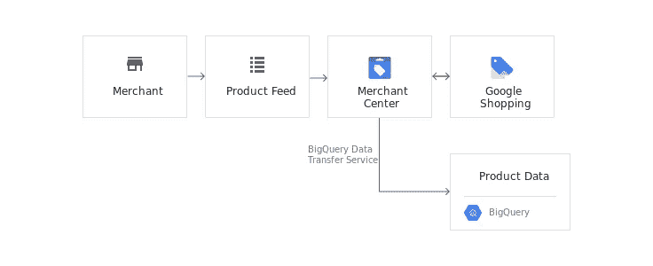
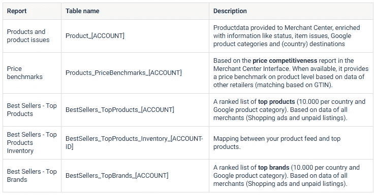
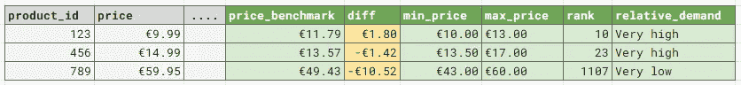

# 使用 Merchant Center BigQuery exports 创建高级 Google 购物洞察

> 原文：<https://towardsdatascience.com/create-advanced-google-shopping-insights-using-merchant-center-bigquery-exports-f81f65399a2c?source=collection_archive---------12----------------------->

## 利用产品级别**价格竞争力**、**需求和受欢迎程度数据，基于**所有谷歌购物商家

[亚采克·迪拉格](https://unsplash.com/@dylu)在 [Unsplash](https://unsplash.com/?utm_source=medium&utm_medium=referral) 上的原始照片

**商品级别价格竞争力和基准数据，已经在商家中心界面提供，可以导出到 Google BigQuery。利用这些导出，您可以创建对产品目录的高级见解，这些见解也可以用于自动化。**

在本教程中，您将学习如何:

*   基于从 Google Shopping 上的所有商家到 Google BigQuery 的数据**,导出产品和品牌层面的市场洞察数据**
*   使用商家中心的数据丰富您的产品信息，如**价格竞争力**、**相对需求**或**产品排名**来创建有价值的高级见解。
*   使用[示例查询](#2842)将数据合并并加入到您的产品提要中。
*   将出口用于其他[实际用例](#aceb)。

> ***注:*** *你喜欢这篇文章吗？阅读* [*原文*](https://stacktonic.com/article/create-advanced-google-shopping-insights-using-merchant-center-big-query-exports) *(以及其他许多动手营销技术相关文章)上*[*【stacktonic.com】*](https://stacktonic.com)*🚀*

# *将商业中心连接到 Google BigQuery*

*第一步，你需要一个有效的计费帐户谷歌云项目。如果不存在，您可以查看这些说明。*

*官方的[谷歌文档](https://cloud.google.com/bigquery-transfer/docs/merchant-center-transfer#setting_up_a_google_merchant_center_transfer)提供了在商业中心和谷歌大查询之间建立数据传输服务的所有信息。建立连接后，Merchant Center 将每天导出几份报告。*

**

*来源:谷歌*

# ***商户中心出口解释***

*传输服务可以导出几种报告类型。您不必导出所有报告(可以在设置导出时进行配置)。*

> *要知道，以 GBs 来说，商业中心的出口并没有那么小。例如，对于每个可用的谷歌产品类别和国家，它将导出 10.000 个顶级产品。所以这可能会在你的谷歌云项目中产生一些成本。参见本文最后一章的提示。*

*最重要的出口；*

**

**另见* [*本概述*](https://cloud.google.com/bigquery-transfer/docs/merchant-center-transfer) *在谷歌官方文档中。**

*一些最有趣的性质和定义；*

*   ***price_benchmark_value** :特定产品的平均(点击加权)价格，基于所有在购物广告上宣传相同产品的商家。商家之间匹配产品是以 GTIN 为基础的。*
*   ***排名**:该产品在购物广告、谷歌产品类别和国家级别上的受欢迎程度。受欢迎程度是基于销售产品的估计数量。排名每天更新，但导出的数据最多会延迟 2 天。*
*   ***previous_rank** :过去 7 天的排名变化。*
*   ***相对 _ 需求.最小/。max /。bucket** :一个产品相对于在同一个类别和国家中具有最高流行等级的产品的当前估计需求。还包括桶(例如非常高)*
*   ***上一个 _ 相对 _ 需求.最小/。max /。桶**:同上，只计算最近 7 天。*
*   ***price _ range . min `/` price _ range . max**:不含小数的价格范围下限和上限。不包括运费。*

# *实际使用案例*

*结合不同的报告，您可以想到以下用例；*

*   ***产品反馈状态**:获取与您的产品反馈相关的商家中心和购物错误及通知。*
*   ***产品库存优化**:使用畅销书报告，你可以根据谷歌产品类别和国家的顶级产品完整列表，检查哪些热门产品已经在你的库存中，哪些潜在产品可以添加。*
*   ***价格和投标优化:**使用价格竞争力基准信息，您可以检查自己在价格方面相对于竞争对手的表现。*
*   ***趋势产品和品牌**:根据过去 X 天/周/月畅销书排行榜的变化，确定趋势产品/品牌。每个国家有所不同*
*   ***产品提要丰富化**:用谷歌市场洞察数据丰富你的产品提要*
*   ***基于规则的自动化**:根据产品反馈的丰富程度，暂停和启用渠道中的活动/产品(如谷歌购物)或调整出价。例如基于价格竞争力。*

**

*利用商家中心的市场洞察丰富产品数据*

# *示例查询*

*为了向您展示如何组合数据，我构建了一个查询，该查询将在产品级别上连接和组合不同的 Merchant Center 表中的数据。*

*一些评论:*

*   ***谷歌并没有为你 feed 中的每一个产品提供数据**。要么是某个产品不在畅销书排行榜上，要么就是谷歌不提供或者不计算(数据不够，可能还有其他一些原因)。或者你有其他商家不提供的独特产品。*
*   *使用*畅销书 _ 顶级产品 _ 库存*作为映射表，通过连接 *rank_id* (在两个表中都可用)，将*畅销书 _ 顶级产品*数据与您的*产品*数据连接起来*
*   *您系统中已知的“原始”产品 ID 在不同的出口中并不直接可用。它在 *product_id* 字段中可用，但是您必须拆分该值并选择最后一部分，因为 Google 向其添加了附加信息，例如:*online:NL:NL:<original-product-id>**
*   *这些报告包含大量数据。例如，畅销书报告包含每个谷歌产品类别和国家的 10.000 本畅销书。出于效率原因，尽量只选择需要的国家。同样重要的是，在谷歌提供的表格中，同一产品可以在不同的国家重复出现。*
*   *报告包含嵌套和重复的数据，请确保您理解表格结构。例如，产品错误和通知是嵌套的。*

## *示例:用基准和价格竞争力数据丰富产品提要*

*下面的查询将产生这个表，您可以在您的原始产品提要上匹配它，并且可以作为自动化规则的输入(在产品级别上)*

**

> *确保根据您的情况用正确的值替换数据集/表名*

*[GitHub 上也有代码](https://gist.github.com/krisjan-oldekamp/631e2f029d89538da45f4946f7d5be4f)*

## *结束语*

*使用 BigQuery Merchant Center 导出，您可以大规模生成洞察，并将其用于自动化。但是请记住，导出保存了大量数据，因此可能会在您的 Google Cloud 项目中产生一些成本(您可能不需要所有的数据)。这些表是按日期分区的，因此您可以编写一个 Python 脚本或使用 Airflow 删除超过 X 天的分区，以保持 BigQuery 中的数据量(可能在您创建了一些聚合报告之后)。*