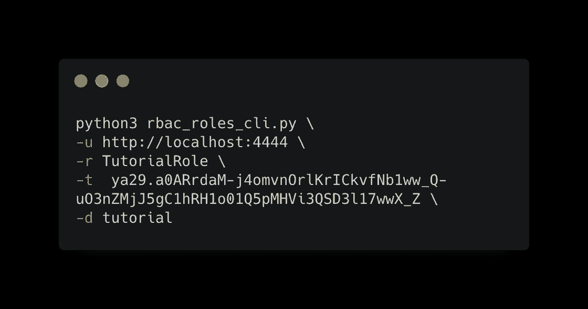
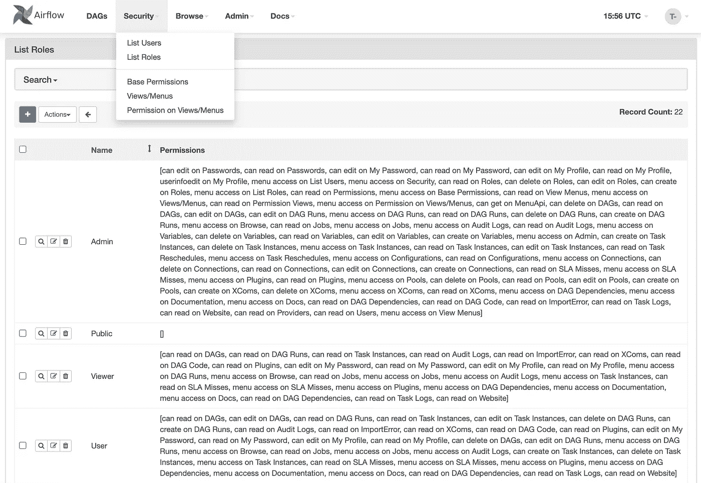
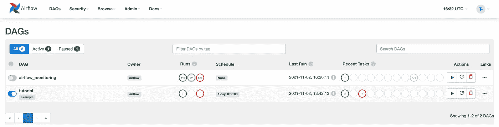
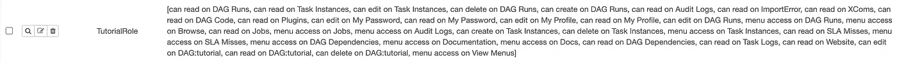
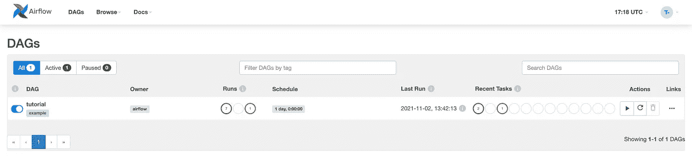
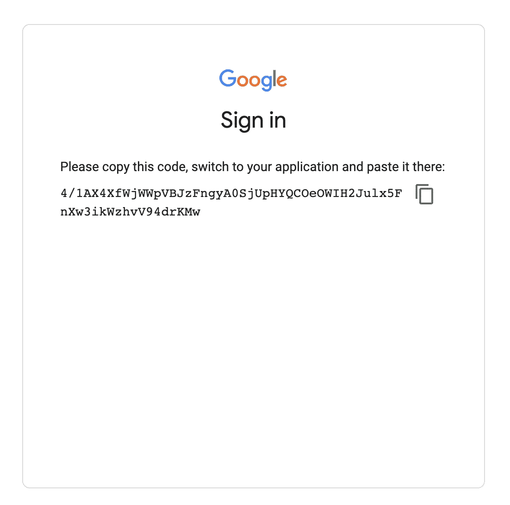

# 使用 cli 权限创建气流角色

> 原文：<https://towardsdatascience.com/create-airflow-roles-with-permissions-from-cli-64e05aaeb2fc?source=collection_archive---------14----------------------->

## 直接从 cli 而不是 UI 创建具有 dag 级别气流权限的角色



作者图片

# 成为管理员

Airflow 提供了一种通过 [RBAC 角色](https://cloud.google.com/composer/docs/airflow-rbac)管理多个用户权限的方法。这些权限可以直接从 Airflow 的 UI 编辑(RBAC 默认使用 Airflow ≥ 2.0 激活。



图片作者。气流中默认 RBAC 角色的 UI 视图

> 只有当连接的用户拥有**管理员角色时，才能访问这些角色。**

默认情况下，当您第一次连接到 Airflow 时，角色是 Op，这是仅次于 Admin 的第二高角色。此角色没有足够的权限来管理角色。要成为管理员，请使用以下命令:

```
airflow users add-role -e *your_email* -r Admin
```

现在您是管理员，刷新气流页面，您应该可以访问具有角色和权限的安全菜单。

您将看到可以直接从 UI 编辑角色和权限。还可以创建 dag 级别的权限，即仅适用于给定 dag 的权限。现在假设您希望一些用户只访问一些特定的 Dag。直接从用户界面对多个 dag 使用 Dag 级别的权限非常容易出错且非常耗时，因为您必须从用户界面手动选择权限，甚至无法进行复制粘贴。

这就是为什么我创建了一个脚本，用于直接从 cli 创建具有预定义权限的角色。

# 剧本

以下是用于创建具有足够权限来管理特定 Dag 的角色的脚本。

> 最新版本托管在[本回购](https://github.com/TristanBilot/airflow-rbac-roles-cli)。

默认情况下，该脚本使用预定义的权限，允许用户仅访问参数中给定的 Dag，以便可以在同一个气流中托管由多个 Dag 组成的多个项目。

> 请注意，可以根据您的特定用例在代码中直接编辑权限。气流 RBAC 许可语法的详细列表可以在[气流代码](https://github.com/apache/airflow/blob/d1f3d8ec19d3c3b2494fbcd5a1adb5be4d4af03b/airflow/security/permissions.py)中找到。

# 例子

假设我的气流中有两把匕首。每个项目一个。我想为这两个项目创建一个角色，以便只授权从事特定项目的用户查看相应的 dag。



图片作者。气流中的两个 Dag

## 创建角色

然后，我使用该脚本为 Dag“tutorial”创建一个访问受限的新角色。

```
python3 rbac_roles_cli.py \
-u http://localhost:4444 \
-r TutorialRole \
-d tutorial
```

*   -u:(url)air flow UI 根页面的 URL。
*   -r: (role)新角色的名称。
*   -d:(Dag)允许访问的 Dag 列表，用空格分隔。

如果返回错误，请检查您是否是 Airflow 的管理员，以及使用-d 选项指定的 Dag 是否存在。

## 向用户添加角色

现在，我们必须使用 Airflow 的 cli 向现有用户添加新角色。如果用户尚未在 Airflow 中创建，请遵循[这些步骤](https://airflow.apache.org/docs/apache-airflow/stable/cli-and-env-variables-ref.html#create_repeat1)。

```
airflow users add-role -e tutorial_user@gmail.com -r TutorialRole
```

从管理员用户的角度来看，我们可以在“Security menu”>“List Roles”中看到已经正确创建了角色。通过分析权限，您可以看到 dag 级别的权限也被添加到角色中。



图片作者。在气流 UI 视图中创建的角色

现在，为了确保用户只拥有已创建的角色，您可以使用以下命令删除其他角色，如 Op 或 Admin:

```
airflow users remove-role -e tutorial_user@gmail.com -r Op
airflow users remove-role -e tutorial_user@gmail.com -r Admin
```

> 如果一个给定的用户有多个角色，这个用户的权限将是每个角色权限的总和，所以你必须小心，这个用户只有这一个角色。

## 测试权限

现在，使用创建的角色登录帐户。



图片作者。用户对创建的角色中定义的 Dag 具有有限的访问权限。

用户现在只能访问创建角色时给出的 dag:在本例中，只能访问 Dag“tutorial”。用户甚至可以编辑 dag，查看日志和代码。如果您想个性化该用户的权限，您可以在代码中自由添加/删除一些权限。

# 与 Cloud Composer 兼容

有人用 Cloud Composer 直接在 Google 云平台管理自己的气流。因为 Composer 在访问 GCP 的资源之前需要对 Google 进行认证，所以我们必须生成一个 Google 访问令牌，以便在使用脚本之前对 GCP 进行认证。

## 创建 OAuth 凭据

为了与 Google APIs 通信，我们必须使用在 GCP 创建的个人令牌。这个令牌是 OAuth 令牌。要创建该令牌，请执行以下操作:

**在 GCP**:API&服务**>凭证 **>** 创建凭证 **>** OAuth 客户端 ID **>** 电视和受限设备**

创建了 OAuth 令牌，现在您拥有了一个**客户端 ID** 和一个**客户端秘密**。

## 获取授权码

在以下 URL 中替换您的用户 ID，并在浏览器中直接调用它。

[https://accounts.google.com/o/oauth2/v2/auth?client_id=**client _ id**&redirect _ uri = urn:IETF:WG:oauth:2.0:OOB&scope = https://www . Google APIs . com/auth/userinfo . profile&response _ type = code](https://accounts.google.com/o/oauth2/v2/auth?client_id=XXXX.apps.googleusercontent.com&redirect_uri=urn:ietf:wg:oauth:2.0:oob&scope=https://www.googleapis.com/auth/userinfo.profile&response_type=code)

该页面要求您使用您的 Google 帐户登录，然后复制显示的代码:这是授权代码。这个代码是临时的，所以我们将创建一个比这个更长的令牌。



图片作者。谷歌授权码

## 获取访问令牌

现在启动一个新的终端，粘贴这个 curl 并用您在上一步中复制的代码替换***authorization _ code***，用在 GCP 用 OAuth 令牌创建的客户端 id 和 secret 替换 ***client_id*** 和 ***client_secret*** 。

```
curl -s \
 — request POST \
 — data \
“code=***authorization_code***&client_id=***client_id***&client_secret=***client_secret***&redirect_uri=urn:ietf:wg:oauth:2.0:oob&grant_type=authorization_code” \
[https://accounts.google.com/o/oauth2/token](https://accounts.google.com/o/oauth2/token)
```

此 post 请求的响应应遵循以下模式:

```
{
  “***access_token***”: “ya29.a0ARrdaM-az...”,
  “expires_in”: 3599,
  “refresh_token”: “1//03uXjr...”,
  “scope”: “https://www.googleapis.com/auth/userinfo.profile",
  “token_type”: “Bearer”,
  “id_token”: “eyJaaza...“
}
```

复制响应中给出的 access_token。

## 使用脚本

最后，我们将使用之前用于标准气流的相同命令，只是我们必须为访问令牌指定一个选项，以便与受 Google 保护的 Composer Airflow 页面进行交互。

```
python3 rbac_roles_cli.py \
-u ***https://...composer.googleusercontent.com*** \
-r TutorialRole \
-d tutorial \
***-t access_token***
```

## 将用户添加到角色

可以使用 gcloud beta cli API 添加用户。

```
gcloud beta composer environments run example-environment — location europe-west1 users add-role — -e name[@organization.com](mailto:tristan_bilot@carrefour.com) -r TutorialRole
```

# 结论

Airflow 没有提供一种直接在 cli 中创建具有特定权限的角色的本机方法，除非使用一个复杂的、糟糕的、带有长卷的 API。提议的脚本使用 Python 轻松地操作这个 API，以便创建具有权限的角色。如果发生任何问题，请随时[提出问题](https://github.com/TristanBilot/airflow-rbac-roles-cli/issues)。尽情享受吧！