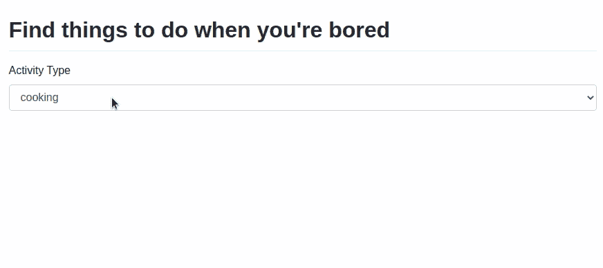
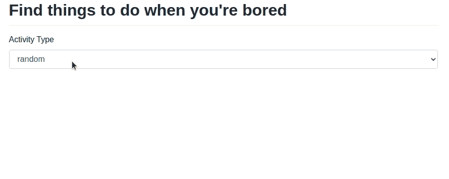

# 使用 PyWebIO 创建一个处理无聊的应用程序

> 原文：<https://towardsdatascience.com/create-an-app-to-deal-with-boredom-using-pywebio-d17f3acd1613?source=collection_archive---------14----------------------->

## [实践教程](https://towardsdatascience.com/tagged/hands-on-tutorials)

## 建议用户在无聊时使用 Python 进行哪些活动

# 动机

你有没有无聊到在谷歌上搜索:“无聊的时候做什么？”如果您可以创建一个应用程序，使用 Python 向用户推荐当天的随机活动以及与该活动相关的书籍，这不是很好吗？


作者 GIF

可以在这里用上面[所示的 app 玩。在本文中，我将向您展示如何使用 PyWebIO、Bored API 和 Open Library 用几行代码创建这个应用程序。](https://khuyentran1401.pyweb.io/bored_app/)

在进入代码之前，让我们收集创建应用程序所需的工具。

# 工具

## PyWebIO —用 Python 创建一个 Web 应用程序

PyWebIO 是一个 Python 库，允许你在没有 HTML 和 Javascript 知识的情况下构建简单的 web 应用。它比 Django 和 Flask 更容易学习，但比 Streamlit 更容易定制。

</pywebio-write-interactive-web-app-in-script-way-using-python-14f50155af4e>  

要安装 PyWebIO，请键入:

```
pip install pywebio
```

## 无聊的 API——无聊的时候找些事情做

[无聊 API](https://www.boredapi.com/) 帮你无聊的时候找事情做。你只要去 https://www.boredapi.com/api/activity[就能得到一项活动的建议。](https://www.boredapi.com/api/activity)

刷新页面会得到不同的结果:

如果您喜欢参与某一类型的活动，请将`?type=activity-name`添加到 API:

```
[https://www.boredapi.com/api/activity?type=education](https://www.boredapi.com/api/activity?type=education)
```

输出:

## 开放图书馆

[开放图书馆](https://openlibrary.org/developers/api)是一个开放的、可编辑的图书馆目录，收录了所有出版过的书籍。Open Library 提供了一套 API 来帮助开发人员使用他们的数据。

您可以通过访问以下网址获得 Open Library 搜索结果的 JSON 文件:

```
[https://openlibrary.org/search.json?title=friends+influence+people](https://openlibrary.org/search.json?title=friends+influence+people)
```

产出摘要:

现在我们已经收集了创建应用程序所需的工具，让我们利用这些工具来创建一个应用程序。

# 创建应用程序

## 创建下拉列表

首先，创建一个下拉列表来显示所有活动类型:

上述代码的详细信息:

*   `put_markdown`:写减价
*   `select`:创建下拉菜单
*   `start_server`:启动一个 web 服务器，在上面服务 PyWebIO 应用。`debug=True`告诉服务器当代码改变时自动重新加载。



作者 GIF

## 根据所选选项显示活动

正常情况下，PyWebIO 的输入表单在成功提交后会被销毁。


作者 GIF

然而，用户可能希望使用不同的输入，所以我们需要找到一种方法来防止输入表单在成功提交后消失。这可以用`pywebio.pin`轻松完成。

对上述代码的解释:

*   `while True`:允许用户无限期插入新输入
*   `put_select`:类似于`select`小部件，但是被`pin`小部件函数用来检测输入的变化
*   `pin_wait_change`:监听一列 pin 小工具。当任何小部件的值改变时，该函数返回改变的小部件的名称和值。
*   `with use_scope('activity', clear=True)`:当范围内有新的输出时，清除最后一个输出

输出:


作者 GIF

## 使用 Bored API 获得一个随机活动

接下来，我们将使用 Bored API 获得一个基于活动类型的随机活动。为此，我们将:

*   创建一个名为`get_activity_content`的函数，它使用`requests.get`向`[https://www.boredapi.com/api/activity](https://www.boredapi.com/api/activity)`发出请求。
*   将我们从下拉栏获得的输入传递给函数`get_activity_content`。如果输入的值是`education`，API 将是`[https://www.boredapi.com/api/activity?type=education](https://www.boredapi.com/api/activity?type=education)`。



作者 GIF

不错！

## 使用 Open Library 获取图书建议

建议要做的活动是好的，但不是很足智多谋。如果用户想了解他们将要做的活动的更多信息，该怎么办？这就是为什么我们也会建议他们使用开放图书馆阅读一些有用的资源。

从开放图书馆获取相关书籍的步骤:

*   **获取活动名称:**下图中，活动名称为“给你生命中有影响力的人写一封感谢信”


作者图片

*   **从活动名称中提取名词短语:**名词短语是以一个名词如“一个漂亮的女孩”为首的一组两个或两个以上的词。我们将使用 [spaCy](https://spacy.io/usage/linguistic-features) 从文本中提取名词短语:

```
$ pip install spacy
$ python -m spacy download en_core_web_sm
```

```
['a thank', 'you', 'an influential person', 'your life']
```

*   **使用提取的名词短语搜索书名。**例如，为了搜索标题与`your life`相关的书籍，我们将把`?title=your+life`添加到 API 中:

```
[https://openlibrary.org/search.json?title=your+life](https://openlibrary.org/search.json?title=your+life)
```

在下面的代码中，我们使用从名词短语中提取的查询从 Open Library 获取相关书籍:

第一本书的输出示例:

*   **显示书名和作者的表格:**JSON 输出很无聊。让我们使用`pywebio.output.put_table`将 JSON 结果转换成表格:

输出:


作者图片

太棒了。由于请求图书可能需要很长时间，我们还将在代码中添加`put_loading`，以便用户知道网站仍在加载:

结果:


作者 GIF

不错！

# 结论

恭喜你！你刚刚学习了如何[使用 PyWebIO、Bored API 和 Open Library 创建一个 app](https://helix.pyweb.io/bore_app/) 。我希望这篇文章能给你用 Python 创建一个有趣的应用程序的动力。

既然使用 PyWebIO 创建一个应用只需要几行代码，为什么不试一试呢？

请在这里随意使用本文的源代码:

<https://build.pyweb.io/get/khuyentran1401/bored_app>  

我喜欢写一些基本的数据科学概念，并尝试不同的算法和数据科学工具。你可以在 LinkedIn 和 Twitter 上与我联系。

如果你想查看我写的所有文章的代码，请点击这里。在 Medium 上关注我，了解我的最新数据科学文章，例如:

</streamlit-and-spacy-create-an-app-to-predict-sentiment-and-word-similarities-with-minimal-domain-14085085a5d4>  </pywebio-1-3-0-add-tabs-pin-input-and-update-an-input-based-on-another-input-e81a139fefcb>  </simulate-real-life-events-in-python-using-simpy-e6d9152a102f> [## 使用 SimPy 在 Python 中模拟真实事件

towardsdatascience.com](/simulate-real-life-events-in-python-using-simpy-e6d9152a102f) </how-to-solve-a-staff-scheduling-problem-with-python-63ae50435ba4> 