# 创建一个出色的 Streamlit 应用程序，并使用 Docker 进行部署

> 原文：<https://towardsdatascience.com/create-an-awesome-streamlit-app-deploy-it-with-docker-a3d202a636e8?source=collection_archive---------2----------------------->

## 本文全面概述了使用 streamlit 和 Docker 部署简单情感分析应用程序的分步指南

由 [Timelab Pro](https://unsplash.com/@timelabpro) 在 [Unsplash](https://unsplash.com/photos/yx20mpDyr2I) 上拍摄的照片

# 介绍

作为机器学习或软件工程师，我们希望与他人分享我们的应用程序/模型及其依赖性。如果处理不当，这个过程不仅会耗费我们的时间，还会耗费我们的金钱。如今，与其他开发人员合作的最受欢迎的方式之一是使用源代码管理系统(例如 Git)。这可能还不够，因为您在自己的计算机上开发的令人惊叹的模型可能因为不同的原因而无法在其他人的计算机上运行。所以解决这个问题的一个更好的方法可能是使用 **Docker 容器**，以便能够“复制”你的计算机，并让其他人可以访问它。在本文中，我们将按照以下顺序学习这一概念:

*   **训练一个简单的情感分类器**
*   **使用良好的软件项目结构创建相应的 Streamlit 应用程序**
*   **为 streamlit 应用程序创建 Docker 映像**
*   **运行容器中的图像**

# 机器学习模型

因为主要目标是引导您完成使用 Streamlit 和 Docker 部署模型的步骤，所以我们不会在模型培训上花费太多时间。

## 笔记本中的模型训练

***有用的库*** 以下是有用的库

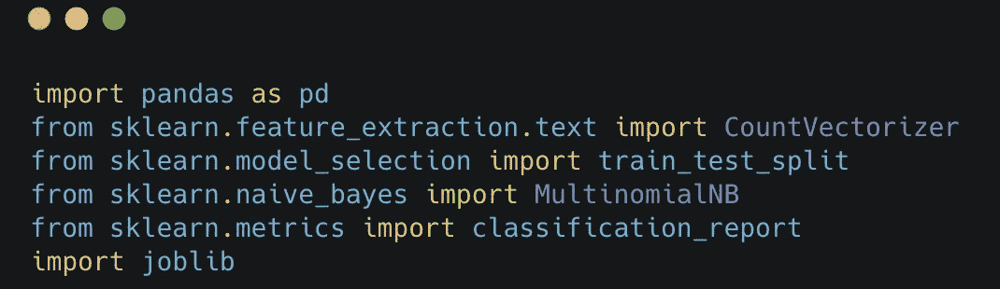

(图片由作者提供)

***读取垃圾数据*** 读取数据集并显示 3 个随机样本

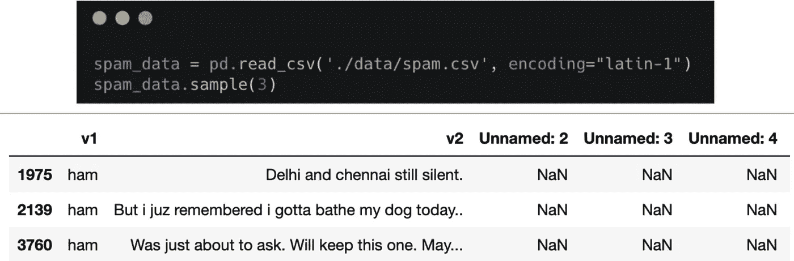

(图片由作者提供)

spam_data.v1.unique() == >数组(['ham '，' spam']，dtype=object)

**观察:**我们有两个标签，对应一个 2 类分类问题。然后，我们需要将这两个标签编码成数字格式，用于模型训练。

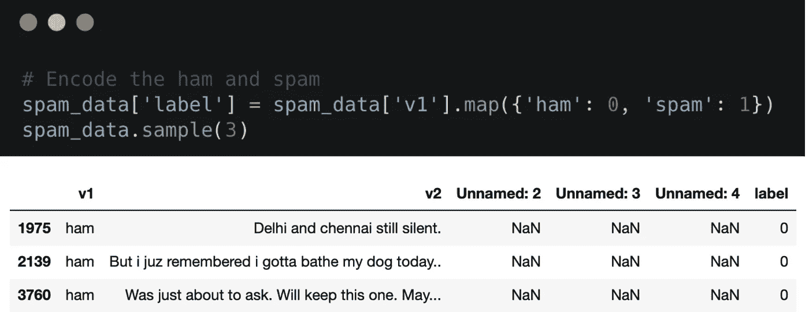

(图片由作者提供)

***特征和目标***

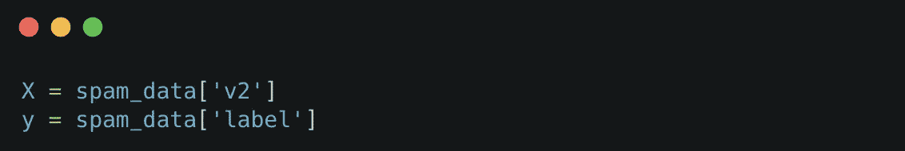

(图片由作者提供)

***特征提取&模型训练*** 我们使用朴素贝叶斯分类器

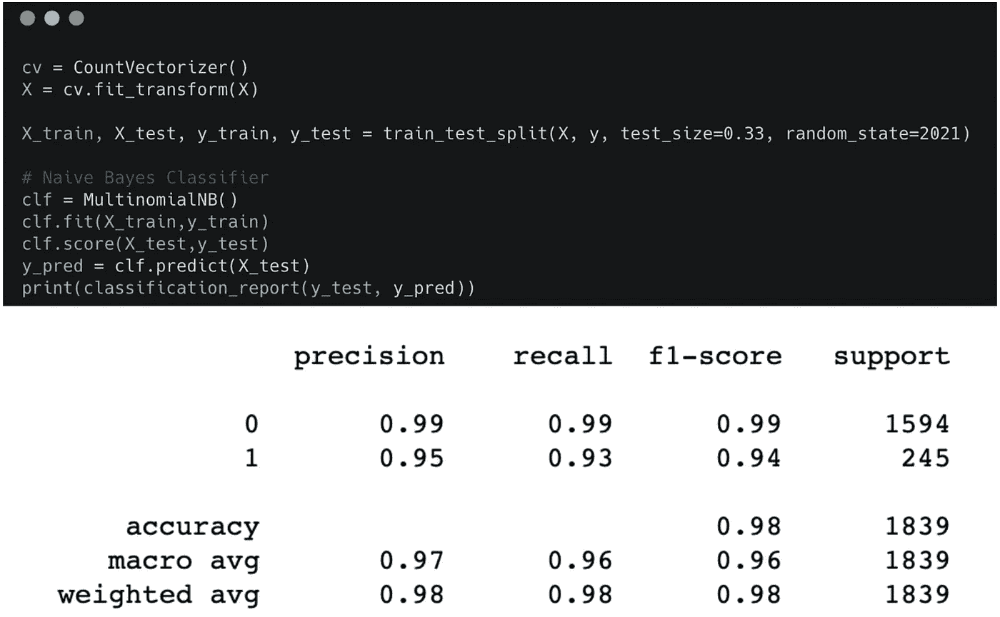

(图片由作者提供)

# 什么是 Streamlit 以及它如何有用

Streamlit 是一个**开源框架**，数据科学和机器学习团队可以使用它来为业务执行更好的**数据可视化**，还可以将**模型部署到生产**环境中(而不是使用 Flask、Django、FastAPI，它们可能需要相当长的模型部署时间)，如下面的数据科学生命周期所示。

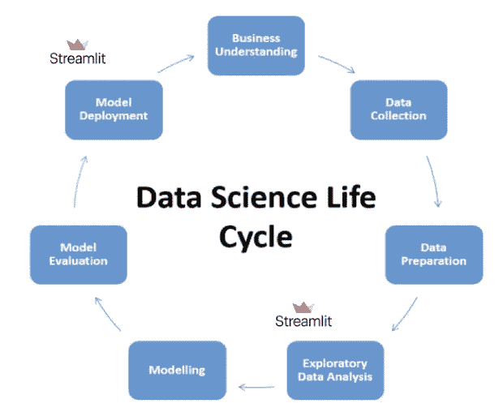

图片由作者根据 [Analytics Vidhya](https://editor.analyticsvidhya.com/uploads/19820Model.png) 定制

## **创建我们的 Streamlit 应用**

**先决条件**

1.  创建并激活虚拟环境

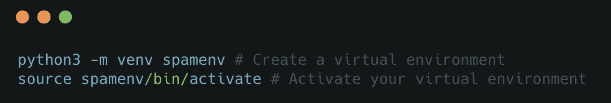

(图片由作者提供)

2.安装项目依赖项

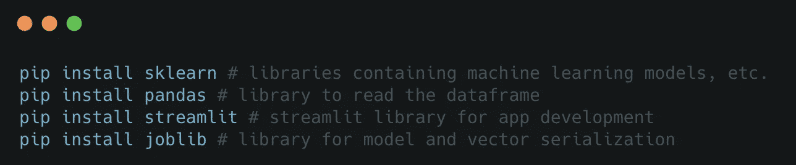

(图片由作者提供)

**3。构建项目**

以如下所示的方式构建项目具有以下优势:

*   简化协作
*   维护干净健壮的代码
*   使部署更加容易
*   等等。

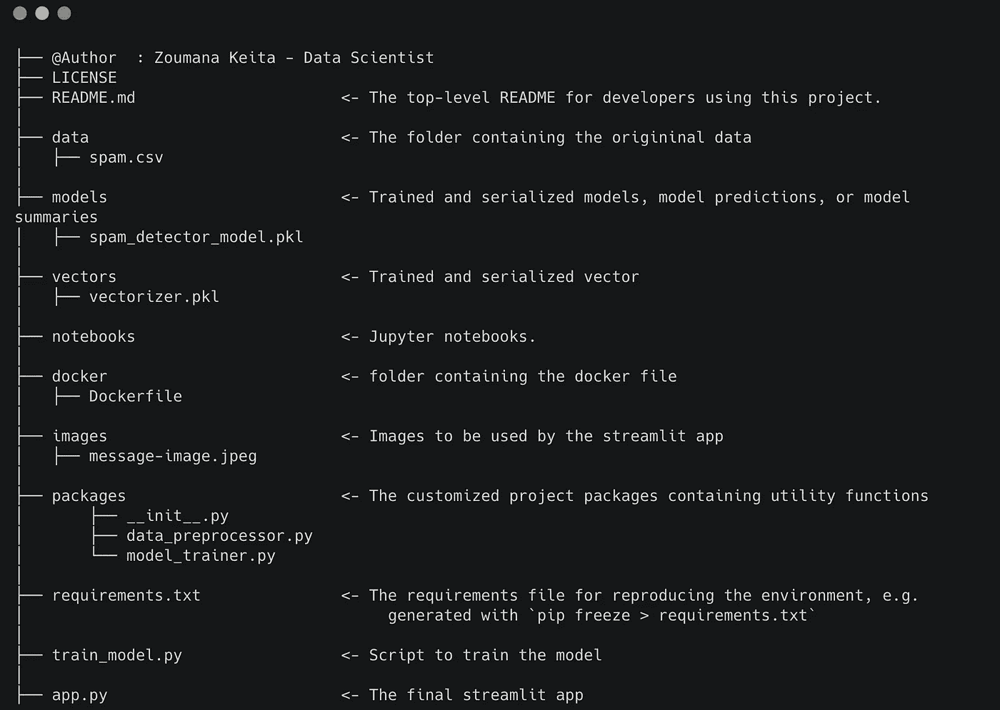

(图片由作者提供)

**实现**
***项目包***
_ _ init _ _。py 是一个空文件。下面是其余两个文件(data_processor.py 和 model_trainer.py)的内容

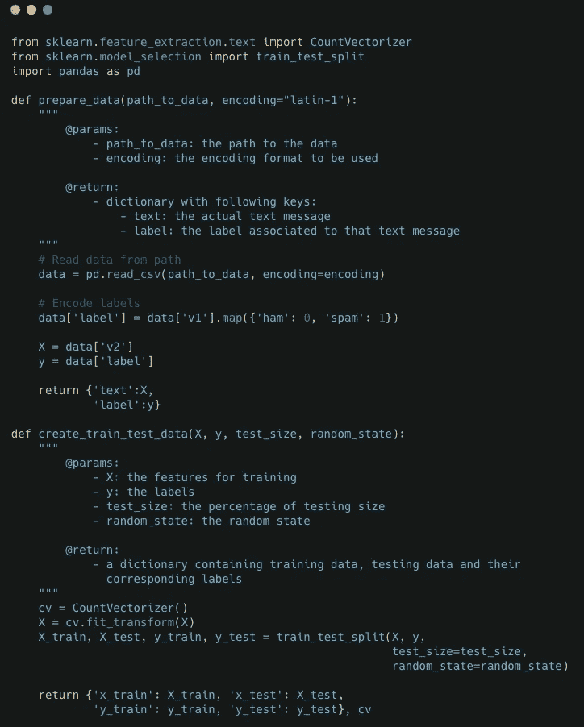

*data _ processor . py 的内容*

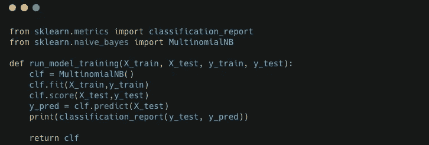

model_trainer.py 的内容

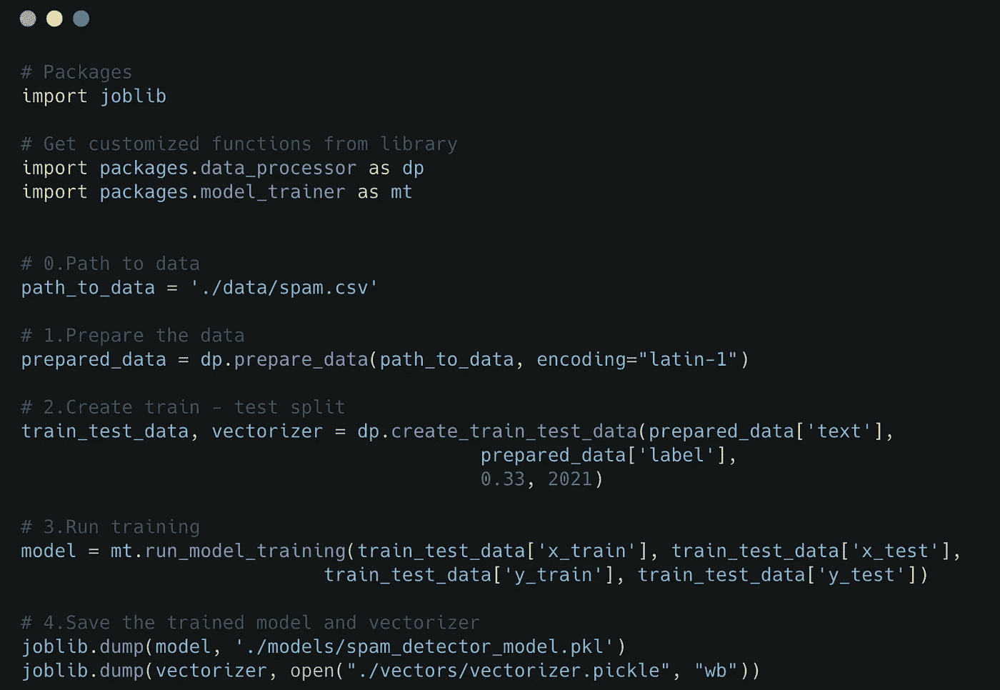

train_model.py 内容

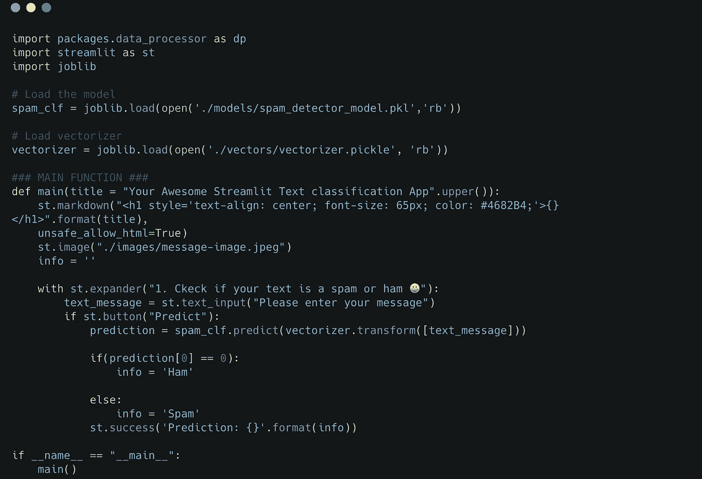

app.py 的内容

**运行 app
运行模型主要有两个步骤。必须从项目的根本着手:**

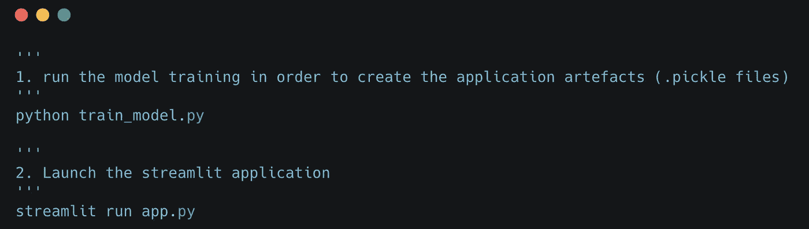

(图片由作者提供)

运行第二个命令后，我们终于可以与应用程序进行交互了。下面是两个场景:

1.  所提供的消息被分类为**垃圾邮件**的情况

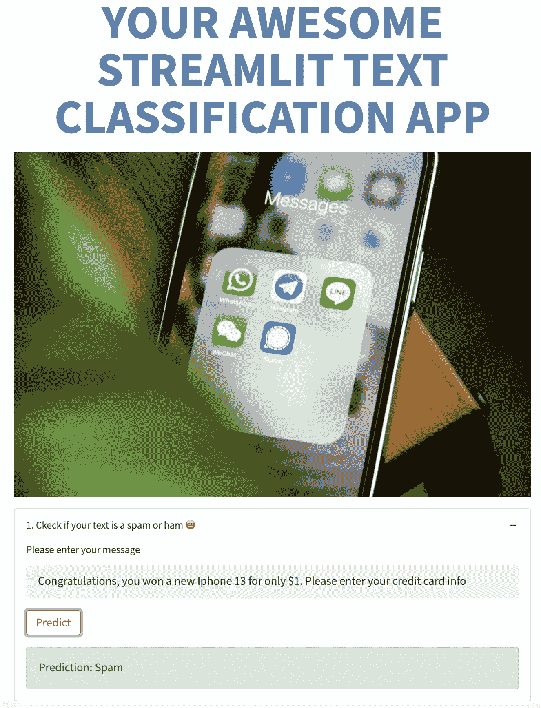

(图片由作者提供)

2.提供的消息被分类为**垃圾消息**(非垃圾邮件)的情况

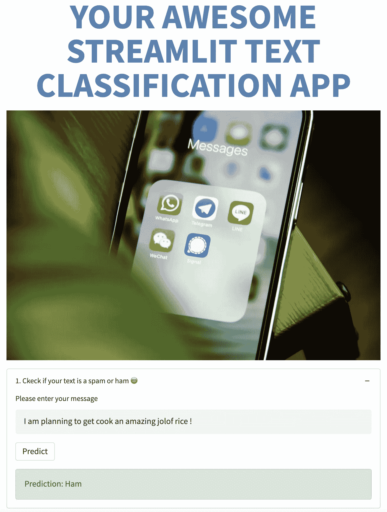

(图片由作者提供)

## 申请归档的时间到了

**创建 docker 层** 为了能够对应用程序进行 docker 化，我们需要在 **docker** 文件夹中创建一个 Docker 文件。该文件包含如下所示的七条主要指令。

1.  (来自):从 docker hub 获取一个官方的 python 映像，然后我们的文件将从该映像构建。
2.  (WORKDIR):创建/app 作为应用程序的工作目录
3.  (复制源目标):将文件从源文件夹复制到目标文件夹。
4.  (运行):运行 requirements.txt 文件以安装项目依赖项。
5.  (EXPOSE):用于公开模型要使用的端口。
6.  (ENTRYPOINT) & (CMD):创建一个入口点，以便最终使映像可执行。

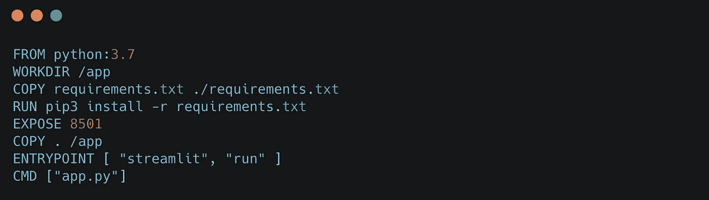

(图片由作者提供)

**构建 Docker 映像** 以下命令构建名为***streamlitspamapp***的映像，标记为 ***最新*** 版本。这个图像是从以前的 docker 文件构建的。

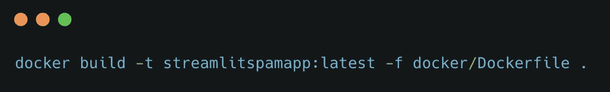

(图片由作者提供)

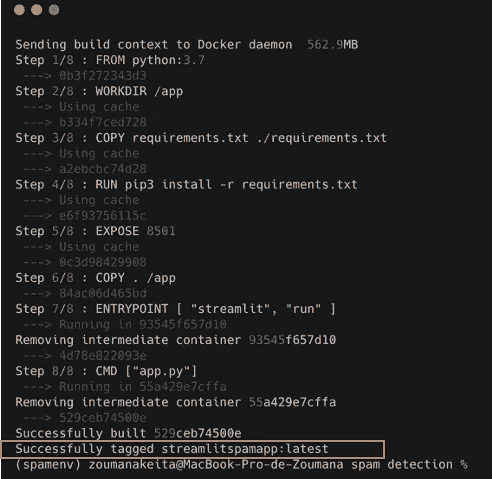

(图片由作者提供)

从 docker build 命令的上一个结果中，我们可以看到我们的映像已经按照前面的解释创建好了。

**运行容器** 镜像构建完成后，我们需要用下面的命令将它运行到一个容器中。

🚫确保在运行这个命令之前停止之前的 streamlit 应用程序，否则，您可能会遇到一个漂亮的消息错误，告诉您端口已经被使用

(图片由作者提供)

前面的命令会自动生成两个 URL。你的可能和我的不一样。

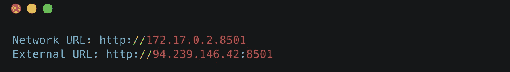

(图片由作者提供)

您使用 docker 部署了您的 streamlit 应用程序🎉🎉🎉！

# 文章结尾

在本文中，您已经学习了如何构建一个简单的机器学习模型，实现相应的 streamlit 应用程序，并最终使用 Docker 进行部署。您现在可以使用一些云提供商平台，如 Azure、AWS、GCP，在几分钟内部署容器！
如需进一步阅读，请随时关注我在 [YouTube](https://www.youtube.com/channel/UC9xKdy8cz6ZuJU5FTNtM_pQ) 上的文章，并参考以下链接:

# 额外资源

[Github 代码](https://github.com/keitazoumana/streamlit-spam-detector)

再见🏃🏾