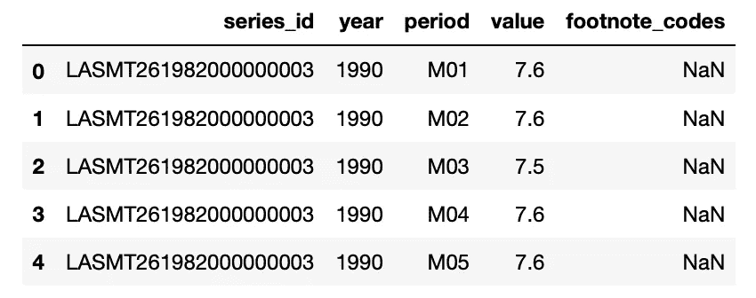
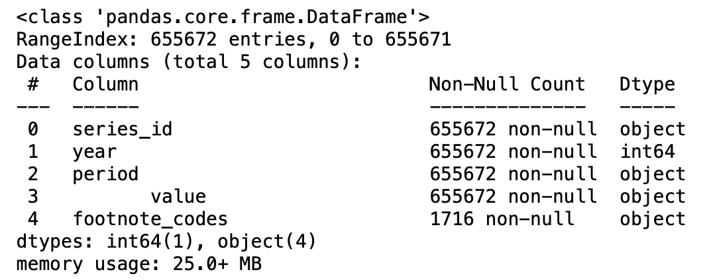
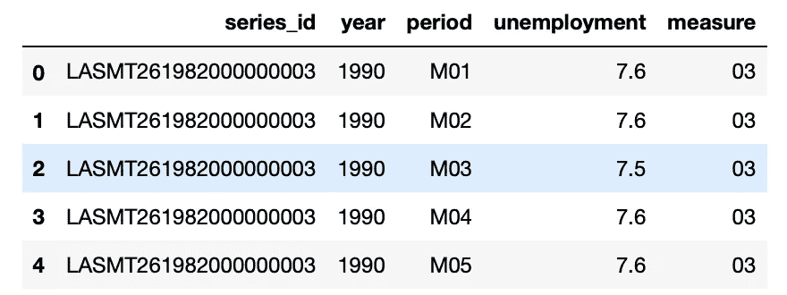
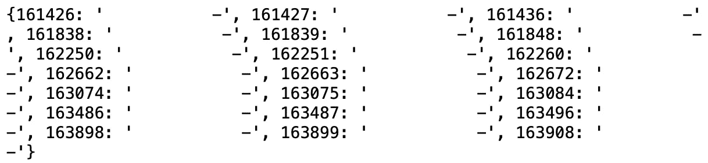
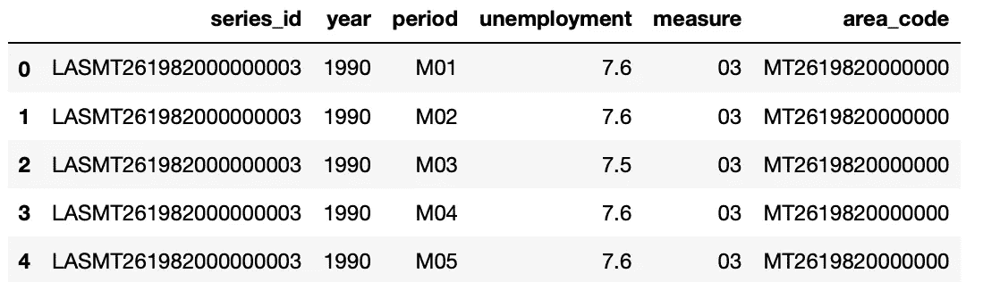
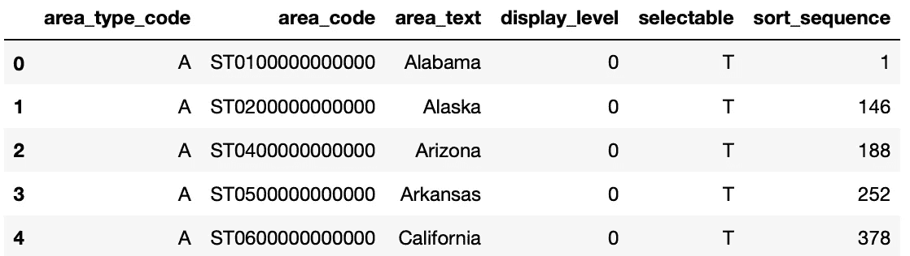
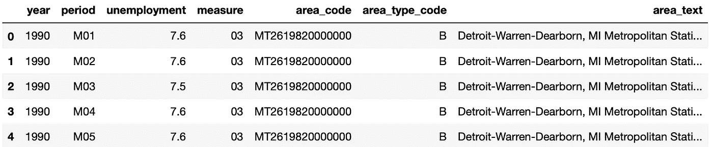

# 从美国劳工统计局平面文件网站创建可供分析的数据集

> 原文：<https://towardsdatascience.com/create-analysis-ready-datasets-from-the-u-s-bureau-of-labor-statistics-flat-files-web-c83a54e2c064?source=collection_archive---------23----------------------->

## 循序渐进的指南

美国劳工统计局(BLS)网站是美国经济数据的丰富来源之一，研究经济学家、数据科学家、金融专业人士、记者和数据爱好者经常访问该网站来搜索有关经济的信息。网站定期发布关于就业、失业、通货膨胀和价格、生产率、消费者支出和时间使用等经济指标的数据。虽然大多数指标是以汇总(或国家)数据的形式提供的，但有些指标是细分到国家以下各级的。本文特别面向那些不熟悉使用值和元数据分开存储的数据的分析师，旨在帮助这些分析师快速准备好数据以供分析。

BLS 网站不遗余力地简化对数据的访问，包括以表格、摘要和可视化形式排列已发布的系列。一些经常被访问的主题被超链接到一个交互式数据查看器([，就像这个](https://beta.bls.gov/dataViewer/view/timeseries/CUUR0000SA0))上，从这里可以下载数据。BLS 网站还有一个数据检索工具([这里是](https://www.bls.gov/data/))，用户可以通过这个工具从网上获取数据。数据也可以通过[公共数据应用编程接口](https://www.bls.gov/developers/) (API)来检索，以实现对经济数据的编程访问，出版商希望开发者能够利用这些数据来创建应用。该 API 有两种格式，具有不同的需求和功能。访问 BLS 数据的说明总结在这样一个页面上 [one](https://www.bls.gov/lau/lausad.htm) ，包括如何访问平面文件 FTP 站点([参见示例](https://www.bls.gov/lau/lausad.htm#flat))。在需要大量数据的情况下，需要平面文件，而获取数据超出了可用数据检索工具的能力。

虽然这些说明告诉您不同的文件是如何关联的，但它没有告诉新手如何将不同的文本文件组合成对分析有用的数据集。本文的目的是提供一个详细步骤的示例，分析师(尤其是使用这种文件的新手)可以使用这些步骤将不同平面文件中的信息组合成可用的格式。这些步骤是用 python 完成的( *R 也可以用*)，因为以编程方式工作时操作更容易。此外，由于我试图从本地失业统计(LAUS)网站获取美国大都市统计区(MSA)的月度失业数据，因此我在此描述的示例将集中于此，但同样的步骤也可以(很可能)用于获取其他指标。

在下载和使用数据集的过程中，一些数据集被组织成用于数据值的文件以最小化文件大小，而包含关于数据的元数据的数据字典在单独的文件中可用。FTP 平面文件就是这种情况。[数据字典](https://www.sciencedirect.com/topics/computer-science/data-dictionary)解释了数据文件的组织(参见此处的、此处的和此处的用于 LAUS 平面文件数据)以及关于数据的其他信息。还建议用户阅读上面示例链接末尾的信息，以便更好地理解数据。本指南还可以作为清理数据集并为分析做好准备的教程。该任务的最终产品是 1990 年至 2021 年 9 月美国大都市统计区域(MSA)月度失业率的纵向(或面板)数据集。

**实施流程**:GitHub 回购可在:[https://github.com/tyngbayi/Using_LAUS_flatfiles](https://github.com/tyngbayi/Using_LAUS_flatfiles)找到

**步骤 1** :导入相关 python 库，检索 metro 和 area 数据集，并另存为。csv 文件。

```
import pandas as pd
import numpy as npimport urllib
from urllib.request import urlretrieve# urls for time series and area code data
url1='[https://download.bls.gov/pub/time.series/la/la.data.60.Metro](https://download.bls.gov/pub/time.series/la/la.data.60.Metro)'
url2='[https://download.bls.gov/pub/time.series/la/la.area](https://download.bls.gov/pub/time.series/la/la.area)'
```

**第二步**:读入数据，检查一些信息

```
df1 = pd.read_csv(‘filepath/timeseries.csv’, delimiter=”\t”) df.head()
```



作者图片

```
df.info()
```



作者图片

调用 info()方法会在一些列名周围显示一些空白。这可以通过重命名列来解决。

```
df1.rename(columns={'series_id                     ':’series_id’, 
                    '       value':’unemployment’}, inplace=True)
```

**步骤 3** :删除一些列并创建新列

```
df1.drop(‘footnote_codes’, axis = 1, inplace=True)df1[‘measure’] = df1[‘series_id’].apply(lambda x: x[18:].strip())df1.head()
```



作者图片

**第四步**:使用 float 函数将失业数据转换为数值数据类型。但是由于一些“坏的”值必须被删除，这就产生了错误。

```
cnt = 0unemployment_dict = {}for row in df1[‘unemployment’]:
 if row is not None:
 try:
 float(row)
 pass
 except ValueError:
 unemployment_dict[cnt] = row
 cnt+=1print(unemployment_dict)
```



作者图片

**步骤 5** :创建区号列，这是一个惟一的 MSA 标识符，将用于合并失业统计数据和区号名称

```
df2[“area_code”] = df2[‘series_id’].apply(lambda x: x[3:18])
```



作者图片

**第六步**:读入 MSA 名称文件，只选择 MSA 数据行(area_type_code B)，准备与失业统计合并

```
df3 = pd.read_csv(‘filepath/area_codes.csv’, delimiter=”\t”)
df3.head(5)
```



作者图片

**步骤 7** :合并失业统计和地铁数据集

```
df5 = df2.merge(df4, on=’area_code’)
```

**第 8 步**:只选择月数据的行

```
monthly_unemployment = df5[df5[‘period’] != ‘M13’]
monthly_unemployment.head()
```



作者图片

当然，可以做一些进一步的清理，例如创建城市和州名的列，或者城市名和州名的单独列；过滤季节性未调整行；或者只处理年度数据(M13 期)，这取决于分析师的目标。

我希望这能帮助那些对比 BLS 网站上的其他数据检索方法所能提供的大得多的数据集感兴趣的分析师。本文特别面向那些不熟悉使用值和元数据分开存储的数据的分析师，旨在帮助这些分析师快速准备好数据以供分析。

此外，当我试图获取数据时，我正在使用 Python，并没有寻找使用 R 的选项。有一天，当我不那么忙的时候，我可以搜索一个 R 教程或图书馆，使 LAUS 的数据随时可用，如果我找不到，我可以开始工作。