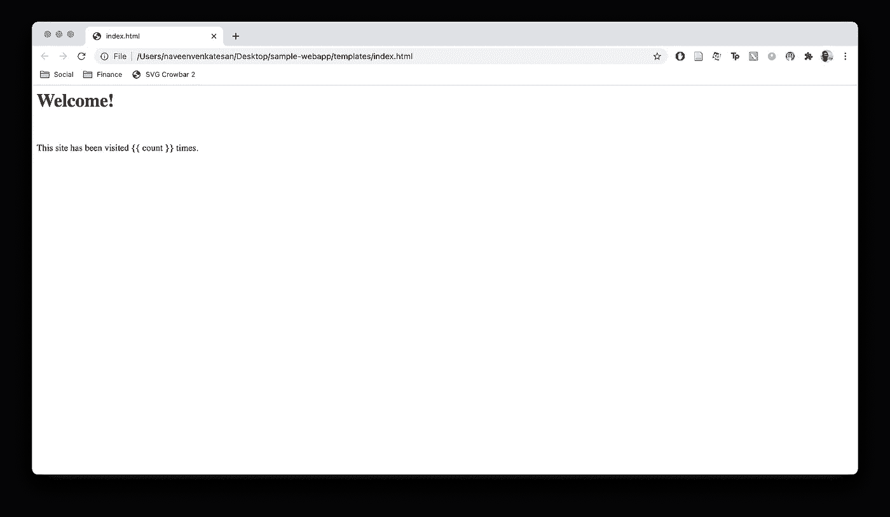
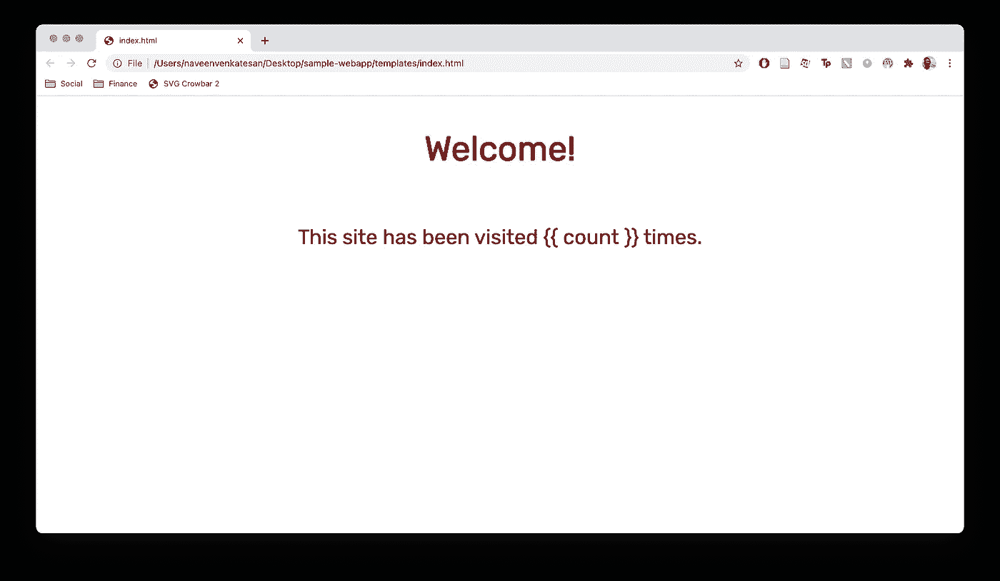
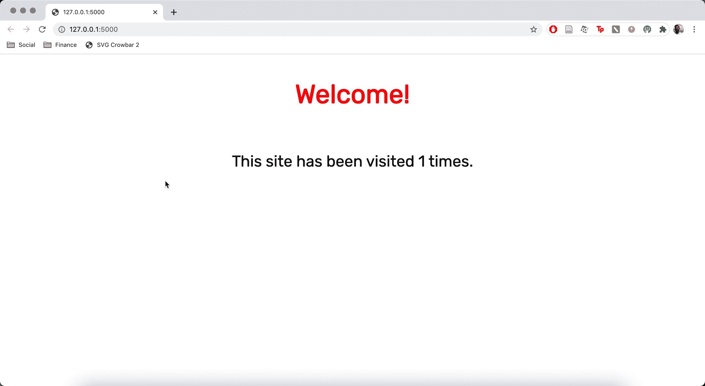
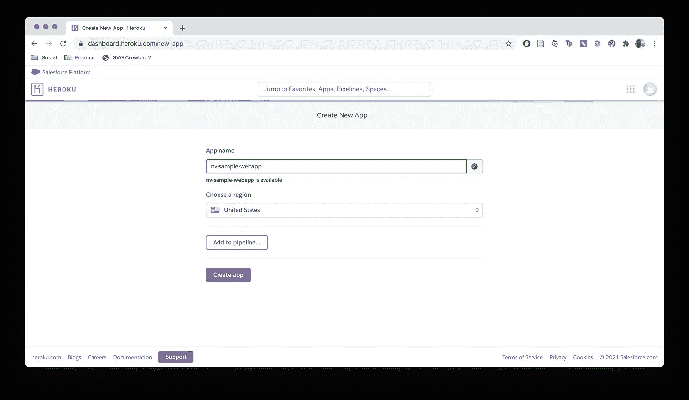
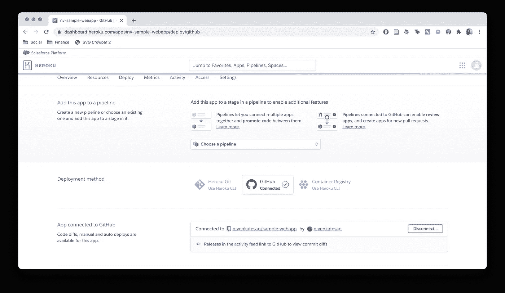
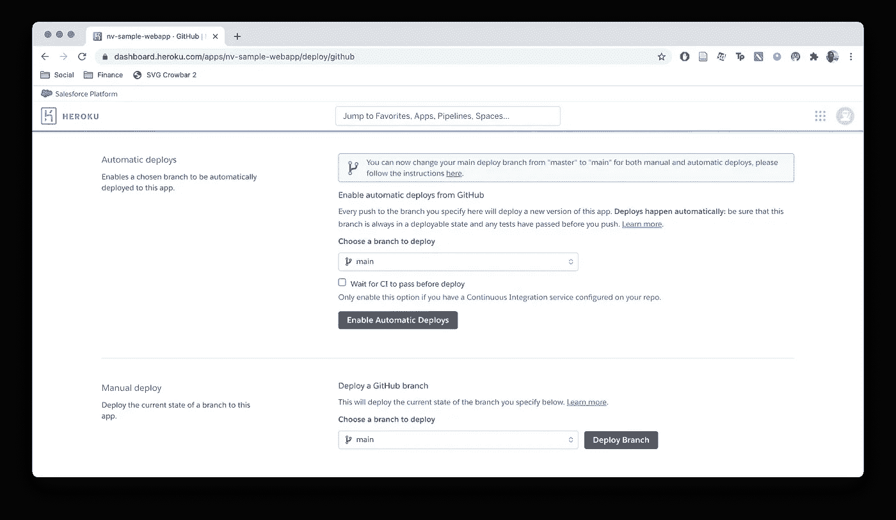

# 用 Flask 和 Heroku 创建和部署一个简单的 Web 应用程序

> 原文：<https://towardsdatascience.com/create-and-deploy-a-simple-web-application-with-flask-and-heroku-103d867298eb?source=collection_archive---------2----------------------->

## 通过简单的交互式 web 应用程序分享您的作品


照片由[将](https://unsplash.com/@elevatebeer?utm_source=unsplash&utm_medium=referral&utm_content=creditCopyText)提升到 [Unsplash](https://unsplash.com/s/photos/chemistry?utm_source=unsplash&utm_medium=referral&utm_content=creditCopyText) 上

假设您已经用 Python 编写了一个非常酷的脚本来进行一些有趣的数据分析，现在您想向其他人演示它。很有可能，发送一个`.py`文件并要求其他人运行它，或者演示自己在命令行上运行它，都不会像一个包装精美的 web 应用程序那样有把握。通过使用 Python 包`flask`，我们可以相当快地创建一个这样的交互式应用程序。在本文中，我将制作一个简单的 web 应用程序，显示主页被访问的次数，并将其部署在 Heroku 上与其他人共享。

> 注意——以下所有截图均由作者拍摄。

# **设置项目和文件夹层次**

向下游部署我们的项目的最简单的方法是在 GitHub 上创建一个新的存储库，我们所有的文件都将存放在那里。因此，我开始在 github.com/n-venkatesan/sample-webapp 创建一个新的回购协议，并将其克隆到我的本地电脑上。当创建存储库时，您可以选择用一个`.gitignore`文件初始化——我建议从下拉菜单中选择`Python`,以避免不必要的文件被签入 Git。

```
> git clone [https://github.com/n-venkatesan/sample-webapp](https://github.com/n-venkatesan/sample-webapp)> cd sample-webapp/
```

现在我们需要做的就是创建一个名为`templates`的文件，我们的 HTML 文件将存放在这里:

```
> mkdir templates
```

文件夹结构设置完毕！

# **创建新的虚拟环境**

我们希望我们的开发从一个全新的开始，这样我们就只安装我们的应用程序绝对需要的依赖项——这在我们以后部署我们的 web 应用程序时尤其重要。

```
> python3 -m venv venv> source venv/bin/activateIf you see the name of the virtual environment (venv) before the command prompt, you have successfully activated the new environment(venv) > Success!
```

我们现在需要安装我们的应用程序所需的依赖项，它们是`flask`和`gunicorn`，这是运行我们的应用程序所需的 Python web 服务器接口。

```
(venv) > pip install flask gunicorn
```

酷——现在我们可以开始创建我们的应用程序了！

# **为网页编写 HTML**

在我们的`templates/`目录中，创建一个名为`index.html`的新文件。这将是当我们试图访问我们的 web 应用程序时显示的页面。要查看呈现的 HTML 是什么样子，您可以在 web 浏览器中打开该文件。本教程假设你对 HTML 和 CSS 有一个非常基本的了解，但是有很多像 [W3School](https://www.w3schools.com/html/) 这样的资源可以帮助你快速上手。

我们的页面将只包含两个元素，一个标题写着`Welcome!`，下面一个段落写着`This site has been visited n times.`，其中`n`是到目前为止网站被访问的实际次数。我们将把这两个元素嵌套在一个`<div>`块中，以便稍后做一些 CSS 样式。标签表示标题和段落之间的换行符。

```
<div>
    <h1>Welcome!</h1><br>
    <p>This site has been visited {{ count }} times.</p>
</div>
```

关于上面的 HTML 块，唯一可能出现的新内容是段落块中的`{{ count }}`文本。双花括号(`{{ }}`)意味着您正在该块中运行 Python 代码——所以我们引用变量`count`的值，稍后我们将把它传递给 HTML 模板。

在当前状态下，我们的页面如下所示:



非常基本——让我们添加一些格式！首先，让我们为文本选择不同的字体。我喜欢去[谷歌字体](https://fonts.google.com/)，那里有各种各样的免费字体可以使用——对于这个应用程序，我选择了一种叫做 [Rubik](https://fonts.google.com/specimen/Rubik) 的字体。在每个字体粗细的旁边，有一个按钮，上面写着“选择这种样式”——单击其中的至少一个，将在右边打开一个窗口，其中有代码，您可以复制/粘贴到您的 HTML 中，以访问该字体！我只是选择了`Regular 400`字体的粗细，并得到了下面的代码，我把它添加到了我的`index.html`文件的顶部:

```
<link rel="preconnect" href="https://fonts.gstatic.com">
<link href="https://fonts.googleapis.com/css2?family=Rubik&display=swap" rel="stylesheet">
```

现在我们可以使用 CSS 来设置页面的样式——我们首先在`index.html`中创建一个样式标签，然后将所有的 CSS 代码放在这里。我们将使页面上所有文本的字体变得像魔方一样，这可以通过改变与所有元素相对应的属性`*`来实现。此外，我们将把所有内容从页面顶部向下移动 50 像素，将标题设为红色，并更改标题和段落部分的字体大小。我将这段代码添加到字体链接的正下方，但在任何实际页面内容之前。

```
<style>
    * {
        font-family: "Rubik", "sans-serif";
    } div {
        text-align: center;
        margin-top: 50px;
    } h1 {
        color: red;
        font-size: 40pt;
    } p {
        font-size: 24pt;
    }
</style>
```



看起来好多了！现在，我们可以添加运行我们的应用程序的 Python 后端了！

# **创建烧瓶应用程序**

在我们的主项目文件夹中，我们可以创建一个名为`app.py`的文件，它将成为我们的 web 应用程序的后端。我们需要做的第一件事是导入所需的包。

```
from flask import Flask, render_template
```

`Flask`是我们将用来实例化我们的应用程序的，而`render_template`是我们将用来把我们上面写的 HTML 连接到我们的应用程序的。

我们现在必须创建我们的应用程序，我将把它存储在一个名为`app`的变量中:

```
app = Flask(__name__)
```

现在，我们需要处理路由——路由是一个 URL 模式，也就是说，你的网站的基本 URL 会有路由`/`，而你的网站中的另一个路由可能有路径`/route_path`。由于我们的应用程序只有一个页面，我们只需要为`/`路线编写一个函数。为了指定路径，我们在函数上方使用了一个装饰器，格式为`@app.route(route_path)`。该函数目前什么都不做，因为我们刚刚在主体中添加了一个`pass`。

```
@app.route("/")
def index():
    pass
```

我们的功能需要做 4 件事:

1.  加载一个名为`count.txt`的文件，我们将使用它来跟踪当前访问站点的人数
2.  将计数增加 1
3.  用新的计数值覆盖`count.txt`的内容
4.  使用插入的 count 变量的值呈现我们之前编写的 HTML。

## **加载电流计数**

让我们首先在主项目文件夹中创建一个名为`count.txt`的文件，其中只有`0`作为唯一的字符(因为我们目前没有访问者)。

```
(venv) > less count.txt0
count.txt (END)
```

现在，在我们的函数`index()`中，我们可以添加以下代码来读取`count`的当前值:

```
@app.route("/")
def index(): # Load current count
    f = open("count.txt", "r")
    count = int(f.read())
    f.close()
```

我们以读取模式(`r`)打开文件`count.txt`，用`f.read()`读取文件内容，用`int()`将值转换为整数。最后，我们用`f.close()`关闭文件。

## **增加计数**

我们可以用下面的一行代码做到这一点:

```
@app.route("/")
def index(): # Load current count
    f = open("count.txt", "r")
    count = int(f.read())
    f.close() # Increment the count
    count += 1
```

## **覆盖计数值**

类似于我们在读取 count 时所做的，我们现在以覆盖模式(`w`)打开文件`count.txt`，并在再次关闭文件之前，将新 count 的值(用`str()`转换为字符串)写入文件。

```
@app.route("/")
def index(): # Load current count
    f = open("count.txt", "r")
    count = int(f.read())
    f.close() # Increment the count
    count += 1 # Overwrite the count
    f = open("count.txt", "w")
    f.write(str(count))
    f.close()
```

## **渲染 HTML**

既然我们每次路由到`/`时计数都会增加，我们需要呈现我们之前编写的 HTML，但是插入了`count`的值。还记得我们如何在名为`templates`的子文件夹中创建`index.html`文件吗？这是因为`flask`有一个名为`render_template()`的函数，它会自动查看这个文件夹，并可以获取与 HTML 文件中引用的变量相对应的关键字参数！在这种情况下，我们通过编写`{{ count }}`来引用 HTML 中名为`count`的变量的值。因此，通过使用`render_template()`传递值，我们可以在 HTML 中引用它。

```
@app.route("/")
def index(): # Load current count
    f = open("count.txt", "r")
    count = int(f.read())
    f.close() # Increment the count
    count += 1 # Overwrite the count
    f = open("count.txt", "w")
    f.write(str(count))
    f.close() # Render HTML with count variable
    return render_template("index.html", count=count)
```

# **运行应用程序**

我们快完成了！要运行我们的应用程序，我们需要在我们的`app.py`代码中添加以下几行:

```
if __name__ == "__main__":
    app.run()
```

当我们从命令行调用 Python 脚本时，上面的代码启动我们的应用程序 web 服务器。现在，运行我们的应用程序:

```
(venv) > python app.py* Serving Flask app "app" (lazy loading)
* Environment: production
WARNING: This is a development server. Do not use it in a production deployment.
Use a production WSGI server instead.
* Debug mode: off
* Running on [http://127.0.0.1:5000/](http://127.0.0.1:5000/) (Press CTRL+C to quit)
```

如输出所示，我们的 web 服务器运行在`127.0.0.1:5000`，也可以通过`localhost:5000`访问。导航到此 URL，您会发现:



呜哇！由于 count 的当前值也存储在`count.txt`文件中，所以即使您停止并重新启动 web 服务器，您也会得到准确的总计数值！

# **将应用程序部署到 Heroku**

Heroku 是一项服务，它允许您部署这个 Python web 应用程序，这样任何拥有该链接的人都可以使用它。你应该做的第一件事是在 Heroku 上创建一个免费帐户。一旦你创建了一个帐户，从你的仪表板，点击按钮“创建新的应用程序”。在这里，为您的应用程序命名，然后单击“创建应用程序”。



在部署我们的 web 应用程序之前，我们需要添加几个文件供 Heroku 识别。第一个是名为`requirements.txt`的文件，本质上是一个 Python 依赖列表，Heroku server 需要安装它来运行您的应用程序。幸运的是，通过在虚拟环境中工作，您已经安装了所需的依赖项。因此，创建我们的`requirements.txt`文件非常简单:

```
(venv) > pip freeze > requirements.txt(venv) > less requirements.txtclick==7.1.2
Flask==1.1.2
gunicorn==20.0.4
itsdangerous==1.1.0
Jinja2==2.11.2
MarkupSafe==1.1.1
Werkzeug==1.0.1
requirements.txt (END)
```

这些都是之前运行`pip install flask gunicorn`时安装的依赖项。

第二个文件叫做`Procfile`，它是 Heroku 如何运行应用程序的指令列表。这个文件将是一行程序，它指定了两件事:

1.  要使用的 web 服务器接口(`gunicorn`
2.  应用程序的名称(`app`)

```
web: gunicorn app:app
```

现在您已经创建了`requirements.txt`和`Procfile`，我们可以将所有这些签入我们的 GitHub repo:

```
(venv) > git add .
(venv) > git commit -m "Added web application files"
(venv) > git push origin main
```

现在，在我们的应用仪表板上，我们可以通过点击相关按钮来选择连接到 GitHub。然后我们将被重定向到登录 GitHub 并允许 Heroku 使用。然后，我们可以选择与我们的项目相关联的存储库。



将 Heroku 应用程序连接到 Github

最后，我们有两个选择:

1.  自动部署—这将导致每次有新的推送到指定分支上的存储库时，应用程序都要重新部署。
2.  手动部署—您可以通过单击按钮从指定分支手动部署应用程序



自动与手动应用程序部署

我们现在将手动部署-单击“部署”按钮后，您将看到几分钟的构建日志，之后您将看到您的应用是否已成功部署。

你可以点击“查看应用”来查看你的超棒的网络应用！你可以在这里看到这个教程[的结果。请记住，如果你的应用程序没有收到很多流量，它会在几个小时后进入休眠模式，所以下次你试图访问它时，它可能需要几秒钟才能启动。此外，Heroku 机器每天重启一次，因此您将丢失对本地文件系统的更改。如果你想让`count.txt`文件不受影响，你应该把它放在像](https://nv-sample-webapp.herokuapp.com/)[亚马逊 S3](https://aws.amazon.com/s3/) 这样的云文件存储系统上，并使用你的应用程序发出请求。然而，对于这个例子，我想保持简单，所以当机器重新启动时，计数会每隔一段时间重置一次。

本文中的所有代码都可以在这个库中找到。

# 结束语

感谢您的阅读！你可以在我的个人 [GitHub 页面](https://github.com/venkatesannaveen)看到我的一些作品。我感谢任何反馈，你可以在 [Twitter](https://twitter.com/naveenv_92) 上找到我，并在 [LinkedIn](https://www.linkedin.com/in/naveenvenkatesan/) 上与我联系，以获取更多更新和文章。