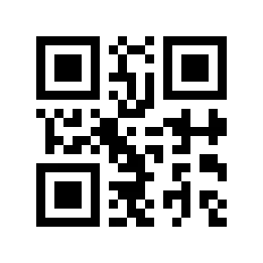
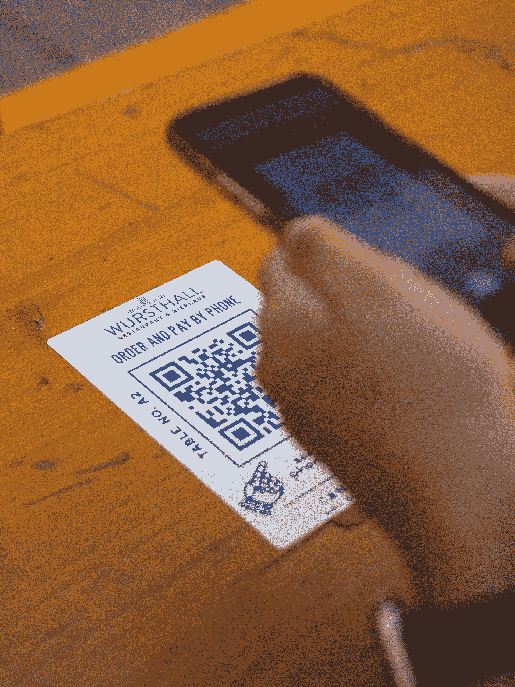

# 使用 Python 创建和读取二维码

> 原文：<https://towardsdatascience.com/create-and-read-qr-code-using-python-9fc73376a8f9?source=collection_archive---------1----------------------->

## 如何使用 python 制作和读取二维码的简单分步指南

## 什么是二维码？

QR 码是机器可读的二维像素化条形码，可用于存储各种信息。*二维码*中的 *QR* 代表*快速反应*。二维码是由汽车制造商*电装波*的日本工程师 *Masahiro Hara* 于 1994 年发明的，用于追踪汽车零部件的运动。
2010 年代后期，随着手机光学功能的改善和广泛采用，二维码越来越受欢迎。
如今，二维码正被广泛用于各种应用，如在线支付、查看酒店菜单、共享 wifi 密码、获取产品价格和其他详细信息等。二维码已经变得如此流行，以至于现在每部新的智能手机都内置了二维码阅读器。

在这篇文章中，我们将学习如何使用 python 来读取和生成 QR 码。

# 生成二维码

**安装二维码模块** 我们将使用二维码包生成二维码。
第一步是使用 pip 命令安装软件包。

```
pip install qrcode
```

软件包的完整文档可以在软件包的 [PYPI 主页](https://pypi.org/project/qrcode/)中获得。

## 简单二维码

使用 *qrcode* 的 *make* 函数，将数据作为参数传递，可以生成一个简单的 qr 码。下面的代码生成一个二维码，上面写着“你好，世界”

```
#Import Library
import qrcode#Generate QR Code
img=qrcode.make('Hello World')
img.save('hello.png')
```



Hello World 的二维码(图片由作者提供)

你可以用你的智能手机阅读上面的代码。

注意:不要使用手机读取随机二维码，因为它可能包含恶意代码/链接。

## 高级二维码

可使用 *QRCode* 对象定制 QR 码，该对象具有以下参数:

*一、版本* :
二维码有 40 个版本，控制码的大小。
1 为最小，40 为最大。
版本 1 将创建一个 21X21 矩阵二维码。

*二。误差修正* :
该参数控制用于二维码的误差修正。误差修正率从 7%到 30%不等，如下所示。
错误 _ 更正 _L:高达 7%
错误 _ 更正 _M:高达 15%
错误 _ 更正 _Q:高达 25%
错误 _ 更正 _H:高达 30%

*三世。box_size* :
该参数控制二维码每个方框中的像素数

*四。边框* :
该参数控制边框的粗细。默认边框为 4 像素厚。

QRCode 对象具有以下功能，可用于创建 QR 码。

*一、*添加数据
二维码的内容可以作为参数传递给这个函数。

*二。*制作
如果不确定使用哪个版本的二维码，可以通过以下方式自动设置版本:
*a.* 设置*版本*参数为*无*和
*b.* 设置*的*适合*参数使*到*为真。*

*三。*制作图像
该功能生成二维码。它还可用于使用 *fill_color* 和 *back_color* 参数设置二维码的填充颜色和背景颜色。

下面的代码生成一个指向我的中等个人资料的 QR 码。

```
qr = qrcode.QRCode(
    version=1,
    error_correction=qrcode.constants.ERROR_CORRECT_L,
    box_size=10,
    border=4,
)
qr.add_data("[https://abhijithchandradas.medium.com/](https://abhijithchandradas.medium.com/)")
qr.make(fit=True)img = qr.make_image(fill_color="red", back_color="black")
img.save("medium.png")
```


高级二维码(图片由作者提供)

# 读取二维码

我们将使用 OpenCV 读取二维码。如果没有安装软件包，可以按如下方式安装:

```
pip install cv2
```

二维码可以使用 [OpenCV](https://docs.opencv.org/4.5.2/index.html) 的 QRCodeDetector 对象的 detectAndDecode 函数进行解码。

```
import cv2img=cv2.imread("medium.png")
det=cv2.QRCodeDetector()
val, pts, st_code=det.detectAndDecode(img)
print(val)Output:
[https://abhijithchandradas.medium.com/](https://abhijithchandradas.medium.com/)
```

detectAndDecode 函数返回 QR 码的内容、盒子角的坐标和二进制化的 QR 码。关于使用 OpenCV 读取二维码的更多信息，您可以参考 [OpenCV QRCodeDetector](https://docs.opencv.org/4.5.2/de/dc3/classcv_1_1QRCodeDetector.html) 类参考。

# 资源:

教程的代码可以在我的 [GitHub Repo](https://github.com/hashABCD/Publications/tree/main/Medium/QR%20Code) 中找到。

## 成为会员

我希望你喜欢这篇文章，我强烈推荐 [**注册*中级会员***](https://abhijithchandradas.medium.com/membership) 来阅读更多我写的文章或成千上万其他作者写的各种主题的故事。
[你的会员费直接支持我和你看的其他作家。你也可以完全接触到 Medium](https://abhijithchandradas.medium.com/membership) 上的每个故事。

## 相关文章:

</generate-pencil-sketch-from-photo-in-python-7c56802d8acb>  

照片由[阿尔伯特·胡](https://unsplash.com/@alberthu?utm_source=medium&utm_medium=referral)在 [Unsplash](https://unsplash.com?utm_source=medium&utm_medium=referral) 上拍摄