# 从你的个人数据中创造美丽的艺术

> 原文：<https://towardsdatascience.com/create-beautiful-art-from-your-personal-data-9dc0abfeeaf?source=collection_archive---------16----------------------->

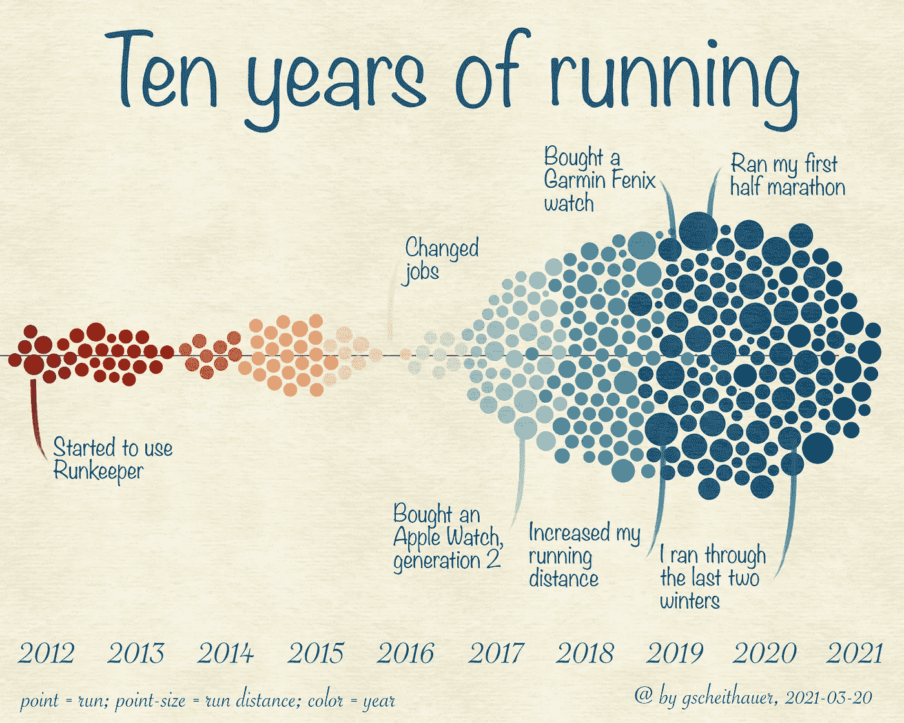

我的跑步之旅；作者图片

## 教程-数据即艺术-亲和力

## 一步一步的教程来创造美丽的艺术使用数据工具和亲和力设计

*大家好，我是 Gregor，一名数据科学家，一名热情的非竞赛跑步者。我也喜欢摄影艺术，与此同时——和其他一切一样——我仍在学习。*

## 1.介绍

我在全职工作之外保持创造性的策略之一是写数据科学。我最近写了一篇关于[如何提取和可视化我的智能手表](/how-to-visualize-your-runners-high-with-python-and-altair-45dde7803141)收集的数据的文章。这是我最喜欢分享的技术和知识。但是最近，我读了一篇来自[切斯卡·柯克兰](https://medium.com/u/a45288dbb699?source=post_page-----9dc0abfeeaf--------------------------------)的文章，她在文章中描述了她如何在封锁阶段收集个人数据，以及[她如何利用这些数据创作出漂亮的海报](https://medium.com/nightingale/coviz-19-10-things-i-learnt-from-75-days-alone-in-lockdown-8fa3ed3e451e)，我当时就知道我被忽悠了。我也对数据艺术有所了解，我从乔治·诺比尔和斯蒂芬妮·波萨维克的亲爱的数据项目中找到了美好的灵感。

请跟随我从数据中创造个人艺术的旅程。在这篇文章中，我将向你展示我的设置，包括数据和工具，如何执行创建艺术的步骤，以及如何使用它的想法。

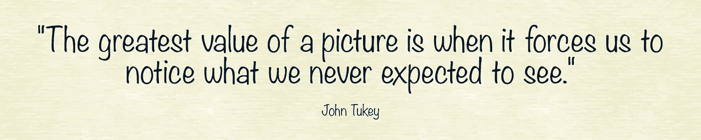

## 2.设置

为了创造一些与我平时创作完全不同的东西，我使用了不同于其他作品的工具。这里有一个我用过的工具的列表，但是你可以自由地做出你自己的选择。

1.  数据本身
2.  数据可视化工具 rawgraphs.io
3.  affinity Designer(Adobe Illustrator 的替代产品)
4.  额外的图形资源(如纸质背景)

运行数据；作者图片

**数据** 在我的情况下，我利用了我的 Garmin sport-/智能手表在过去十年中收集的跑步数据。请随意 [*阅读我的颇具技术性的文章《如何检索和清理此类数据*](/how-to-visualize-your-runners-high-with-python-and-altair-45dde7803141) 》。该数据最重要的属性包括*日期时间*信息以及关于*跑步距离*的信息。

但是任何数据都可以。正如我在介绍中提到的，我的目标是从个人数据中创造个性化的艺术。这可能包括健身数据(Garmin connect、Strava、Apple Watch)、营养数据(如卡路里摄入量、水消耗量)、健康数据(体重测量、每日步数)。尽管如此，请随意使用您喜欢的任何数据。

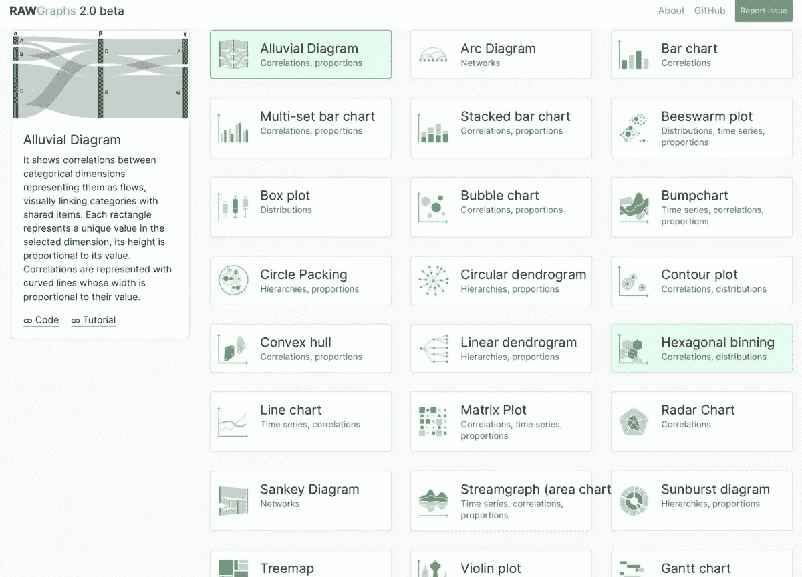

[https://rawgraphs.io](https://rawgraphs.io) 上可用图表概述(图片由作者提供)

**数据可视化工具
但我最近发现了一个名为 rawgraps.io 的免费在线服务，它允许你创建大量不同的数据图表(取决于你的数据类型)。按照我的理解，它在你的浏览器中工作，但是数据没有上传到他们的后端；在你的电脑上，所有的东西都可以在你的浏览器中运行。**

> RAW Graphs 是一个开源的数据可视化框架，旨在使复杂数据的可视化表示对每个人来说都很容易。RAW Graphs 主要是为设计师和 vis 极客设计的工具，旨在提供电子表格应用程序(如 Microsoft Excel、Apple Numbers、OpenRefine)和矢量图形编辑器(如 Adobe Illustrator、Inkscape、Sketch)之间缺少的链接。— *rawgraphic 的网站*

他们提供了广泛的图表类型。有些很常见，比如条形图、箱线图、折线图。我发现最有趣的是不属于 MS Excel 或典型数据科学包的图表，如等值线图、桑基图或蜂群图。

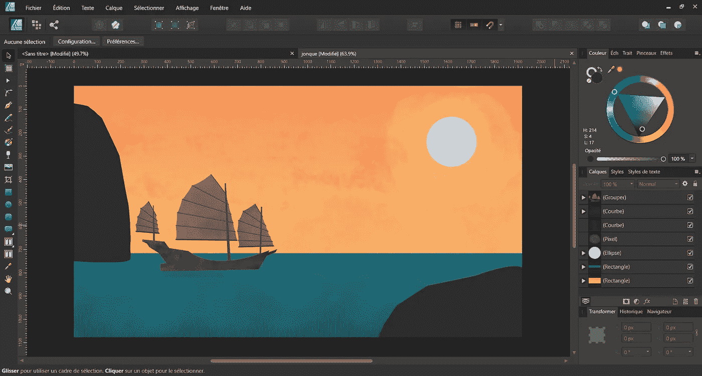

卢卡斯·拉克，CC BY-SA 4.0<[https://creativecommons.org/licenses/by-sa/4.0](https://creativecommons.org/licenses/by-sa/4.0)，通过维基共享

**亲和设计师** 如上所述，[亲和设计师](https://affinity.serif.com/en-us/designer/)是 Adobe Illustrator 的替代品。这是一个[矢量图形编辑器](https://en.wikipedia.org/wiki/Vector_graphics_editor)，它允许你 [*创建概念艺术、印刷项目、标志、图标、UI 设计、实体模型和更多*](https://affinity.serif.com/en-us/designer/) 。

它适用于所有平台。与 Adobe 不同，Affinity 产品只需一次性付款，无需任何订阅。它目前减价 50%。如果你正在寻找一个免费/开源的 vector 应用，请尝试一下 [Inkscape](https://inkscape.org) 。

**附加图形资源** 我直接从 Affinity 购买了一些纸质的背景。它叫做“ [*涂抹水彩&洗*](https://affinity.serif.com/en-us/store/product/daub-watercolours-and-washes-brush-pack/) ”。我可以想象，你也可以在网上找到有趣的选择。

## 3.程序

在接下来的段落中，我将概述我所采取的步骤。

第一步:raw graphs . io
T22 首先，请前往 [rawgraphs.io](https://app.rawgraphs.io) 。在这里，您可以选择将您的数据上传或复制粘贴到网站上(或者在浏览器中)。

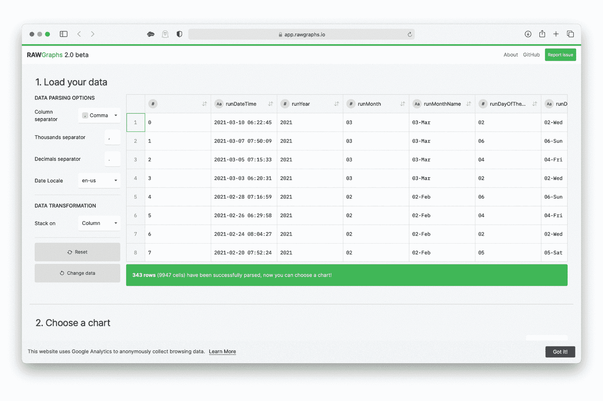

截图自 rawgraphs.io(作者提供 gif)

其次，选择一个有趣的情节或图表。在我的例子中，我选择了*蜂群图*。但是请随意使用你喜欢的任何图表。第三，请向下滚动，直到你到达映射部分。对于 x 轴，我选择了我的*日期栏*，对于尺寸栏我选择了*跑步距离、*，对于颜色，我选择了跑步的*年份。*

当您进一步向下滚动时，图表会自动呈现在您面前。您可以在这里进一步定制。我选择将色标从*顺序*更改为*发散*，并更改了配色方案。同样，请随意使用提供给您的选项。最后，将您的图表作为 SVG 文件导出到您的计算机上。

**第二步:亲缘关系设计者**

首先，我创建一个新文件，长宽比为 5:4 横向(宽:3000 像素，高:2400 像素)。

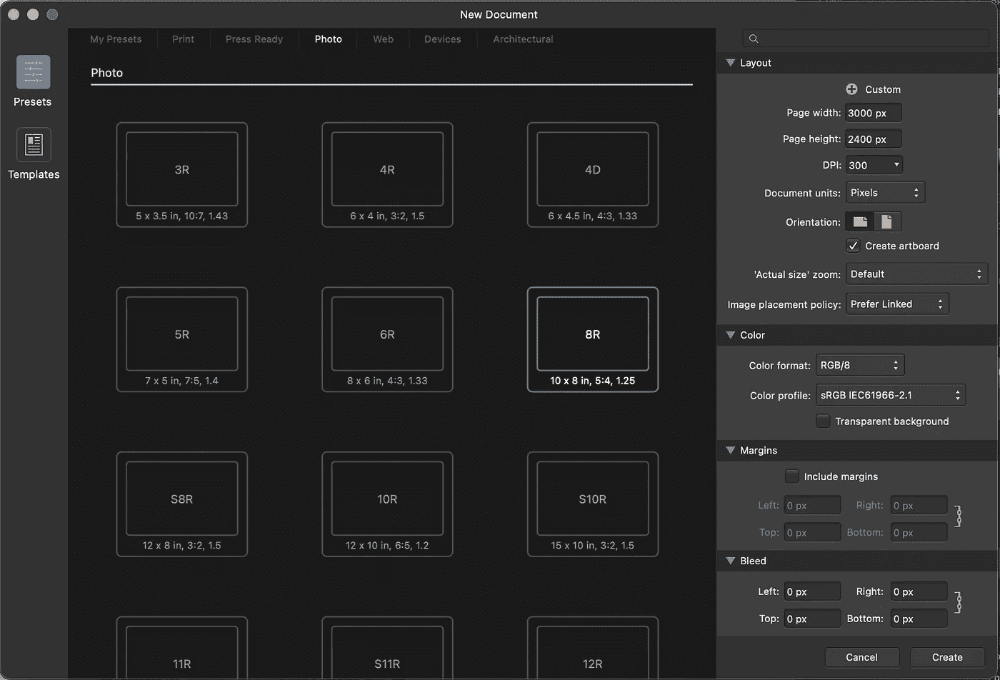

在关联性设计器中创建新文件；作者图片

其次，我打开左侧的资产窗口，选择*涂抹纸*。对于我的图像，我选择了纸张#9，并将其拖到屏幕中间的空白画布上。我用手柄来定位它，这样它就覆盖了整个画布。

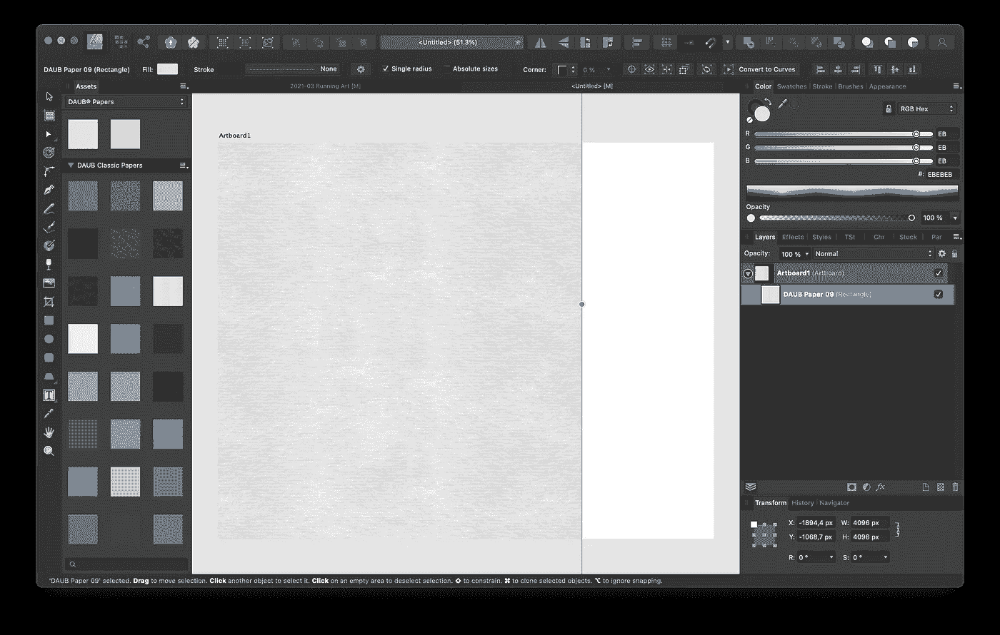

选择纸质背景；作者图片

第三，我应用一个*颜色调整*到纸张背景。你可以在菜单栏`Layer > New Adjustment > Recolor`下找到。我将*色调改为 50，饱和度改为 50，*和*亮度改为 9。*

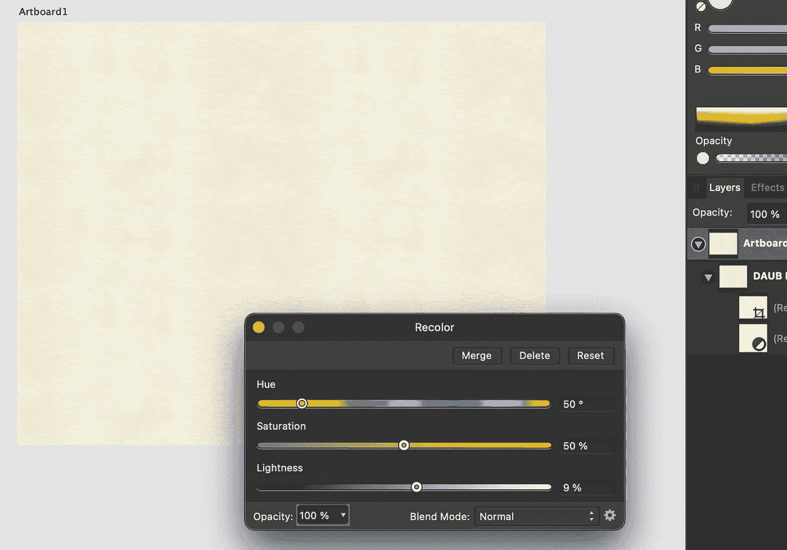

对背景应用重新着色调整；作者图片

第四，您可以导入之前创建的 svg 图。将文件从文件浏览器拖到画布中，或者使用`File > Place ... > select your image`。您可以使用左侧的裁剪工具来调整大小和裁剪。

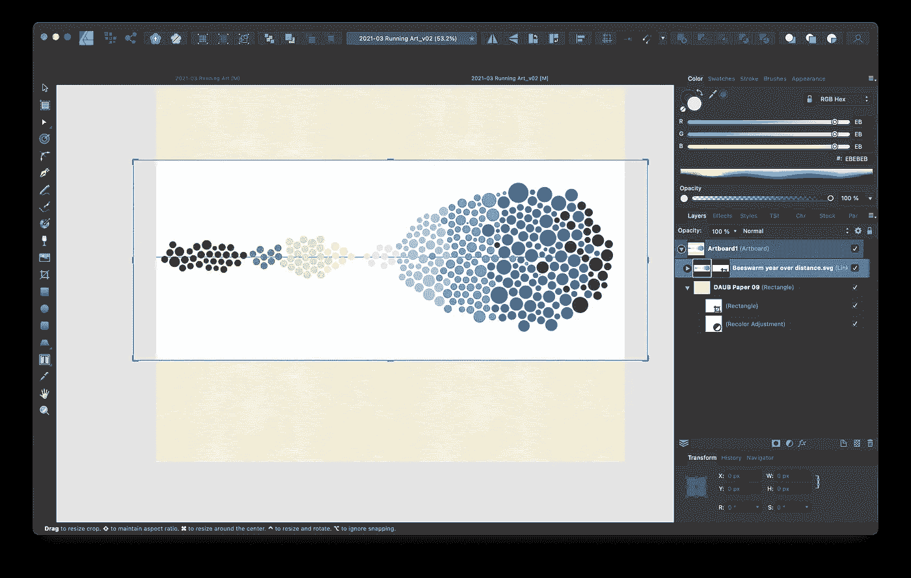

将图表放入画布；作者图片

接下来，我们将混合模式从*正常*更改为*线性燃烧*。你可以在右边的图层面板中实现。只要确保您首先选择了图形图层。

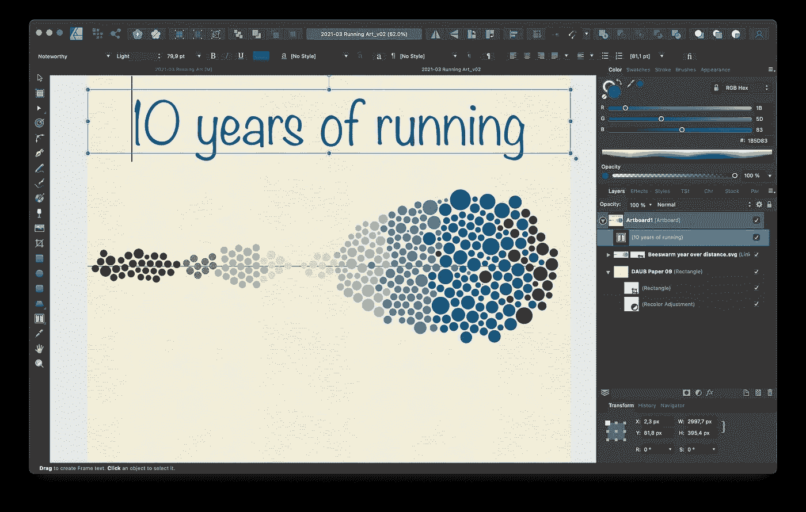

混合模式和标题图表的更改；作者图片

然后，我使用*框架文本工具*(快捷键 T)在图表上方放置一个文本框架。我把我的图表命名为*跑步十年*。在图表下方，我添加了一个带有年份和更多信息的图例。随意使用字体、颜色和文本大小。

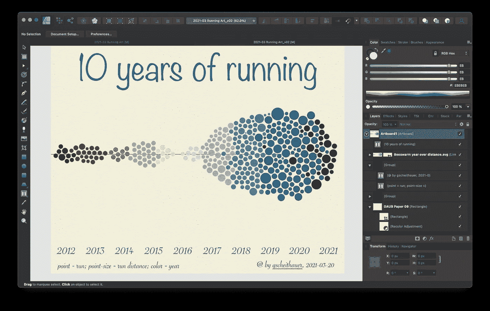

添加图例；作者图片

当然，在图表中加入一些个人亮点。我发现传统的图表框架几乎不可能做到这一点。

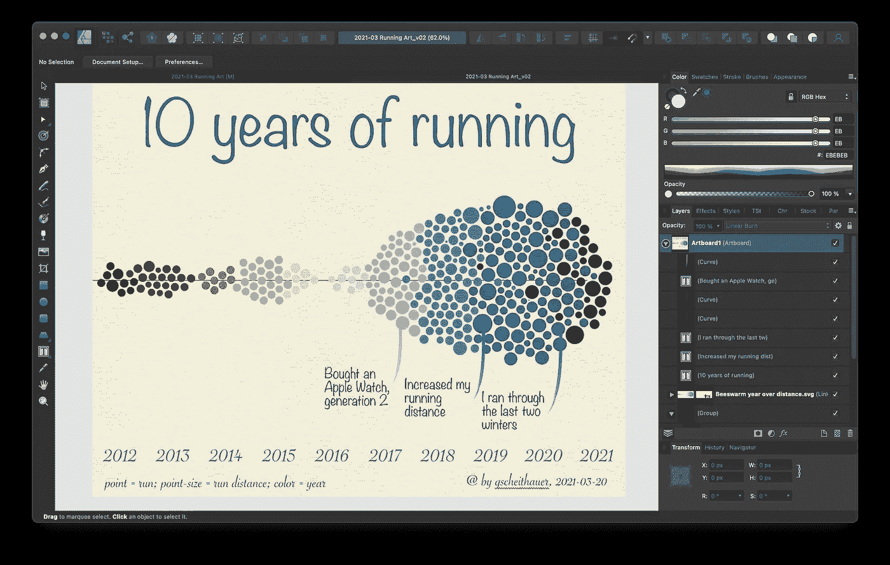

添加个人详细信息；作者图片

**第三步:尝试一些变化**

这里，完成的定义是什么？我猜每当这个作品被送到印刷厂:-)。我尝试了这个版本的一些变化。为此，我推荐使用*画板*功能。如果你想了解更多关于 Affinity Designer 的知识，请看看他们的[教程](https://affinity.serif.com/en-us/learn/)。

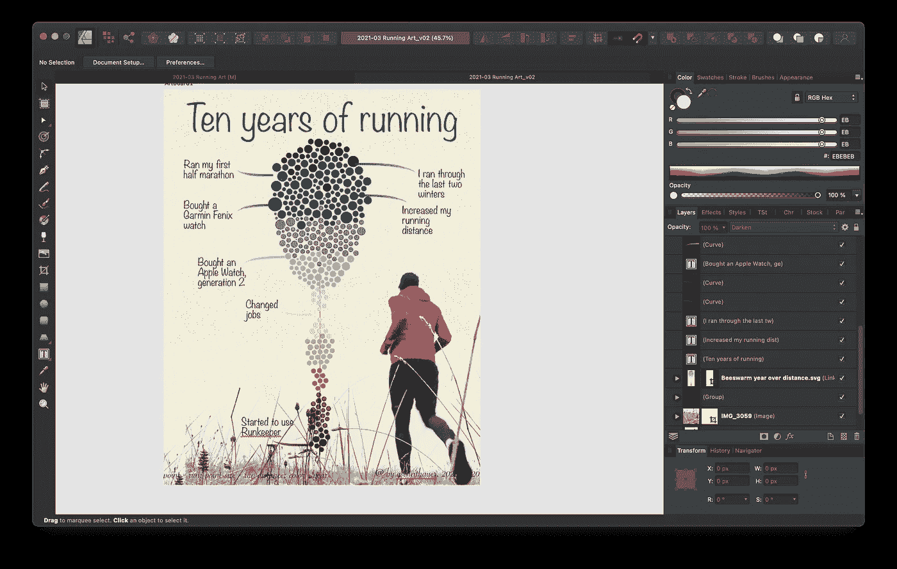

人像替代；作者图片

在第一个版本之后，我创造了一个肖像的替代品。我还添加了我自己的另一张照片来填补一些空白(在我不常跑步的几年里)。请注意，我为这张额外的图片使用了*变暗*混合模式。接下来，我对照片进行了一些模糊处理，这样就不会影响到图表，同时也降低了不透明度。

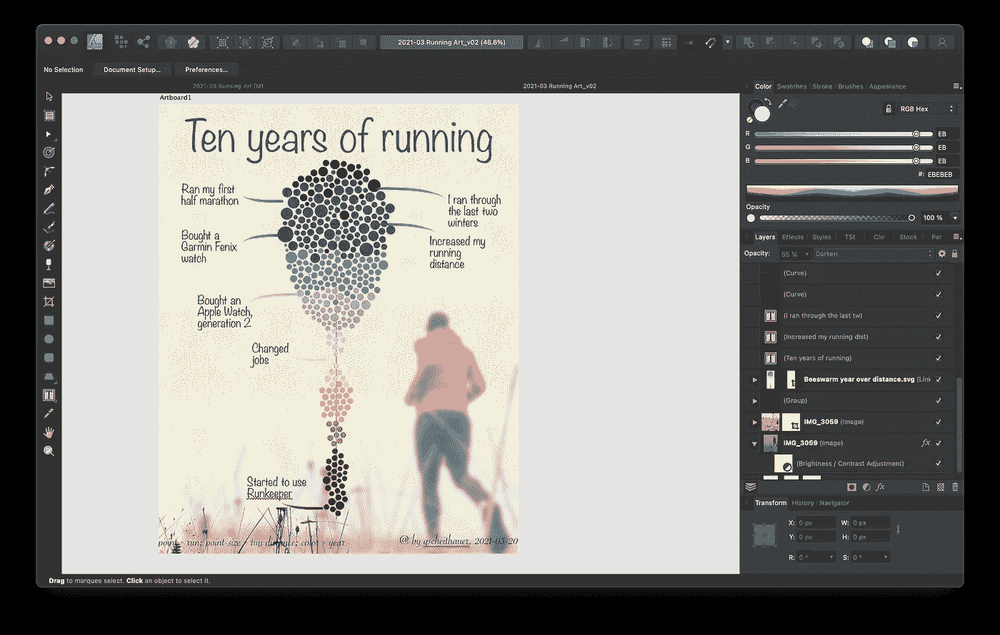

背景照片模糊；作者图片

接下来，我在风景模式下尝试了一个*等高线图*。我还改变了一些字体和颜色。

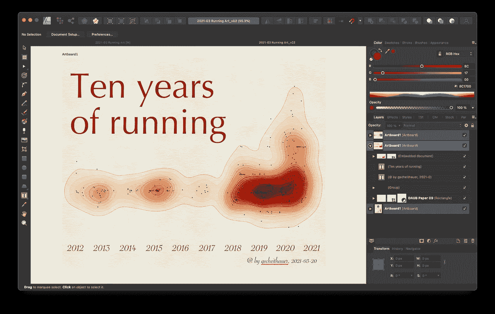

等高线图替代；作者图片

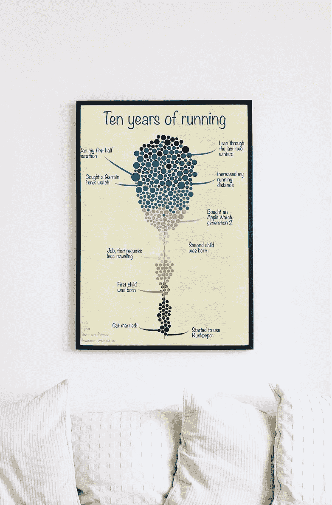

[Martin Péchy](https://unsplash.com/@martinpechy?utm_source=medium&utm_medium=referral) 在 [Unsplash](https://unsplash.com?utm_source=medium&utm_medium=referral) 和 [Kam Idris](https://unsplash.com/@ka_idris?utm_source=unsplash&utm_medium=referral&utm_content=creditCopyText) 在 [Unsplash](https://unsplash.com/s/photos/frame-mockup?utm_source=unsplash&utm_medium=referral&utm_content=creditCopyText) 的照片；由作者修改

## 4.结论

在这篇文章中，我向你展示了我从跑步数据中创造个性化艺术的尝试。很明显，我已经超出了我的能力范围，但是它让我尝试了一些新的东西，我肯定可以学到更多关于矢量编辑器的知识。

我将打印并装裱一个版本——希望——说服我的妻子把它挂在我们家的墙上。

> 你怎么想呢?你有什么反馈给我吗？

如有任何问题和意见，请随时联系我。谢谢你。**点击此处查看我的更多文章**:

1.  [了解我如何为媒体设计文章](https://medium.com/technical-excellence/article-pipeline-management-with-notion-app-template-13e83635ed1)
2.  [了解我如何获得和分析我的 Garmin 跑步数据](/how-to-visualize-your-runners-high-with-python-and-altair-45dde7803141)
3.  [了解如何为您的 Python 代码设置日志记录](/how-to-setup-logging-for-your-python-notebooks-in-under-2-minutes-2a7ac88d723d)
4.  [了解如何使用链接(或管道)在 Python 中编写干净的代码](https://medium.com/technical-excellence/article-pipeline-management-with-notion-app-template-13e83635ed1)
5.  [学习如何使用 R 分析你的 LinkedIn 数据](/nine-years-on-linkedin-in-data-b34047c77223)
6.  [学习如何使用图形语法在 Python 中以描述性的方式创建图表](/data-visualization-in-python-like-in-rs-ggplot2-bc62f8debbf5)

Gregor Scheithauer 是一名顾问、数据科学家和研究员。他专门研究流程挖掘、业务流程管理和分析。你可以在[**LinkedIn**](https://www.linkedin.com/in/gscheithauer/)[**Twitter**](https://twitter.com/gscheithauer)上和他联系，或者在 [**Medium**](https://gscheithauer.medium.com/) 上这里。谢谢大家！