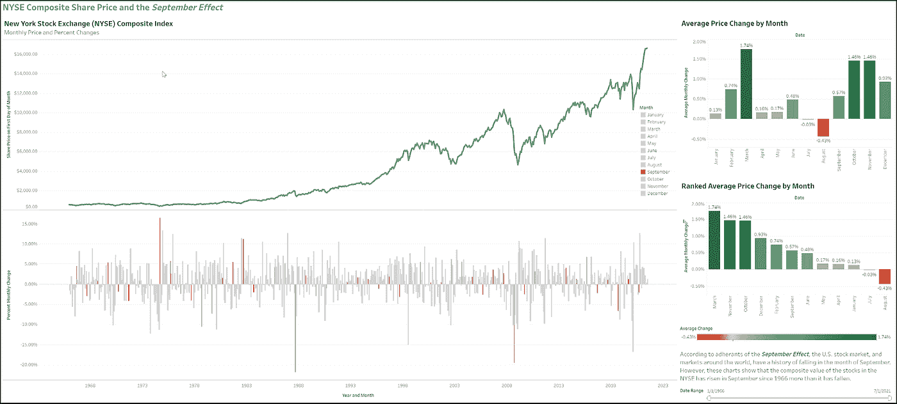
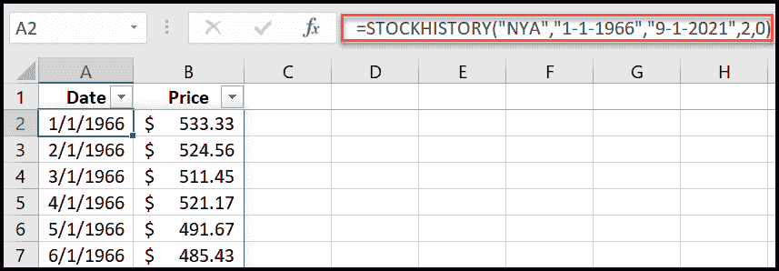
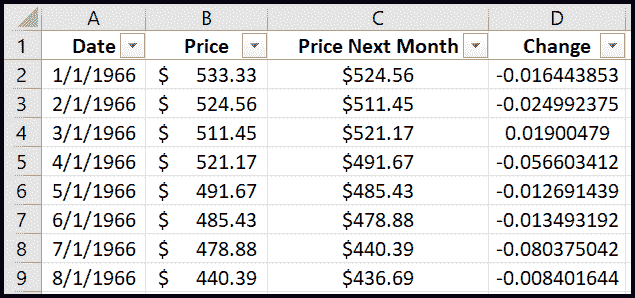
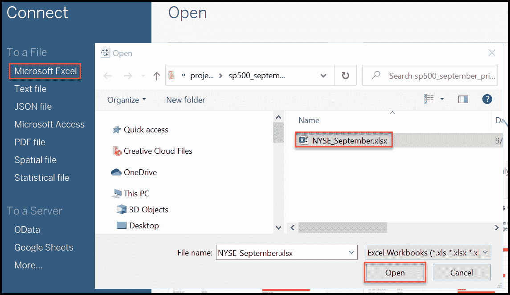
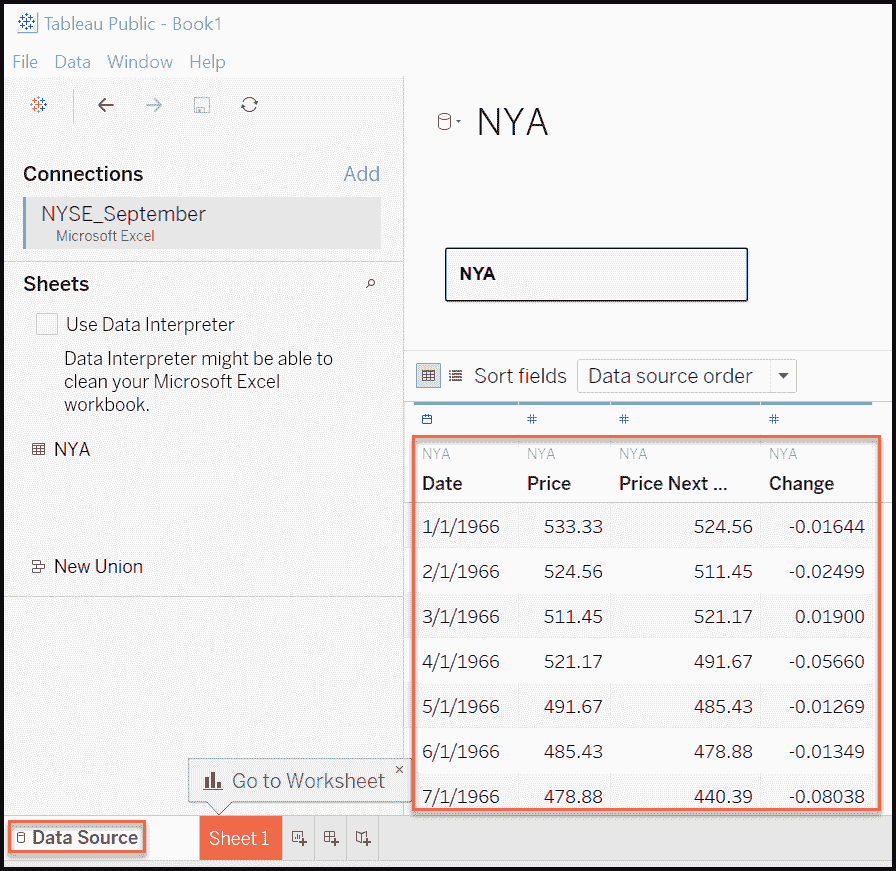
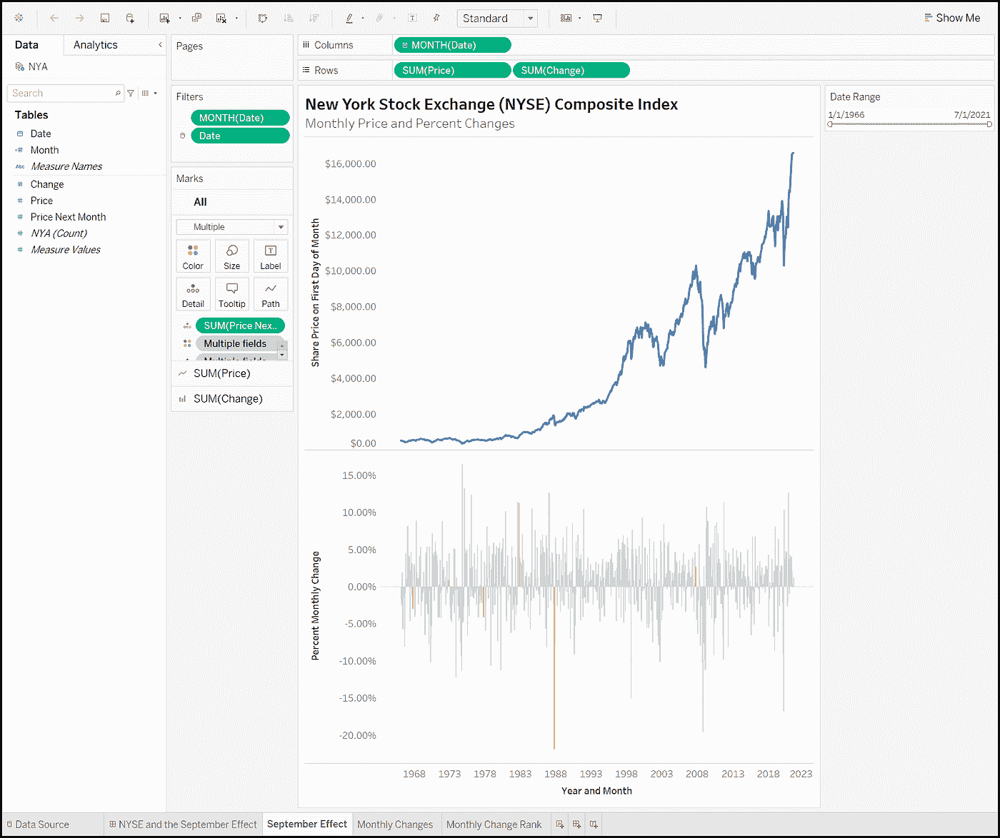
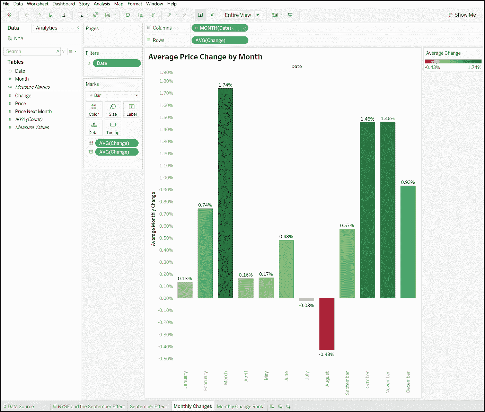
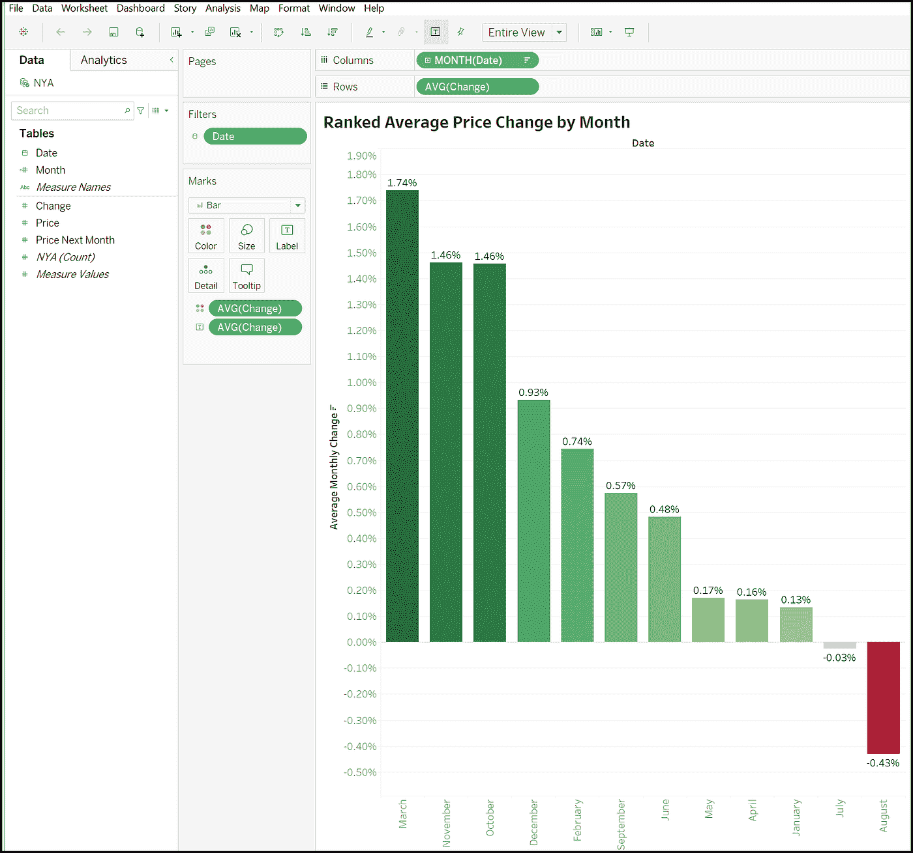
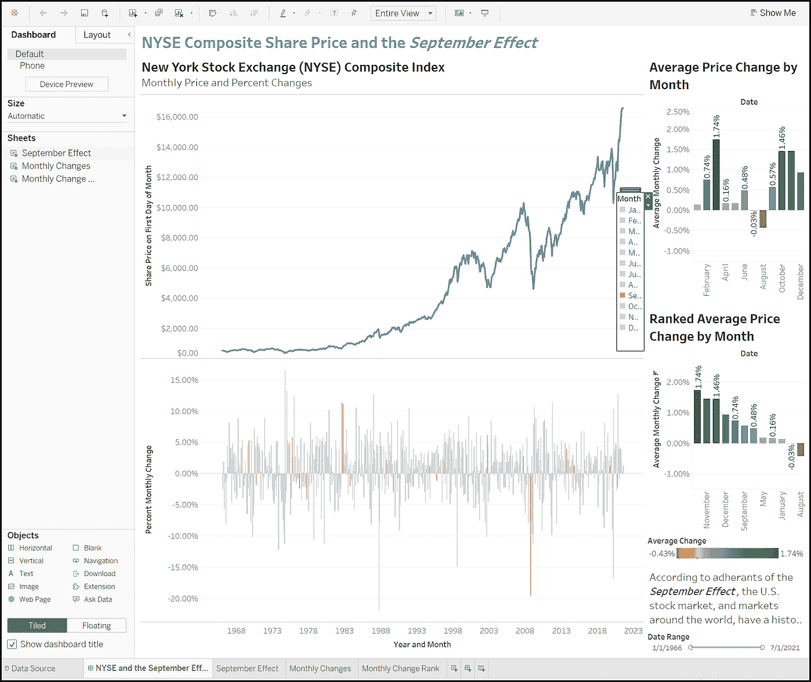

# 使用 Excel 和 Tableau 创建定制的投资分析仪表板

> 原文：<https://towardsdatascience.com/create-custom-investment-analytics-dashboards-with-excel-and-tableau-7d304eeebfc4?source=collection_archive---------21----------------------->

## 投资、数据分析、Excel 和 Tableau

## 使用 Excel 的 STOCKHISTORY 函数获取股票价格数据和 Tableau 来构建投资分析仪表板

纽约的纽约证券交易所。照片由 [Unsplash](https://unsplash.com/s/photos/stock-market?utm_source=unsplash&utm_medium=referral&utm_content=creditCopyText) 上的 [David Vives](https://unsplash.com/@davidvives?utm_source=unsplash&utm_medium=referral&utm_content=creditCopyText) 提供。

> *“对知识的投资回报最高。”* —本杰明·富兰克林

# 介绍

昨晚，当我回顾我的投资和当天的股市新闻时，一篇关于九月效应的文章引起了我的注意。人们用这个词来描述 9 月份股市低回报的假定历史趋势。在浏览了几篇关于这个话题的文章后，我进一步研究了它，以了解它是否准确，以及它是否会影响我 9 月份的股票投资。

我在我的经纪人网站、谷歌和雅虎上研究股票图表。这些网站提供了令人难以置信的投资分析工具，但没有一个能提供我所需要的东西来更好地理解九月效应的可能模式。所以，我做了我自己的仪表板，而且很有效。仪表板回答了我关于 9 月份股市是否总体持续下跌的问题。

本文将演示如何使用 Microsoft Excel 获取股票价格数据，并在 Tableau 中构建一个九月效应仪表板。您可以使用这里描述的工具和技术来执行各种其他投资分析和跟踪投资。

***来自《走向数据科学》编辑的注释:*** *虽然我们允许独立作者根据我们的* [*规则和指南*](/questions-96667b06af5) *发表文章，但我们并不认可每个作者的贡献。你不应该在没有寻求专业建议的情况下依赖一个作者的作品。详见我们的* [*读者术语*](/readers-terms-b5d780a700a4) *。*

# 九月效应数据分析项目概述

下面是我制作的“纽约证券交易所综合价格和九月效应”Tableau 仪表板的截图，它帮助我了解九月效应以及它是否真的存在。用 Excel 和 Tableau Public 构建不到两个小时。它应该作为未来定制投资分析项目的坚实基础。

九月效应仪表板。图片由作者提供。

以下是构建仪表板的步骤概述:

1.  在 Excel 中，使用 STOCKHISTORY 函数检索每个月第一天纽约证券交易所(NYSE)综合指数的价格。例如，获取从 1966 年 1 月到 2021 年 7 月的价格数据。
2.  在 Excel 中，计算每个月的价格变化和价格变化率。Excel 计算比率如下:*比率=(month 2 price-month 1 price)/month 1 price*。例如，1966 年 1 月 1 日的价格是 533.33 美元，1966 年 2 月 1 日的价格是 524.56 美元。因此，1966 年 1 月的变化率为-0.0165533853，百分比变化为-1.64%。
3.  打开 Tableau 桌面或 Tableau 公共桌面应用程序。然后，将 Tableau 连接到上面步骤 1 和 2 中创建的 Excel 电子表格和工作表。
4.  在 Tableau 中，创建一个九月效应工作表，显示一段时间内 NYSE 指数的价格和每月的价格变化百分比。此外，创建一个工作表，显示按月排序的每月平均价格变化百分比(不包括年份)。最后，创建另一个月度变化工作表，但按价格变化百分比排序。
5.  组装一个包含上述三个工作表的 Tableau 仪表板。
6.  将 Tableau 仪表板发布到 Tableau 服务器或 Tableau 公共服务器(在我的例子中)以与最终用户共享。

# 使用 Microsoft 365 中的股票历史功能

## Excel 股票历史功能概述

我使用 Excel 已经很多年了，但是直到昨晚我在谷歌搜索“股票历史”来研究九月效应时，我才听说过它的股票历史功能。发现这个功能促使我建立了投资仪表板。该函数返回指定时间范围内几乎任何股票、ETF、共同基金和一些证券指数的价格历史。

请注意，在作为微软 365 订阅产品一部分的 Excel 的联网版本中，STOCKHISTORY 函数仅在 ***和*** 有效。例如，我订阅了微软 365 系列，所以我立即将 STOCKHISTORY 投入使用。

## 选择用于股票历史的综合股票指数

STOCKHISTORY 将投资工具(股票、ETF 或共同基金)或综合指数股票作为其第一个参数。我最初想用标准普尔 500(标准普尔 500)综合指数价格来分析九月效应。但是 STOCKHISTORY 只返回了过去十年的月值。因此，在对综合指数做了一些研究后，我选定了纽约证券交易所(NYSE)的综合指数。

纽约证券交易所是一家美国证券交易所，于 1792 年获得了第一笔交易证券。到目前为止，全球最大的证券交易所，其上市公司的市值在 2018 年 2 月达到 30.1 万亿美元。投资者每个交易日都在交易所交易数十亿美元。

纽约证券交易所在 20 世纪 60 年代中期建立了它的综合指数(股票代码:NYA)。1965 年 12 月 31 日开市时，该交易所给该指数的初始值为 50 点。2003 年，纽约证交所将该指数重新设定为 5000 点，接近 2002 年的收盘点位。

今天，纽约证券交易所列出了 2000 多种股票。其中大约 1600 家是美国公司，其余的是外国公司。因此，该指数很好地代表了股票市场。与它的规模相比，标准普尔 500 综合指数列出了 500 家大公司，道琼斯工业平均指数(DJIA)列出了 30 家著名公司。

基于纽约证交所的规模和历史，它似乎很适合我的需求。另外，与标准普尔 500 综合指数不同，STOCKHISTORY 函数返回纽约证券交易所指数从 1966 年 1 月到 2021 年 7 月的月度价格。

## 利用股票历史获取纽约证券交易所综合指数价格

虽然许多 Excel 函数可以访问多个工作表单元格中的数据，但它们通常在单个单元格中写入和显示数据。另一方面，STOCKHISTORY 可以将数据“溢出”到其他单元格中。例如，查看下面的截图。STOCKHISTORY 函数检索 NYA 股票交易所(NYSE 综合指数)55 年来的月度价格数据。因此，即使函数驻留在单元格 A2 中，其结果也会溢出到区域 A2:B69 中。

在 Excel 中使用股票历史函数。图片由作者提供。

出于我的目的，我将 STOCKHISTORY 调用如下:

***=股票历史(" NYA "，" 1–1–1966 "，" 9–1–2021 "，2，0)***

从左至右，以下是其参数的含义:

1.  **股票** —股票、电子资金转账、共同基金、其他证券或指数的代码。在这种情况下，“NYA”是纽约证券交易所综合指数的股票代码。
2.  **开始日期** —所需日期范围的第一天。在这种情况下，该值为“1–1–1966”
3.  **结束日期** —所需日期范围的最后一天。在这种情况下，该值为“9–1–2021”
4.  **间隔** —每个数值代表的时间间隔。允许的值为 0(每天)、1(每周)和 2(每月)。我选择 2(每月)，因为我需要按月计算值的变化。

有关 STOCKHISTORY 函数及其参数的更多信息，请参见下面“了解更多”一节中的链接。

> “我将告诉你如何变得富有。关上门。当别人贪婪的时候要恐惧。在别人恐惧的时候贪婪。” —沃伦·巴菲特

# 创建 Excel 电子表格

为了获取纽约证券交易所综合指数(股票代码 NYW)值数据并准备在 Tableau 中使用，我创建了一个名为“NYSE _ June . xlsx”的 Excel 电子表格，其中有一个名为“NYA”的工作表。完成后，它将在四列中包含计划的 Tableau 九月效果仪表板所需的所有数据。

按照以下步骤重新创建 NYA 工作表:

1.  在第 1 行的 A 到 D 列中，输入“日期”、“价格”、“下个月的价格”和“变化”的列名
2.  在单元格 A2 中，按照上一节所述输入此公式:***=股票历史(" NYA "，" 1–1–1966 "，" 9–1–2021 "，2，0)***
3.  在单元格 A2 中，按[Enter]键。如果函数正常工作，日期和价格数据应该填充 A 列和 B 列到 69 行。如果没有，请确保您拥有有效的 Microsoft 365 订阅，并且您的计算机已连接到 Internet。
4.  将 A 列中的每个日期格式化为日期值。为此，右击单元格并点击[单元格格式…]。一个对话框将显示可能的格式列表。单击[日期]，然后单击[确定]。
5.  将此公式输入单元格 C2: **=B3** 。然后，将公式复制并粘贴到单元格 C3 到 C69 中。虽然这一栏是必要的，但可能并不明显。总之，它的存在确保了单元格 C2 到 C69 中的公式拥有计算其值所需的所有值。
6.  将此公式输入单元格 D2: **=(B3-B2)/B2** 。然后，将此公式复制并粘贴到单元格 D3 至 D69 中。对于每个月，该公式计算从当月到下月的价格变化率。
7.  保存电子表格文件。

该电子表格应该类似于下图所示。请注意列名右侧的向下箭头符号。它们是我添加的过滤器，用来帮助我检查数据。

纽约证券交易所综合指数数据电子表格样本。图片由作者提供。

# 创建 Tableau 可视化和仪表板

纽约证券交易所综合指数数据已经获得、准备并存储在一个 Excel 文件中。以下总结步骤描述了在 Tableau Public desktop 中连接文件和构建可视化效果。虽然我使用 Tableau 已经超过五年了，但它需要一些尝试和错误。因此，描述创建仪表板的每个步骤的教程超出了本文的目的。

此外，如果您想使用免费的 Tableau Public 而不是整个 Tableau，请注意，您只能将您的工作保存到 Tableau Public 网站。这使得你的可视化可以被世界上的任何人使用。所以，一定要排除网站上的机密信息。

## 安装 Tableau

若要执行以下步骤，您需要安装 Tableau Desktop 或 Tableau Public Desktop 的副本。要安装 Tableau Public Desktop，请按照 Tableau Public 主页上的说明进行操作，并下载本文末尾“了解更多”一节中列出的链接。Tableau 公共桌面应用程序和 Tableau 公共网站上的发布是免费的。

## 连接到数据

打开 Tableau 桌面或 Tableau 公共桌面应用程序。然后，按照下面列出的步骤连接到 Excel 电子表格和工作表。参考截图中的例子。

1.  在“连接”标题下，单击[Excel]。
2.  在“打开”对话框中，导航到存储 NYSE 综合指数电子表格文件的文件夹。
3.  单击电子表格的名称，然后单击[打开]。

使用 Tableau 连接到 Excel 文件。图片由作者提供。

月度指数价格数据应该显示在“数据源”窗口中，如下所示。

Excel 中的数据已成功加载到 Tableau 中。图片由作者提供。

## 构建工作表和控制板

Tableau 项目包含一个名为“纽约证券交易所和九月效应”的仪表板它包括三个工作表，称为“九月效应”、“月度变化”和“月度变化等级”仪表板讲述了“九月效应”的部分故事，至少使用了 1966 年开始的纽约证券交易所综合指数数据。

如上所述，我不会提供组装工作表和仪表板的详细说明。取而代之的是，每张照片的截图会提供它们是如何制作的想法。

## Tableau Public 入门

如果您是 Tableau 的新手，我建议您按照以下步骤开始学习如何使用该工具:

1.  安装免费的 Tableau 公共桌面应用程序。请参阅本文末尾“了解更多”一节中的链接。
2.  创建一个免费的 Tableau 公共帐户，以便您可以将可视化效果保存并发布到 Tableau 公共网站。
3.  观看免费的 Tableau 在线培训视频。有关更多信息，请参见下面“了解更多”部分中的培训资源链接。

## 创建工作表

Tableau 公共桌面应用程序中的“九月效应”工作表如下所示。蓝色线条图描绘了纽约证券交易所综合指数的月值。条形图显示了指数的月度变化(增加或减少)。

纽约证券交易所和九月效应可视化。纽约证券交易所和九月效应可视化。图片由作者提供。

下面显示的“每月变化”工作表以条形图显示了指数每月的平均百分比变化。

纽约证券交易所综合指数月平均变化条形图。图片由作者提供。

如下所示的“月度变化等级”工作表与“月度变化”工作表相同，只是条形图按月度变化百分比降序排列。

纽约证券交易所综合指数月度平均变化条形图，按变化百分比降序排列。图片由作者提供。

创建工作表后，我将它们组装到一个仪表板中，如下所示。请注意，三个图表的时间窗口受位于右下角的“日期范围”过滤器的影响。

Tableau 公共桌面应用程序中的九月效果 Tableau 仪表板。图片由作者提供。

## 将仪表板发布到 Tableau Public

在改进和测试仪表板及其底层工作表后，我将其发布在 Tableau 公共网站上。你可以在这里看到[完成的项目并与之互动。](https://public.tableau.com/views/NewYorkStockExchange-SeptemberEffectStockPriceAnalysis/NYSEandtheSeptemberEffect?:language=en-US&:display_count=n&:origin=viz_share_link)

# 结论

用 Excel 及其 STOCKHISTORY 功能获取纽约证券交易所综合指数数据的项目以及“九月效应”Tableau 仪表板的构建和使用帮助满足了我的好奇心。当我与仪表板互动时，我更好地理解了九月效应。当我投资股票时，这个项目帮助我确认了我和我的“货币与金融”课教授的共识，他说，“股票市场和任何东西都没有关系。”

通过九月效应项目，我获得了新的知识和技能。我还开发了分析投资证券和市场的新方法。当现有的投资分析仪表板不能满足我的分析需求时，我打算继续使用 Excel、其股票历史功能和 Tableau 来增强我的能力。

我希望你也能从这篇文章中获得新的知识和想法。感谢您的阅读。

> *“对历史有一个好的视角，我们可以更好地理解过去和现在，从而对未来有一个清晰的愿景。”* —卡洛斯·斯利姆·埃卢

# 关于作者的免责声明

虽然我在软件开发、数据工程和数据分析方面有丰富的专业经验，*但我是个业余投资者*。请不要依赖这里提供的信息来指导你的投资。请依靠自己的决策和专业的投资建议。

# 了解更多信息

[Excel 股票历史函数](https://support.microsoft.com/en-us/office/stockhistory-function-1ac8b5b3-5f62-4d94-8ab8-7504ec7239a8)

[纽约证券交易所](https://en.wikipedia.org/wiki/New_York_Stock_Exchange)

[纽约证券交易所综合指数](https://en.wikipedia.org/wiki/NYSE_Composite)

[Tableau 公共主页及下载](https://public.tableau.com/)

[免费 Tableau 公共培训资源](https://public.tableau.com/en-us/s/resources)