# 从准备发布的数据框架中创建完美的表格

> 原文：<https://towardsdatascience.com/create-flawless-tables-from-your-dataframe-ready-for-publication-7e3fe2d63a52?source=collection_archive---------11----------------------->

杰瑞米·泽罗在 [Unsplash](https://unsplash.com/?utm_source=unsplash&utm_medium=referral&utm_content=creditCopyText) 上的照片

## 教程-表格-R

## 如何创建发布就绪表的分步教程

我是一名数据科学家，大多数时候，我会考虑一种完美的方式来可视化大量数据，以向客户和团队成员传达有趣的发现。老实说，在大多数情况下，如果不是在所有情况下，以简单的表格形式显示数据及其结构是必要的，并将有助于提高整体理解。

然而，在大多数情况下，我使用 PowerPoint 或 Excel 来创建这个表，以使其看起来可展示和/或可发布。这当然打破了自动重现这一结果的可能性。在我最近的一个项目中，我了解并应用了一个软件包，该软件包允许我在不离开我的数据科学平台的情况下创建漂亮的、可供发布的数据表。

# **1 简介**

在本文中，我将向您展示如何使用 **Grammar of Tables** (gt)包来创建完美的、准备发布的表格，将您的设置转换为主题以便快速重用，以及如何在您的下一个数据科学项目中应用该主题。

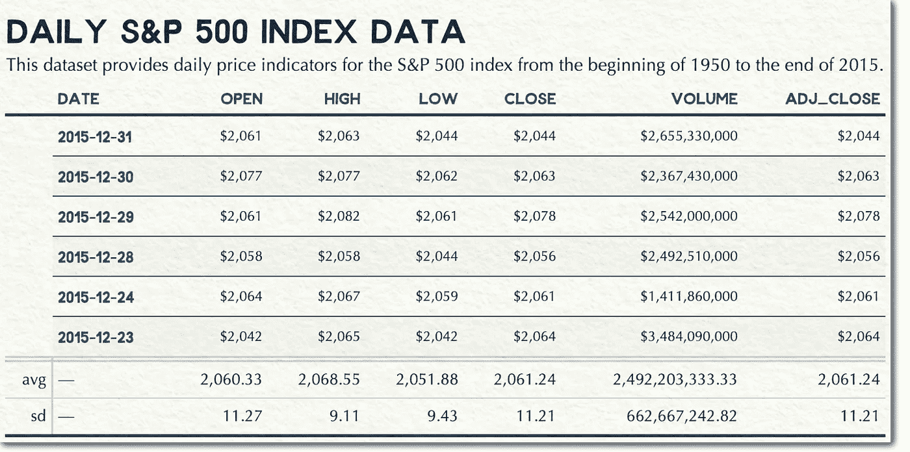

标准普尔 500 数据示例表(图片由作者提供)

# **2 设置**

我的大部分客户工作都涉及到 [Python 和](/the-flawless-pipes-of-python-pandas-30f3ee4dffc2)熊猫。但是，通过训练，我是一个 [R 人](/the-radical-rise-of-oktoberfest-beer-prices-created-a-90-million-euro-business-261da252c827)。我为 R 数据科学平台解决了这个问题，但是在我即将发表的一篇文章中，我将研究如何使用 Python 和 Pandas 来实现这个问题。

然而，以下是我正在使用的软件和软件包列表:

1.  [R & RStudio](https://www.rstudio.com) —语音的数据科学平台和 IDE。
2.  [tidyverse 包](https://www.tidyverse.org)——这个包允许我编写优雅、可读、高效的代码来操作数据帧
3.  [gt 包](https://gt.rstudio.com) —表格语法(gt)包，打造完美的表格设计
4.  Gapminder 软件包——Gapminder 按国家分列的预期寿命、人均国内生产总值和人口数据摘录

## **2.1 表格语法概述(gt)**

gt 包遵循一种描述性的方法来创建表格，比如图形的语法。简而言之，它允许我们指定*什么*应该发生，而不是指定*如何*应该发生——这是编写代码的一种非常棒且可读的方式。

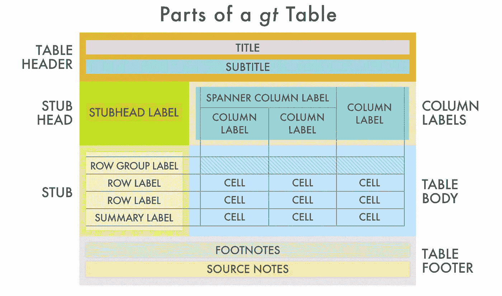

gt 表的零件(图片来源:[https://gt.rstudio.com](https://gt.rstudio.com))

gt 包定义了大量的区域来添加到您的表中，并操纵它们的可视化。在下面的例子中，我将向你解释如何使用这些区域。

还需要注意的是，您可以为 R notebook 创建一个表格，并以多种格式保存该表格，包括 HTML 和 PNG，如果您需要在不同的出版物(如网站或 PowerPoint 文档)中报告表格，这将非常有用。

## **2.2 包和常量**

在开始创建一个表之前，我先分享一下这段代码，它将加载(如果有必要的话，还会安装)必需的包:

我还使用了一些帮助我编写灵活的 R 脚本的常量。请注意，我使用 **c_rn** 来指定表中包含的最大行数，使用 **c_save** 来确定是否将表创建过程的每一步都保存为文件(这需要一点时间)，使用 **c_format** 来指定输出格式。

Gapminder 数据集的一般输出如下所示:

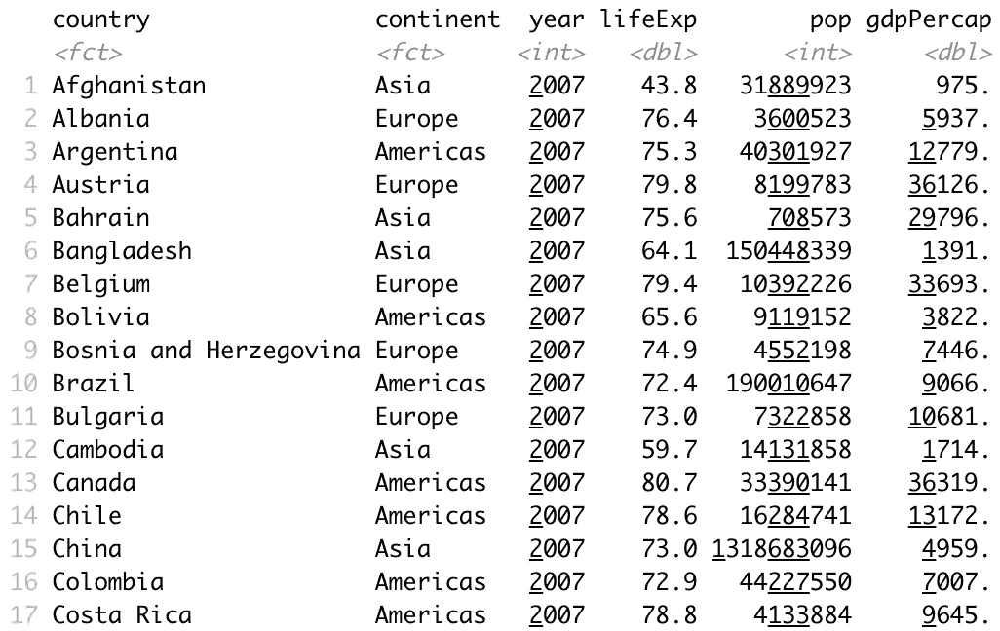

标准控制台输出(图片由作者提供)

# **3 创建一个完美的、准备发布的表格**

gt 包最基本的用途只是将过滤后的数据帧传递给 gt 函数。不过，这并不太令人兴奋，也没有给标准控制台输出带来任何好处。

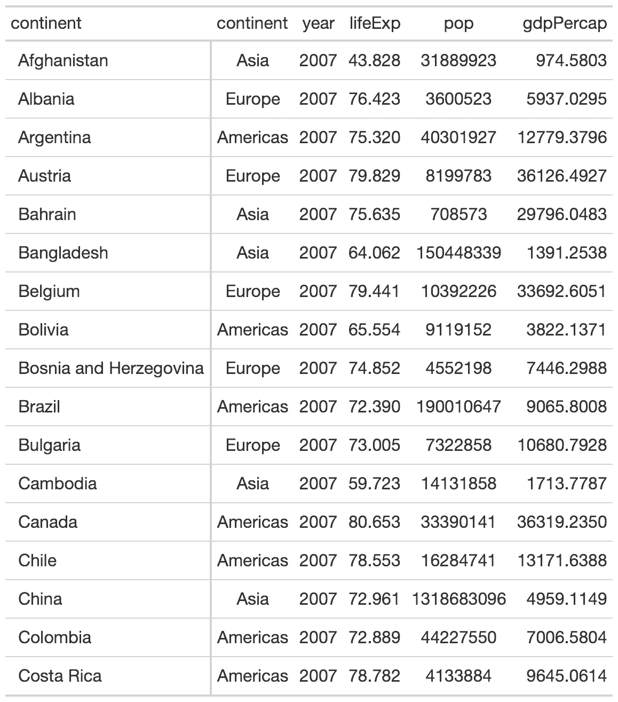

标准 gt 输出(图片由作者提供)

## **3.1 添加分组列**

这可能与您的大多数数据框无关。然而，我想展示这是如何工作的，这将有助于更好地理解你的表。为此，我将列 continental 作为分组列传递，并将 country 列指定为行标签列。

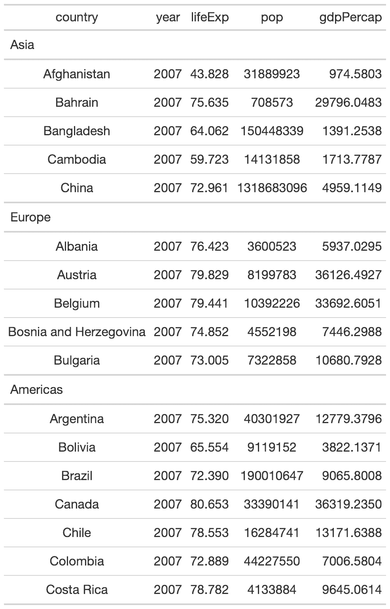

添加分组列(图片由作者提供)

## **3.2 添加汇总行**

下面的代码允许我们添加汇总行。摘要可能包含的内容由你决定，并对你的听众有价值。我决定添加函数 sum、average 和 standard deviation。虽然不是所有的汇总函数对这个数据集都有意义，但我想展示如何实现它们。

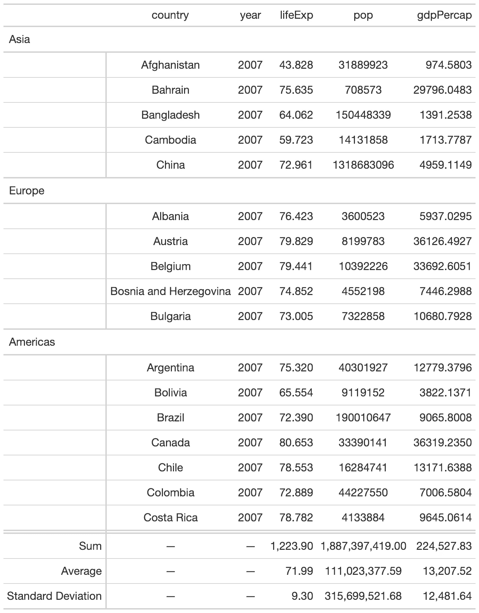

添加汇总行(作者图片)

## **3.3 更改每列的标签**

我相信你在你的项目中也经历了这一点。如何给你的栏目贴标签？您的数据框通常使用技术名称(即，不含空格的短名称)，但也有对受众有意义的功能名称。Gapminder 数据集中的一个例子是真正代表“预期寿命”的列 lifeExp。gt 包允许我们在不改变数据集的情况下改变结果表的标签。

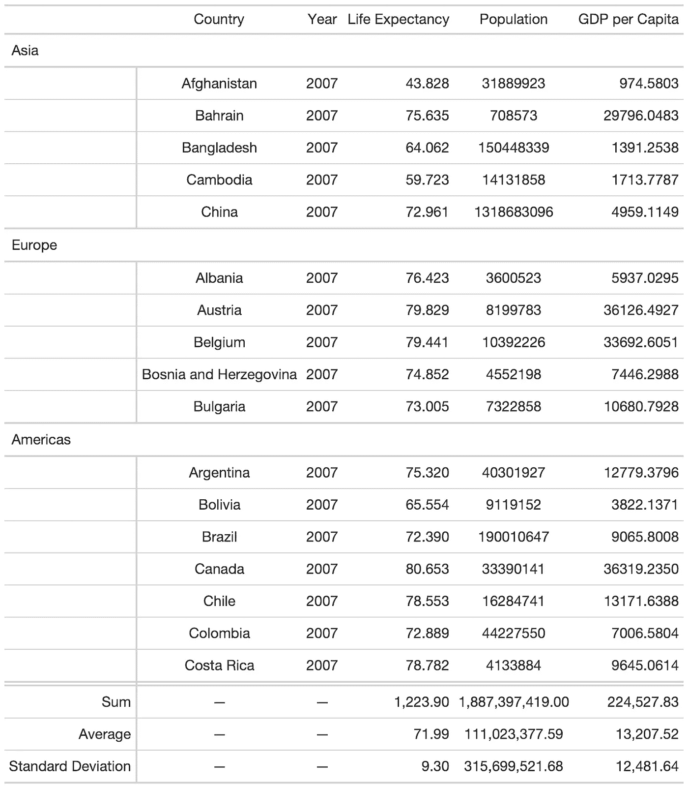

更改标签名称(图片由作者提供)

## **3.4 格式化列**

格式化列包括几个方面。在这个例子中，我告诉包区分数字和货币列，它们的对齐方式，以及它们应该有多少空间(px)。opt_row_striping()函数创建带状行，以提高表格的可读性。

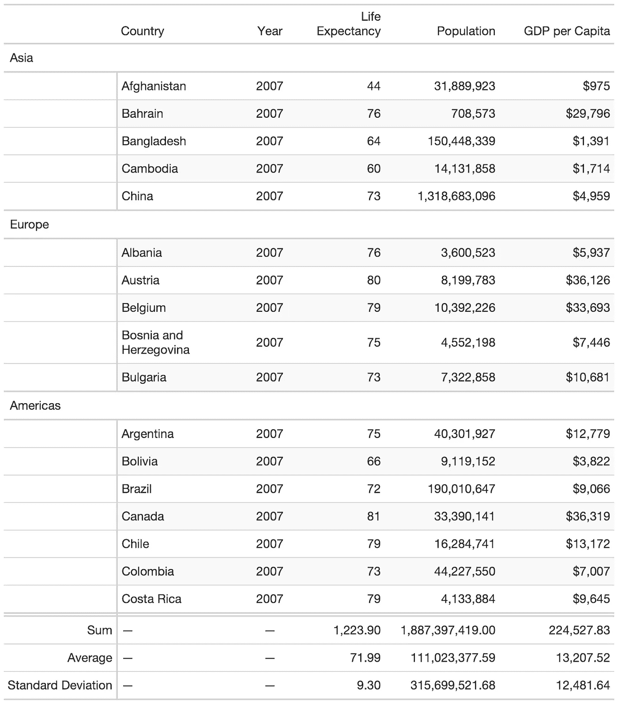

格式化列(图片由作者提供)

## **3.5 添加标题、脚注和来源**

如果您计划将所有相关的元信息作为表布局的一部分，gt 包将会帮助您。尤其是脚注的可能性是有益的，因为你可以对它应用一个函数。在下面的例子中，将为人口最少的国家添加一个脚注。请注意，可以使用 md 函数使用标记来修改文本布局。

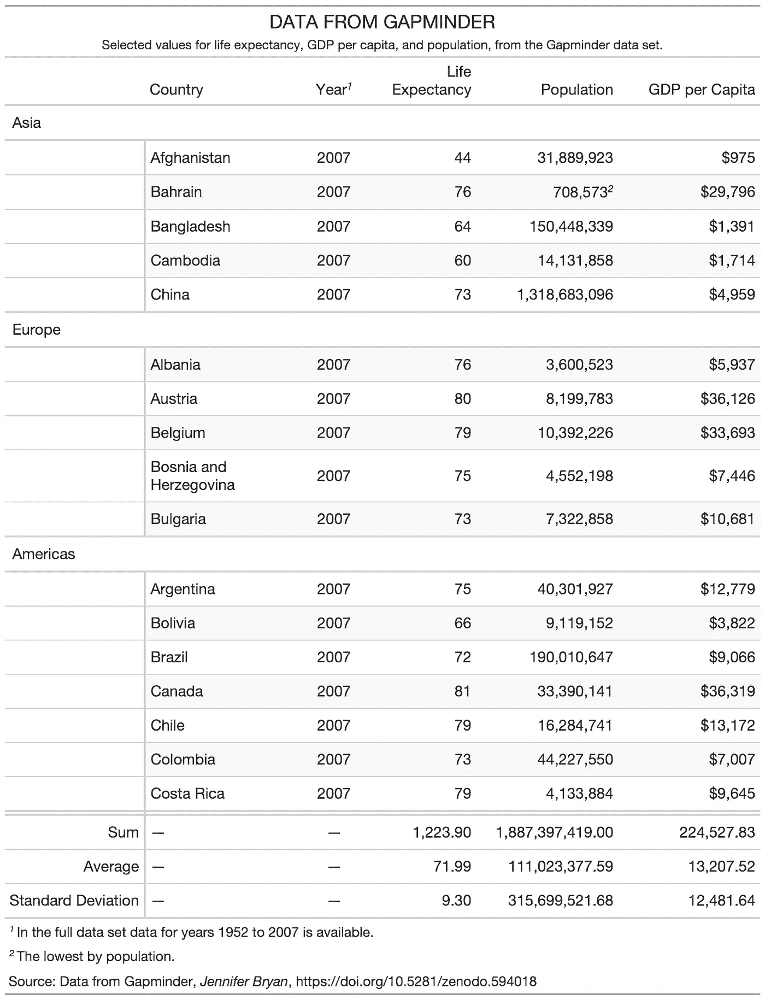

添加标题、脚注和来源(图片由作者提供)

## **3.6 对表格应用格式**

这是一个相当长的问题，但是我希望代码能够解释这里可能会发生什么。请注意，我使用了函数 [tab_options()](https://gt.rstudio.com/reference/tab_options.html) 以及 [tab_style()](https://gt.rstudio.com/reference/tab_style.html) 。tab_options 看起来像是操纵一般的设置，而 tab_style 用于更具体的位置。请分享你的想法来简化下面的代码。非常感谢。

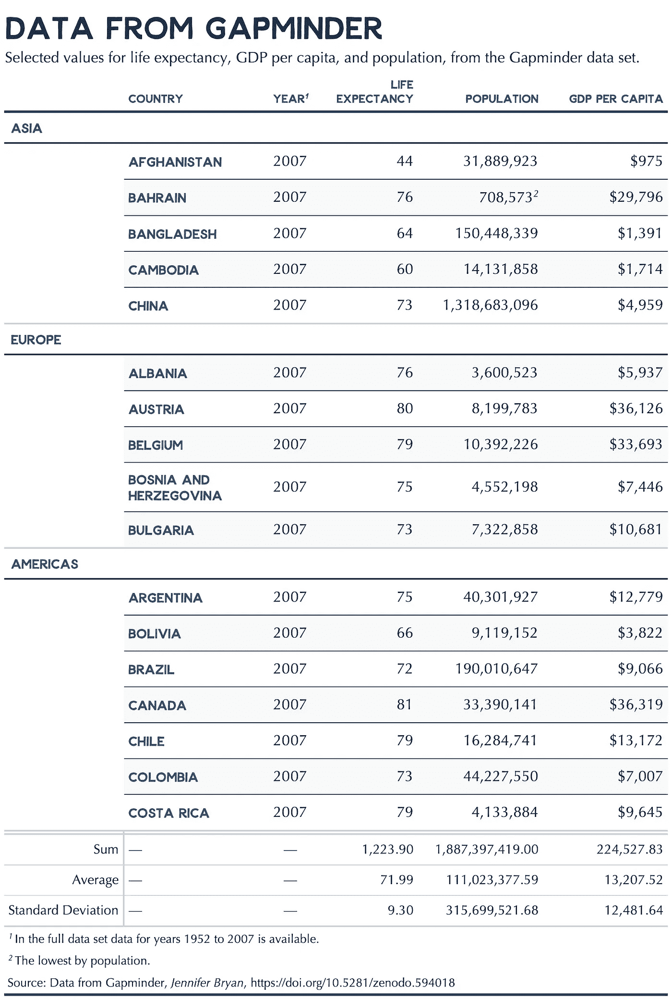

将格式应用于表格(图片由作者提供)

## **3.7 应用条件单元格着色**

gt 包的另一个有用的特性是基于值给单元格着色的能力。在下面的例子中，我将以两种不同的方式使用它。首先，我想为第一个中的“预期寿命”一栏应用蓝色底纹。为此，我将使用名为 c_col 的调色板，它在开始时被指定为常量之一。

我想用第二种方法将人口最少的行涂成蓝色。

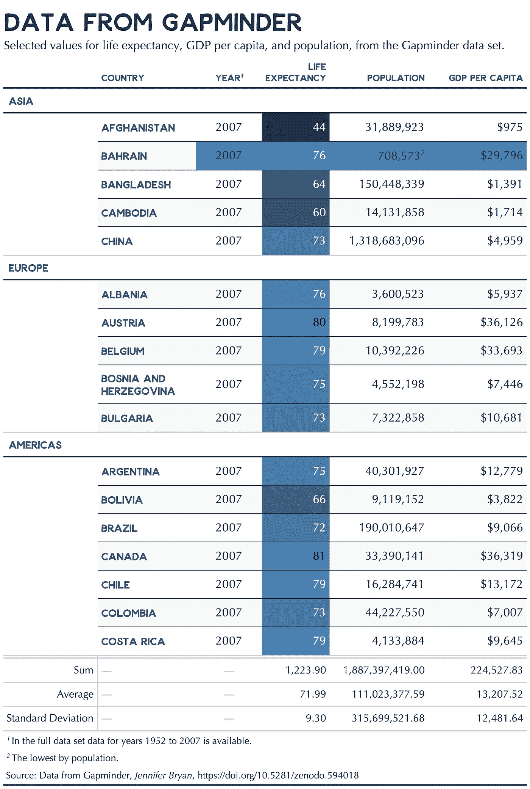

应用条件单元格颜色(图片由作者提供)

# **4 创建可重复使用的 gt 主题**

为了创建一个主题，我需要理解如何区分与外观相关的设置和与特定于数据的列相关的设置(这将随着每个数据集而改变)。为了展示这一点，我将使用数据集“每日标准普尔 500 指数数据”，它是 gt 包的一部分。

## **4.1 从 S & P 数据集**创建一个 gt 表

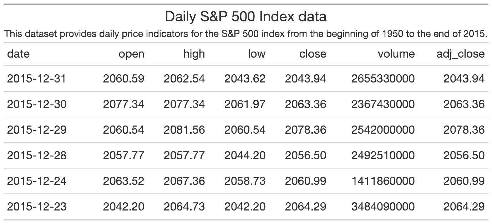

标准 gt 表输出(图片由作者提供)

## **4.2 创建主题**

我创建了一个函数 **my_theme()** ，它可以快速应用于你的任何 gt 表。

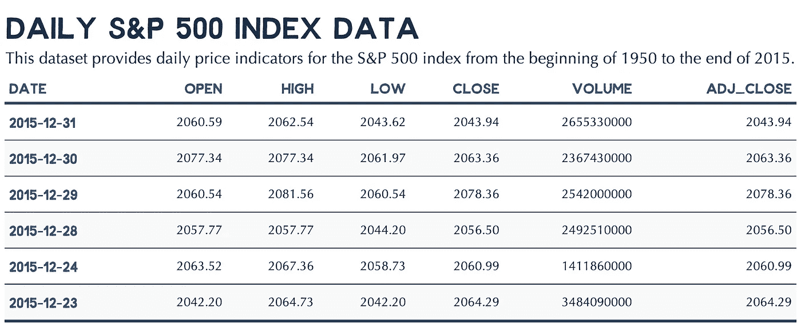

主题 gt 表输出(图片由作者提供)

请注意，这个主题是用我有限的知识构建的。因此，请分享如何改进和简化这段代码的想法。非常感谢。

## **4.3 应用特定于列的格式**

剩下的步骤是格式化特定于 S&P 的列。首先，我用货币格式指定列。

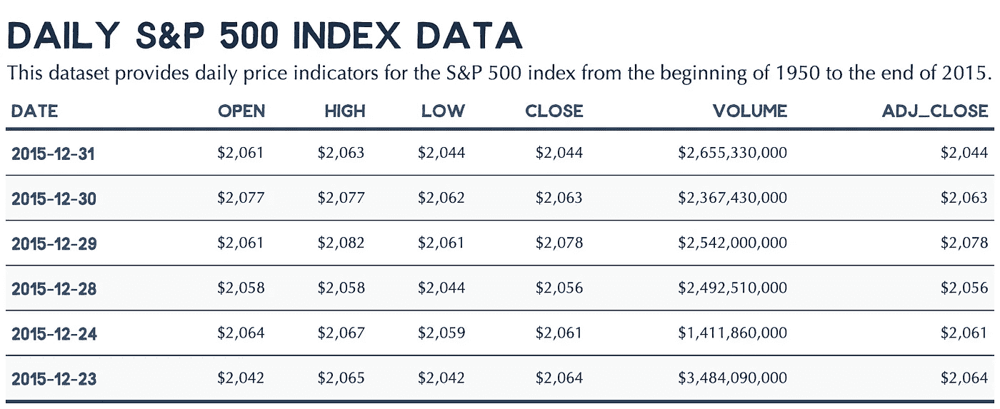

格式化列(图片由作者提供)

最后，我向表中添加汇总行，包括平均值和标准偏差。

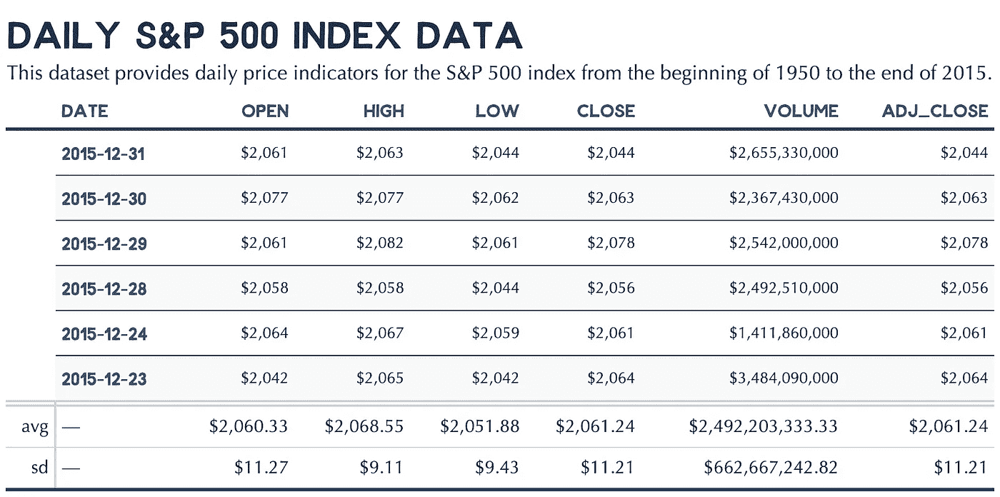

添加了汇总行(图片由作者提供)

# **5 结论**

在本文中，我向您介绍了 [gt 包](https://gt.rstudio.com/index.html)。然后，我向您展示了如何格式化表格、包含汇总行以及应用条件单元格格式。此外，我解释了如何创建一个单独的主题，您可以在每个数据项目中重用它。

请注意，我只是触及了 gt 包的表面。此外，我的知识可能有限，有更好的方法用更少的代码实现这些结果。如果你有兴趣，请接触其他教程，进一步教育自己。我很高兴与下面的列表分享伟大的教程:

*   [http://www . danieldsjoberg . com/gt-and-gt summary-presentation/# 1](http://www.danieldsjoberg.com/gt-and-gtsummary-presentation/#1)
*   [https://themockup.blog/static/slides/intro-tables.html#1](https://themockup.blog/static/slides/intro-tables.html#1)
*   [https://malco . io/2020/05/16/replication-an-nyt-table-of-Swedish-covid-deaths-with-gt/](https://malco.io/2020/05/16/replicating-an-nyt-table-of-swedish-covid-deaths-with-gt/)
*   [https://themockup . blog/posts/2020-05-16-gt-a-grammer-of-tables/](https://themockup.blog/posts/2020-05-16-gt-a-grammer-of-tables/)

> 你怎么看？你有什么反馈给我吗？

如有任何问题和意见，请随时联系我。谢谢你。