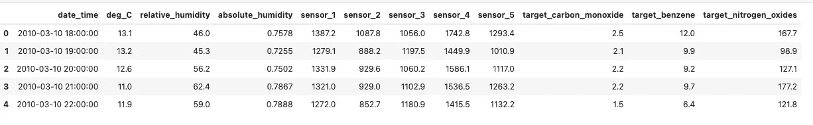
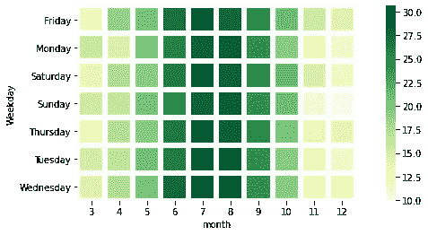
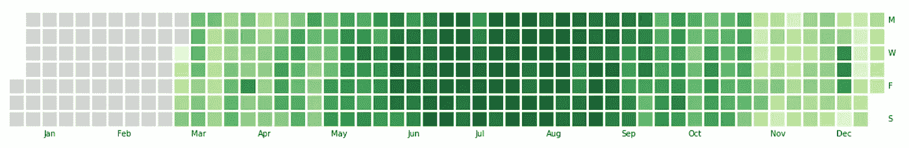
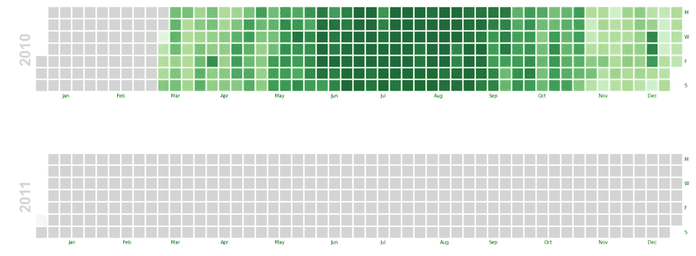

# 为您的时间序列数据创建 GitHub 的风格贡献图

> 原文：<https://towardsdatascience.com/create-githubs-style-contributions-plot-for-your-time-series-data-79df84ec93da?source=collection_archive---------18----------------------->

## 让您的热图脱颖而出


墙上的另一块砖|作者图片

Github 贡献图显示了您在过去一年中对存储库的贡献。一张填满的贡献图不仅看起来赏心悦目，还表明了你的努力工作(除非你已经黑了它)。图表虽然漂亮，但也显示了关于你的表现的大量信息。然而，如果你仔细观察，它只是一个显示一些时间序列数据的热图。因此，作为一项周末活动，我试图复制一些基本时间序列数据的图表，通过本文与您分享这一过程。

# 数据集和一些预处理

我将在本文中使用的数据集来自 Kaggle 上的表格游乐场系列(TPS)竞赛。TPS 竞赛为期一个月，于每月 1 日开始。我将使用 TPS — [**七月版竞赛**](https://www.kaggle.com/c/tabular-playground-series-jul-2021/data) 中的数据集。

> 数据集是基于时间序列的数据，其任务是根据基本天气信息(温度和湿度)和 5 个传感器的输入值，预测空气污染测量值随时间的变化。

让我们导入基本库并在 pandas 中解析数据集。

```
import pandas as pd
import numpy as np
import datetime as dt
from datetime import datetimedata = pd.read_csv(‘train.csv’, parse_dates=[‘date_time’])
data.head()
```



时间序列数据集

对于我们的目的来说，这是一个相当不错的数据集。我们开始工作吧。

# 使用 Seaborn 库创建基本热图

[Seaborn](https://seaborn.pydata.org/) 是 Python 中的统计数据可视化库。它基于 matplotlib，但是有一些很棒的默认主题和绘图选项。从技术上讲，创建热图本质上是用颜色替换数字。更准确地说，这意味着将数据绘制成颜色编码的矩阵。让我们看看如何通过代码实现这一点。但在此之前，我们必须将数据转换成所需的格式

```
#Importing the seaborn library along with other dependenciesimport seaborn as sns
import matplotlib.pyplot as plt
import datetime as dt
from datetime import datetime# Creating new features from the datadata['year'] = data.date_time.dt.year
data['month'] = data.date_time.dt.month
data['Weekday'] = data.date_time.dt.day_name()
```

对数据进行子集化，只包含`year 2010` ，然后丢弃除了`month`、`weekday`、`and`、`deg_C.`之外的所有列，然后我们将旋转数据集，得到一个类似矩阵的结构

```
data_2010 = data[data['year'] == 2010]
data_2010 = data_2010[['month','Weekday','deg_C']]pivoted_data = pd.pivot_table(train_2010, values='deg_C', index=['Weekday'] , columns=['month'], aggfunc=np.mean) 
```

由于我们的数据集已经以矩阵的形式存在，现在用 seaborn 绘制热图只是小菜一碟。

```
plt.figure(figsize = (16,6))
sns.heatmap(pivoted_data, linewidths=5, cmap='YlGn',linecolor='white', square=True)
```



使用 Seaborn 库创建的热图|图片由作者提供

热图显示了 2010 年的平均温度(摄氏度)。我们可以清楚地看到，7 月是当年最热的一个月。为了模拟 Github 的贡献图，使用了一些参数:

*   pivoted_data:使用的数据集
*   线宽:分隔每个单元格的线的宽度。
*   线条颜色:划分单元格的线条的颜色
*   方形:确保每个单元格都是方形的

这是一个很好的尝试，但仍有改进的余地。我们还没有接近 Github 的贡献图。让我们用另一个库再试一次。

# 使用 calmap 创建日历热图

Python 中有一个名为 [calmap](https://pythonhosted.org/calmap/) 的专用库，而不是对 seaborn 进行修补。它根据 Github 贡献图中的时间序列数据创建了漂亮的日历热图，而且只用了一行代码。

```
#Installing and importing the calmap library
pip install calmap#import the library
import calmap
```

我们将使用与上一节相同的数据集，并使用`yearplot()`方法来绘制。

```
#Setting the date_time column as the index
data = data.set_index('date_time')#plotting the calender heatmap for the year 2010
plt.figure(figsize=(20,10))
calmap.**yearplot**(data['deg_C'], cmap='YlGn', fillcolor='lightgrey',daylabels='MTWTFSS',dayticks=[0, 2, 4, 6],
                linewidth=2)
```



使用 calmap 库创建的热图|图片由作者提供

上面，我们已经定制了`color`、`linewidth`和`fillcolor`，即在没有数据的日子里使用的颜色。您可以根据需要设置这些值。更多信息可从[文档](https://pythonhosted.org/calmap/#module-calmap)中获得。

也可以使用`[**calendarplot()**](https://pythonhosted.org/calmap/#calmap.calendarplot) method.`将所有年份作为支线剧情绘制成一个图形

```
fig_kws=dict(figsize=(20, 10)
```



带有 calmap 库的 Calenderplots 按作者分类的图像

如你所见，2011 年的数据并不多，但我相信你已经有了想法。

# 包裹

热图是有用的可视化工具，通过使用颜色提供深度透视来帮助传达模式。它有助于可视化矩阵的两个维度之间的值的集中，这对人眼来说比单纯的数字更明显。这篇文章向你展示了如何让你的热图变得更明亮、更生动，并在创建热图时获得乐趣。