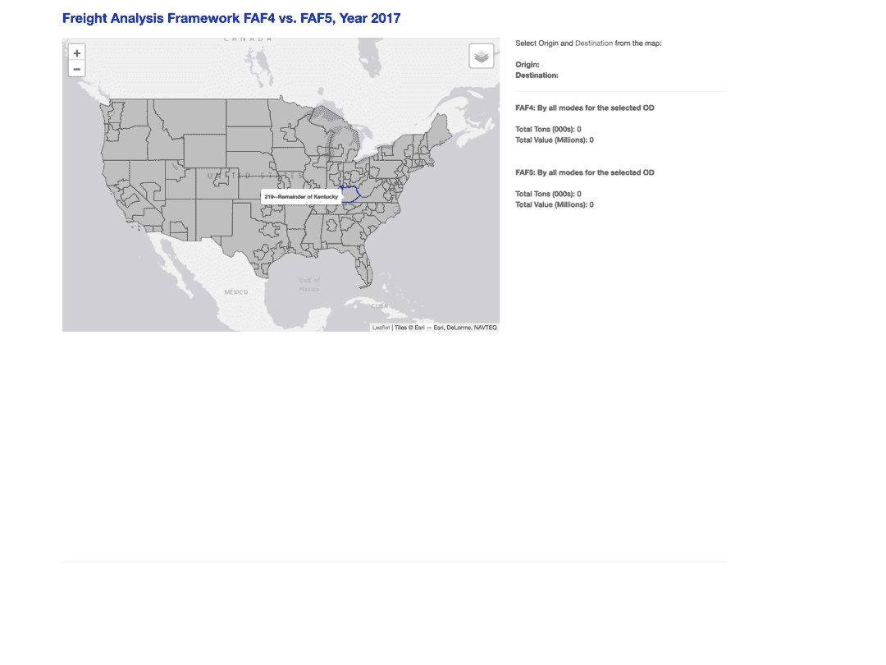
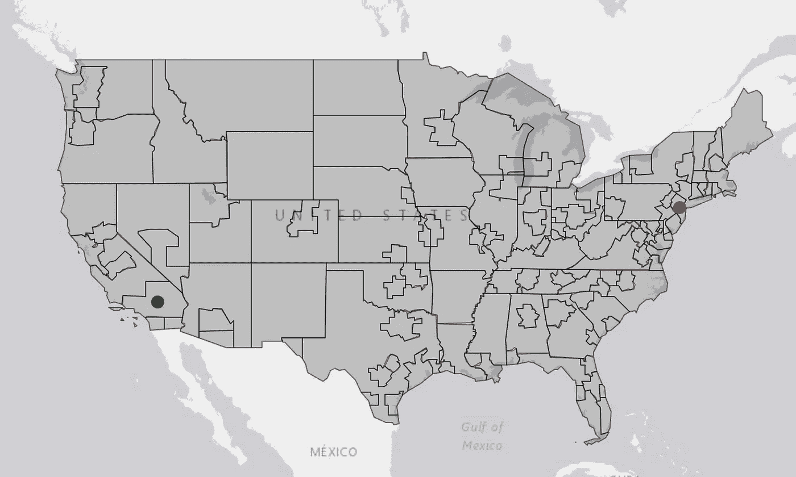
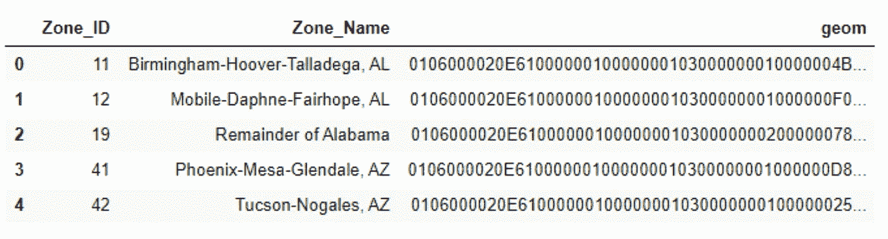
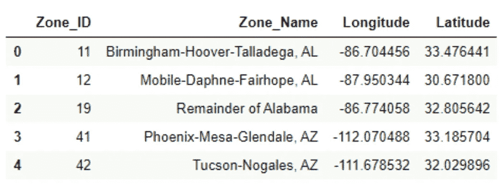
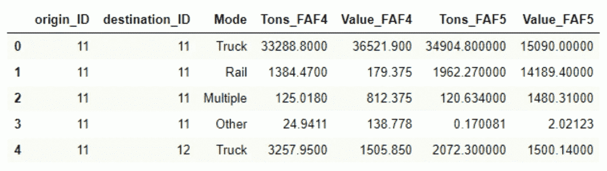
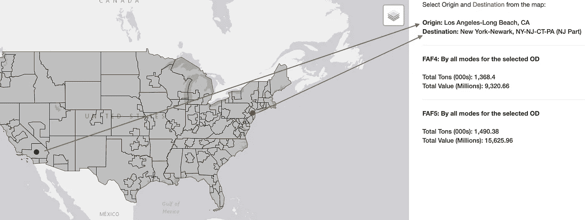
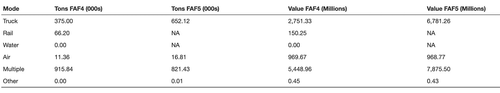
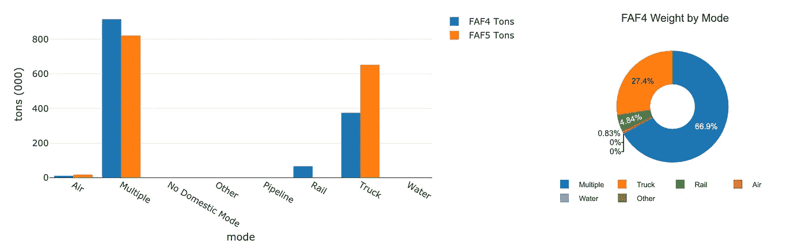

# 在 R and R 创建交互式地图应用程序，探索地理空间数据

> 原文：<https://towardsdatascience.com/create-interactive-map-applications-in-r-and-r-shiny-for-exploring-geospatial-data-96b0f9692f0f?source=collection_archive---------0----------------------->

## 使用地图进行输入选择的 Web 应用程序



作者制作的动画

数字所能讲述的重要故事通常与地点有关。地理空间数据(或空间数据，也称为地理数据)是指由地理位置指示或与地理位置相关的任何数据( [REF](https://www.omnisci.com/learn/geospatial) )。地理空间数据将地址、邮政编码或区域等位置信息与和该位置相关联的相应属性信息相结合。

对于大多数人来说，如果不使用地图，很难探索地理空间数据。通过这个应用程序，我们展示了如何使用 R and R Shiny 创建一个免费的开源(FOSS)解决方案，允许用户与地理空间数据进行交互，并使用交互式地图快速找到他们想要看到的内容。

# Web 应用程序设计

我们选择使用 [**运费分析框架**](https://ops.fhwa.dot.gov/freight/freight_analysis/faf/)【FAF】数据进行本次论证。FAF 是一个公共数据源，提供各州和主要大都市地区之间所有运输方式的货运流量的估计和预测。

与 FAF 数据相关联的地理信息被定义为区域。在**美国大陆地区**总共有 129 个 FAF 区，每个区都可以是起点区或终点区。换句话说，有 129×129 个可能的始发地-目的地区域对组合。

用户可以浏览他们选择的任何始发地和目的地区域对之间的货运数据。该工具提供了一种直观的方法，用户可以直接从地图上选择一个区域，同时获得区域的位置、大小和边界信息，而不是从 129 个区域的长列表中选择一个区域。



运费分析框架区域(图片由作者提供)

用户可以通过点击区域直接从地图上选择始发地和目的地区域来选择他们想要查看的数据。他们可以放大、缩小或平移地图来查找感兴趣的区域。

如果单击原点，原点区域的质心将显示为绿色。如果单击目标区域，目标区域的质心将显示为红色。我们将在本文后面解释当选择一个区域时，如何确定区域类型(即起点和终点)。

一旦选择了始发地和目的地区域，应用程序后端的 R 脚本将查询 FAF 数据，并将结果显示为所选始发地-目的地区域对的数据表和图表。

我们将一步一步地解释这个 web 应用程序的实现，如下所示:

1.  R and R 闪亮简介
2.  布局用户界面(UI)
3.  设置服务器以生成输出
4.  免费发布闪亮的应用

*注:这篇文章的代码和数据可以在*[*this GitHub repo*](https://github.com/shi093/Map-Freight-Analysis-Framework)*找到。*

# 1.R and R 闪亮简介

r 是一种用于统计计算和图形的语言和环境。R 的优势之一是可以很容易地制作出设计良好的出版物质量的情节。([参考](https://www.r-project.org/about.html)

Shiny 是 R 的一个 web 应用程序框架，它结合了 R 的计算能力和现代 web 的交互性。Shiny 为开发者提供了卓越的能力来创建 web 应用程序，这些应用程序可以使用你自己的服务器或 Shiny 的托管服务来部署。

## 闪亮应用的结构

Shiny app 是一个目录，包含两个 R 脚本，即`ui.R`和`server.R` 以及其他输入到 app 的文件。

`ui.R`控制应用程序的布局和外观，并在闪亮的应用程序中创建用户界面。它通过接受用户输入并在屏幕上动态显示生成的输出来为应用程序提供交互性。

`server.R`包含构建应用程序逻辑的指令，因此它就像是应用程序的大脑。它将用户的输入转换成想要的输出，如表格和图表，显示在屏幕上。

或者，Shiny app 可以由一个名为`app.R`的文件组成，该文件包含 UI 和服务器组件。一个只有一个文件(即`app.R`)的闪亮应用的基本结构如下所示:

```
library(shiny)ui <- fluidPage(
  # front end interface
)server <- function(input, output, session) {
  # back end logic
}shinyApp(ui = ui, server = server)
```

保持两个独立的 R 文件，即`ui.R`和`server.R` *、*通常被认为是一个好的实践，特别是对于较大的应用程序，具有独立的`ui.R`和`server.R`文件使得代码更容易管理。

# 2.布局用户界面(UI)

首先，我们将所有需要的库加载到应用程序中。应用程序界面通常使用`fluidPage` 创建，这样可以确保页面根据每个设备的分辨率动态布局( [REF](https://www.analyticsvidhya.com/blog/2016/10/creating-interactive-data-visualization-using-shiny-app-in-r-with-examples/) )，这样应用程序界面可以在不同屏幕分辨率的不同设备上流畅运行。

我们使用`fluidRow`和`column`从网格系统构建我们的定制布局。行由`fluidRow()`函数创建，包括由`column()`函数定义的列( [REF](https://shiny.rstudio.com/articles/layout-guide.html) )。

我们还使用 Shiny 的 HTML 标签函数为用户界面添加内容，比如`br, div, span, HTML`等。这些功能与常见的 HTML5 标签相似。

使用`span()`函数添加的应用程序“运费分析框架 FAF4 vs. FAF5，2017 年”的标题显示在界面顶部，后面是一个`fluidRow()`，左边是一个名为“Zone”的地图，右边是一组静态(如`span("select")`)和动态文本输出(如`htmlOutput("od_info")`)。

闪亮的应用程序包含输入和输出对象。输入允许用户通过修改他们的值与应用程序交互(我们将在后面讨论输入对象)。输出是显示在应用程序中的对象([参考](https://www.paulamoraga.com/book-geospatial/sec-shinyexample.html))。输出对象总是与渲染函数配合使用，例如:

```
ui <- fluidPage(
  leafletOutput("Zone")
)server <- function(input, output, session) {
  output$Zone <- renderLeaflet({
    # generate the map
  })
}
```

在`ui`中我们使用`leafletOutput()`，在`server()`中我们使用`renderLeaflet()`。在`renderLeaflet()`中，我们写下返回传单地图的说明。

此应用程序中显示的输出对象类型包括:

***活页*** 用于创建交互式地图，如`leafletOutput("Zone")`

***html*** 用于将反应输出变量显示为 html，如`htmlOutput("od_info")`

***DT*** 用于显示交互表格中的数据，如`DT:dataTableOutput("od_vol")`

***plotly*** 用于创建与数据交互的图形，如`plotlyOutput("od_ton_chart”)`

# 3.设置服务器以生成输出

## 导入数据文件

数据文件与 R 文件位于相同的位置。我们使用`read.csv()`函数读取 CSV 文件(`centroid.csv``od_mode_vol_45.csv`*)*，使用 **rgdal** 包的`readOGR()`函数读取 FAF 区域的 shape file(`faf4_zone2.shp`)。

区域 shapefile 中的每个要素都是一个多边形。以下是 shapefile 中属性数据的示例。表中的每一行都用区域 ID、区域名称和几何定义了一个多面要素(即区域)。



来自 faf4_zone2 的数据示例(图片由作者提供)

`centroid.csv`中的每一行用区域 id、区域名称、经度和纬度定义了一个 FAF 区域质心(即区域的中心位置)。注意`centroid.csv`中的区域 ID 和区域名称与 shapefile 中的对应。因此，我们可以使用区域 ID 作为从区域多边形到区域质心的关键字，反之亦然。



数据示例来自 centroid.csv(图片由作者提供)

`od_mode_vol_45.csv` 包含每个始发地-目的地区域对(使用区域 id 定义)按运输方式(如卡车、铁路、水路、航空等)计算的重量和价值的货运数据。此文件中的数据是从原始的 FAF 版本 5 (FAF5)数据和 FAF 版本 4 (FAF4)数据设计而来的。

FAF5 数据提供 2017 年*的货运走势预估；而 FAF4 数据提供了 2017 年 ***的货运预测*** 。该应用程序比较了每个始发地-目的地对的 FAF5 与 FAF4 的 2017 年数据。*

*文件`od_mode_vol_45.csv`中的起点 ID 和终点 ID 对应于`centroid.csv` 和`faf4_zone2.shp`中的区域 ID 字段。*

**

*数据样本来自 od_mode_vol_45.csv(图片由作者提供)*

## *使用全局变量来跟踪区域选择*

*让我们先解决房间里的大象。应用程序需要判断点击(或选择)的区域应该是起始区域还是目标区域。*

*我们假设当用户开始使用应用程序时，第一个点击的区域将是源区域，第二个点击的区域将是目标区域。*

*然而，如果用户希望通过选择另一对始发地和目的地区域来继续使用该应用程序，该怎么办？如果用户在地图上不断点击，不断改变选择怎么办？*

> *为了解决这个问题，我们需要跟踪用户点击地图的总次数。*

*下面的**全局变量**用于跟踪用户的区域选择动作。因为我们需要在不同的函数中访问和改变这些变量的值，所以有必要将这些变量定义为全局变量。*

```
*click_count <- 0
type <- 0
origin <- ""
dest <- ""
origin_id <- 0
dest_id <- 0*
```

*   *变量`click_count`用于跟踪自会话开始以来地图上的累计点击次数。 ***注意其初始值设为 0*** 。*
*   *变量`type`用于将`click_count`转换为区域类型，即始发地区域或目的地区域。它的值由模数`click_count`乘以 2 计算得出:*

```
*# with click_count initiated with value 0type <<- click_count%%2if (type ==0 ){
  # treat as origin zone
}     
if (type == 1){
  # treat as destination zone
}# add one to the accumulative map click counts
click_count <<- click_count+1*
```

> *上面的代码将被嵌入到一个函数中，要改变函数内部全局变量的值，我们需要使用**全局赋值**操作符`<<-`。当使用赋值运算符`<<-`时，该变量属于全局范围。*

*   *变量`origin`和`dest`用于存储所选始发地和目的地区域的描述性区域名称。*
*   *变量`origin_id`和`dest_id`用于存储所选起点和终点区域的区域 id。*

## *Shiny 中的反应式编程*

*Shiny 使用一个**反应式编程模型**来简化 R-powered web 应用程序的开发。Shiny 从用户界面获取输入，用 ***监听变化，观察*** 或 ***无功。****

*反应源通常是通过浏览器界面的用户输入。我们通过在构建输出的`server()`中的反应表达式(如`render*()`和`reactive()`函数)中包含输入`input$variable_selected` 的值来创建反应。当输入发生变化时，所有依赖于输入的输出都将使用更新后的输入值自动更新(或重建)。*

****传单*** 当用户与地图和对象交互时，它们会将输入值(或事件)发送到 Shiny。对象事件名称通常使用这种模式:*

> *输入$MAPID_OBJCATEGORY_EVENTNAME*

*对于`leafletOutput("Zone")`，点击其中一个多边形形状(即 FAF 区)将在`input$Zone_shape_click`更新闪亮的输入。*

*点击事件被设置为 NULL(如果该事件从未发生过),或者 list()包括:对象的纬度和经度是可用的；否则，鼠标光标；和 layerId，如果有的话。*

*在我们的例子中，基于区域 Id 的 *layerId* 字段包含在多边形对象中；因此区域 ID 的值将在`input$Zone_shape_click`事件的*事件$Id* 中返回。*

```
*addPolygons(data=zone.rg, col="black", weight = 1, **layerId = ~id**, label = zone_labels, highlight = highlightOptions(color = "blue",weight = 2, bringToFront = F, opacity = 0.7))*
```

*我们希望应用程序的服务器端对地图上的点击做出响应，所以我们需要创建反应式表达式，使用`reactive()`函数来结合用户的选择。使用`reactive()`函数也有助于减少代码中的重复。*

*`selected_zone()`返回点击(或选择)区域的质心。*

```
*selected_zone <- reactive({
      p <- input$Zone_shape_click
      subset(centroid, id==p$id )
    })*
```

*`selected_od()`返回所选始发地-目的地区域对的信息(包括区域名称和区域 id)。请注意，它会一直等待，直到选择了起始区域和目标区域才返回值。*

**如果选择了一个新的原点区域，上一轮选择的目的区域将被重置。**

```
*selected_od <- reactive({
      p <- input$Zone_shape_click
      # return selected origin-destination zone pair
    })*
```

## *使用带光泽的传单*

****传单*** 是最流行的用于交互式地图的开源 JavaScript 库之一。 ***活页*** 包装包含强大而方便的功能，可与闪亮的应用程序集成([参考](https://rstudio.github.io/leaflet/shiny.html))。可以通过以下基本步骤创建传单地图:*

1.  *通过调用 leaflet()创建地图小部件*
2.  *通过使用图层功能(例如，添加切片、添加标记、添加多边形)来修改地图微件，将图层(即，要素)添加到地图中。*
3.  *根据需要重复步骤 2。*
4.  *打印地图微件以显示它。*

```
*output$Zone <- renderLeaflet({
  # create zone labels
  # create map widget called m
  # add base map and the FAF zone polygon layer
})*
```

*观察者使用热切评估策略，即一旦他们的依赖关系改变，他们就调度自己重新执行。*

*现在我们更新`input$Zone_shape_click`对应的地图。当`input$Zone_shape_click`改变时，观察器将自动重新执行。*

```
*observe({
      p <- input$Zone_shape_click # get input value
      if (is.null(p))             
        return()

      m2<-leafletProxy("Zone", session = session) # get map widget

      # create zone labels

      selected <- selected_zone() # get selected zone centroid
      # create selected zone label

      type <<- click_count%%2
      if (type ==0 ){ 
        # clear the centroids displayed
        # add a marker, the centroid of the new origin zone
      }

      if (type == 1){
        # add a marker, the centroid of the new destination zone
      }
      click_count <<- click_count+1    # keep track of map clicks
    })*
```

*首先获取所选区域，并使用前面解释的逻辑确定所选区域是源区域还是目标区域。通过显示所选区域的质心来更新地图，并对起点和终点使用不同的颜色。*

> *为了修改页面中已经运行的地图，我们使用了`leafletProxy()`函数来代替`*leaflet()*`调用。*

*通常我们使用`leaflet`来创建地图的静态方面，使用`leafletProxy`来管理动态元素，这样就可以在点击时更新地图，而不用重新绘制整个地图。关于如何使用该功能的详细信息，请参见 [RStudio 网站](https://rstudio.github.io/leaflet/shiny.html)。*

## *添加输出*

*现在，我们在 Shiny 应用程序中显示数据，包括几个用于交互式可视化的输出。*

*`output$od_info` 对象是无功端点，它使用无功源`input$Zone_shape_click`。每当`input$Zone_shape_click`改变时，`output$od_info`被通知需要重新执行。此输出动态显示选定的源区域和目标区域的名称。*

**

*od_info 的输出(图片由作者提供)*

*我们使用 R package **DT** 将数据对象(矩阵或数据框)显示为 HTML 页面上的表格。在`output$od_vol`中，我们首先通过`selected_od()`获取所选始发地和目的地区域的信息，然后过滤`od_mode_vol`中存储的 FAF 数据，以获取所选始发地和目的地区域对的结果。*

**

*所选始发地和目的地区域对的 FAF 数据比较(图片由作者提供)*

*除了将查询结果显示为数据表之外，我们还使用条形图和圆环图来显示结果。*

**

*作者图片*

*我们使用`renderPlotly()`函数来渲染一个反应式表达式，该表达式根据输入值`input$Zone_shape_click` 到`selected_od()` *生成**图形。****

***要制作一个圆环图，使用`add_pie()`函数的`hole=` 参数设置要从饼图中切掉的半径的分数。该值可以在`0.01`和`0.99`之间。***

# ***4.免费发布闪亮的应用***

****Shinyapps.io* 是一款软件即服务(SaaS)产品，用于在云中托管闪亮的应用。RStudio 负责托管应用程序和维护服务器的所有细节，因此我们可以专注于编写应用程序。***

***一个闪亮的应用程序可以在几分钟内部署到 shinyapps.io 上。只要按照这个详细的[一步一步的指示](https://shiny.rstudio.com/articles/shinyapps.html#:~:text=Shinyapps.io%20is%20an%20online,focus%20on%20writing%20great%20apps!&text=Use%20the%20tokens%20generated%20by,to%20configure%20your%20rsconnect%20package.)就可以了。***

****Shinyapps.io* 提供免费和付费计划。通过免费计划，您可以同时部署多达 5 个闪亮的应用程序，并且每月有多达 25 个小时的活动时间由该帐户下托管的所有应用程序共享。***

***<https://huajing-shi.medium.com/membership>  

r 代码和输入数据可从 my [GitHub repo](https://github.com/shi093/Map-Freight-Analysis-Framework) 获得。*** 

## ***参考***

1.  ***[闪亮应用的基本组成部分](https://shiny.rstudio.com/articles/basics.html)***
2.  ***[shiny apps . io 入门](https://shiny.rstudio.com/articles/shinyapps.html#:~:text=Shinyapps.io%20is%20an%20online,focus%20on%20writing%20great%20apps!&text=Use%20the%20tokens%20generated%20by,to%20configure%20your%20rsconnect%20package.)***
3.  ***[在 R 中使用闪亮的应用程序创建交互式数据可视化(带示例)](https://www.analyticsvidhya.com/blog/2016/10/creating-interactive-data-visualization-using-shiny-app-in-r-with-examples/)***