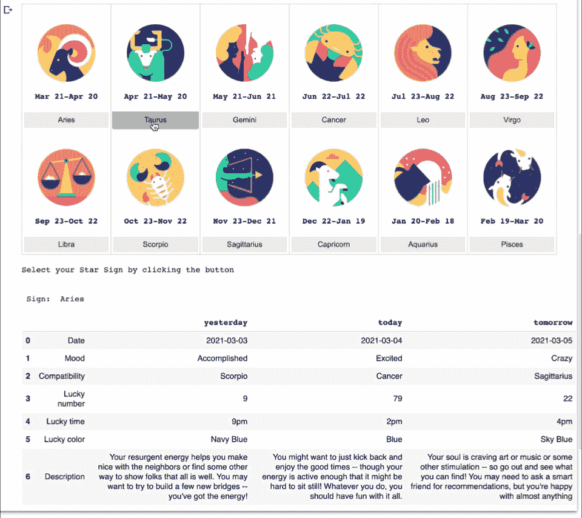
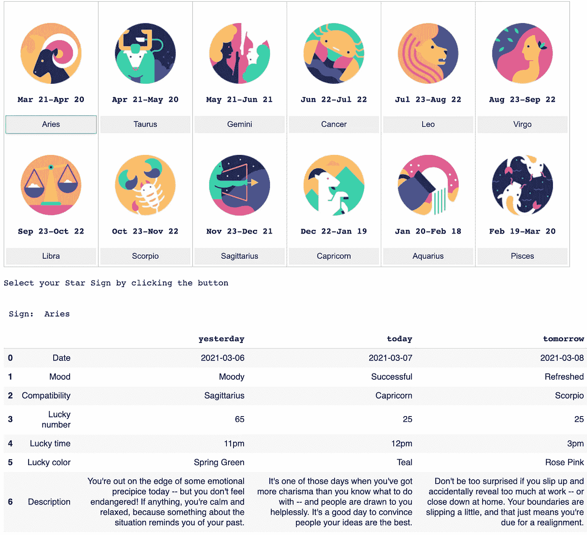

# 使用小部件在 Google Colab 中创建交互式工具

> 原文：<https://towardsdatascience.com/create-interactive-tools-in-google-colab-using-widgets-8a1a504d3b7e?source=collection_archive---------10----------------------->

## 一个 Python 应用程序，可以读取你的每日星象



作者制作的动画

在充满不确定性的时代，你不会想知道未来会怎样吗？让我们在学习如何用 Python 创建一个用户友好的工具来阅读你的每日星座运势的同时，停止担心，找点乐子吧。

作为编码练习，我设想在 Python 笔记本中创建一个交互式工具，如上面的动画所示。用户只需点击按钮，就可以很容易地看到不同的程序输入如何改变输出。

该程序将使用 Google Colab 来实现，以便更容易与最终用户共享，特别是那些没有编码和没有在他们的计算机上安装 Python 的用户。在我的[上一篇文章](/automate-data-preparation-using-google-colab-read-and-process-citi-bike-data-in-zip-file-2ab34dd33205)中，我解释了为什么我选择 Google Colab 进行 Python 编程。

# 程序设计

通过***的交互式图形用户界面为用户创造一种身临其境的、有趣的体验，我们可以将静态代码转化为探索的工具，让 Python 笔记本变得生动起来。***

***Python 中有一个有趣的库叫做 **PyAztro** ，它提供了太阳星座的星座信息。一旦指定一个标志名称，以及日期类型("昨天"、"今天"或"明天")，则 **pyaztro。Aztro()** 函数返回当天所选星座的相关信息，包括幸运数字、幸运颜色、心情、与其他太阳星座的兼容性以及描述等。每日占星读数每天在格林威治时间午夜(格林威治标准时间)更新，所以你每天都有新读数！***

***用户可以从日期范围标记的星座图像列表中选择一个太阳星座(或星星星座)，然后单击与该星座相关的按钮来获得星座读数。***

***该计划的实施可分为以下几个步骤:***

1.  ***安装缺失的 Python 库***
2.  ***从网上抓取星座图像***
3.  ***创建一个变量来保存星座图像和相应的日期范围***
4.  ***生成星座阅读工具的用户界面***

***这里可以下载笔记本[。](https://github.com/shi093/python_widget/blob/main/Daily_Horoscope.ipynb)***

# ***程序实现***

## ***第一步。在 Google Colab 中安装 Python 库***

```
*!pip install pyaztro*
```

*****PyAztro** 库默认不安装在 Colab 中，我们需要先安装。要在 Colab 中运行任何命令行脚本，您需要添加一个！在行首。***

## ***第二步。从网上抓取星座图像***

***为了获得标牌图像，我们从 **Python 图像库(PIL)** 中导入**图像**，并调用 ***Image.open()*** 来创建来自网站的图像文件的图像对象。使用 ***Image.open()*** 接收的图像对象，以后可以应用调整大小、裁剪、绘制或其他图像操作方法调用。***

## *****第三步。创建一个变量来保存星座图像和相应的日期范围*****

***创建一个列表变量来保存每个标志的数据，包括标志名称、图像对象和日期范围。***

## ***第四步。生成星座阅读工具的用户界面***

***为十二个太阳星座创建了十二个按钮的列表。来自 **ipywidgets 的 ***按钮小部件***(**也称为 jupyter-widgets 或简称为小部件)用于处理鼠标点击。*按钮的 ***on_click*** 方法可以用来*注册点击按钮时要调用的函数*。****

****点击按钮时，将调用 *on_button_clicked()* 函数，从 *pyaztro 中生成所选星座的星座读数。Aztro()* 。循环的*用于返回三天中每一天的符号读数，即昨天、今天和明天。*****

*******输出小部件*** 可以捕获并显示 **IPython 生成的 stdout、stderr 和 rich 输出。**输出可以直接*追加*或*从输出小工具中清除*。*为了避免在一系列按钮点击后累积输出，我们需要在显示新输出前清除先前的输出。***输出小部件**是 interact 的基础，因为它构成了如何实现 interact 和相关方法的基础。****

****为了让应用程序看起来对用户有吸引力，应用程序的组件(即图像、按钮和文本)的布局是一个需要考虑的重要因素。为了排列十二个标志图像、相应的日期范围和按钮，我们使用Colab 的布局小部件中的 ***网格*** ，这些小部件使*能够将未来的输出*重定向到布局中的特定位置。图像对象的大小被调整为适合布局。****

****这是这个占星阅读程序的界面:****

********

****作者图片****

****<https://huajing-shi.medium.com/membership>  

源代码:[GitHub 上的谷歌可乐笔记本](https://github.com/shi093/python_widget/blob/main/Daily_Horoscope.ipynb)**** 

****本文的灵感来自“蟒蛇的隐藏宝藏”****

****</hidden-treasures-of-python-78ae604f7e33> ****