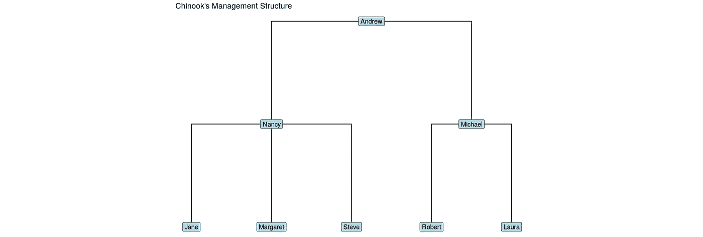
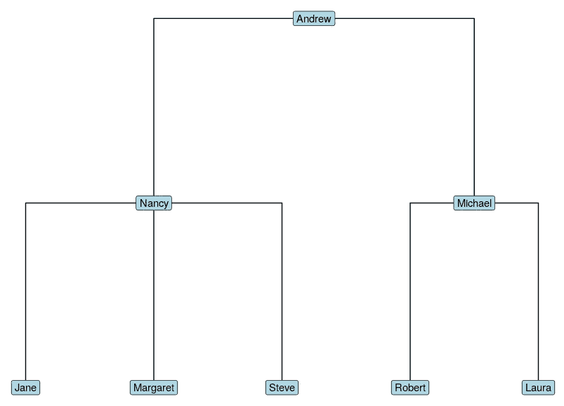
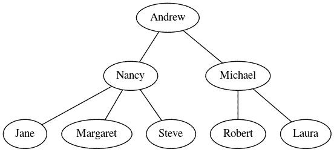

# 用几行代码创建组织图(5 分钟学习)

> 原文：<https://towardsdatascience.com/create-organization-diagrams-in-a-few-lines-of-code-the-5-minute-learn-dcca81dac3a2?source=collection_archive---------8----------------------->

## 如何用 R 和 Python 来实现



作者生成

组织结构图非常受欢迎，但创建起来确实令人头疼。创建它们的手动软件既烦人又费时。如果我们只用几行代码就能把它们组装起来，那不是很好吗？

好消息是，只要有正确的数据，你就可以做到，因为组织图是一种特殊类型的图表，称为树或树状图。树是一个图，其中任意两个顶点之间只有一条路径。因为我们拥有使用数据科学语言处理和可视化图表的工具，所以我们可以使用这些工具来创建组织图。在本文中，我将向您展示如何操作，首先使用 R，然后使用 Python。r 有更好的 viz 选项，但是你也可以用 Python 生成一个基本的组织结构图。

为了举例说明，我们将使用 *Chinook* 开源数据库，您可以在这里下载[。下载后解压找到一个叫`chinook.db`的文件。这是一个示例数据库，与您在任何组织中找到的数据库没有什么不同，但显然为了演示的目的，它更小更简单。](https://www.sqlitetutorial.net/wp-content/uploads/2018/03/chinook.zip)

## R 里怎么做

在 R 中，在我们做了一些数据操作之后，我们将通过从数据中创建一个`igraph`对象，然后使用令人敬畏的`ggraph`包来可视化它。

首先让我们使用`RSQLite`包连接到我们的数据库，并查看表格:

```
library(RSQLite)con <- dbConnect(
  drv = RSQLite::SQLite(),
  "chinook.db"
)RSQLite::dbListTables(con)## [1] "albums"          "artists"         "customers"       "employees"       "genres"          "invoice_items"  
 ## [7] "invoices"        "media_types"     "playlist_track"  "playlists"       "sqlite_sequence" "sqlite_stat1"   
## [13] "tracks"
```

让我们下载并快速浏览一下`employees`表的字段名:

```
employees <- dbGetQuery(con, "SELECT * FROM employees")
colnames(employees)## [1] "EmployeeId" "LastName"   "FirstName"  "Title"      "ReportsTo"  "BirthDate"  "HireDate"   "Address"    "City"      
## [10] "State"      "Country"    "PostalCode" "Phone"      "Fax"        "Email"
```

您能看到我们如何使用`ReportsTo`列来形成组织图的基础吗？事实上，我们从这个数据库中需要做的就是`EmployeeId`和`ReportsTo`字段，但是我们也将使用`FirstName`使它更友好(假设它们都是唯一的)。

```
library(dplyr)
(emps <- employees |> 
  dplyr::select(EmployeeId, FirstName, ReportsTo))##   EmployeeId FirstName ReportsTo
## 1          1    Andrew        NA
## 2          2     Nancy         1
## 3          3      Jane         2
## 4          4  Margaret         2
## 5          5     Steve         2
## 6          6   Michael         1
## 7          7    Robert         6
## 8          8     Laura         6 
```

现在，我们可以使用`EmployeeId`和`ReportsTo`对表本身进行连接，以创建一个在图表中使用的报告关系边列表:

```
(edgelist <- emps |> 
  dplyr::inner_join(
    emps, 
    by = c("EmployeeId" = "ReportsTo")
  ) |> 
  dplyr::select(from = FirstName.x, to = FirstName.y))##      from       to
## 1  Andrew    Nancy
## 2  Andrew  Michael
## 3   Nancy     Jane
## 4   Nancy Margaret
## 5   Nancy    Steve
## 6 Michael   Robert
## 7 Michael    Laura
```

现在我们已经拥有了在`igraph`中创建图形对象所需的一切:

```
library(igraph)
(orgchart <- igraph::graph_from_data_frame(
  edgelist
))## IGRAPH e155618 DN-- 8 7 -- 
## + attr: name (v/c)
## + edges from e155618 (vertex names):
## [1] Andrew ->Nancy    Andrew ->Michael  Nancy  ->Jane     Nancy  ## ->Margaret Nancy  ->Steve    Michael->Robert  
## [7] Michael->Laura
```

不错！最后一步是想象它。您可以使用树状图布局、肘形边和节点标签用`ggraph`创建一个漂亮的可视化:

```
library(ggraph)
ggraph(orgchart, layout = "dendrogram") +
  geom_edge_elbow() +
  geom_node_label(aes(label = name), fill = "lightblue") +
  theme_void()
```



作者生成的图像

## 用 Python 怎么做

要连接到`chinook`并获取员工详细信息:

```
import sqlite3, pandas as pd
con=sqlite3.connect('chinook.db')qry="""
SELECT EmployeeId, FirstName, ReportsTo
FROM employees
"""emps=pd.read_sql(qry, con)##    EmployeeId FirstName  ReportsTo
## 0           1    Andrew        NaN
## 1           2     Nancy        1.0
## 2           3      Jane        2.0
## 3           4  Margaret        2.0
## 4           5     Steve        2.0
## 5           6   Michael        1.0
## 6           7    Robert        6.0
## 7           8     Laura        6.0
```

要生成边列表:

```
edgelist=pd.merge(emps, emps, left_on='EmployeeId', right_on='ReportsTo')edgelist.rename(
  columns={'FirstName_x' :'from', 'FirstName_y' :'to'},
  inplace=True
)edgelist=edgelist[['from', 'to']]##       from        to
## 0   Andrew     Nancy
## 1   Andrew   Michael
## 2    Nancy      Jane
## 3    Nancy  Margaret
## 4    Nancy     Steve
## 5  Michael    Robert
## 6  Michael     Laura
```

创建一个`networkx`图形对象:

```
import networkx as nxorgchart=nx.from_pandas_edgelist(edgelist, 
source='from', target='to')
```

Python 对图形可视化的支持肯定比 R 更基本。然而，如果你已经在你的系统上安装了 graphviz(例如`brew install graphviz`或`sudo apt-get install graphviz`)并且安装了`pydot`包，你可以用它来获得一个基本的可视化:

```
p=nx.drawing.nx_pydot.to_pydot(orgchart)
p.write_png('orgchart.png')
```



作者生成

最初我是一名纯粹的数学家，后来我成为了一名心理计量学家和数据科学家。我热衷于将所有这些学科的严谨性应用到复杂的人的问题上。我也是一个编码极客和日本 RPG 的超级粉丝。在 [*LinkedIn*](https://www.linkedin.com/in/keith-mcnulty/) *或*[*Twitter*](https://twitter.com/dr_keithmcnulty)*上找我。也可以看看我的博客上的*[*drkeithmcnulty.com*](http://drkeithmcnulty.com/)*或者我的* [*教科书上的人物分析*](https://www.routledge.com/Handbook-of-Regression-Modeling-in-People-Analytics-With-Examples-in-R/McNulty/p/book/9781032041742) *。*