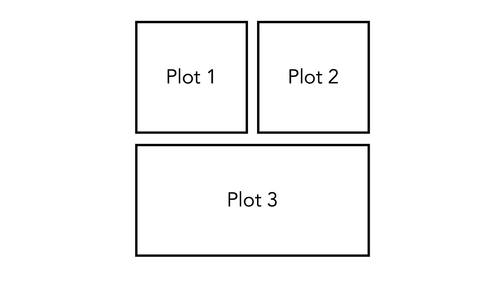
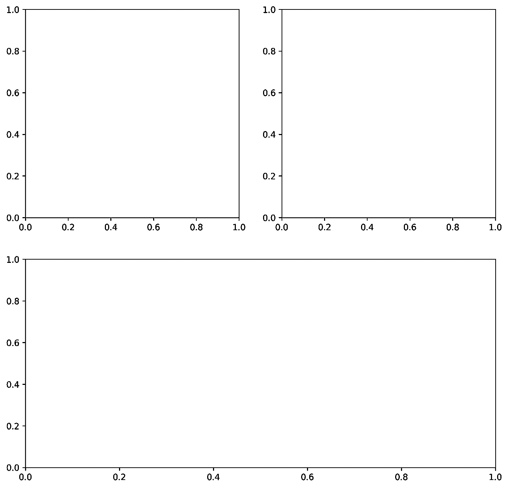
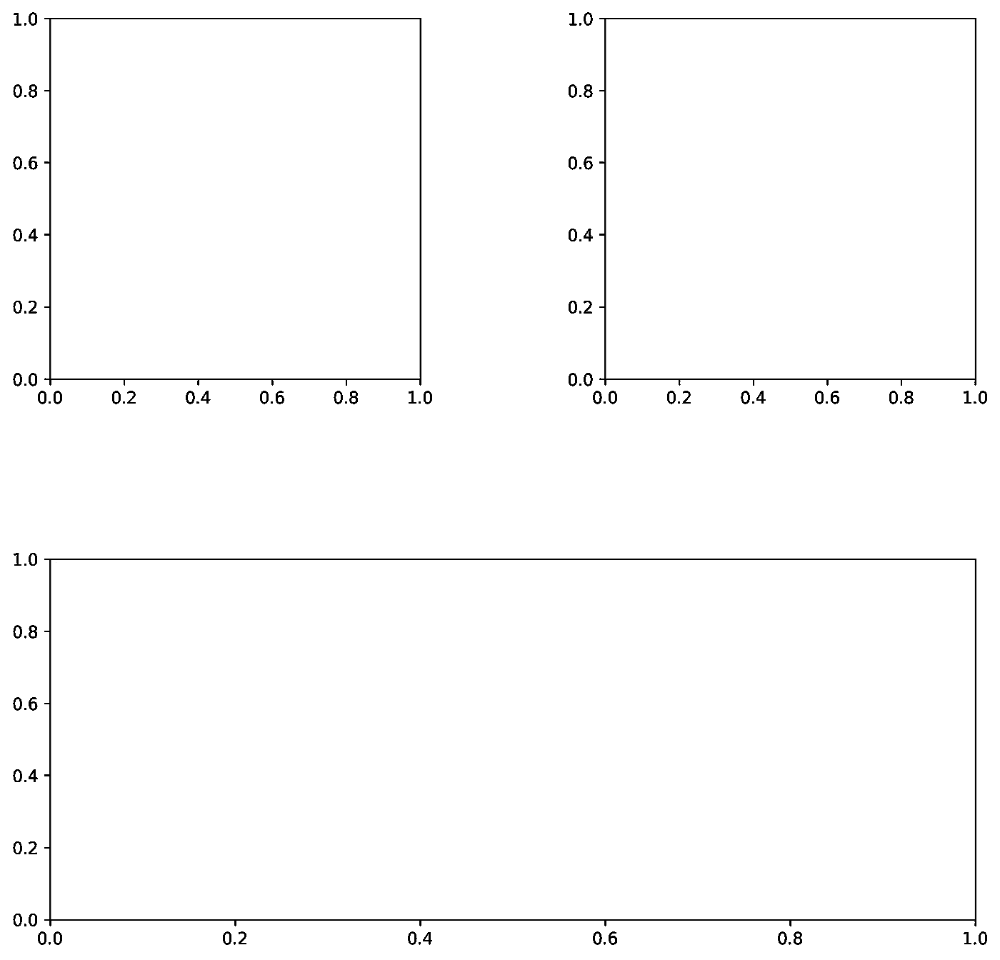
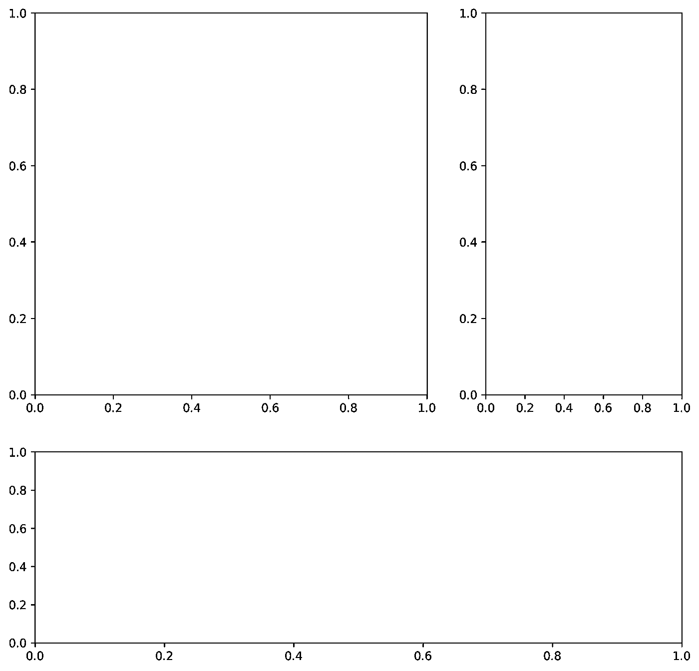
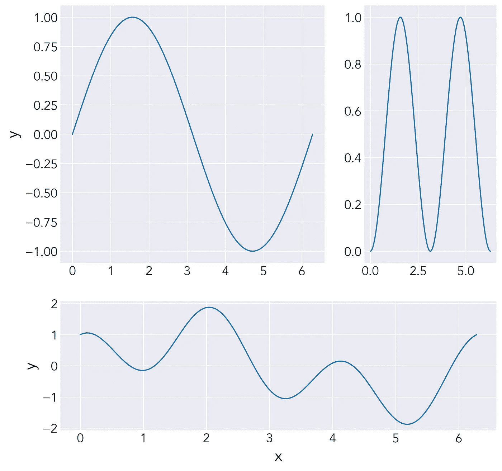

# 使用 Gridspec 在 Matplotlib 中创建面板图形布局

> 原文：<https://towardsdatascience.com/create-panel-figure-layouts-in-matplotlib-with-gridspec-7ec79c218df0?source=collection_archive---------21----------------------->

## Python 科学绘图

## 使用 gridspec 布局您的图形，而不需要导出多个图形，并使用另一个程序将它们组合在一起


[丹尼尔·麦卡洛](https://unsplash.com/@d_mccullough?utm_source=medium&utm_medium=referral)在[unplash](https://unsplash.com?utm_source=medium&utm_medium=referral)拍摄的照片

出版物人物通常需要将多个情节放入镶板布局中来讲述一个故事。一种简单的拖放方法是单独创建每个绘图，然后使用图像编辑程序甚至 Powerpoint 将绘图排列成完整的图形并保存为一个图像。这种方法的问题；然而，字体之间大小一致性等。如果您必须继续编辑单个绘图、调整大小和移动以适应您的图形布局，这是很困难的。确保所有单个图形格式一致的一种方法是直接在`matplotlib`中创建面板图形，并导出为一个图像。对我们来说幸运的是，有一个强大的工具叫做`gridspec`，我们可以用它让`matplotlib`为我们做大部分的工作。让我们从创建一个 10 x 10 英寸大小的空白图形开始:

```
**# Import Libraries** import matplotlib.pyplot as plt
import numpy as np**# Create Blank Figure** fig = plt.figure(figsize=(10, 10))
```

假设这是我们希望最终从脚本中生成的布局:



我们镶板图形的理想布局

如果我们想利用`gridspec`的优势，我们需要将我们的布局简化成一个网格。因此，为了设计布局，我们可以把上面的图想象成一个 4×4 的网格，其中`Plot 3`占据了底部的两个正方形。我们可以如下创建这个初始网格:

```
**# Create 4x4 Grid** gs = fig.add_gridspec(nrows=2, ncols=2)
```

现在我们有了网格，我们可以创建三个轴对象，对应于上面布局中的三个图。我们可以像索引任何二维数组或列表一样索引`gridspec`。注意对于`ax3`我们索引`gs[1, :]`，这意味着轴对象将跨越第二行和两列。

```
**# Create Three Axes Objects** ax1 = fig.add_subplot(gs[0, 0])
ax2 = fig.add_subplot(gs[0, 1])
ax3 = fig.add_subplot(gs[1, :])
```



基本 gridspec 布局

在那里！我们有了最初尝试创建的基本布局。当前的布局是使用 4 个大小相等的正方形，它们之间有默认的间距。假设我们想要对布局有更多的控制——我们可以从图中各个图之间的水平和垂直间隙开始，我们可以通过`hspace`(高度空间)和`wspace`(宽度空间)作为参数。这些关键字参数采用对应于平均轴高度和宽度的一部分的浮点值。

```
**# Edit gridspec to change hspace and wspace** gs = fig.add_gridspec(nrows=2, ncols=2, hspace=0.5, wspace=0.5)
```



hspace 和 wspace 值为 0.5 的 Gridspec 布局

如您所见，这些图现在间隔得更远了，因为空间是按平均轴宽和高度的一半来计算的。现在，假设我们实际上希望`Plot 1`的宽度是`Plot 2`的两倍，而`Plot 3`的高度是`Plot 1`和`Plot 2`的一半。我们可以使用关键字参数`height_ratios`和`width_ratios`对此进行调整。这两个参数都接受一个浮点数列表，分别描述轴的高度和宽度的比率。

```
**# Edit gridspec to change height_ratios and width_ratios** gs = fig.add_gridspec(nrows=2, ncols=2, height_ratios=[2, 1], width_ratios=[2, 1])
```



height_ratios 和 width_ratios 已更改的 Gridspec 布局

在这里，我们非常简单地创建了具有不同高度和宽度的更复杂的网格布局。现在，让我们使用最后的布局来创建最终的面板图:

```
**# Styling** plt.style.use("seaborn-darkgrid")
plt.rcParams["font.family"] = "Avenir"
plt.rcParams["font.size"] = 16**# Create Blank Figure** fig = plt.figure(figsize=(10, 10))**# Create 4x4 Grid**
gs = fig.add_gridspec(nrows=2, ncols=2, height_ratios=[2, 1], width_ratios=[2, 1])**# Create Three Axes Objects** ax1 = fig.add_subplot(gs[0, 0])
ax2 = fig.add_subplot(gs[0, 1])
ax3 = fig.add_subplot(gs[1, :])**# Dummy Data** x = np.linspace(0, 2*np.pi, 1000)**# Plot Data** ax1.plot(x, np.sin(x))
ax2.plot(x, np.sin(x)**2)
ax3.plot(x, np.sin(x) + np.cos(3*x))**# Set axis labels** ax1.set_ylabel("y", size=20)
ax3.set_xlabel("x", size=20)
ax3.set_ylabel("y", size=20)
```



最终面板图

我们做到了！我们能够非常简单地使用`matplotlib`中的`gridspec`来创建我们的面板图形。

# 结论

这是一个非常基本的介绍，介绍如何使用`gridspec`创建带有多个图的面板图形。您可以使用本文中显示的设置来创建一些非常复杂的布局，甚至可以利用在一些网格元素中使用空白地块来创建空间区域。本文中的`gridspec.ipynb`笔记本将在这个 [Github 资源库](https://github.com/venkatesannaveen/python-science-tutorial)中提供。

感谢您的阅读！我感谢任何反馈，你可以在 [Twitter](https://twitter.com/naveenv_92) 上找到我，并在 [LinkedIn](https://www.linkedin.com/in/naveenvenkatesan/) 上与我联系，以获取更多更新和文章。