# 使用 Altair 创建令人惊叹的可视化效果

> 原文：<https://towardsdatascience.com/create-stunning-visualizations-with-altair-f9af7ad5e9b?source=collection_archive---------13----------------------->

## 提高在 Python 中可视化数据的效率

> “美将拯救世界。”
> 
> - F .陀思妥耶夫斯基


在 [Unsplash](https://unsplash.com/?utm_source=unsplash&utm_medium=referral&utm_content=creditCopyText) 上由 [corina ardeleanu](https://unsplash.com/@corina?utm_source=unsplash&utm_medium=referral&utm_content=creditCopyText) 拍摄的照片

# 介绍

你是否曾经在看了 Python 中的可视化后感到沮丧？你有没有想过用更少的努力和时间可以做得更好？如果是这样，这篇文章非常适合你，因为我想分享一下 Altair 库，它会提高你的工作效率，让你的视觉效果更吸引人。

我想你已经知道可视化对于任何分析是多么重要，以及它如何帮助向更广泛的受众传达和翻译一个想法。此外，可视化数据是探索数据并了解从哪里深入挖掘的第一步。因此，我将使用散点图 重点介绍牛郎星的 ***基本语法，然后 ***与您分享一些各种图形*** 的示例。在此之前，我们先来说说牛郎星，了解一下它为什么这么厉害。***

# 为什么是牛郎星？

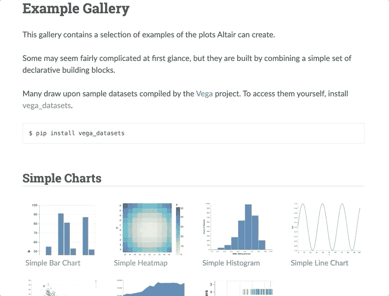

牛郎星示例图库(来源于作者)

Altair 是一个声明性的统计可视化库，它使用 Vega 和 Vega-Lite 语法来帮助描述 JSON 格式的可视化的视觉外观和交互行为。

Altair 背后的关键思想是，你声明数据列和可视编码通道之间的链接(例如，x 和 y 轴、颜色、大小等。)并且可视化过程的其余部分由库来处理。因此，它让你有更多的时间关注数据和分析，而不是解释如何可视化数据[1]。

## 牛郎星的组件

1.  ***数据:*** 用于可视化的数据帧

2. ***标记:*** 您希望数据以何种方式显示(线条、条形、刻度、点)？

3. ***编码:*** 数据将如何表示(x 和 y 的位置，颜色，大小)？

4. ***转换:*** 在应用可视化之前，您希望如何转换数据(聚集、折叠、过滤等)。)?

5. ***Scale:*** 用于在屏幕上输入和渲染数据的功能

6. ***引导:*** 图例、x 轴和 y 轴上的记号等视觉辅助。

对于 ***标记*** 组件，可以使用以下基本标记属性:

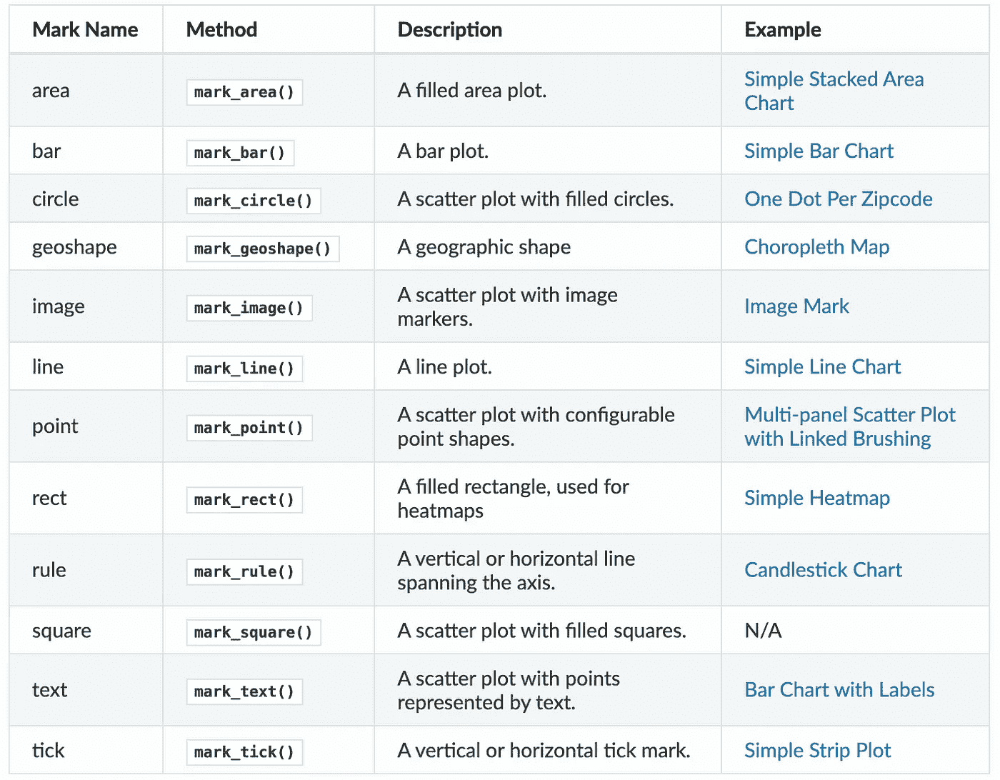

Altair 的文档截图

# 用散点图理解牛郎星的语法

让我们把我们的手脏，并学习阿尔泰的语法使用散点图。

## 装置

```
$ pip install altair vega_datasets
```

conda 的等效值为

```
$ conda install -c conda-forge altair vega_datasets
```

## 数据

我将使用以下 Vega 数据集:

1.  data.gapminder()
2.  投资数据.股票()
3.  data.movies()

让我们导入包并查看数据

```
import pandas as pd
import altair as alt
from vega_datasets import data
```

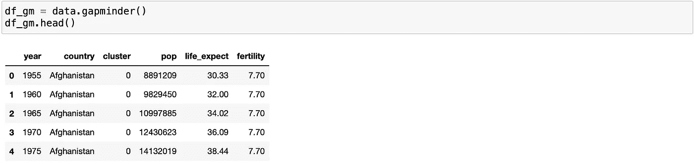

Gapminder 数据集

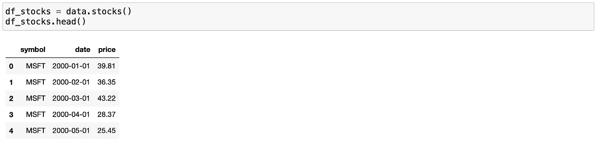

股票数据集

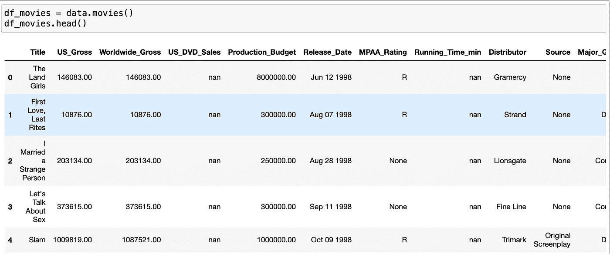

电影数据集

## 步骤 1:简单散点图

*Chart()。让我们使用 *Chart()* 、 *mark_point()。**

```
alt.Chart(df_gm_2005).mark_point().encode(
 alt.X(‘life_expect’),
 alt.Y(‘fertility’))
```

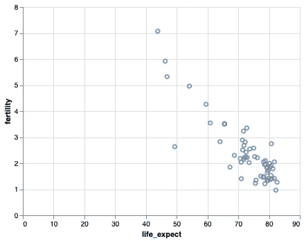

简单散点图

## 第二步:增加互动性

通过在散点图中添加 *interactive()。此外，让我们用 *alt 来定义泡沫的大小。大小)(*为地块添加更多信息。*

```
alt.Chart(df_gm_2005).mark_point(filled=True).encode(
 alt.X(‘life_expect’),
 alt.Y(‘fertility’),
 alt.Size(‘pop’)
).interactive()
```

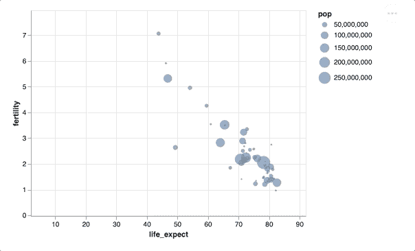

简单交互散点图

## 第三步:添加颜色

我们可以通过添加 *alt 来改变气泡的颜色。*中的*颜色()编码为*对象。这是伟大的，我们不需要担心每一个国家的每一种颜色，因为牛郎星为你这样做。

```
alt.Chart(df_gm_2005).mark_point(filled=True).encode(
 alt.X(‘life_expect’),
 alt.Y(‘fertility’),
 alt.Size(‘pop’),
 alt.Color(‘country’),
 alt.OpacityValue(0.7)
).interactive()
```

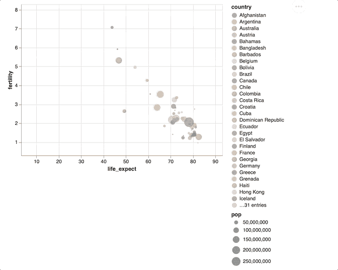

带有彩色气泡的交互式散点图

## 第 4 步:添加更多信息

我们可以通过在 *encode()。*

```
alt.Chart(df_gm_2005).mark_point(filled=True).encode(
 alt.X(‘life_expect’),
 alt.Y(‘fertility’),
 alt.Size(‘pop’),
 alt.Color(‘country’),
 alt.OpacityValue(0.7),
 tooltip = [alt.Tooltip(‘country’),
 alt.Tooltip(‘fertility’),
 alt.Tooltip(‘life_expect’),
 alt.Tooltip(‘pop’),
 alt.Tooltip(‘year’)]
).interactive()
```

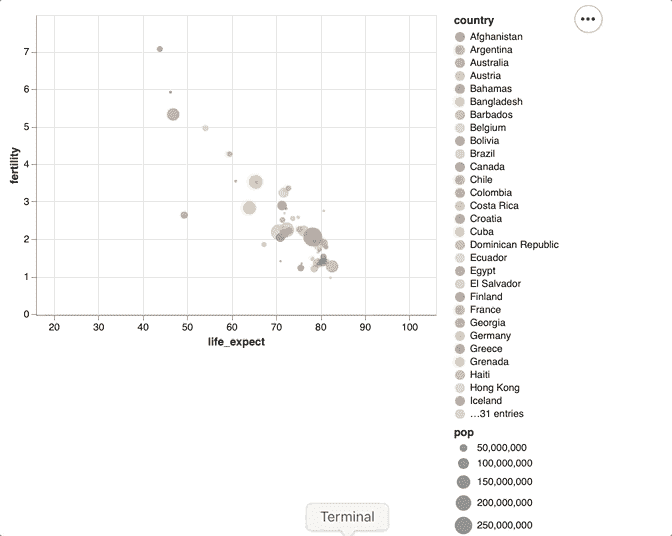

现在显示每个国家/地区的信息

## 第五步:让情节充满活力

对于 2005 年的数据来说已经显得惊人了。让我们添加一个酒吧，以改变数据，使绘图动态。

```
select_year = alt.selection_single(
 name=’Select’, fields=[‘year’], init={‘year’: 1955},
 bind=alt.binding_range(min=1955, max=2005, step=5)
)alt.Chart(df_gm).mark_point(filled=True).encode(
 alt.X(‘life_expect’),
 alt.Y(‘fertility’),
 alt.Size(‘pop’),
 alt.Color(‘country’),
 alt.OpacityValue(0.7),
 tooltip = [alt.Tooltip(‘country’),
 alt.Tooltip(‘fertility’),
 alt.Tooltip(‘life_expect’),
 alt.Tooltip(‘pop’),
 alt.Tooltip(‘year’)]
).add_selection(select_year).transform_filter(select_year).interactive()
```

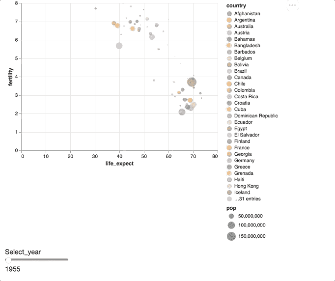

选择年度的动态可视化

## 步骤 6:更改大小并添加标题

最后，让我们更改情节的大小并添加一个标题

```
select_year = alt.selection_single(
 name=’Select’, fields=[‘year’], init={‘year’: 1955},
 bind=alt.binding_range(min=1955, max=2005, step=5)
)scatter_plot = alt.Chart(df_gm).mark_point(filled=True).encode(
 alt.X(‘life_expect’),
 alt.Y(‘fertility’),
 alt.Size(‘pop’),
 alt.Color(‘country’),
 alt.OpacityValue(0.7),
 tooltip = [alt.Tooltip(‘country’),
 alt.Tooltip(‘fertility’),
 alt.Tooltip(‘life_expect’),
 alt.Tooltip(‘pop’),
 alt.Tooltip(‘year’)]
).properties(
 width=500,
 height=500,
 title=”Relationship between fertility and life expectancy for various countries by year”
).add_selection(select_year).transform_filter(select_year).interactive()scatter_plot.configure_title(
 fontSize=16,
 font=”Arial”,
 anchor=”middle”,
 color=”gray”)
```

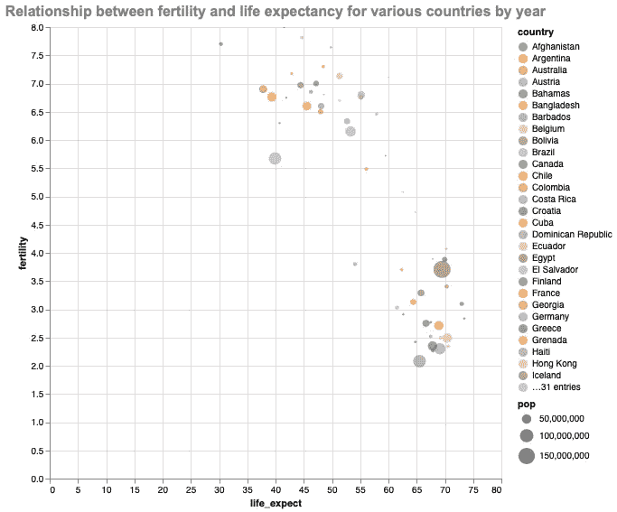

散点图的最终结果

最终的输出看起来很棒，我们可以从这样一个复杂的可视化中得到各种见解。

# 其他有用的地块与牵牛星

现在，了解了基本的牵牛星的语法，让我们看看其他一些情节。

## 方框图

```
box_plot = alt.Chart(df_gm_2005).mark_boxplot(size=100, extent=0.5).encode(
 y=alt.Y(‘life_expect’, scale=alt.Scale(zero=False))
).properties(
 width=400,
 height=400,
 title=”Distribution of life expectancy for various countries in 2005 year”
).configure_axis(
 labelFontSize=14,
 titleFontSize=14
).configure_mark(
 opacity=0.6,
 color=’darkmagenta’
)box_plot.configure_title(
 fontSize=16,
 font=”Arial”,
 anchor=”middle”,
 color=”gray”)
```

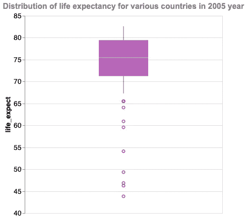

方框图

## 柱状图

```
histogram = alt.Chart(df_gm_2005).mark_bar().encode(
 alt.X(“life_expect”, bin=alt.Bin(extent=[0, 100], step=10)),
 y=”count()”
).properties(
 width=400,
 height=300,
 title=”Distribution of population for various countries in 2005 year”
).configure_axis(
 labelFontSize=14,
 titleFontSize=14
).configure_mark(
 opacity=0.5,
 color=’royalblue’
)histogram.configure_title(
 fontSize=16,
 font=”Arial”,
 anchor=”middle”,
 color=”gray”)
```

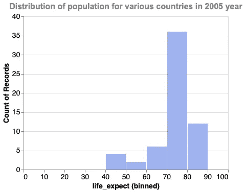

柱状图

## 条形图

```
bar_chart = alt.Chart(df_gm_ir).mark_bar(color=’seagreen’,
 opacity=0.6
).encode(
 x=’pop:Q’,
 y=”year:O”
).properties(
 width=400,
 height=400,
 title=”Population of Ireland”
)text = bar_chart.mark_text(
 align=’left’,
 baseline=’middle’,
 dx=3
).encode(
 text=’pop:Q’
)bar_chart + text
```

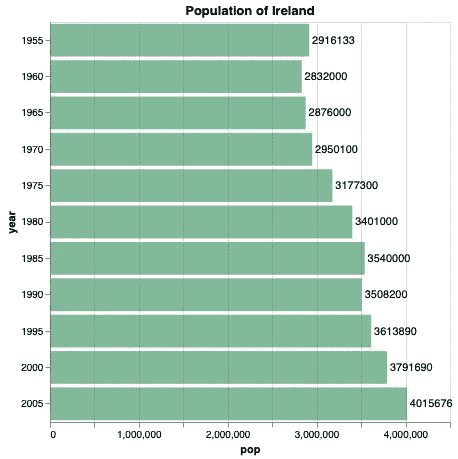

条形图

## 折线图

```
line_chart = alt.Chart(df_stocks).mark_line().encode(
 x=’date’,
 y=’price’,
 color=’symbol’
).properties(
 width=400,
 height=300,
 title=”Daily closing stock prices”
)line_chart.configure_title(
 fontSize=16,
 font=”Arial”,
 anchor=”middle”,
 color=”gray”)
```

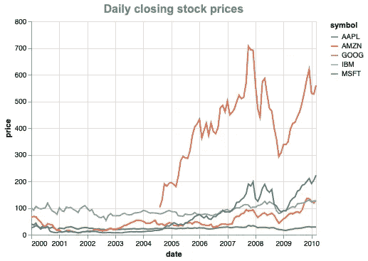

折线图

## 多个散点图

```
mult_scatter_plots = alt.Chart(df_movies).mark_circle().encode(
 alt.X(alt.repeat(“column”), type=’quantitative’),
 alt.Y(alt.repeat(“row”), type=’quantitative’),
 color=’Major_Genre:N’
).properties(
 width=150,
 height=150
).repeat(
 row=[‘US_Gross’, ‘Worldwide_Gross’, ‘IMDB_Rating’],
 column=[‘US_Gross’, ‘Worldwide_Gross’, ‘IMDB_Rating’]
).interactive()mult_scatter_plots
```

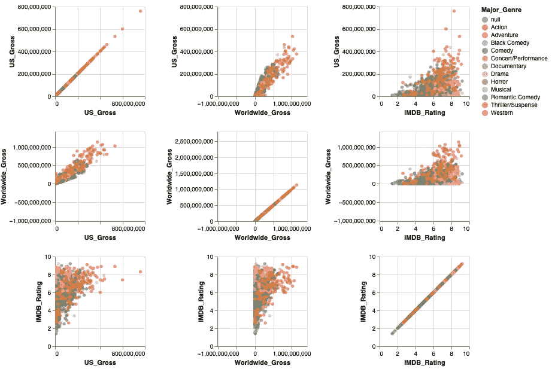

多个散点图

# 最后的想法

牛郎星是一个伟大的工具，以提高你的生产力可视化数据，在那里你只需要指定数据和可视化编码通道之间的链接。这样你就可以把你的思想直接放在一个情节上，而不用担心耗时的“如何”部分。

有关详细信息，请参阅

*   我的 [Jupyter 笔记本](https://github.com/aigera2007/data_visualization_with_altair/blob/main/data_visualization_with_altair.ipynb)用于博客帖子
*   [官方文件](https://altair-viz.github.io/getting_started/overview.html)附有各种地块的示例画廊。

感谢您的阅读，请在下面评论您对使用 Altair 可视化数据的想法。要查看我的更多帖子，请订阅 Medium 和 [LinkedIn](https://www.linkedin.com/in/aigerimshopenova/) 。

# 参考

1.  *总览页面*。概述— Altair 4.1.0 文档。(未注明)。[https://altair-viz.github.io/getting_started/overview.html.](https://altair-viz.github.io/getting_started/overview.html.)