# 用 Python 创建具有异常特征的合成时间序列

> 原文：<https://towardsdatascience.com/create-synthetic-time-series-with-anomaly-signatures-in-python-c0b80a6c093c?source=collection_archive---------20----------------------->

## [行业笔记](https://towardsdatascience.com/tagged/notes-from-industry)

## 一种简单而直观的方式来创建带有定制异常的合成(人工)时间序列数据，特别适合工业应用。

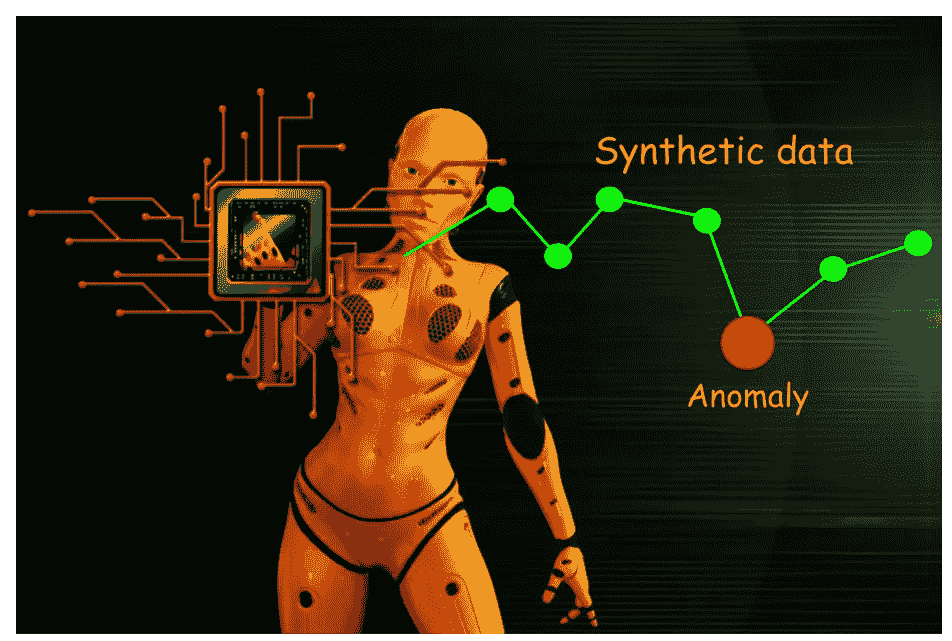

**图片来源**:作者用 [Pixabay](https://pixabay.com/illustrations/digitization-cyborg-chip-circuit-6399664/) (免费使用)图片创作

# 为什么要合成时间序列？

正如我在被大量引用的文章[中所写的，合成数据集是以编程方式生成的数据的存储库。所以，它没有被任何现实生活中的调查或实验所收集。因此，它的主要目的是足够灵活和丰富，以帮助 ML 从业者用各种分类、回归和聚类算法进行有趣的实验。](/synthetic-data-generation-a-must-have-skill-for-new-data-scientists-915896c0c1ae)

 [## 合成数据生成—新数据科学家的必备技能

### 为自驱动数据科学项目和深潜生成合成数据的包和想法的简要概述…

towardsdatascience.com](/synthetic-data-generation-a-must-have-skill-for-new-data-scientists-915896c0c1ae) 

合成时间序列也不例外，它可以帮助数据科学家试验各种算法方法，并为现实生活中的部署做准备，而这种部署方式仅使用真实数据集是不可能的。

## 工业环境中的时间序列数据

在现代工业环境中，时间序列分析有各种丰富的应用，大量的传感器正在从机器、工厂、操作员和业务流程中创建永无止境的数字数据流。

压力。温度。电动部件的振动和加速度。质检数据。操作员操作日志。

数字从未停止过。这是[工业 4.0](https://www.epicor.com/en-us/resource-center/articles/what-is-industry-4-0/) 或智能工厂时代的新规范。虽然结构化和半结构化数据都在增加，但其中许多仍然是来自现代工厂中嵌入的所有测量抽头的各种各样的时间序列(或类时间序列)数据。

 [## 工厂 2030 -智能工厂的“时代来临”-计量和质量新闻-在线…

### 1913 年 12 月，亨利·福特引进了第一条移动装配线，使整个…

计量新闻](https://metrology.news/factory-2030-the-coming-of-age-of-the-smart-factory/) 

**图片来源** : [Pixabay](https://pixabay.com/illustrations/industry-web-network-artificial-4330186/) (免费使用)

## 异常检测至关重要

大多数时候，它们是“正常”、“在范围内”、“符合预期”。但在极少数情况下，他们不是。这就是你需要注意的地方。这些是正常数据流中的“异常”,它们需要被捕获、分析并采取行动——几乎总是实时的。

这些数据流中的异常检测是所有现代数据分析产品、服务和初创公司的面包和黄油。他们正在使用各种方法，从经过试验和测试的时间序列算法到最新的基于神经网络的序列模型，来检测这些异常信号，并根据业务逻辑的要求发出警报或采取行动。

> 在现代工业环境中，时间序列分析有各种丰富的应用，大量的传感器正在创建一个永无止境的数字数据流…

## 合成数据生成是一个强大的辅助工具

关于这些工业数据流，有几点值得重复，以理解为什么合成时间序列的生成可能会非常有用。

*   **现实生活中的异常是罕见的**，人们需要监控和处理大量数据来检测各种有趣的异常。对于想要在短时间内测试和重新测试一系列算法的数据科学家来说，这不是一个好消息。
*   异常的出现是如此不可预测，以至于它们的模式很难在任何全面的统计分布中被捕捉到。对大量异常类型进行快速实验对于生产**健壮可靠的**异常检测系统至关重要。在缺乏常规、可靠的异常数据来源的情况下，合成方法提供了实现某种受控实验的唯一希望。
*   许多工业传感器生成的数据被认为是高度保密的，不允许超出本地私有云或现有的边缘分析系统。为了**再现异常特征而不损害数据安全性**，合成方法是显而易见的选择。

> 这些是正常数据流中的“异常”,它们需要被捕获、分析并采取行动——几乎总是实时的。

在本文中，我们展示了一种简单而直观的方法，在模拟工业过程的一维合成时间序列数据中创建一些常见类型的异常特征。我们会为此使用大家最喜欢的 Python 语言。

> **注意**:这不是一篇关于异常检测算法的文章。我只讨论与合成生成注入异常的时间序列数据相关的思想和方法(集中在一个特定的应用领域)。

# 有异常的合成时间序列

这里是 [**Jupyter 笔记本**](https://github.com/tirthajyoti/Synthetic-data-gen/blob/master/Notebooks/Time%20series%20synthesis%20with%20anomaly.ipynb) 这里是带主类对象的 Python 模块供你玩。

## 工业过程和“单位过程时间”的概念

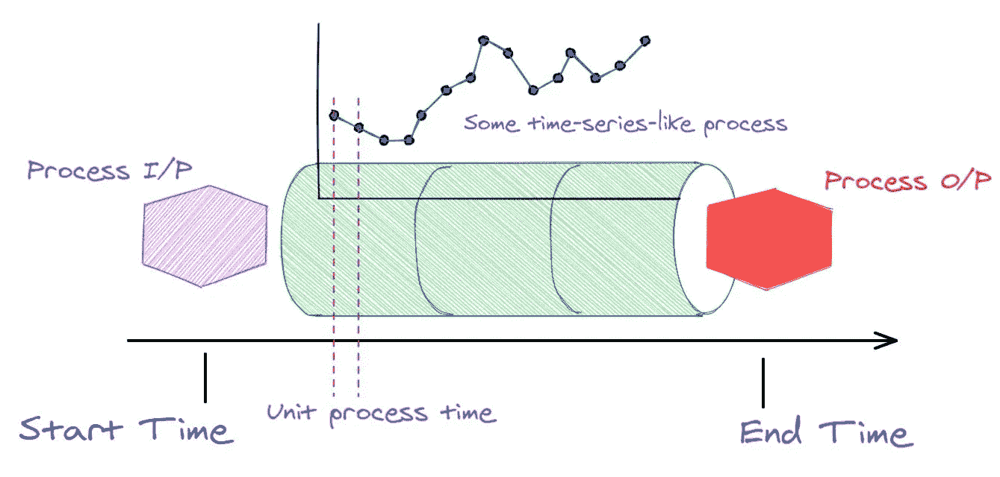

**图片来源**:作者创作

上面，我们展示了一个典型的工业过程和“单位加工时间”的图解。假设一些原材料(图中的 ***流程 I/P*** )正在进入一台复杂的机器，而成品(图中的 ***流程 O/P*** )正在从另一端出来。

我们不需要知道机器内部到底发生了什么，只需要知道它会定期生成一些数据，也就是说，我们可以以时间序列的方式测量过程的状态(也许使用一些传感器)。我们想看看这个数据流，发现异常。

因此，要定义我们的合成时间序列模块，我们至少需要以下内容:

*   流程开始时间
*   流程结束时间
*   单位处理时间(我们接收数据的时间间隔)

因此，基类`SyntheticTS`的定义就是这样开始的，

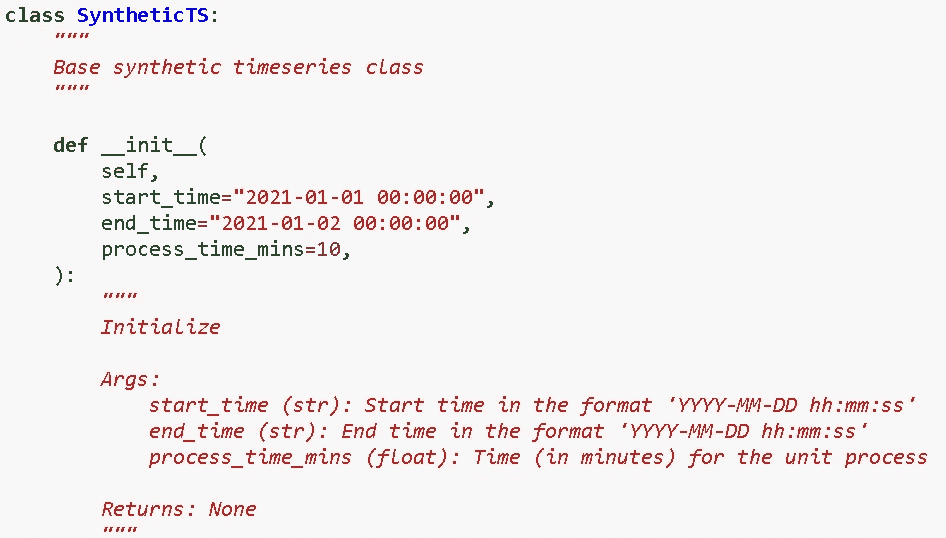

## “正常”过程

要产生异常，我们需要一个正常的基线。我们可以用“正态分布”来解释这一点。您可以根据您的具体过程类型和情况随时更改它，但绝大多数工业过程的传感器测量值确实遵循正态分布。

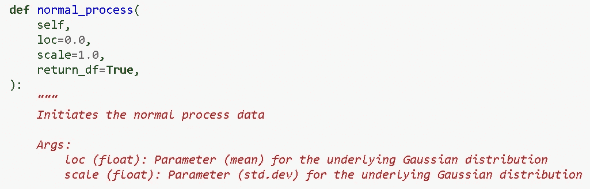

假设我们有一个工业流程/机器，从 2021 年 5 月 1 日开始运行，一直运行到 2021 年 5 月 6 日(在每周维护之前，在许多情况下通常运行 6 天)。单位处理时间为 15 分钟。我们选择过程的平均值为 100，标准偏差为 5。

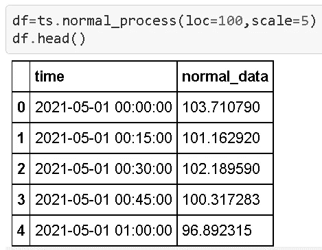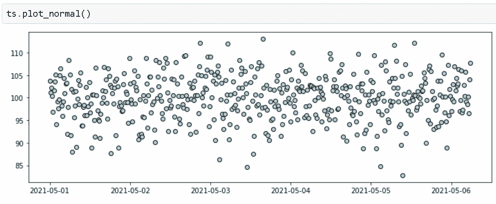

## 基本的“异常化”方法

作为一种合成数据生成方法，您希望控制异常的以下特征:

*   需要异常的数据部分
*   异常的规模(它们离正常有多远)
*   单边或双边(在数量上高于或低于正常数据)

我们不会为精确的代码而烦恼，而是向您展示一些关键的结果。

## 单边异常

这里有一个例子，

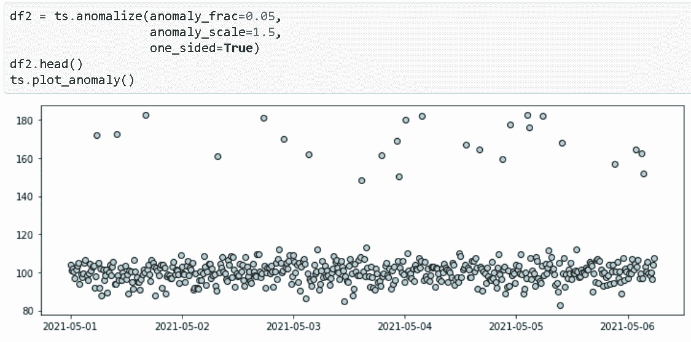

## 改变异常尺度

我们可以通过简单地改变`anomaly_scale`参数将异常放置在不同的距离。

这是结果图。请注意图的垂直比例是如何变化的，以适应越来越大的异常。

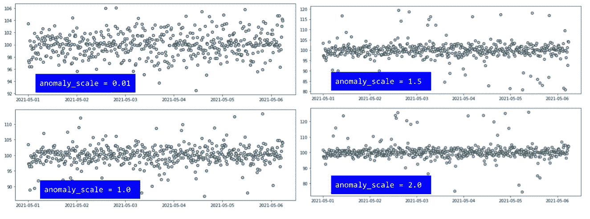

## 异常的变化部分

接下来，我们更改异常的分数(保持比例不变，为 2.0)。

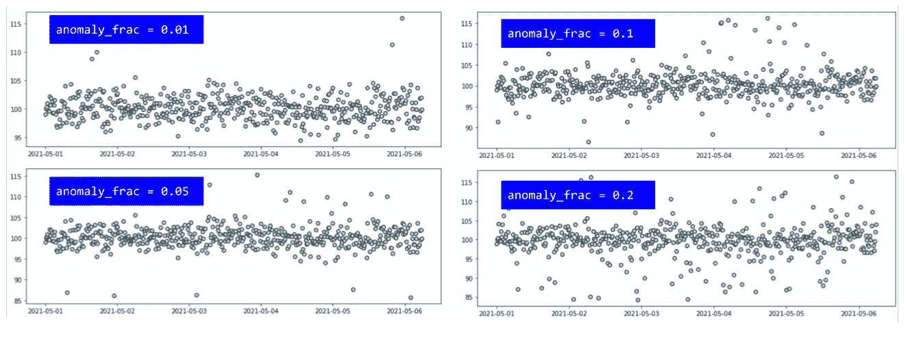

## 引入“积极转变”

这在工业过程中是相当常见的情况，其中由于过程/机器设置的突然变化或一些其他原因，在过程中引入了可见的偏移。**有时是计划好的，有时是无意的**。根据具体情况，异常检测算法可能需要对其进行不同的分析和处理。无论如何，我们需要一种方法在合成数据中引入这样的变化。

在这种情况下，我们选择了 10%的数据偏移，即带有`pct_drift_mean=10`参数的平均值。注意，如果我们没有在方法中指定参数`time_drift`，那么代码会自动在整个过程的开始和结束时间的中间点引入漂移。

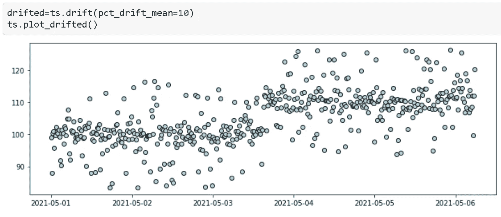

## 特定位置的负偏移

在下面的例子中，我们展示了一种情况，

*   数据向负方向漂移
*   数据的分布(方差)随着平均值而变化
*   漂移从用户可以选择的特定位置开始

这是比较现实的情况。

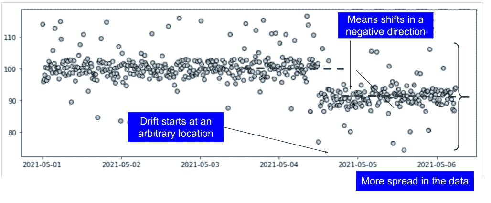

## 块状异常

在许多情况下，**异常会成批出现，然后消失**。我们也可以综合这种情况。请注意，这里我们创建了“双侧异常”，但与所有其他选项类似，我们也可以创建“单侧”变异。

现在，代码创建了在整个时间段内均匀分布的分块异常。但是这可以在下一次代码更新中用单独的时间点和异常特征来定制。

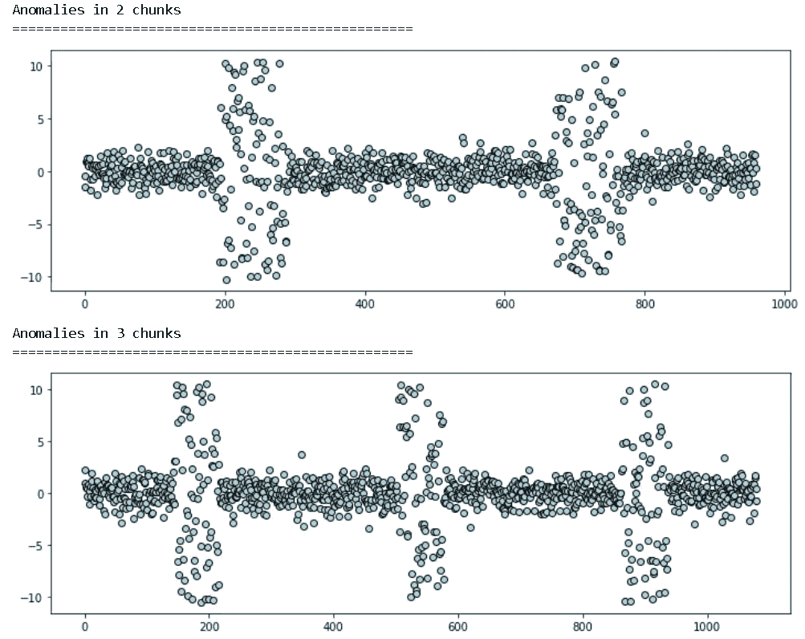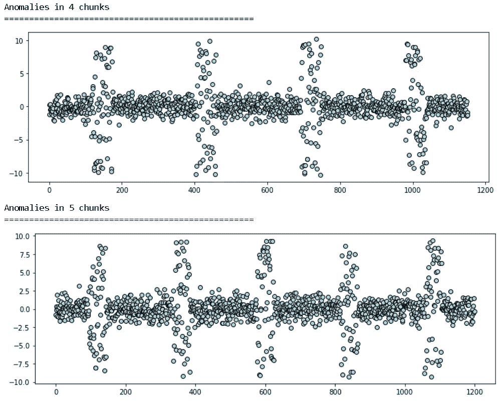

# 摘要

我们展示了一种简单直观的方法来创建具有各种异常特征的合成一维时间序列数据，这些异常特征在工业用例中很常见。这种合成数据生成技术对于算法迭代和模型测试非常有用。

## 保持简单

为了专注于工业用例，**我们没有在基线数据**生成中添加传统的时间序列模式(如季节性、上升/下降趋势),而是将其保持为极其简单的高斯过程。数据也没有自动回归的性质。尽管 ARIMA 等算法非常受欢迎，对金融和商业数据分析很有帮助，但工业环境中独立传感器生成的数据通常呈正态分布，我们坚持这一原则。

## 进一步的改进

有很多方法可以在此基础上添加额外的功能。有些可能是，

*   增加了各种统计分布的选择作为基线数据生成过程
*   分块异常的任意位置和特征
*   多个合成数据类/对象的合成方法
*   更好的可视化方法

同样，示例 [Jupyter 笔记本在这里](https://github.com/tirthajyoti/Synthetic-data-gen/blob/master/Notebooks/Time%20series%20synthesis%20with%20anomaly.ipynb)。请随意叉和实验。

Y ou 可以查看作者的 [**GitHub**](https://github.com/tirthajyoti?tab=repositories) **知识库**获取机器学习和数据科学方面的代码、思想和资源。如果你和我一样，对人工智能/机器学习/数据科学充满热情，请随时[在 LinkedIn 上添加我](https://www.linkedin.com/in/tirthajyoti-sarkar-2127aa7/)或[在 Twitter 上关注我](https://twitter.com/tirthajyotiS)。

 [## Tirthajyoti Sarkar -数据科学和解决方案工程经理- Adapdix 公司|…

### 将 AI/ML 的力量放在工业 4.0 和下一代智能工厂的边缘。将人工智能引入工业领域…

www.linkedin.com](https://www.linkedin.com/in/tirthajyoti-sarkar-2127aa7/)