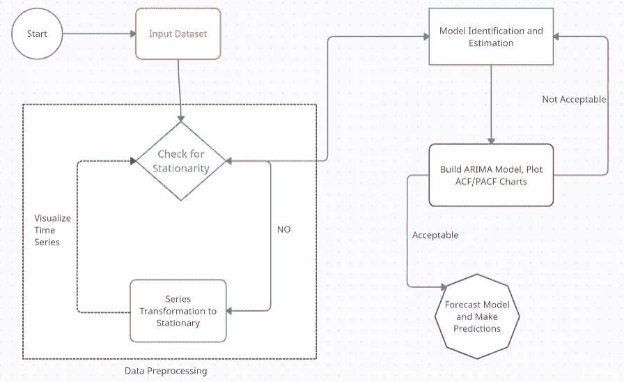
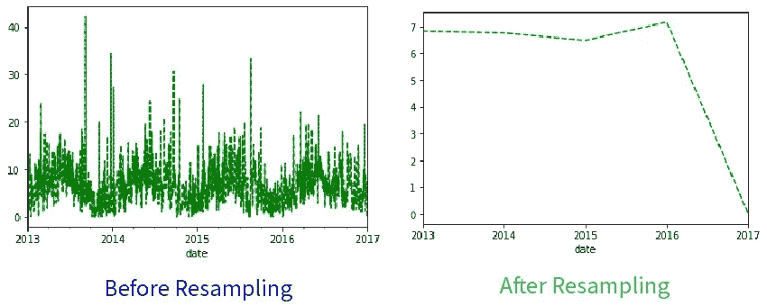
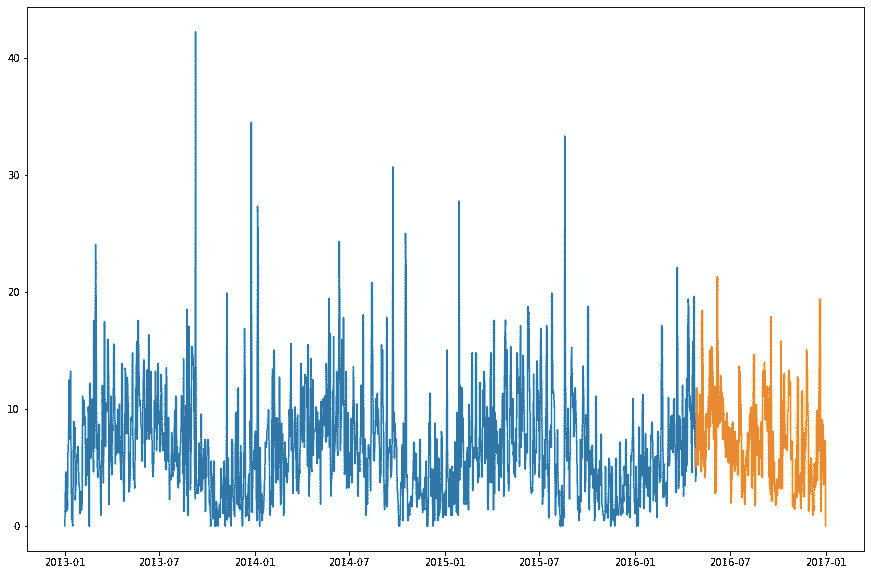
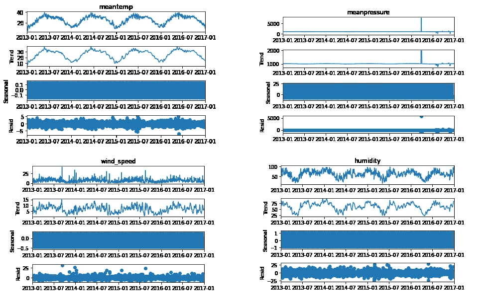
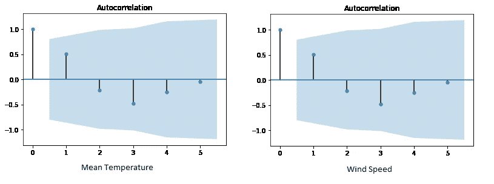
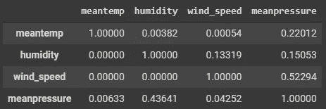

# 为您的时间序列预测模型创建“不受天气影响”的验证

> 原文：<https://towardsdatascience.com/create-weather-proof-validations-for-your-time-series-forecasting-model-d456a1037c4f?source=collection_archive---------20----------------------->

## 使用 Python 构建最终时间预测的指南


马尔科·布里托在 [Unsplash](https://unsplash.com?utm_source=medium&utm_medium=referral) 上的照片

时间旅行！！—是时候让我们的探索更上一层楼，致力于预测依赖于时间的结果了。时间序列是以时间间隔出现的一系列数据。这些时间间隔可以是每小时、每天、每周或任何可量化的重复持续时间。在一定时间间隔内进行的一系列观察称为时间序列。

> 预测时间序列处理的是预测下一个周期或在未来参考时间框架内发生的事件观察。

在整个故事中，我们的目标是建立一个对所有问题都理想的时间序列预测。这里的想法是不要为一个问题建立最佳解决方案，而是为大多数问题建立一个可以接近的解决方案。

**成功的时间序列所需的重要结构和测试**

1.  重采样
2.  时间序列的平稳性
3.  ARIMA 和皮拉明德·ARIMA 造型
4.  季节性和缺失值插补
5.  Ad-Fuller (ADF)测试
6.  自相关和偏相关
7.  格兰杰因果检验

**了解时间序列预测的流程**



时序预测和分析的逐步流程|作者图片

**Panel Data:** Panel 是一个基于时间的数据集，除了序列数据之外，还包含一个或多个在某些时间段量化的关联变量。这些因变量有助于为预测“Y”的值提供有价值的见解。

**时间序列中的滞后:** Lag，作为一个通用的英文术语，指的是较慢的响应时间，通常称为潜伏期。在时间序列预测或分析中，1 到 8 范围内的滞后被认为适用于季度定时数据。对于以月为间隔的时间序列，6、12 或 24 的滞后被认为是合适的。为了更好地理解滞后，让我们看一下这个场景。对于属于时间序列的一组离散值，对于滞后 1，此时间序列将与当前时间序列之前的同一时间序列进行比较。换句话说，时间序列被移动到过去的一个时间段。

> 了解数据集是时间序列还是面板的一种方法是了解时间列是否是影响预测结果的唯一数据部分。

从下一节开始，我们开始动手(我们编码！！)而且为了简单起见，我在这个故事里只加伪代码。但是，为了能够遍历整个代码，我链接了下面的代码库。这只是一个 Python 笔记本，我建议您跟随这个故事。

[](https://github.com/rjrahul24/ai-with-python-series/tree/main/05.%20Build%20Concrete%20Time%20Series%20Forecasts) [## rjrahul 24/时间序列预测

### Python 系列教程，旨在学习人工智能概念。

github.com](https://github.com/rjrahul24/ai-with-python-series/tree/main/05.%20Build%20Concrete%20Time%20Series%20Forecasts) 

# 1.对时间序列进行重采样

重采样是一种用于改变时间序列观测频率的技术。在 pandas 的数据帧中，重采样方法使这种频率转换变得很方便。所需的先决条件是，对象必须具有 DateTime 数据类型格式(DateTime、DateTimeIndex、PeriodIndex、TimeDeltaIndex 等。).如下所述，存在两种重采样类型。 ***虽然，在这两种情况下，都必须发明数据。***

1.  **上采样**:增加采样数据的频率。例如，将基于分钟的频率更改为秒。
2.  **下采样**:上采样的反过程。例如，将基于天的频率更改为月。

当数据可用的频率与您进行分析的频率不同时，需要进行重采样。

> 但在最常见的情况下，重采样用于为监督学习算法提供某种程度的附加结构和对机器学习问题的洞察。

```
# The series module from Pandas will help in creating a time series
from pandas import Series,DataFrame
import seaborn as sns# Before resampling
timeseries_mm = time_series['wind_speed']
timeseries_mm.plot(style='g--')
plt.show()# Resampling the dataset using the Mean() resample method
timeseries_mm = time_series['wind_speed'].resample("A").mean()
timeseries_mm.plot(style='g--')
plt.show()
```



时间序列重采样前后记录的风速变化|作者提供的图像

# 2.平稳和非平稳时间序列

平稳性被认为是每个时间序列的一个特征。在平稳序列的情况下，时间序列的值不是时间的函数。

> 这意味着当前值与过去值的均值、方差和自相关等测量值都是恒定的。平稳的时间序列也不受季节变化的影响。

几乎每一个时间序列都可以通过适当的变换变得平稳。

## **使时间序列平稳**

使用以下提到的任何一种方法都可以使时间序列数据变得平稳:

1.  对序列进行一次或多次差分:差分的概念是用当前时间中的序列值减去前一时间单位中同一序列的值，将使其保持不变。也就是说，用当前值减去下一个值叫做差分。
    — ***比如考虑以下数列:[1，5，2，12，20]。一阶差分给出:[5–1，2–5，12–2，20–12]=[4，-3，10，8]。第二次求差得到:[-3–4，-10–3，8–10]=[-7，-13，-2]***
2.  获取现有时间序列的日志
3.  取当前数列的第 n 个根。
4.  结合一种或多种上述技术。

## **为什么平稳时间序列很重要？**

平稳的时间序列比较容易预测，也比较可靠。

> 原因是，预测模型基本上是线性回归算法，利用这些系列数据的滞后来形成预测值。

我们还知道，线性回归算法在预测值(X)彼此不相关的情况下效果最好。使时间序列平稳可消除预测值之间的所有和任何持续的自相关，从而使序列更适合回归分析。一旦序列的滞后或预测因子是独立的，预测就有望给出可靠的预测。

*** *下节中的 Ad-Fuller 测试将测试系列的稳定性。**

# 3.ARIMA 和皮拉明德·ARIMA 造型

统计学和经济学领域的通用术语，**【自回归综合移动平均线(ARIMA)】**用于描述移动平均线构造。他们对建立时间序列预测模型产生了浓厚的兴趣。

> ARIMA 模型适用于输入数据在均值意义上显示非平稳性的证据，但没有观察到显著差异的情况。

我们可以将 ARIMA 的定义分解如下，ARIMA 的 AR 部分代表一个进化变量，它根据自身滞后(旧值)进行回归。MA 部分显示回归误差，它是过去不同时间出现的误差项的线性组合。剩下的“I”(积分)表示数据被当前值和先前值之间的差异所取代。这些单独的过程可能需要执行多次。每个功能的目的都是使模型尽可能符合数据。

> [来自 Python 文档](https://pypi.org/project/pyramid-arima/) — Pyramid 是一个严肃的统计 Python 库，只有一个目标:将 R 的 auto.arima 功能引入 Python。金字塔的运作方式是将 **statsmodels.tsa.ARIMA** 和**stats models . TSA . statespace . sarimax**包装到一个估算器类中，并为熟悉 scikit-learn 的程序员创建一个更加用户友好的估算器界面。

pmdarima 最初被称为 pyramid-arima，是一个统计库，有助于填补 Python 时间序列中的数据空白。它包含一组用于检查平稳性和季节性的统计测试。还包括时间序列差分和逆差分等功能。

```
# Predicting Wind Speeds using "pmdarima" package in Pythonfrom pmdarima.arima import auto_arima
from pmdarima.arima import ADFTesttrain=df[:1300]
test=df[-250:]
plt.figure(figsize=(15,10))adf_test=ADFTest(alpha=0.05)
adf_test.should_diff(time_series_train["wind_speed"])
df = time_series_train["wind_speed"]model = auto_arima(train,start_p=0,d=1,start_q=0,max_p=5,max_d=5,max_q=5, start_P=0,D=1, start_Q=0, max_P=5,max_D=5,max_Q=5, m=12,seasonal=True,error_action='warn',trace=True,supress_warnings=True,stepwise=True,random_state=20,n_fits=50)plt.plot(train)
plt.plot(test)
plt.autoscale()
```



使用 pmdarima 风速模型预测的数据部分(橙色)|图片由作者提供

# 4.季节性和缺失值插补

时间序列数据的季节性是指在小于一年的特定时间间隔内出现的变化。这些时间间隔可以是每小时、每月、每周或每季度。天气或气候变化等各种因素会导致季节性。

> 造成季节性的模式总是循环的，并以周期性模式出现。

对于工作依赖于这些变化的企业来说，如股票市场、劳工组织等，理解季节性是很重要的。季节性变化有几个研究的理由和意义:

*   对数据集季节性影响的解释提供了对季节性变化对数据影响的详细理解。
*   一旦一个季节模式被建立，重要的方法可以被用来从时间序列中消除它。这将有助于研究数据集其他不规则成分的影响。去季节性是消除季节性的概念。
*   季节性和规律性变化的历史模式有助于预测类似数据的未来趋势。例如，气候模式的预测。

## **处理时间序列内的缺失值**

在任何数据集中观察到缺失数据是很常见的。类似地，对于表示时间序列的数据，可以观察到缺少日期或时间的序列。数据总是有可能被捕获并且为零。在这种情况下，需要忽略假阴性。

> 此外，需要注意的重要一点是，对于时间序列数据，均值或中值插补不是一个好的做法。特别是，如果时间序列没有表现出平稳性。更好、更明智的方法是用该时间段的历史值填充远期数据。

但是，基于对数据的研究和序列的前景，可以尝试多种方法来估算缺失值。以下是一些值得注意的输入缺失时间序列值的常用技术:

*   反向填充
*   线性内插法
*   二次插值法
*   最近邻居的平均值
*   季节性对应平均值

将新值引入数据集后，测量时间序列的性能也很重要。

> 使用两种或多种方法输入值，然后使用均方根(RMSE)等方法计算模型的精度，这被认为是一种良好的做法。这有助于决定哪种插补技术最适合数据。

# 5.Ad-Fuller (ADF)测试

扩展的 Dickey-Fuller 检验(ADF)，也称为 Ad-Fuller 检验，是时间序列分析的一种重要检验机制。它测试一个基本的零假设，即给定的输入单位根存在于整个时间序列样本中。另一个假设通常是序列的平稳性或趋势平稳性。

> 在这个测试中主要使用的增强的 Dickey-Fuller(ADF)统计是一个负数。越是否定，对某个置信水平下存在单位根的假设的否定越强。

Ad-Fuller 测试背后的启示是，如果时间序列以单位根过程为特征，那么在这种情况下，序列(y-1)的滞后水平将不会产生任何预测(y)未来变化的相关信息，除了在(y-1)的 delta 中观察到的那些变化。*在这种情况下，零假设不被拒绝。*另一方面，如果现有过程没有单位根，则表明它是稳定的，因此显示出向均值的回归。这里，滞后水平将提供预测未来变化的相关信息。

```
# Statsmodel and Adfuller will help in testing the stationarity of the time series
import statsmodels
from statsmodels.tsa.stattools import adfuller# Decomposing the time series with Statsmodels Decompose Method
from statsmodels.tsa.seasonal import seasonal_decompose
sd_1 = seasonal_decompose(time_series_train["meantemp"])
sd_2 = seasonal_decompose(time_series_train["humidity"])
sd_3 = seasonal_decompose(time_series_train["wind_speed"])
sd_4 = seasonal_decompose(time_series_train["meanpressure"])
sd_1.plot()
sd_2.plot()
sd_3.plot()
sd_4.plot()
```



所有列的季节性分解|按作者分类的图像

```
# From the above graph’s observations, it looks like everything other than meanpressure is already stationary
# To re-confirm stationarity, we will run all columns through the ad-fuller testadfuller(time_series_train["meantemp"])
adfuller(time_series_train["humidity"])
adfuller(time_series_train["wind_speed"])
adfuller(time_series_train["meanpressure"])# Consolidate the ad-fuller tests to test from static data
temp_var = time_series_train.columns
print('significance level : 0.05')
for var in temp_var:
  ad_full = adfuller(time_series_train[var])
  print(f'For {var}')
  print(f'Test static {ad_full[1]}',end='\n \n')***>>> significance level : 0.05 
>>> For meantemp Test static 0.2774121372301611   
>>> For humidity Test static 0.004470100478130758   
>>> For wind_speed Test static 0.0025407221531464   
>>> For meanpressure Test static 0.0***
```

通过 ad-fuller 检验，我们现在可以得出结论，所有数据都是静态的，因为静态检验低于显著性水平。这也否定了平均压力不是静态的假设。

# 6.自相关和偏相关

**自相关**:序列与其滞后时间的相关性称为自相关。就像相关性测量两个变量之间线性关系的大小一样，自相关在时间序列的滞后值之间也是如此。如果时间序列有很大的自相关性，这意味着滞后对时间序列预测的影响很大。更一般地说，相关因子 1(滞后= 1)表示彼此相隔一个周期的值之间的相关性。同样，滞后“k”自相关显示了彼此独立的“k”个时间段的值之间的关联。

**偏相关:**偏相关的目的也类似于自相关，因为它传达了关于变量及其滞后之间关系的信息。但是部分自相关仅提供滞后之间的纯关联的细节，而忽略了中间滞后产生的相关性。

```
# Plotting the test data with auto correlation
from statsmodels.graphics.tsaplots import plot_acf# The next 6 periods of mean temperature (graph 1) and wind_speed (graph 2)
plot_acf(df_forecast["meantemp"])
plot_acf(df_forecast["wind_speed"])
```



平均温度和风速的自相关|图片作者

# 7.格兰杰因果检验

格兰杰因果关系检验有助于通过分析相似的时间序列来理解时间序列的行为。

> 该测试假设，如果一个事件 X 导致另一个事件 Y 的发生，那么基于前面的 Y 和 X 的组合值的 Y 的未来预测应该超过单独基于 Y 的 Y 的预测。

> 因此，这里需要注意的是，格兰杰因果关系不应该在事件 Y 的滞后导致 Y 的情况下使用。

带有 PyPi 的 statsmodel 包实现了格兰杰因果关系检验。该方法接受一个有两列的二维数组作为其主参数。第一列包含值，第二列包含预测值(X)。这里的零假设是，属于第二列的序列不会导致属于第一列的序列出现。 ***如果 P 值小于预定义的显著性水平 0.05，则拒绝零假设。这也得出结论，X 的滞后是有用的。*** 第二个参数*“maxlag”*允许您输入 Y 需要包含在测试中的最大滞后数。

```
# Import Granger Causality module from the statsmodels package and use the Chi-Squared test metric
from statsmodels.tsa.stattools import grangercausalitytests
test_var = time_series.columns
lag_max = 12
test_type = 'ssr_chi2test'causal_val = DataFrame(np.zeros((len(test_var),len(test_var))),columns=test_var,index=test_var)
for a in test_var:
  for b in test_var:
    c = grangercausalitytests ( time_series [ [b,a] ], maxlag = lag_max, verbose = False)
    pred_val = [round ( c [ i +1 ] [0] [test_type] [1], 5 ) for i in range (lag_max) ]
    min_value = np.min (pred_val)
    causal_val.loc[b,a] = min_value
causal_val
```



作者图片

*格兰杰因果关系的结果证明了这些特征之间的密切相关性。*

# 结论

时间序列是一个巨大的主题，包括本章没有讨论的各种其他奇点，这应该被认为是这一领域研究的开始。分析从研究时间序列数据开始，了解平稳性，测试季节性，建立预测模型，最后进行时间预测。这个故事的目的是强调可以建立一个可持续的和健壮的时间序列预测模型的关键结构。如果需要的话，请随意浏览下面的参考资料部分，以获得各个主题的详细解释。另外提醒一下，我建议您在阅读本文的同时阅读上面链接的代码库。


由[瓦尔德马尔·布兰德](https://unsplash.com/@waldemarbrandt67w?utm_source=medium&utm_medium=referral)在 [Unsplash](https://unsplash.com?utm_source=medium&utm_medium=referral) 上拍摄的照片

## 通读几个比较有趣的机器学习教程

[](/implementing-an-end-to-end-machine-learning-workflow-with-azure-data-factory-f16cbeeffd94) [## 使用 Azure Data Factory 实现端到端的机器学习工作流

### 使用微软的 Azure 数据工厂(ADF)在一个屏幕上构建完整的 MLOps 生命周期

towardsdatascience.com](/implementing-an-end-to-end-machine-learning-workflow-with-azure-data-factory-f16cbeeffd94) [](/a-guide-to-genetic-learning-algorithms-for-optimization-e1067cdc77e7) [## 最优化遗传“学习”算法指南

### 利用强化学习和遗传算法重建图像

towardsdatascience.com](/a-guide-to-genetic-learning-algorithms-for-optimization-e1067cdc77e7) [](/clean-architecture-of-analyzing-data-7e689da7dd4a) [## 分析数据的清晰架构

### 数据分析是一个复杂的过程吗？让我们一步一步来理解它

towardsdatascience.com](/clean-architecture-of-analyzing-data-7e689da7dd4a) 

## 关于我

我是 Rahul，目前在研究人工智能，在 Xbox 游戏上实现大数据分析。我在微软工作。除了专业工作之外，我还试图制定一个程序，来理解如何通过使用人工智能来改善世界上发展中国家的经济状况。

我现在在纽约的哥伦比亚大学，你可以通过 [LinkedIn](https://www.linkedin.com/in/rjrahul24/) 和 [Twitter](https://twitter.com/rjrahul24) 与我联系。

## [参考文献]

1.  [https://www . statistics solutions . com/free-resources/directory-of-statistical-analyses/time-series-analysis/](https://www.statisticssolutions.com/free-resources/directory-of-statistical-analyses/time-series-analysis/)
2.  [https://towards data science . com/the-complete-guide-to-time-series-analysis-and-forecasting-70d 476 bfe 775](/the-complete-guide-to-time-series-analysis-and-forecasting-70d476bfe775)
3.  [https://en . Wikipedia . org/wiki/auto regressive _ integrated _ moving _ average](https://en.wikipedia.org/wiki/Autoregressive_integrated_moving_average)
4.  [https://machine learning mastery . com/ARIMA-for-time-series-forecasting-with-python/](https://machinelearningmastery.com/arima-for-time-series-forecasting-with-python/)
5.  [https://otexts.com/fpp2/arima.html](https://otexts.com/fpp2/arima.html)
6.  [https://towards data science . com/taking-consideration-for-time-series-analysis-4 E1 F4 fbb 768 f](/taking-seasonality-into-consideration-for-time-series-analysis-4e1f4fbb768f)
7.  [https://www . first intuition . co . uk/fihub/time-series-analysis/](https://www.firstintuition.co.uk/fihub/time-series-analysis/)