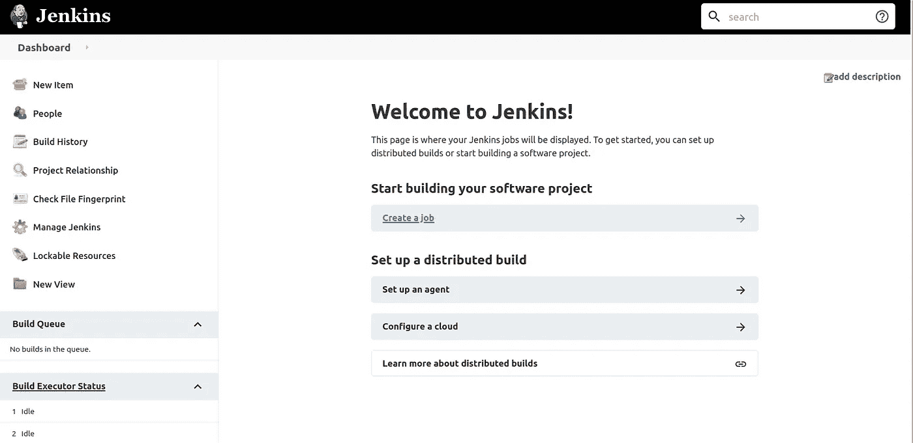
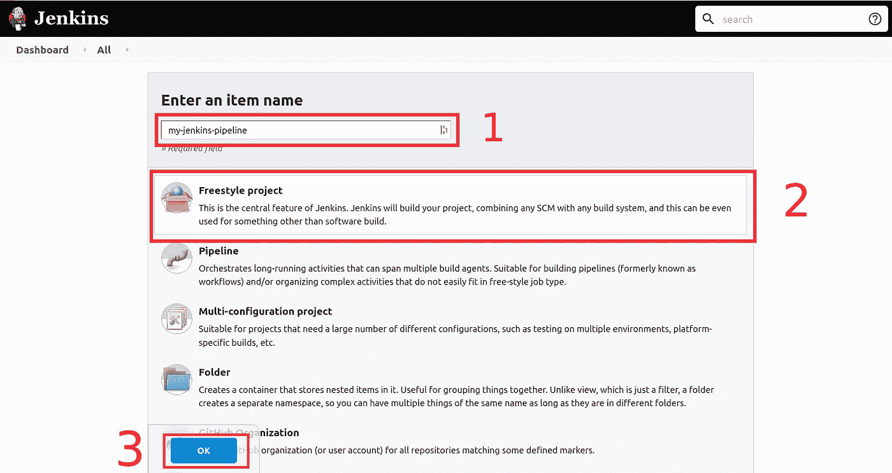
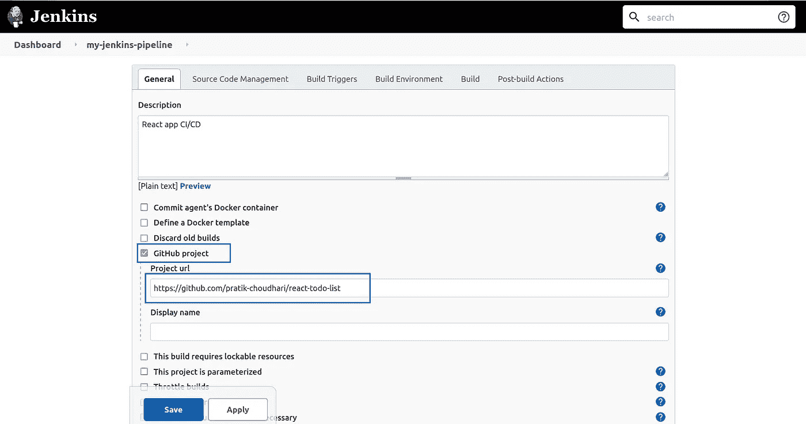
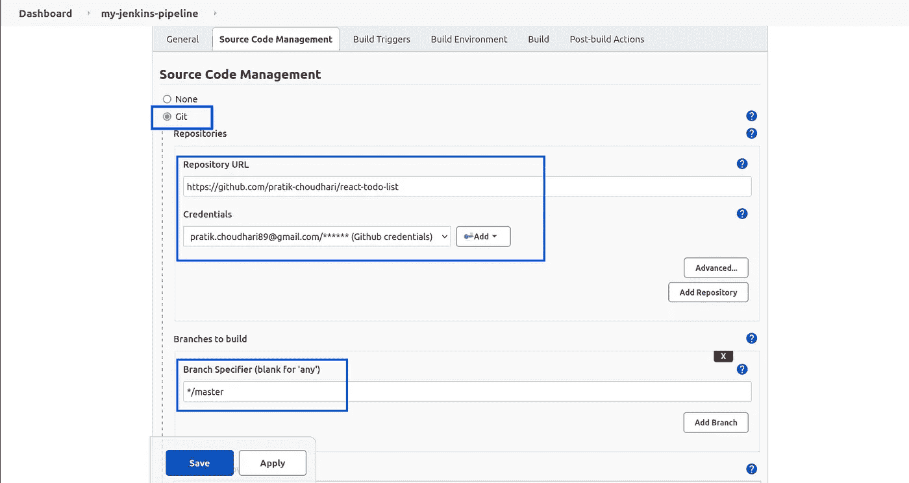
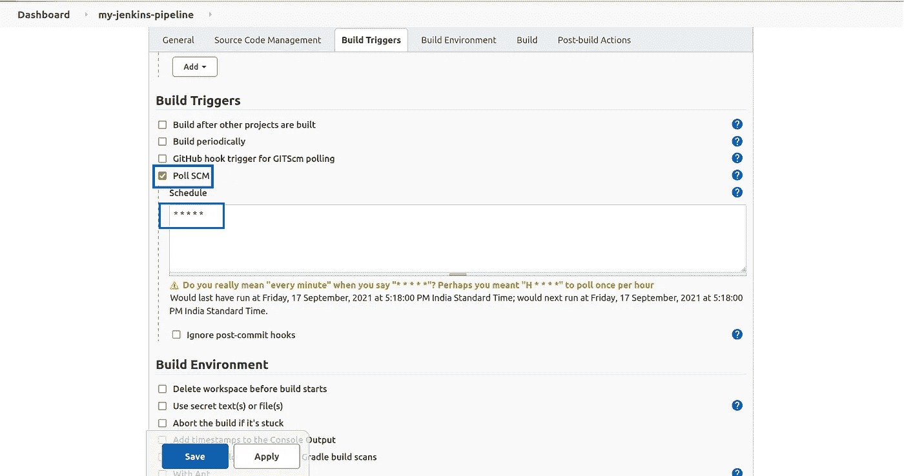
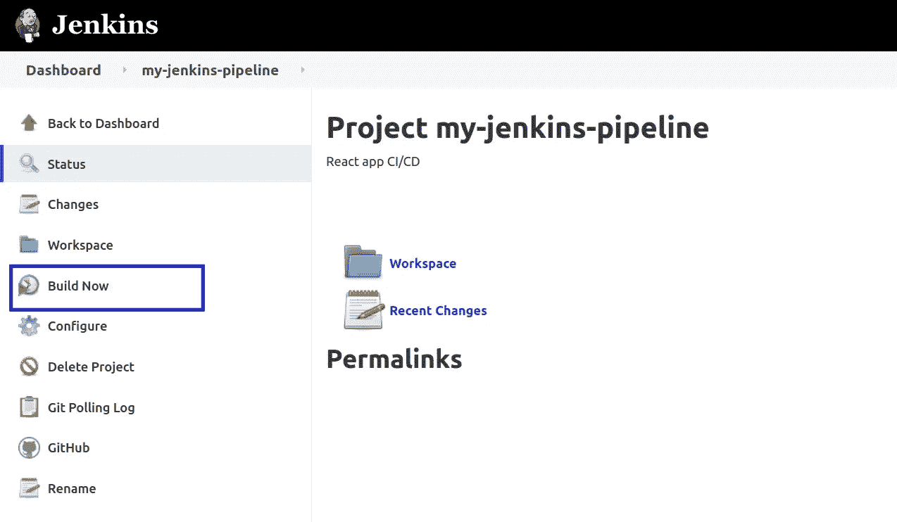
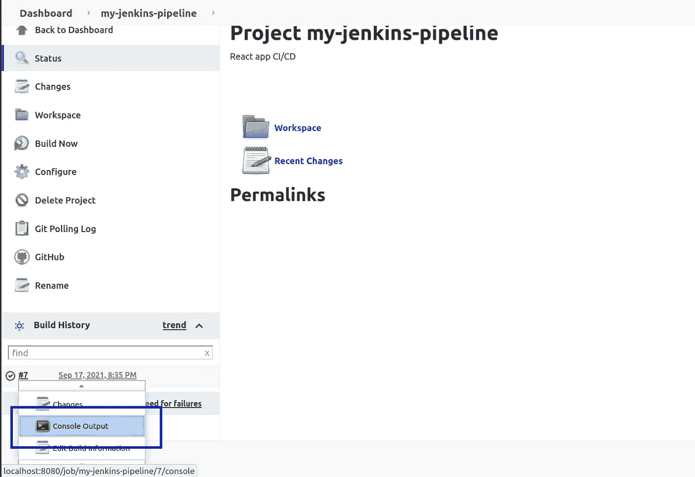

# 与 Jenkins 和 GitHub 一起创建您的第一个 CI/CD 渠道

> 原文：<https://towardsdatascience.com/create-your-first-ci-cd-pipeline-with-jenkins-and-github-6aefe21c9240?source=collection_archive---------2----------------------->

## 创建和部署自由式 Jenkins 项目的指南

在 [Unsplash](https://unsplash.com?utm_source=medium&utm_medium=referral) 上由 [Samuel Sianipar](https://unsplash.com/@samthewam24?utm_source=medium&utm_medium=referral) 拍照

因此，快速想象一下，您的团队每天都非常努力地工作，试图尽快推出新功能，但要将更新代码的项目带入测试和生产阶段，我们必须更新服务器，并确保在此过程中不出错。这里显而易见但费力的解决方案是手动将代码从版本控制中拉入服务器，运行测试并给它一个绿色标志，一切都好吗？可悲的是，没有！随着提交频率的增加，开发人员不得不一次又一次地进行整个服务器更新过程。

以下是手动更新服务器的方法:

1.  SSH 进入服务器。
2.  从 VCS 拉过来。
3.  启动应用程序之前，请检查配置。
4.  在容器中启动应用程序。
5.  检查日志并确保应用程序正在运行。
6.  结束 SSH 会话。

那么，如何自动化这个过程呢？进入开发运营模式，开发运营侧重于使开发和运营周期相互兼容，它试图将两者结合在一起。 [Jenkins](https://www.jenkins.io/) 是一个用 Java 构建的 CI/CD 开发运营工具。

正如标题中所提到的，我们将看到 Jenkins 如何帮助我们消除这一手动流程并实现整个流程的自动化。

## 先决条件

在开始我们的食谱之前，让我们先弄清楚我们的配料。

> 本教程将使用安装在本地机器上的 Jenkins，以防您在远程计算机上使用它，用您的计算机 IP 替换 localhost

首先，需要将 Jenkins 安装在您尝试部署的计算机上，安装说明如下:[https://www.jenkins.io/doc/book/installing/](https://www.jenkins.io/doc/book/installing/)。其次，这个演示将使用 docker，所以如果你想在你的系统上安装 docker，请参考:[https://docs.docker.com/engine/install/](https://docs.docker.com/engine/install/)。

如果你想学习 docker，我创建了一个 GitHub 库来解释 docker 的基础和中间概念。解释用简单的英语组织在降价文件中，每节课后都会提到一些资源。

<https://github.com/pratik-choudhari/docker-guide>  

最后，我们需要在 GitHub 这样的 VCS 上建立一个项目存储库。

## 安装后步骤

一旦 Jenkins 安装完成，进入 [http://localhost:8080](http://localhost:8080) ，会出现一个屏幕要求你解锁 Jenkins。要设置您的用户，这是一个强制性的过程，请遵循以下指南:[https://www . Jenkins . io/doc/book/installing/Linux/# setup-wizard](https://www.jenkins.io/doc/book/installing/linux/#setup-wizard)

## 创建詹金斯项目

詹金斯有两种类型的项目，自由式和管道。两者的主要区别在于，管道项目遵循特定的流程，可以有多个代理和阶段来构建、测试和部署项目。自由式项目很容易设置和开始。现在让我们从项目配置开始。

登录后，您会看到这样的屏幕。这是 Jenkins 主页或仪表板，用户可以在这里看到所有创建的管道和管道摘要。

詹金斯仪表板

在这里，我们必须点击左上方的**新项目**，然后输入项目名称，点击**自由式项目**，点击**确定**

下一步是用 VCS 信息配置我们的项目，我将使用 GitHub 作为 VCS。勾选 **GitHub 项目**并输入资源库 URL。

向下滚动一点，我们可以看到一个**源代码管理**表单，要求提供登录 VCS 和要使用的分支的凭证。在全新安装的情况下，需要向 Jenkins 添加凭证，为此，请单击**添加**按钮，输入您的用户名和密码，然后单击**添加**。

现在我们进入**构建触发器部分，**在这里我们设置触发器，它将告诉 Jenkins 何时构建一个项目。最常见和最有效的方法是使用网络挂钩。

> Web 挂钩允许通过使用自定义回调在基于 web 的应用程序之间进行交互。web 挂钩的使用允许 web 应用程序自动与其他 web 应用程序通信。web-hook 被设置为在某个事件发生时触发。

*来源:*[*GeeksForGeeks*](https://www.geeksforgeeks.org/what-is-a-webhook-and-how-to-use-it/)

在我们的例子中，触发 webhook 的事件将是对远程存储库的推送操作。在本教程中，我们不打算使用 webhooks，而是使用 **Poll SCM** 选项，该选项的作用是根据预定义的时间表不断查询 VCS，以发现新的变化。如果遇到新的变化，Jenkins 将开始项目构建步骤。

这里使用的预定义时间表是**** * * * * ****，这是每分钟的时间表，Jenkins 使用类似 Crontab 的语法，在 [crontab.guru](https://crontab.guru/) 上探索格式。

剩下的唯一一步是编写构建命令，直接进入**构建**部分，在分离模式下编写 docker 构建和运行命令。

我们已经完成了项目设置，最后一步是点击屏幕底部的**保存**，并通过点击**立即构建**按钮开始第一次构建。

如果构建成功，构建号将显示一个绿色勾号图标，您的应用程序将在定义的网络的指定端口上发布，在我们的示例中，应用程序将在 localhost:3000 上运行。您可以通过单击内部版本号旁边的下拉菜单来检查构建过程的控制台输出。

在这个控制台输出的帮助下，用户可以调试构建过程。

## 结论

希望您能够跟随并成功完成您的第一个构建。我很乐意在评论中回答你的疑问。感谢阅读！保持联系，获取更多关于自动化和 python 项目的教程。