# 在 FastAPI 中创建您的第一个 REST API

> 原文：<https://towardsdatascience.com/create-your-first-rest-api-in-fastapi-e728ae649a60?source=collection_archive---------7----------------------->

## 用 Python 创建高性能 API 的分步指南


尼古拉斯·霍伊泽在 [Unsplash](https://unsplash.com/s/photos/fast?utm_source=unsplash&utm_medium=referral&utm_content=creditCopyText) 上拍摄的照片

在这篇文章中，我将介绍 **FastAPI** :一个基于 Python 的框架来创建 Rest APIs。我将向您简要介绍这个框架的一些基本特性，然后我们将为联系人管理系统创建一组简单的 API。使用这个框架，Python 知识是非常必要的。

在我们讨论 FastAPI 框架之前，让我们先谈谈 REST 本身。

来自维基百科:

> **表述性状态转移(REST)** 是一种软件架构风格，它定义了一组用于创建 Web 服务的约束。符合 REST 架构风格的 Web 服务，称为 RESTful Web 服务，提供互联网上计算机系统之间的互操作性。RESTful Web 服务允许请求系统通过使用一组统一的、预定义的无状态操作来访问和操作 Web 资源的文本表示。其他种类的 Web 服务，如 SOAP Web 服务，公开了它们自己的任意操作集。[1]

# 什么是 FastAPI 框架？

来自官方[网站](https://fastapi.tiangolo.com/):

> FastAPI 是一个现代、快速(高性能)的 web 框架，用于基于标准 Python 类型提示用 Python 3.6+构建 API。

是的，它是[快](https://fastapi.tiangolo.com/benchmarks/)，[非常快](https://www.techempower.com/benchmarks/#section=test&runid=7464e520-0dc2-473d-bd34-dbdfd7e85911&hw=ph&test=query&l=zijzen-7)，这是由于对 **Python 3.6+** 的*异步*特性的开箱即用支持，这就是为什么建议使用最新版本的 Python。


FastAPI 是由塞巴斯蒂安·拉米雷斯创建的，他对现有的框架如 Flask 和 DRF 并不满意。你可以在这里了解更多。他们网站上提到的一些主要功能有:

*   **快**:非常高的性能，与 **NodeJS** 和 **Go** 不相上下(感谢 Starlette 和 Pydantic)。[目前最快的 Python 框架之一](https://fastapi.tiangolo.com/#performance)。
*   **快速编码**:将开发特性的速度提高 200%到 300%左右。*
*   **更少的 bug**:减少约 40%的人为(开发人员)导致的错误。*
*   **直观**:大编辑支持。无处不在的完成。调试时间更少。
*   **简单**:设计为易于使用和学习。减少阅读文件的时间。
*   **简短**:尽量减少代码重复。每个参数声明中的多个特性。更少的错误。
*   **健壮**:获得生产就绪代码。自动交互式文档。
*   基于标准:基于(并完全兼容)API 开放标准(Open API)

FastAPI 的创造者相信站在巨人的肩膀上，并使用现有的工具和框架，如 [Starlette](https://www.starlette.io/) 和 [Pydantic](https://pydantic-docs.helpmanual.io/)

# 安装和设置

我将使用 [Pipenv](https://pipenv-fork.readthedocs.io/en/latest/) 为我们的 API 设置开发环境。Pipenv 使隔离您的开发环境变得更加容易，不管您的机器上安装了什么。它还允许您选择不同于您机器上安装的 Python 版本。它使用`Pipfile`来管理所有与项目相关的依赖项。我不打算在这里详细介绍 Pipenv，所以将只使用项目所必需的命令。

运行`pip install pipenv`可以通过 PyPy 安装 Pipenv

`pipenv install --python 3.9`

安装后，您可以通过运行命令`pipenv shell`来激活虚拟环境


你也可以运行`pipenv install --three`，其中三表示 Python 3.x

安装后，您可以通过运行命令`pipenv shell`激活虚拟环境

首先，我们将通过运行以下命令安装**FastAPI**:`pipenv install fastapi`

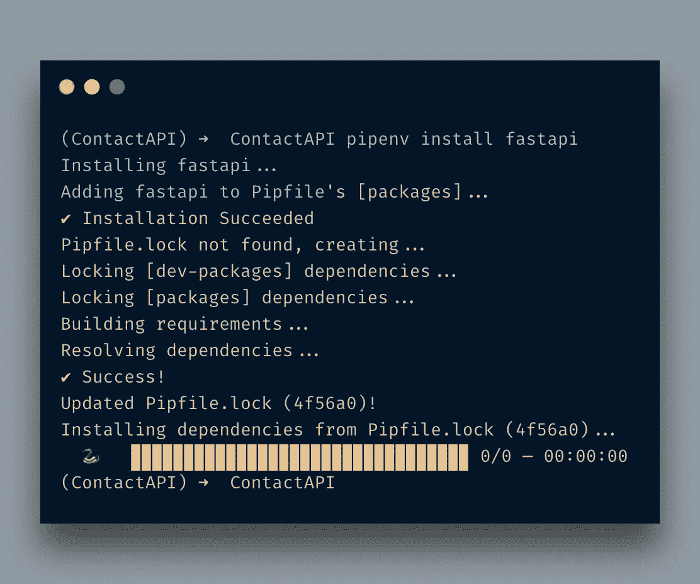

注意是 *pipenv* ，不是 pip。当您进入 shell 时，您将使用`pipenv`。底层使用 pip，但所有条目都存储在`Pipfile`中。下面的`Pipfile`会是什么样子:

好了，我们已经建立了我们的开发环境。是时候开始编写我们的第一个 API 端点了。我将创建一个名为`main.py`的文件。这将是我们 app 的切入点。

```
from fastapi import FastAPIapp = FastAPI()[@app](http://twitter.com/app).get("/")
def home():
    return {"Hello": "FastAPI"}
```

如果你在 Flask 上工作过，你会发现它非常相似。导入所需的库后，您创建了一个`app`实例，并用装饰器创建了您的第一条路线。

现在你想知道如何运行它。FastAPI 附带了一个 ASGI 服务器。您只需运行命令`uvicorn main:app --reload`

您提供的文件名( ***主*** )。py)和类对象( ***app*** 在这种情况下)，它将启动服务器。我使用了`--reload`标志，这样每次修改后它都会自动重新加载。

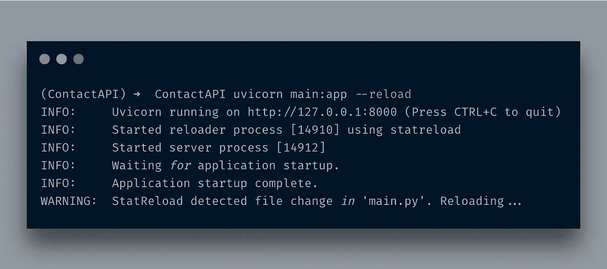

访问`http://localhost:8000/`，您将看到 JSON 格式的消息`{"Hello":"FastAPI"}`

很酷，不是吗？

FastAPI 也提供了一个 API 文档引擎。如果你访问的是使用 Swagger UI 界面的`http://localhost:8000/docs`。

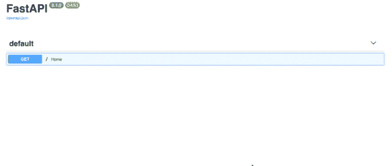

或者，如果你需要一些奇特的东西，请访问`[http://localhost:8080/redoc](http://localhost:8080/redoc)`

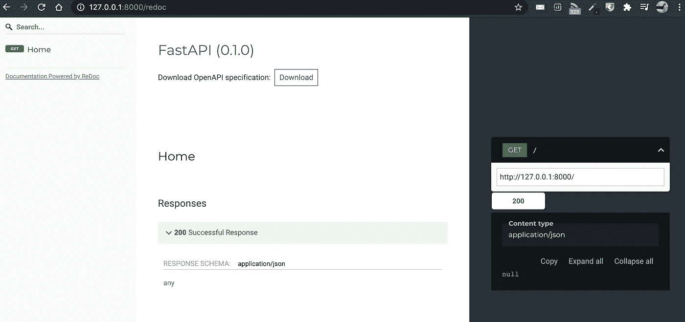

FastAPI 还提供了 API 端点的 OpenAPI 版本，比如这个`[http://127.0.0.1:8000/openapi.json](http://127.0.0.1:8000/openapi.json)`

# 路径和参数

让我们继续前进。我们添加了另一个 API 端点。比方说，它是关于通过 id 获取联系信息的。

```
[@app](http://twitter.com/app).get("/contact/{contact_id}")
def contact_details(contact_id: int):
    return {'contact_id': contact_id}
```

这里有一个方法，`contact_details`，它只接受一个`int`参数，并以`dict`格式返回它。现在，当我通过 **cURL** 访问它时，它看起来如下:

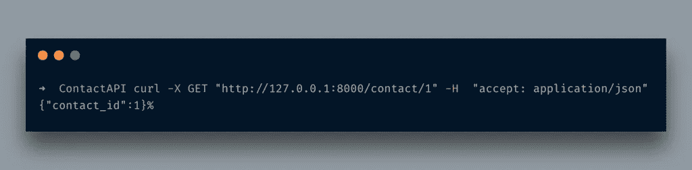

现在，如果我传递一个字符串而不是一个整数呢？你会看到下面的

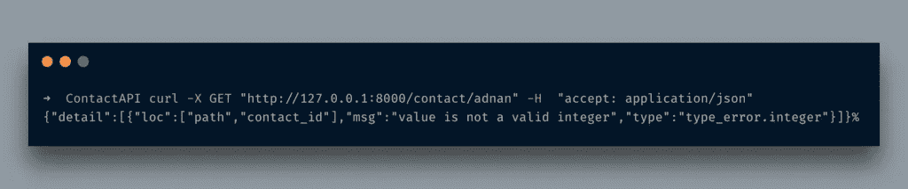

你看到了吗？它返回一条错误消息，指出您发送了错误的数据类型。您不需要为这些琐碎的事情编写验证器。这就是在*法斯塔皮*工作的美妙之处。

# 查询字符串

如果以查询字符串的形式传递额外的数据会怎样？例如，您的 API 端点返回大量记录，因此您需要分页。嗯，没问题，你也可以获取这些信息。

首先，我们将导入`Optional`类型:

`from typing import Optional`

```
[@app](http://twitter.com/app).get("/contact/{contact_id}")
def contact_details(contact_id: int, page: Optional[int] = 1):
    if page:
        return {'contact_id': contact_id, 'page': page}
    return {'contact_id': contact_id}
```

在这里，我传递了另一个参数`page`，并在这里设置了它的类型`Optional[int]`。可选的，顾名思义它是一个*可选的*参数。设置类型`int`是为了确保它只接受整数值，否则就会像上面那样抛出一个错误。

访问网址`http://127.0.0.1:8000/contact/1?page=5`，你会看到如下内容:

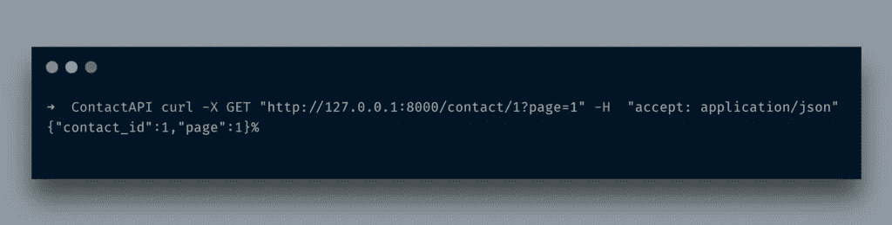

很酷，不是吗？

到目前为止，我们只是手动返回了`dict`。一点也不酷。输入一个值并返回一个 YUUGE JSON 结构是很常见的。FastAPI 提供了一种优雅的方式来处理它，使用 [Pydantic 模型](https://pydantic-docs.helpmanual.io/usage/models/)。

*Pydantic* 模型实际上有助于数据验证，这意味着什么？这意味着它确保被传递的数据是有效的，否则它返回一个错误。我们已经在使用 Python 的类型提示，这些数据模型使得净化的数据被传递。让我们写一点代码。为此，我将再次扩展 contact API。

```
from typing import Optionalfrom fastapi import FastAPI
from pydantic import BaseModel
app = FastAPI()class Contact(BaseModel):
    contact_id:int
    first_name:str
    last_name:str
    user_name:str
    password:str[@app](http://twitter.com/app).post('/contact')
async def create_contact(contact: Contact):
    return contact
```

我从 pydantic 导入了`BaseModel`类。之后，我创建了一个扩展了`BaseModel`类的模型类，并在其中设置了 3 个字段。请注意，我还设置了它的类型。完成后，我创建了一个`POST` API 端点，并向其传递了一个`Contact`参数。我在这里也使用了`async`，它将简单的 python 函数转换成一个*协程*。FastAPI 支持开箱即用。

转到`http://localhost:8080/docs`，您将看到如下内容:

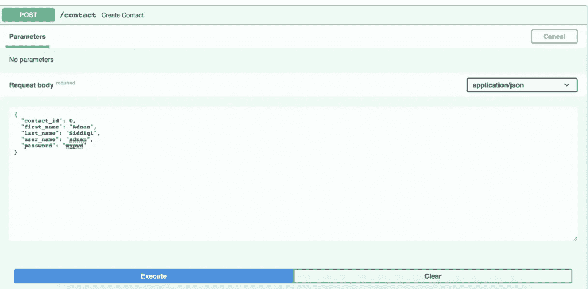

当您运行 CURL 命令时，您会看到如下所示的内容:

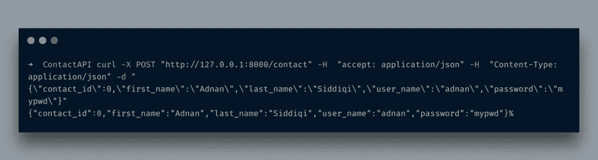

正如所料，它只是以 JSON 格式返回了`Contact`对象。

正如您注意到的，它只是以 JSON 格式转储整个模型，包括密码。即使您的密码不是纯文本格式，它也没有意义。那怎么办呢？[响应模型](https://fastapi.tiangolo.com/tutorial/response-model/?h=+response+model)就是答案。

# 什么是响应模型

顾名思义，*响应模型*是针对请求发送响应时使用的模型。基本上，当你使用一个模型时，它会返回所有的字段。通过使用响应模型，您可以控制应该向用户返回哪种数据。让我们稍微改变一下代码。

```
class Contact(BaseModel):
    contact_id:int
    first_name:str
    last_name:str
    user_name:str
    password:strclass ContactOut(BaseModel):
    contact_id:int
    first_name:str
    last_name:str
    user_name:str[@app](http://twitter.com/app).get("/")
def home():
    return {"Hello": "FastAPI"}[@app](http://twitter.com/app).post('/contact', response_model=ContactOut)
async def create_contact(contact: Contact):
    return contact
```

我添加了另一个类，`ContactOut`，它几乎是`Contact`类的副本。这里唯一不同的是没有了`password`字段。为了使用它，我们将在 *post* 装饰器的`response_model`参数中分配它。就是这样。现在，当我运行点击相同的网址，它不会返回密码字段。

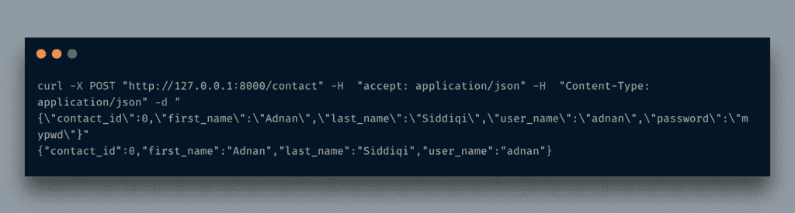

如您所见，这里没有可见的密码字段。如果你注意到了`/docs`的网址，你也会在那里看到它。

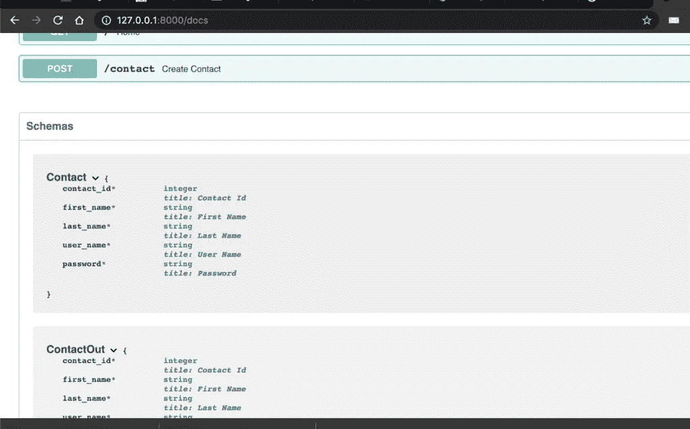

如果您愿意在多个方法中使用不同的响应模型，那么使用不同的响应模型是可行的，但是如果您只想从一个方法中省略机密信息，那么您也可以在装饰器中使用`response_model_exclude`参数。

```
[@app](http://twitter.com/app).post('/contact', response_model=Contact, response_model_exclude={"password"})
async def create_contact(contact: Contact):
    return contact
```

输出将是相似的。您在这里设置`response_model`和`response_model_exclude`。结果是一样的。您还可以将元数据附加到 API 端点。

```
[@app](http://twitter.com/app).post('/contact', response_model=Contact, response_model_exclude={"password"},description="Create a single contact")
async def create_contact(contact: Contact):
    return contact
```

我们添加了此端点的描述，您可以在文档中看到。

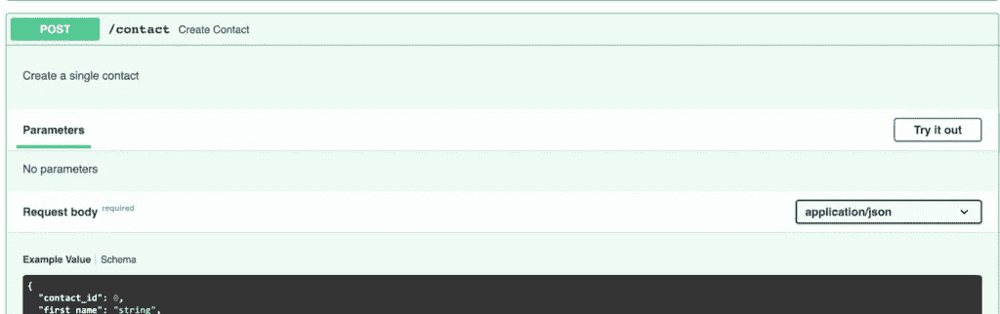

FastAPI 文档的精彩并没有到此结束，它还让您设置模型的示例 JSON 结构。

```
class Contact(BaseModel):
    contact_id:int
    first_name:str
    last_name:str
    user_name:str
    password:strclass Config:
        schema_extra = {
            "example": {
                "contact_id": 1,
                "first_name": "Jhon",
                "last_name": "Doe",
                "user_name": "jhon_123",
            }
        }
```

当你这样做的时候，它会呈现为:

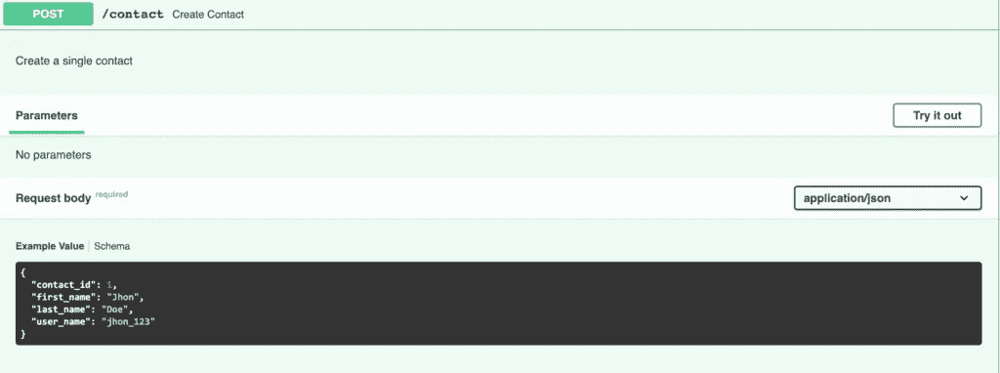

# FastAPI 中的错误处理

你总是有可能得不到所需的信息。FastAPI 提供了`HTTPException`类来处理这样的情况。

```
[@app](http://twitter.com/app).get("/contact/{id}", response_model=Contact, response_model_exclude={"password"},description="Fetch a single contact")
async def contact_details(id: int):
    if id < 1:
        raise HTTPException(status_code=404, detail="The required contact details not found")
    contact = Contact(contact_id=id, first_name='Adnan', last_name='Siddiqi', user_name='adnan1', password='adn34')
    return contact
```

简单的端点。它根据 id 返回联系信息。如果`id`小于 1，则返回一条 *404* 错误消息，并提供详细信息。

在我离开之前，让我告诉你如何发送自定义标题。

```
from fastapi import FastAPI, HTTPException, Response[@app](http://twitter.com/app).get("/contact/{id}", response_model=Contact, response_model_exclude={"password"},
         description="Fetch a single contact")
async def contact_details(id: int, response: Response):
    response.headers["X-LOL"] = "1"
    if id < 1:
        raise HTTPException(status_code=404, detail="The required contact details not found")
    contact = Contact(contact_id=id, first_name='Adnan', last_name='Siddiqi', user_name='adnan1', password='adn34')
    return contact
```

在导入了`Response`类之后，我传递了`Request`类型的`request`参数，并设置了头文件`X-LOL`

运行 curl 命令后，您会看到类似下面的内容:

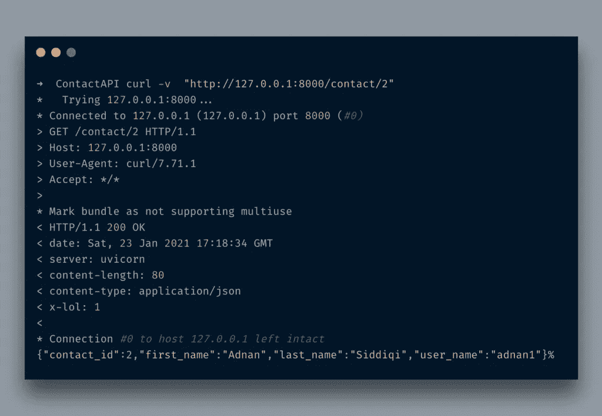

你可以在标题中找到`x-lol`。LOL！

# 结论

因此，在这篇文章中，您了解了如何开始使用 FastAPI 构建高性能 API。我们已经有了一个名为 Flask 的最小框架，但 FastAPI 的异步支持使它对现代生产系统非常有吸引力，尤其是通过 REST APIs 访问的机器学习模型。我只是触及了它的表面。可以在[官方 FastAPI](https://fastapi.tiangolo.com/) 网站进一步了解。

希望在下一篇文章中，我会讨论一些高级的话题，比如与数据库集成、认证和其他事情。

*原载于 2021 年 1 月 23 日*[*http://blog . adnansiddiqi . me*](http://blog.adnansiddiqi.me/create-your-first-rest-api-in-fastapi/)*。*