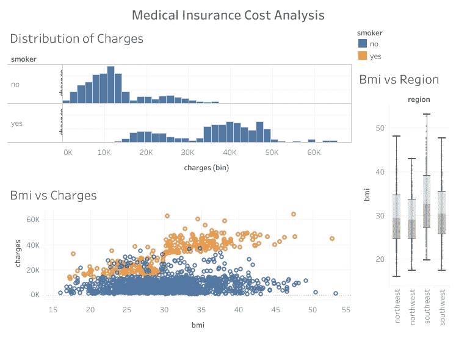
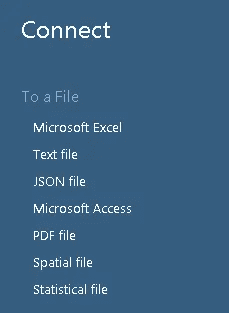
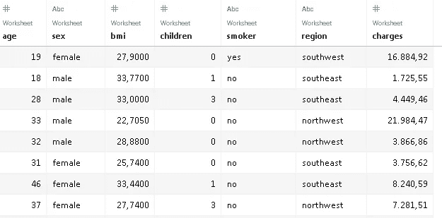
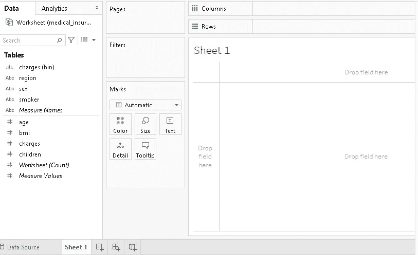
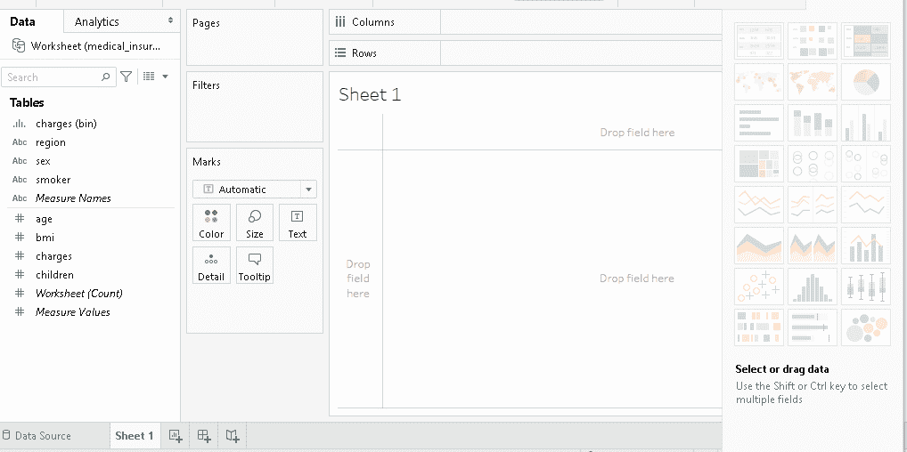
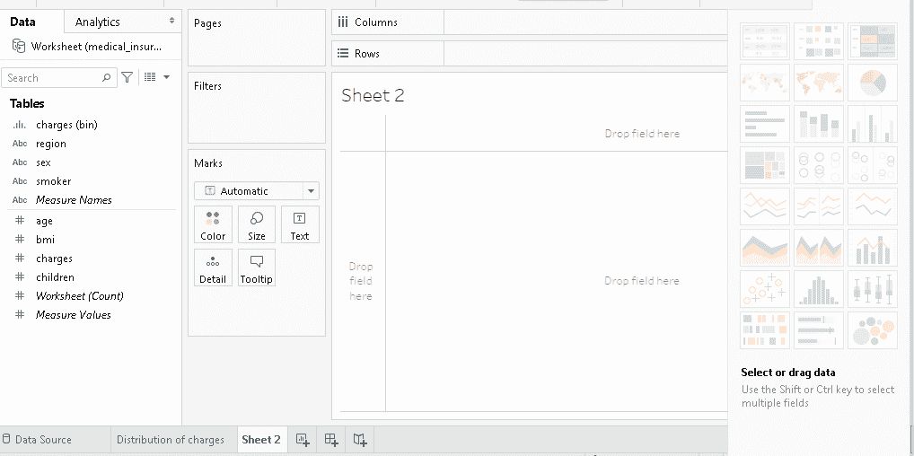
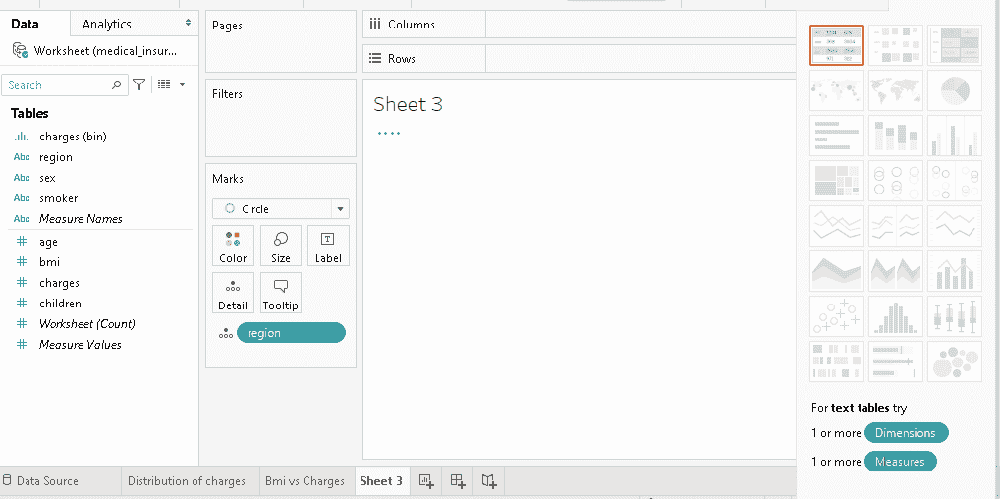
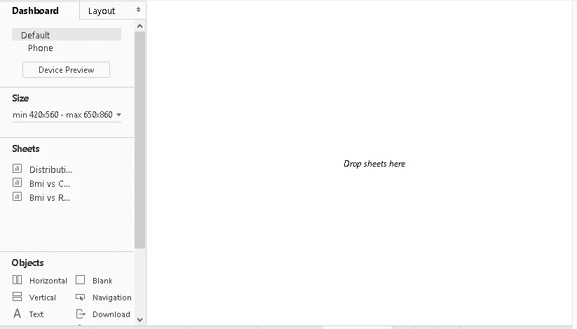
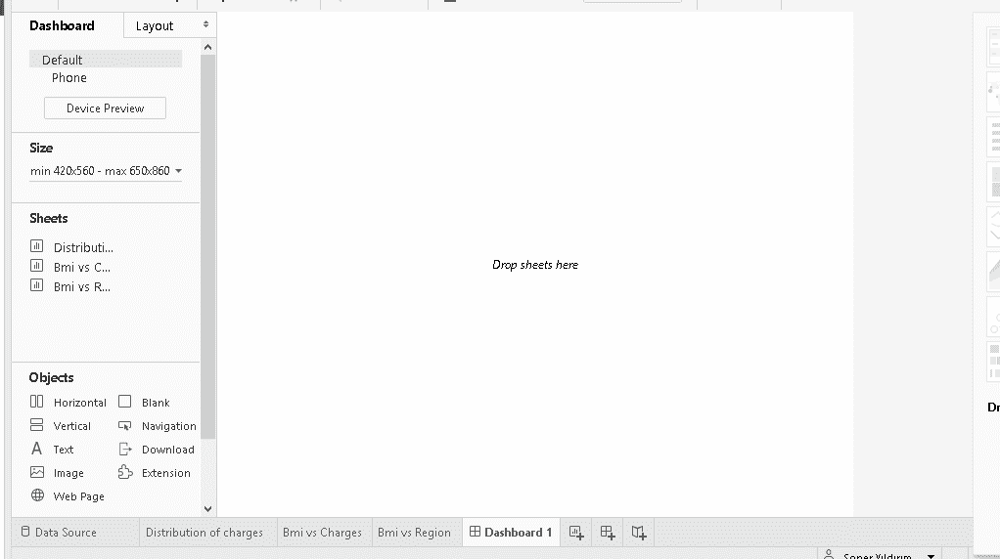
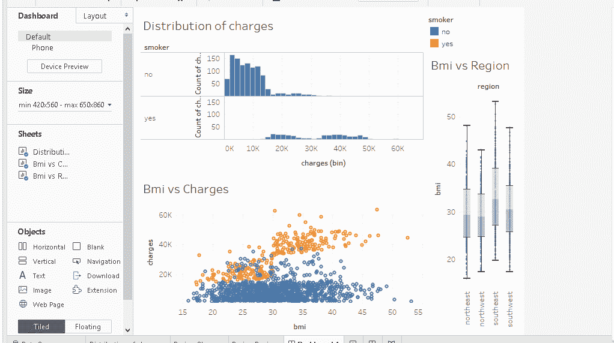

# 立即创建您的第一个 Tableau 仪表板

> 原文：<https://towardsdatascience.com/create-your-first-tableau-dashboard-in-no-time-203700cc7e0c?source=collection_archive---------35----------------------->

## Tableau 的实用介绍

(图片由作者提供)

数据可视化是数据科学不可或缺的一部分。设计良好的可视化是数据探索的一个好方法。与简单的数字相比，通过数据可视化来传递你的发现也更加直观和高效。

Tableau 是创建数据可视化的强大而高效的工具。它允许创建高度信息化的情节，而无需编写任何代码。此外，多个可视化可以很容易地结合到一个仪表板。

Tableau 还提供 Tableau Public，这是一个免费的平台，可以公开分享你的仪表盘。这是展示你的技能和创造力的好方法。

下载 Tableau 桌面的[公版](https://public.tableau.com/en-us/s/)即可免费使用 Tableau，该公版适用于 Windows 和 Mac。在本文中，我们将使用 public edition 创建一个简单的仪表板。我们将使用来自 Kaggle 的包含医疗保险数据的[数据集](https://www.kaggle.com/mirichoi0218/insurance)。

第一步是添加到数据源的连接。这里强调“连接”这个词很重要，因为 Tableau 连接到数据文件并使用它来创建可视化。它不编辑原始文件。

(图片由作者提供)

我们选择适当的格式，然后导航到保存数据集的文件。

Tableau 连接到文件后，它会提供数据源的概述，并自动创建一个工作表。

数据源(图片由作者提供)

工作表用于在 Tableau 中创建可视化效果，因此我们从左下角选择工作表。默认情况下，它被称为“工作表 1”，但我们可以将其重命名。

(图片由作者提供)

列名显示在左窗格中。我们可以将列拖放到工作表中。我们将创建一个具有三种数据可视化的仪表板。

第一个是包含保险成本的 charges 列的直方图。我们将 charges 列拖到 rows 部分，并选择右侧窗格中的直方图符号。让我们也根据吸烟者列来区分行，以便我们可以看到吸烟对费用的影响。这是通过在 rows 部分添加 smoker 列来实现的。

下面的屏幕记录显示了我们刚刚提到的步骤。

直方图(作者提供的 gif)

就是这样！在 Tableau 中创建直方图就是这么简单。您可能已经注意到了列名旁边的缩写，如 bin 和 CNT。它们表示应用于数据的聚合。我们可以从列名的下拉菜单中更改或自定义聚合。

我们清楚地看到，总体而言，吸烟者的医疗保险费用更高。

最好给工作表一个描述性的名称，这可以通过右键单击工作表的名称来完成。在我们的例子中，我将其重命名为“电荷分布”。

第二个可视化是散点图。我们通过单击左下方工作表名称旁边的图标来创建一个新工作表。

下面是我们如何在 Tableau 中创建散点图:

散点图(作者 gif)

我们将“费用”列拖到“行”部分。在这种情况下，我们不需要任何聚合，所以我们选择它作为一个维度。我们对 bmi 列进行了同样的操作，但是是在列部分。然后 Tableau 自动生成散点图。

我们可以通过在标记窗格下的颜色部分添加吸烟者列，使用不同的颜色来区分吸烟者和非吸烟者。代表数据点的圆圈的大小也可以在这里调整。

第二次可视化完成。我会将其重命名为“Bmi 与费用”，然后为下一个图创建一个新的工作表。

第三个可视化图形是一个显示不同地区 bmi 柱分布的箱线图。

我们将 bmi 列放在 rows 部分，将 region 列放在 columns 部分。然后我们将 bmi 列更改为一个维度。

正如我们可以在屏幕记录中看到的，当列被放入部分中时，绘图选项会在右窗格中突出显示。

方框图(作者 gif)

我将把方框图重新命名为“Bmi 与区域”。它概述了不同地区之间 bmi 值分布的差异。东南部地区的 bmi 值普遍较高。

我们已经使用医疗保险费用数据集创建了三个可视化。下一步是将它们合并到一个仪表板中。我们通过单击工作表旁边左下方的新仪表板图标来创建一个空仪表板。

仪表板(作者图片)

包含可视化效果的工作表显示在左侧。我们现在可以使用工作表自定义控制面板。

填充仪表板(gif by author)

我们可以进行许多定制，以使仪表板更具信息性、功能性和吸引力。例如，我们可以添加一个标题，并将一个特定的可视化设置为过滤器。我们也可以调整大小。

自定义仪表板(gif by author)

我们的仪表板现在已经完成。我们可以将其保存到我们的 Tableau 公共个人资料中，并与其他人分享。这是我的 Tableau 公共配置文件中仪表板的最终版本。

(图片由作者提供)

## 结论

我们创建了一个简单的仪表板。Tableau 是一个高度通用和实用的工具，因此它可以用来创建更高级的仪表板。然而，最好先理解基础知识。

成为高级 Tableau 用户需要大量的练习。如果您正在或计划在数据科学领域工作，这是一个非常重要的工具。

感谢您的阅读。如果您有任何反馈，请告诉我。