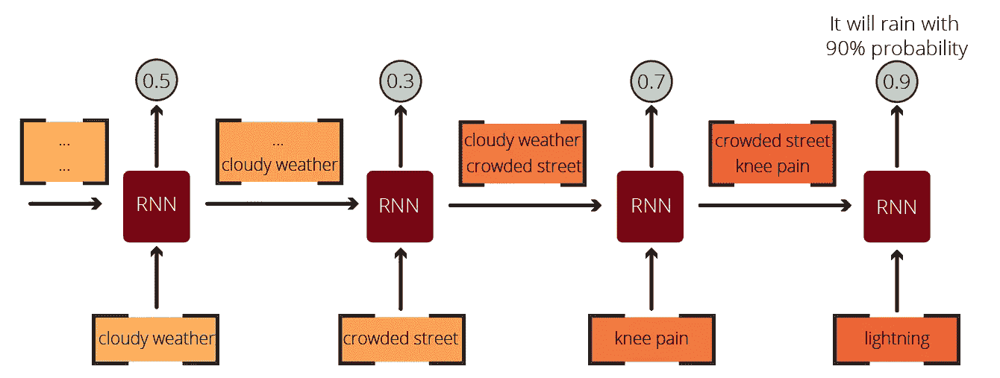

# 用自然语言处理在 10 分钟内创造你自己的人造莎士比亚

> 原文：<https://towardsdatascience.com/create-your-own-artificial-shakespeare-in-10-minutes-with-natural-language-processing-1fde5edc8f28?source=collection_archive---------7----------------------->

## [第一部分](/mastering-word-embeddings-in-10-minutes-with-tensorflow-41e25da6aa54) | [第二部分](/mastering-word-embeddings-in-10-minutes-with-imdb-reviews-c345f83e054e) | [第三部分](/sentiment-analysis-in-10-minutes-with-bert-and-hugging-face-294e8a04b671) |自然语言处理

## 使用递归神经网络和莎士比亚语料库生成莎士比亚风格的文学作品

图一。由[杰西卡·潘普](https://unsplash.com/@yessijes?utm_source=medium&utm_medium=referral)在 [Unsplash](https://unsplash.com?utm_source=medium&utm_medium=referral) 上拍摄的照片

I

研究表明，用于自然语言处理任务的最有效的人工神经网络类型之一是递归神经网络(RNNs)。rnn 广泛应用于自然语言处理任务，如机器翻译、文本生成、图像字幕等。在 NLP 任务中，我们通常使用 NLP 工具和方法将文本数据处理成向量，然后将它们馈送到选定的人工神经网络，如 RNN、CNN，甚至前馈神经网络，以完成任务。在本帖中，我们将遵循这两个标准化的步骤:(1)将文本处理成向量，(2)用这些向量训练神经网络。

# 递归神经网络和序列文本数据

在深入我们的教程之前，我们需要讨论一下递归神经网络和顺序数据，因为文本数据具有顺序性。

> [递归神经网络(RNN)是一类人工神经网络，其中神经元之间的连接形成时间序列。](https://en.wikipedia.org/wiki/Recurrent_neural_network)

能够捕获动态时间信息(时间记忆)的 rnn。递归神经网络源自前馈神经网络，但是它们提供了更多。

## 为什么不是前馈神经网络？

普通前馈神经网络有三个主要限制，使它们不适合序列数据:

*   前馈神经网络不能考虑阶数；
*   前馈神经网络需要固定的输入大小；
*   前馈神经网络不能输出不同长度的预测。

文本数据的基本特征之一是其顺序的重要性。就像重新排列月销售额的顺序可以将我们从上升趋势引向下降趋势一样，重新排列句子中单词的顺序可以完全改变或扭曲它的意思。这就是前馈神经网络的局限性所在。在前馈神经网络中，由于这种限制，不能考虑数据的顺序。重新安排月销售额的顺序会得到同样的结果，这证明他们不能利用投入的顺序。

图二。深度学习中的潜在序列数据任务(图由作者提供)

## 递归神经网络拯救世界

RNN 通过将以前的信息保存在内存中来使用它们，这些信息以“状态”的形式保存在 RNN 神经元中。有几种类型的 RNN，如香草 RNN，GRU 和 LSTM。

下面用一个基本的天气预报例子来说一下记忆结构。我们想通过使用序列中提供的信息来猜测是否会下雨。该数据序列可以从文本、语音或视频中获得。每有新的信息，我们就慢慢更新降雨的概率，最后得出结论。图 3 显示了这项任务:

图 3。一个简单的天气预报任务:会下雨吗？(图由作者提供)

在图 3 中，我们首先记录了多云天气。这一单一信息可能指示降雨，这计算成 50%(或 0.5)的降雨概率。然后，我们收到以下输入:一条拥挤的街道。拥挤的街道意味着人们在外面，这意味着降雨的可能性更小，因此，我们的估计下降到 30%(或 0.3)。然后，我们被提供了更多的信息:膝盖疼痛。人们认为风湿病患者在下雨前会感到膝盖疼痛。因此，我的估计上升到 70%(或 0.7)。最后，当我们的模型将闪电作为最新信息时，集体估计增加到 90%(或 0.9)。在每个时间间隔，我们的神经元使用它的记忆——包含以前的信息，并在这个记忆的基础上添加新的信息，来计算降雨的可能性。可以在层级别以及单元级别设置存储器结构。图 4 示出了细胞水平的 RNN 机制，(I)左边是折叠版本，右边是展开版本。

图 4。一种基于细胞的递归神经网络活动(图片由作者提供)

## RNN 类型

如前所述，RNNs 有许多不同的变体。在本节中，我们将介绍我们经常遇到的三种 RNN:

*   简单的 RNN
*   长短期记忆(LSTM)网络
*   门控循环单元(GRU)网络

您可以在图 5 中找到这些备选 RNN 单元的可视化效果:

图 5。递归神经网络的 3 种流行变体:香草 RNN、GRU、LSTM

> **门控循环单元(gru)——**门控循环单元由 Kyunghyun Cho 于 2014 年推出。正如 LSTMs 一样，gru 也是 RNNs 中处理序列数据的门控机制。然而，为了简化计算过程，GRUs 使用两个门:(I)复位门和(ii)更新门。gru 也为隐藏状态和单元状态使用相同的值。图 5 显示了门控循环单元的内部结构:

# 基于莎士比亚语料库的神经文本生成

在这个案例研究中，我们的目标是训练一个能够从字符中生成有意义文本的 RNN。RNN 可以从单词和字符中生成文本，我们选择使用字符来生成这个案例研究的文本。

当我们建立一个没有经过训练的新 RNN 时，它组合了一堆毫无意义的字符，这没有任何意义。然而，如果我们给我们的 RNN 输入大量文本数据，它就会开始模仿这些文本的风格，并使用字符生成有意义的文本。

所以，如果我们给模型输入大量说教性的文本，我们的模型就会生成教育材料。如果我们给我们的模型输入大量的诗歌，我们的模型将生成诗歌，所以我们将有一个人工诗人。这些都是可行的选择，但是我们将为我们的模型提供一些其他的东西:一个包含莎士比亚作品的长文本数据集。因此，我们将创建一个莎士比亚机器人。

## 莎士比亚文集

图 6。维基媒体上的一本莎士比亚的书

莎士比亚语料库(Shakespeare Corpus)是一个包含 40000 行莎士比亚作品的文本文件，由 Karpathy 清理和准备，由 TensorFlow 团队托管。我强烈建议您看一下`.txt`文件，以理解我们正在处理的文本。该文件包含对话内容，其中每个角色的名字放在相应部分的前面，如图 7 所示。

图 7。莎士比亚语料库中的随机样本文本(图由作者提供)

## 初始进口

在本案例研究中，所需的库是 TensorFlow、NumPy 和 os，我们可以使用以下代码导入它们:

要从在线目录加载数据集，我们可以使用 TensorFlow 中 Keras API 的 util 模块。对于这个任务，我们将使用`get_file()`函数，如果文件不在缓存中，它将从 URL 下载文件，代码如下:

下载完我们的文件后，我们可以用下面的 Python 代码从缓存中读取文件。现在，我们成功地将整个语料库作为变量保存在了 Colab 笔记本的内存中。让我们看看语料库中有多少个字符，前 100 个字符是什么，代码如下:

图 8。语料库的前 100 个字符(由作者提供)

我们的整个语料库可以通过一个名为`*text*`的 Python 变量来访问，现在我们可以开始对它进行矢量化了。

# 向量化文本

文本矢量化是一种基本的 NLP 方法，用于将文本数据转换为机器可以理解的有意义的数字向量。文本矢量化有多种方法。在本案例研究中，我们是这样一步步进行的:

*   给每个独特的字符一个索引号；
*   在语料库中运行一个 for 循环，并索引整篇文本中的每个字符。

为了给每个独特的字符一个索引号，我们首先要找到文本文件中所有独特的字符。使用内置的`set()`函数很容易做到这一点，该函数将 list 对象转换为 set 对象。

> T `*he difference between set and list data structures is that lists are ordered and allow duplicates while sets are unordered and don’t allow duplicate elements. So, when we run the set() function -as shown in the below code-, it returns a set of unique characters in the text file.*`

**输出:**

图 9。唯一字符列表的一部分(图由作者提供)

我们还需要给每个字符一个索引号。下面的代码为每个集合项分配一个数字，然后用给定的数字创建一个集合项字典。我们还制作了 NumPy 数组格式的唯一集合元素的副本，供以后解码预测时使用。然后，我们可以使用一个简单的 for 循环对文本进行矢量化，遍历文本中的每个字符，分配它们对应的索引值，并将所有索引值保存为一个新列表，代码如下:

# 创建数据集

此时，我们用`char2idx`字典对文本进行矢量化，用`idx2char`对矢量化后的文本进行去矢量化(*即解码*)。最后，我们将`text_as_int`作为矢量化的 NumPy 数组。我们现在可以创建数据集了。

首先，我们将使用 Dataset 模块中的`from_tensor_slices`方法从我们的`text_as_int`对象中创建一个 TensorFlow Dataset 对象，我们将把它们分成几批。数据集的每个输入的长度限制为 100 个字符。我们可以用下面的代码实现所有这些:

我们的序列对象包含字符序列，但是我们必须创建一个这些序列的元组，以馈入 RNN 模型。我们可以通过下面的自定义映射函数来实现这一点:

我们生成这些元组的原因是为了让 RNN 工作，我们需要创建一个管道，如图 10 所示:

图 10。一个具有 4 维输入和输出层的 RNN 的例子。注意输入和输出字符之间的延迟。

最后，我们将数据集打乱，分成 64 个句子批次，每行如下:

# 构建模型

我们的数据已经准备好输入模型管道。让我们创建我们的模型。我们希望训练我们的模型，然后做出新的预测。首先，让我们用下面的代码设置一些参数:

现在，重要的是，我们的训练管道将在每一批输入 64 个句子。因此，我们需要构建我们的模型来一次接受 64 个输入句子。然而，在我们训练了我们的模型之后，我们想要输入单句来生成新的任务。所以，我们需要不同的训练前和训练后模型的批量大小。为了实现这一点，我们需要创建一个函数，它允许我们为不同的批量大小重现模型。下面的代码可以做到这一点:

我们的模型有三层:

*   **一个嵌入层:**这一层作为输入层，接受输入值(数字格式中的*)并转换成矢量。*
*   **GRU 层:**填充了 1024 个梯度下降单元的 RNN 层
*   **密集层:**输出结果，用`vocab_size`输出。

现在，我们可以使用以下代码创建我们的培训模型:

图 11 总结了我们的模型:

图 11。培训模型的概要视图(由作者提供的图)。请注意输出形状中的 64，对于训练后的单个预测，它必须为 1

# 编译和培训

为了编译我们的模型，我们需要配置我们的优化器和损失函数。对于这个任务，我们选择`Adam`作为我们的优化器，稀疏分类交叉熵函数作为我们的损失函数。

由于我们的输出总是 65 个字符中的一个，这是一个多类分类问题。因此，我们必须选择一个分类交叉熵函数。然而，在这个例子中，我们选择了分类交叉熵的一个变体:稀疏分类交叉熵。我们使用稀疏分类交叉熵，因为即使它们使用相同的损失函数，它们的输出格式也是不同的。请记住，我们将文本矢量化为整数(*，【2】，【1】，*)，而不是一键编码格式(*，例如【0，0，0】，【0，1】，【1，0，0】，*)。为了能够输出整数，我们必须使用稀疏分类交叉熵函数。

为了能够设置自定义损失函数，我们创建了一个包含稀疏分类交叉熵损失的基本函数:

现在，我们可以使用以下代码设置损失函数和优化器:

为了能够加载我们的重量并保存我们的训练成绩，我们需要使用以下代码设置和配置一个检查点目录:

我们的模型和检查点目录已经配置好了。我们将为我们的模型训练 30 个时期，并将训练历史保存到名为 history 的变量中，代码如下:

图 12。模特训练的最后八个时期(图由作者提供)

由于模型的简单性以及我们对模型的编码方式，我们的培训并不需要太长时间(*大约 3-4 分钟*)。现在，我们可以使用保存的权重，构建一个接受单个输入来生成文本的定制模型。

# 生成新文本

为了能够查看我们最新检查点的位置，我们需要运行以下代码:

现在，我们可以使用我们之前创建的自定义函数，使用保存在 *latest_checkpoint* 中的权重，用`batch_size=1`、`load_weights`构建一个新模型，使用 build 函数基于接收到的输入形状构建模型(*即【1，无】*)。我们可以用下面的代码实现所有这些和`summarize()`的新模型:

图 13。新创建的模型的概要视图(图由作者提供)。现在它接受单一输入。

我们的模型已经准备好进行预测，我们所需要的只是一个定制函数来为模型准备输入。我们必须设置以下内容:

*   要生成的字符数，
*   向量化输入(从字符串到数字)，
*   存储结果的空变量，
*   手动调整预测可变性的温度值，
*   对输出进行去因子化，并且还将输出再次馈送到模型用于下一次预测，
*   将所有生成的字符连接成一个最终字符串。

下面的自定义函数执行所有这些操作:

它返回我们的最终预测值，我们可以很容易地生成一个文本，我们可以使用下面的代码用内置的打印函数打印出来:

图 14。由我们的模型生成的 500 个字符长的文本(图由作者提供)

# 最后的话

使用门控循环单元和莎士比亚语料库，您为自己构建了一个能够生成任意长度文本的莎士比亚机器人。

> `*Note that our model uses characters, so the miracle of the model is that it learned to create meaningful words from characters. So, do not think that it adds a bunch of unrelated words together. It goes over thousands of words and learns the relationship between different characters and how they are used to create meaningful words. Then it replicates this and returns us sentences with meaningful words.*`

您可以随意使用 temperature，看看如何将输出从更合适的单词变成更失真的单词。较高的温度值会增加我们的功能选择不太可能的字符的机会。当我们把它们都加起来时，我们得到的结果就没那么有意义了。另一方面，低温会导致函数生成更简单的文本，更像是原始语料库的副本。

# 让我们保持联系

> 除了我的最新内容，我还与我的订户分享我的 [***Google Colab 笔记本***](https://medium.com/r?url=http%3A%2F%2Feepurl.com%2Fhd6Xfv) *，其中包含我发表的每篇文章的完整代码。如果你喜欢这篇文章，考虑订阅时事通讯:* [订阅时事通讯](http://eepurl.com/hd6Xfv)！✉️

既然您正在阅读这篇文章，我相信我们有着相似的兴趣，并且现在/将来会从事相似的行业。那么我们就通过[*Linkedin*](https://linkedin.com/in/orhangaziyalcin/)*来连线吧！请不要犹豫发送联系请求！*[*Orhan g . yaln—Linkedin*](https://linkedin.com/in/orhangaziyalcin/)