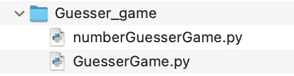
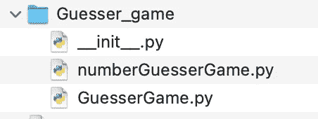
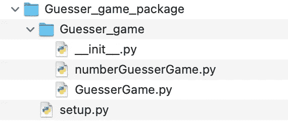
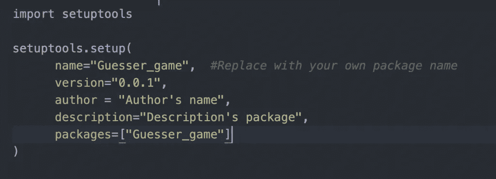
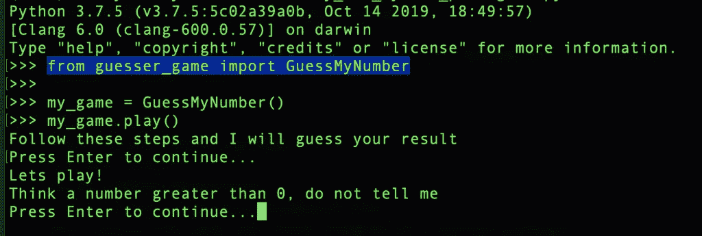
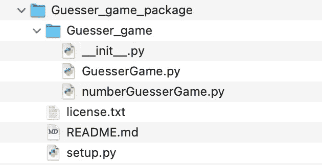
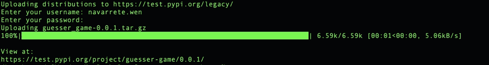
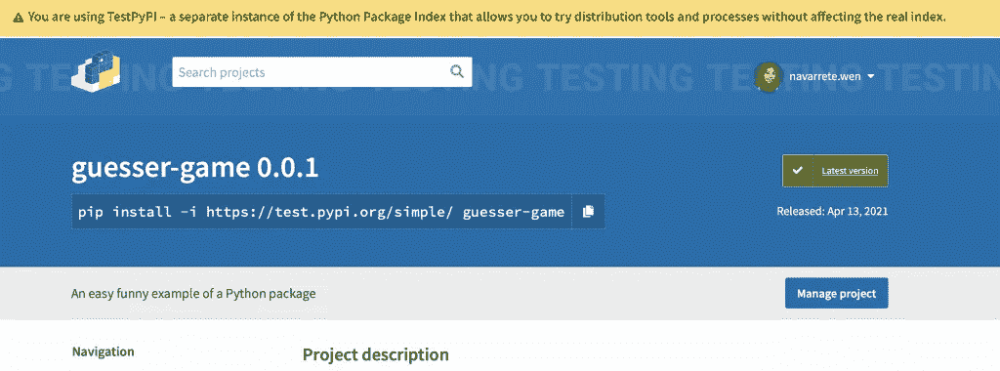
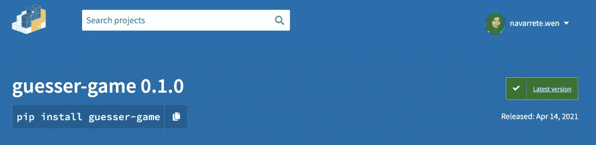

# 创建自己的 Python 包，并将其发布到 PyPI 中

> 原文：<https://towardsdatascience.com/create-your-own-python-package-and-publish-it-into-pypi-9306a29bc116?source=collection_archive---------3----------------------->

## 在本文中，您将找到将代码转换成 Python 包并将其上传到 Python 包索引站点的简单步骤


由 [Pixabay](https://pixabay.com/) 授权

# 您愿意与全球 Python 开发者社区分享您的代码吗？

# 开始吧！

我假设正在阅读本文的大多数人已经运行了下面的命令。但是，幕后发生了什么？

```
pip install pandas
```

在你运行命令 *pip install* 的时候，你正在访问 [PyPI 站点](https://pypi.org)来下载一个包。网站[https://pypi.org/](https://pypi.org/)是 Python 编程语言的软件仓库。

## 步骤 0:准备要共享的代码

作为一个例子，我将使用几个程序转换成一个 Python 包。这个代码是一个简单的游戏，能够“猜测”玩家心中的数字。你可以在我的 [GitHub 库](https://github.com/mwpnava/Python-Code/tree/master/My_own_Python_package)中看到代码。



文件夹内容。作者图片

## 步骤 1:创建 __init__。py 文件

创建一个名为 *__init__ 的文件。py* 并将其保存到您的代码所在的文件夹中。这个文件告诉 Python 这个文件夹包含一个 Python 包。 *__init__ 里面的代码。每当您在 Python 程序中导入一个包时，就会运行 py* 文件。在这种情况下，我的 *__init__。py* 文件正在从 numberGuesserGame 模块导入 *GuessMyNumber* 类。


__init__。py 文件内容。作者图片

现在，我的文件夹里有三个文件:



文件夹内容。作者图片

## 步骤 2:创建 setup.py 文件

在目录中向上一级，创建 *setup.py* 文件。



文件夹内容。作者图片

这个重要的文件包含关于包的信息。每次运行命令 *pip* ，它都会自动寻找 setup.py 文件。



setup.py 文件内容。作者图片

它主要包括对 *setup* 函数的调用，该函数接收参数以指定项目如何定义的细节，例如，*名称、作者、版本、描述等。*

## 步骤 3:在本地安装您的软件包

完成步骤 1 和 2 后，就可以在本地安装 Python 包了。首先，打开一个终端，转到包含您的软件包的文件夹，键入下面的命令。圆点表示在当前文件夹中查找 setup.py 文件，并在其中安装软件包。

```
pip install .
```

现在，您可以留在该文件夹中或移动到另一个文件夹来运行 Python 并使用您的包。让我们看看这个例子:



运行我的包。作者图片

## 步骤 4:创建许可证和自述文件

回到包含您的包的目录，再创建两个文件:

*   License.txt 将告诉用户使用你的软件包的条款和条件。我将[麻省理工学院的许可证](https://opensource.org/licenses/MIT)复制并粘贴到我的文件中
*   **README.md** 会简单的告诉用户你的包是关于什么的

你的文件夹应该看起来像下面的图片，你的包，和 4 个附加文件:



文件夹内容。作者图片

## 第五步。生成您的源代码发行版

一旦你有了所有需要的文件，使用下面的命令安装最新版本的 *setuptools* 包(我们在 *setup.py* 文件中使用)。

```
python -m pip install --user --upgrade setuptools
```

确保您位于 setup.py 所在的目录中，并运行以下命令:

```
python setup.py sdist
```

你会看到有一个新的文件夹 *dist* 包含了 tar.gz 文件，它提供了元数据和 *pip* 安装所需的基本源文件。


文件夹内容。作者图片

您还会看到一个 *ProjectName.egg-info* 文件夹，它包含需要移动到目标系统上特定位置的文件和元数据。别担心，你可以忽略它，删除它或在这里了解更多信息。

## 第六步。为测试 PyPI 和 PyPI 存储库创建帐户。

去 [PyPI 测试](https://test.pypi.org/)和 [PyPI](https://pypi.org/) 网站创建你的账户，记住你的密码很重要，这些密码很快会被重新输入命令行。

## 第七步。将您的包上传到测试 PyPI 存储库

下一步是安装 *twine* ，这个实用程序将帮助你把你的包上传到 [PyPI 仓库](https://pypi.org/)或者其他仓库。一旦安装好*绳线*，就不需要重复这个步骤。

```
pip install twine
```

打开一个终端，在你的命令行中输入下面的命令，它会要求你提供你之前在步骤 6 中创建的用户名和密码。

```
twine upload --repository-url https://test.pypi.org/legacy/ dist/*
```



上传包裹。作者图片



文件夹内容。作者图片

登录到 [Test PyPI 存储库](https://test.pypi.org/)并验证您的包在那里。如果是这样，复制软件包名称下的命令，在命令行中运行它，并在屏幕上阅读说明软件包已成功安装的消息。

```
pip install -i https://test.pypi.org/simple/ guesser-game
```

## 第八步。将您的包上传到 PyPI 存储库

最后，这是您必须运行的最后一个命令，以便与全球 Python 开发人员社区共享您的包。确保你在 *setup.py* 文件所在的同一个目录下。

```
twine upload dist/*
```

现在，这个包在 [PyPI 仓库](https://pypi.org/)中！



文件夹内容。作者图片

## 结论:

知道如何上传你的 Python 包很重要，但在我看来，愿意分享你的知识、与社区合作、创造学习文化和寻找不同的做事方法同样重要，甚至更重要。

更多参考资料，可以回顾一下[packaging.python.org](https://packaging.python.org/)。