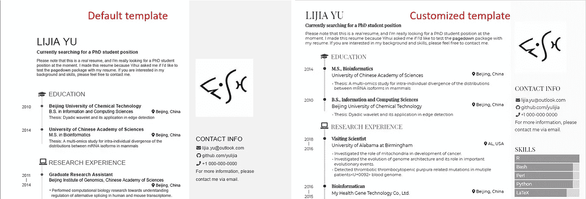
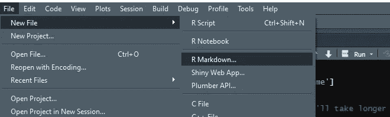
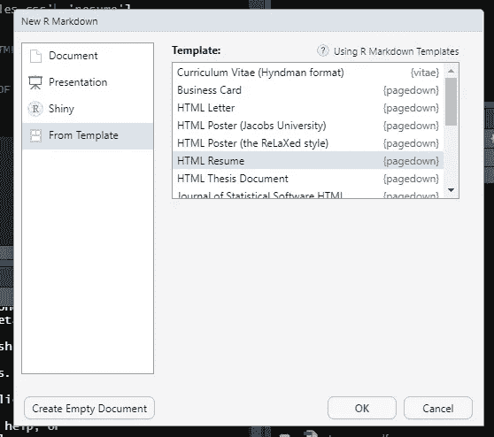
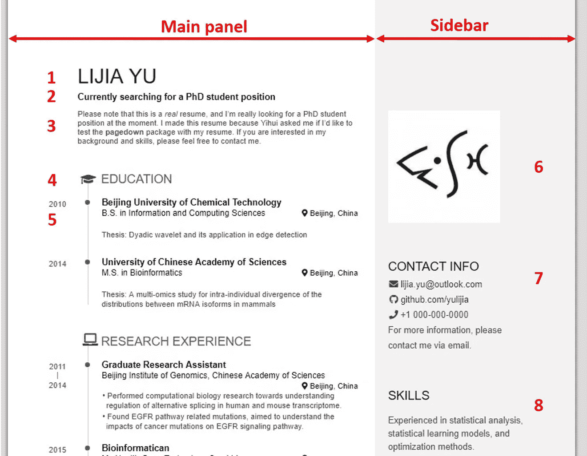
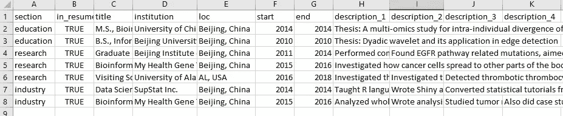

# 用 R 中的 Pagedown 包创建你的简历

> 原文：<https://towardsdatascience.com/create-your-resume-with-pagedown-package-in-r-123ca6310d52?source=collection_archive---------10----------------------->

## 使用 pagedown 包在 1 小时内制作令人印象深刻的简历


马库斯·温克勒在 [Unsplash](https://unsplash.com?utm_source=medium&utm_medium=referral) 上拍摄的照片

过去，我一直梦想用 LaTeX 制作我的简历，但要达到这种完美的学习曲线似乎从未实现。因此，我总是以使用 word 文档制作简历告终，并默默忍受随之而来的对齐问题。

最近，我正在经历更新简历的相同周期，并在对齐上花了很多时间。然后我想，让我们看看是否有一个永久的解决方案，偶然间，我想到了 Nick Strayer 的这个[可爱的博客](https://livefreeordichotomize.com/2019/09/04/building_a_data_driven_cv_with_r/)，它提供了一个非常简单的解决方案，通过将简历分成不同的 CSV 文件来自动构建简历。并进一步添加了一个选项来选择要在简历上显示的子部分。这种风格可以灵活地为不同的工作类型创建有针对性的简历。来自`pagedown`包的内置简历模板负责简历的格式。所以，在某种程度上，这是一个我一直在寻找的无忧无虑的解决方案。

受博客的启发，我创建了这个详细的教程来制作简历，添加我觉得博客中没有充分涵盖的细节(像我这样没有或很少了解 CSS 的人)。

> 使用 R `pagedown`包简历模板增强您的数据组合。

我们将把简历构建分为以下 4 个部分:

1.  简历要点
2.  模板定制
3.  打印到 Pdf
4.  数据自动化

最终目标是让定制的模板启动并运行，如图所示。



简历模板(图片由作者提供)

如果你还没有安装`pagedown`包，首先你要在 RStudio 中制作你的简历。该软件包带有一个内置的简历模板。在安装完`pagedown`包之后，首先创建一个新的`R Markdown`文档。



创建一个新的 R Markdown 文档(图片由作者提供)

弹出一个新窗口，选择【模板中的*选项，然后`pagedown`打包 *HTML 恢复*模板，点击*确定*。*



按 pagedown 选择 HTML 简历模板(按作者选择图片)

这将在 RStudio 上打开简历的默认版本。编织文档，它可能会要求你先保存文档，之后，它会编译简历，一个新的窗口会弹出简历。默认的简历会是这样的。



默认简历(图片由作者提供)

# 简历要点

简历分为两个面板:主面板和侧面板。在上面的图片中总共标出了 8 个区域，这些区域将在下面解释，这将有助于你建立你的简历。

所以我们暂时先不讨论 YAML 的头球部分，稍后再来讨论。在 YAML 标题块的后面是上图中被标记为侧栏的*标题和被标记为主面板的 ***主*** 标题。*第 1-5 点来自简历主面板，第 6-8 点来自侧边栏*。让我们逐点而行(参考上图):*

****点 1*** :你的名字或主标题的占位符。*

****第二点*** :这是你简历的副标题(突出你希望招聘人员或招聘经理注意到的重要细节)。*

****第三点*** :总结部分。你们很清楚该填什么。*

*第 1 点至第 3 点将在下面重点介绍。*

```
*Main
================================================================================Lijia Yu {#title}                        ***[POINT 1: heading]***
--------------------------------------------------------------------------------### Currently searching for a PhD student position             ***[POINT 2: sub-heading]***TEXT SUMMARY                              ***[POINT 3: summary]****
```

> *如果您不太熟悉章节标题的标记语法，标题下的一系列=相当于标题前的#，一系列—相当于##。(文本来自 Pagedown 手册)*

***这一部分可以重复写:工作经历，研究经历，证书，教育等。，模式也是一样的。所以这一段文字可以重复复制。***

***简历模板中使用的图标均来自 [***字体牛逼***](https://fontawesome.com/)*网站。****

*******第 5 点*** :一旦你定义了一个部分，它可以进一步分解成许多子部分。该子部分有 5 个要填写的字段，其中前 4 个是必填字段。第一个是小节的标题，第二个是小节的副标题，第三个是位置，第四个是时间段。时间段可以是一年，如 2021 年，也可以是一个范围，如 2020 年 2 月至 2021 年 3 月或 2020 年至 2021 年。第五个字段不是强制性的，用于支持文本，可以留空。第 4 点和第 5 点解释如下:****

```
****Education {data-icon=graduation-cap}   ***[POINT 4: section heading]***
--------------------------------------------------------------------------------### Beijing University of Chemical Technology  ***[POINT 5: subsection                    heading]***B.S. in Information and Computing Sciences    ***[POINT 5: subtitle]*** Beijing, China                                ***[POINT 5: location]***2010                                          ***[POINT 5: time period]*** Thesis: Dyadic wavelet and its application in edge detection
                                          ***[POINT 5: supporting text]*******
```

> ****在 4 个必填字段中，只有副标题、位置和时间段字段可以通过填写 N/A 来跳过。****

****第五个字段是向您的子部分添加细节。默认情况下，文本将作为单列发布，但可以使用如下所示的`:::concise`块将显示更改为 2 列。****

```
****:::concise
- sentence 1
- sentence 2
- sentence 3
- sentence 4
:::****
```

****现在让我们继续讨论第 6-8 点。****

*******第 6 点*** :默认情况下，模板中会插入一个 logo，只要在文本中添加正确的路径，任何图片都可以更改这个 logo。****

```
****Aside
================================================================================{width=80%](https://avatars1.githubusercontent.com/u/895125?s=400&v=4){width=80%)}****
```

*******第 7 点*** :联系信息部分是您可以突出显示您的社交媒体页面或博客以及个人联系信息的地方。再次图标来自字体真棒网页。联系人信息中的信息可以通过以下方式添加:****

```
****- <i class="fa fa-github"></i> [github.com/yulijia]([https://github.com/yulijia](https://github.com/yulijia))****
```

*******第 8 点*** :技能部分是你可以记下所有技能的地方。如果您想列出技能，可以通过以下方式完成:****

```
****Skills {#skills}
--------------------------------------------------------------------------------
- skill 1
- skill 2
- skill 3****
```

****到目前为止，我们已经介绍了制作简历的基本要素。编辑好的简历会让你知道它会是什么样子。如果你对当前版本满意，那么你可以跳到最后。如果你不确定它的外观，那么让我们来看看它的定制部分。****

# ****模板定制****

****乍一看，如果你认为沿着边框有大量的空白，或者侧边栏太厚，甚至你认为字体样式与你的风格不符，那么你需要定制它。你甚至可以使用左侧时间轴的颜色和侧边栏的背景颜色。****

****要解决所有这些问题，你需要了解 CSS。如果你和我一样没有 CSS 背景，那么继续读下去。****

*****页边距*:要覆盖预定义的函数，需要在函数前添加一个星号(`*`)，如下文所示。这样就可以为页面定义新的边距值。****

```
******* {
  /* Override default margins*/
  --pagedjs-margin-right: 0.2in;
  --pagedjs-margin-left: 0.2in;
  --pagedjs-margin-top: 0.2in;
  --pagedjs-margin-bottom: 0.2in;
}******
```

*****侧边栏宽度*:在根函数中，侧边栏宽度的默认值为 15 rem。这个值可以被改变以获得想要的侧边栏宽度。对于目前的情况，它已被分配到 12 雷姆。****

```
 ******--sidebar-width: 12rem;******
```

*****侧边栏颜色*:在 root 功能中，侧边栏背景颜色也可以改变。出于演示目的，颜色从`#f2f2f2`切换到`#a2e2e2`。****

```
******--sidebar-background-color: #a2e2e2;******
```

*****时间线颜色*:简历左侧的时间线是由同一板块下的点连接起来的竖线组成。垂直线的粗细和颜色都可以更改，如下所示。****

```
******--decorator-border: 2px solid #a2e2e2;** /* change color and thickness of timeline */****
```

****此外，点的背景颜色可以如下所示进行更改。****

```
 ******background-color: #a2e2e2; /* change color timeline dots */******
```

*****字体类型*:通过定义字体族，可以在 body 函数中改变字体类型。在这个例子中，我将字体从 *Open Sans* 改为 *Roboto* ，两者都是无衬线字体。****

```
******/* Define the font family here */
body{
  font-family: "Roboto", sans-serif;
}******
```

****为定制所做的所有更改都在`override.css`文件中定义。完整的代码在这里:****

****为了在 CSS 文件中包含所有的更改，我们可以完全覆盖现有的 CSS 文件，或者在 YAML 文件头中使用新的规则来覆盖某些规则。这是通过添加带有 CSS 扩展名的新文件名来完成的。新创建的 CSS 文件应该保存在 markdown 文件所在的文件夹中。原始 CSS 文件的位置将是`…Resume_demo_files\paged-0.13\css\resume.css`。该文件夹将在减价文件以默认状态编织时创建。****

```
****output:
  pagedown::html_resume:
    css: 
      - override.css         # OVERIDE CERTAIN FUNCTIONS OF CSS
      - resume               # DEFAULT FILE****
```

# ****打印到 pdf****

****您会注意到，当您编制降价文件时，会弹出一个窗口，在左上角显示带有 ***在浏览器中打开*** 选项的简历。点击这个选项，它会在你的浏览器上打开一个空白标签。要使简历显示在浏览器选项卡上，必须将 YAML 设置从默认值“假”更改为“真”。这可以通过将`self_contained: false`设置为`self_contained: true`来实现。然后，可以通过在浏览器选项卡上打印显示的简历来生成 pdf。****

****创建 pdf 文件的另一个选项是将`knit: pagedown::chrome_print`添加到 YAML 文件头。****

# ****数据自动化****

****现在到了简历制作的最佳部分，你可以自动填写数据。感谢 Nick Strayer 让我的简历从仅仅定制变成了完全数据自动化。和往常一样，你需要为简历的所有部分创建主数据 CSV 文件。主数据可以通过两种方式完成:****

1.  *****CSV 文件*:创建 CSV 文件，并根据您的需要不断更新。CSV 文件可以在您的个人设备或 google sheets 上制作。可以为工作、技能和联系方式建立单独的文件。****
2.  *****混合方法*:如果您很着急，那么您可以直接填写简历模板的降价文件中的字段，并会给出默认简历模板中显示的所需输出，或者包含定制内容。在某些情况下，可能会使用 CSV 文件来添加数据。因为我倾向于使用技能栏来突出我的编程技能的熟练程度，而不是仅仅将它们作为文本添加。所以我选择混合方法。****

****因此，让我向您演示一下，通过使用默认简历模板中的文本来自动构建简历意味着什么。第一步是创建 CSV 文件。以下是工作和教育历史的 CSV 文件详细信息的示例。****

********

****作者图片****

****一旦你创建了文件，你就可以使用简历模板，链接在末尾。有两个 R 文件与模板相关联。如果需要从 google sheets 或 CSV 文件中读取数据，那么`gather_data.R`会寻找数据源。降价文件中指出了对此的偏好。当功能涉及教育、工作历史、联系信息、技能等时,`parsing_functions.R`将相关信息粘贴到降价文件中。被召唤。****

****如果技能栏的颜色需要改变，那么参考`parsing_functions.R`文件并寻找`build_skill_bars()`功能。****

# ****结论****

****在本文中，我一步一步地展示了如何从`pagedown`包中定制默认的简历模板。这是通过中断模板的工作流实现的。在第一部分中，解释了模板的基本构造块和需要注意的区域。第二部分集中在模板定制上，寻找可能的陷阱并根据我的需要定制它们。第三部分是生成一份 pdf 版本的简历。****

****第四部分，也就是最后一部分，是基于 Nick Strayer 的工作，关于简历中数据填充的自动化。在这一部分，我试着解释了需要关注的一些基本特征，以使简历能够立即运行起来。****

****通过这种方式，您可以展示您的数据技能和由 R `pagedown`软件包支持的数据组合。****

## ****简历模板的链接:****

****定制简历:[链接](https://github.com/amalasi2418/Blog-post/tree/master/resume)****

****自动化定制简历:[链接](https://github.com/amalasi2418/Blog-post/tree/master/resume/Automate)****

## ****参考资料:****

1.  ****[https://livefreeordichotomize . com/2019/09/04/building _ a _ data _ driven _ cv _ with _ r/](https://livefreeordichotomize.com/2019/09/04/building_a_data_driven_cv_with_r/)****
2.  ****[https://pagedown.rbind.io/](https://pagedown.rbind.io/)****
3.  ****[https://fontawesome.com/](https://fontawesome.com/)****

****您可以在 [LinkedIn](https://www.linkedin.com/in/abhinav-malasi/) 和 [Twitter](https://twitter.com/malasi_abhinav) 上与我联系，跟随我的数据科学和数据可视化之旅。****