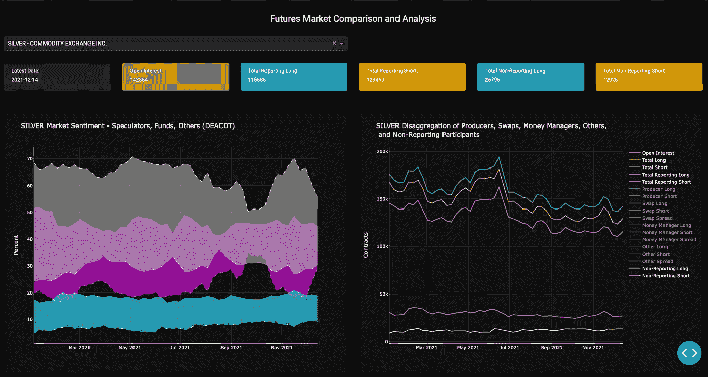

# 使用 Python、Dash 和 Plotly 创建更好的仪表板

> 原文：<https://towardsdatascience.com/creating-a-better-dashboard-with-python-dash-and-plotly-80dfb4269882?source=collection_archive---------0----------------------->

## 让您开始使用 python 轻松创建仪表板的演练。


仪表板——来自 [Pexels](https://www.pexels.com/photo/white-motorcycle-cluster-gauge-887843/?utm_content=attributionCopyText&utm_medium=referral&utm_source=pexels) 的[迈克](https://www.pexels.com/@mikebirdy?utm_content=attributionCopyText&utm_medium=referral&utm_source=pexels)拍摄

# 介绍

我的爱好是研究商品和期货的深度。正如人们可能想象的那样，其中包含大量数据和分析。表格、报告、图表、图形——应有尽有。

在努力前进并弄清楚这一切的过程中，我发现自己需要想象那些并不总是存在的东西。我需要以我想要的方式查看数据。

如果你从事任何形式或行业的数据分析，你可能已经知道我在说什么了。然而，有很多刚接触数据分析的人只是在尝试。也有一些比较有经验的人只是没用过这些工具。

这篇文章是写给那些想做更多事情或者想尝试新工具的人的。也许你已经完成了 Dash 和 Plotly 的基础部分，想看看不同的东西。

希望这能回答一些问题或激发一些新的创意。

# 期待什么

我将用一种全新的方法来研究这篇文章。我将解释这个项目是如何产生的，它的结构和功能，以及我认为它未来的发展方向。

由于大小的原因，我无法对所有内容进行完整的逐行解剖。然而，我已经煞费苦心地编写了包含大量内联文档的冗长而简单的代码。作为补充，存储库文件将是非常宝贵的。

我的目的是提供一个运行这样一个项目的模板概述，并展示一些可能的东西。你不需要真正理解底层数据，甚至不需要对它感兴趣就能获得洞察力。如果你对商品和期货感兴趣，那么这将会有一个全新的价值维度。

# 开始的时候…

正如我在介绍中所说，我的爱好是收集和分析商品数据。这些数据的一个重要来源是商品期货交易委员会(CFTC)提供的每周报告。

我在整个项目中使用的数据保存在这里:[https://www . CFTC . gov/market reports/CommitmentsofTraders/index . htm](https://www.cftc.gov/MarketReports/CommitmentsofTraders/index.htm)

对我来说，整个项目始于对一些报告的剖析。当我第一次开始时，我编写了一个快速脚本，它将获取报告，对文件进行一些处理，添加一些值，并输出一些图表。然后举报数量开始增长。

随着我的继续，我开始观察多种商品。我运行我的脚本，让几十个标签用各种各样的图表填满浏览器窗口。这是不可持续的。

我需要组织这一切。因此，仪表板被概念化了。

像所有懒惰的程序员一样，我从一个模板开始。该模板碰巧是我过去使用的标准模板，并针对更大的数据库驱动的分析系统进行了改进。我开始撕掉我不需要的东西，开始建造。

我提出这个并不是为了用不必要的描述和故事来浪费时间，而是为了给出一些架构决策背后的一些逻辑。乍一看似乎很奇怪的事情。然而，当把简单的系统扩展成更健壮和更复杂的系统时，这一切都是有意义的。

好的解决方案解决今天的问题。更好的解决方案着眼于未来。伟大的系统融合了这两者。

# 代码

当我们深入研究时，你需要访问代码。这是我的这个项目资源库的链接。所有代码示例和参考均来自此处:

<https://github.com/brad-darksbian/commodities-dashboard>  

商品仪表板——我们在构建什么

# 高层设计

该仪表板包含多个元素，这些元素被划分为不同的组织文件。

1.  main.py —此文件包含仪表板代码，用作前端组织文件。
2.  support_functions.py —这个文件是系统的核心。从报告检索到实际图表创建的一切都存在于此。
3.  business_logic.py —该文件充当收集数据和设置必要数据框架的桥梁。
4.  layout_configs.py —该文件包含帮助器元素，用于按照我希望的方式设计图表，以及定义我希望使用的工具。

如果我要进一步重构，我可以通过重新组织来删除其中的一些文件。然而，随着系统的增长，它为适当地合并其他功能提供了一个很好的平衡。例如，在我的较大的应用程序中，我的 business_logic 文件处理数据库调用和更多的数据争论，然后才进行传递。

# 支持功能

让我们从讨论一些获取数据所需的后台函数开始。没有一些数据，我们真的做不了什么。

```
deacot_file = "/tmp/deacot2021.txt"
da_file = "/tmp/deacot_DA_2021.txt"# Data Retreival and Handling
# Function to retrieve reports
def get_COT(url, file_name):
  with urllib.request.urlopen(url) as response, open(file_name, "wb") as out_file:
    shutil.copyfileobj(response, out_file)
  with zipfile.ZipFile(file_name) as zf:
    zf.extractall()# Function to make sure things are fresh for data
def get_reports():
  freshness_date = datetime.now() - timedelta(days=7)
  if os.path.exists(deacot_file):
    filetime = datetime.fromtimestamp(os.path.getctime(deacot_file))
    if (filetime - timedelta(days=7)) <= freshness_date:
      print("Deacot file exists and is current - using cached data")
    else:
      get_COT(
        "https://www.cftc.gov/files/dea/history/deacot2021.zip",
        "deacot2021.zip",)
      os.rename(r"annual.txt", deacot_file)
      print("Deacot file is stale - getting fresh copy")
  else:
    print("Deacot file does not exist - getting fresh copy")
    get_COT(
      "https://www.cftc.gov/files/dea/history/deacot2021.zip",
      "deacot2021.zip")
    os.rename(r"annual.txt", deacot_file) if os.path.exists(da_file):
    filetime = datetime.fromtimestamp(os.path.getctime(da_file))
    if (filetime - timedelta(days=7)) <= freshness_date:
      print("Disaggregation report file exists and is current - using cached data")
    else:
      get_COT( "https://www.cftc.gov/files/dea/history/fut_disagg_txt_2021.zip",
        "fut_disagg_txt_2021.zip",)
      os.rename(r"f_year.txt", da_file)
      print(
        "Disaggregation report file is stale - getting fresh copy")
  else:
    print(
      "Disaggregation report file does not exist - getting fresh copy")
    get_COT(
   "https://www.cftc.gov/files/dea/history/fut_disagg_txt_2021.zip",
      "fut_disagg_txt_2021.zip",)
    os.rename(r"f_year.txt", da_file)
```

上面的两个函数(在 Medium 的代码框中被可怕地格式化了)做了几件事。首先，函数 get_reports()评估文本报告文件是否存在。如果是，则检查它们是否是“新鲜的”,因为它们少于或等于七天。如果它们是好的，则使用现有的文件。如果没有，则检索新的。同样，如果文件不存在，则从 CFTC 网站检索。

文件检索使用第一个函数 get_COT，并将 url 和文件名作为参数。这些函数使用 python 模块 zip 文件、url lib、shutil、os 和 datetime。设置两个变量来定义路径。

如果使用此代码，请记住根据您的情况适当地设置这些变量。

一旦我们有了文件，我们就有了要处理的数据。但是，它还是生的。文件“deacot_process”和“DA_process”中的下两个函数会对数据帧进行一些修改。

一般来说，这些函数首先重命名一些列，使事情更容易处理。接下来，他们按照日期对数据帧进行排序，以确保事情按照预期的方式有序进行。之后，会创建一些新的计算列，以便以后参考。最后，拆分“exchange”列，为商品和市场创建两个新列。最后一步是必要的，以便以后在图表和其他位置提供一些标签。

就我个人而言，我总是觉得很难决定是应该将计算列添加到主数据框架中，还是等到以后再添加。我个人的原则是，如果我认为有可能不止一个地方需要它，我会全力以赴。

这个文件的其余部分由生成特定图表的函数组成，这些图表将在仪表板上使用。我不会详细讨论它们，但是如果有不清楚的地方，我鼓励任何人提问。

因为这是一个图表优先的过程，所以图表是在合并到仪表板框架之前定义的。简单地将它们创建为可调用的函数比采用其他方法更有意义。但是，和任何事情一样，应对这一挑战的方法不止一种。

要记住的关键是图表是由函数作为一个现成的对象返回的。这意味着您可以将其作为函数的输出、图形变量或作为布局对象的一部分内联调用。你的选择实际上取决于组织和使用。

# 业务逻辑

在这个应用程序中，business_logic.py 文件非常简单。总共 41 行，包括许多注释，它实际上只是提供了一个在应用程序启动或重新加载时运行某些功能的入口。

```
"""    
This files does a lot of the dataframe work and larger data functions. Mostly this is data retrieval, organization, and making sure everything is ready to be called by the main app via call backs.    
This is called by main.py and in turn calls support functions when needed
"""
import pandas as pd
import numpy as np
import plotly.io as pio
import support_functions as sf pd.options.plotting.backend = "plotly"
pio.templates.default = "plotly_dark" # Make sure we have data
# This will check to see if a file exists and if not gets one
#  This also checks the data freshness
sf.get_reports() # Get the data frames to work with
# DEACOT report
df_deacot = pd.read_csv("/tmp/deacot2021.txt", na_values="x")
df_deacot = sf.deacot_process(df_deacot) # Disambiguation report
df_da = pd.read_csv("/tmp/deacot_DA_2021.txt", na_values="x", low_memory=False)
df_da = sf.DA_process(df_da) ####################################################
# Generate the commodities list - use the DA listing
####################################################
da_list = df_da["Exchange"].unique()
da_list = np.sort(da_list) if __name__ == "__main__":    
  print("business logic should not be run like this")
```

总体布局如下:

1.  将数据帧后端设置为 plotly。
2.  将默认模板配置为深色主题。
3.  使用函数获取报告
4.  将 CSV 读入数据帧并适当处理
5.  创建一个只包含交换列中唯一值的新数组

第 5 项用于创建商品的主列表，我们将使用它来驱动仪表板视图并相应地更新图表。

# 布局配置

layout_config.py 文件包含一些可以跨图表重用的样式数据。它的存在主要是为了简化布局和图表构建过程。

例如:

```
layout = go.Layout(    
  template="plotly_dark",    
  # plot_bgcolor="#FFFFFF",    
  hovermode="x",    
  hoverdistance=100,  # Distance to show hover label of data point    
  spikedistance=1000,  # Distance to show spike    
  xaxis=dict(        
    title="time",        
    linecolor="#BCCCDC",        
    showspikes=True,        
    spikesnap="cursor",        
    spikethickness=1,        
    spikedash="dot",        
    spikecolor="#999999",        
    spikemode="across",    
  ),    
  yaxis=dict(        
    title="price",        
    linecolor="#BCCCDC",        
    tickformat=".2%",        
    showspikes=True,        
    spikesnap="cursor",        
    spikethickness=1,        
    spikedash="dot",        
    spikecolor="#999999",        
    spikemode="across",    
  ),
)tool_config = {    
  "modeBarButtonsToAdd": [        
    "drawline",        
    "drawopenpath",        
    "drawclosedpath",        
    "drawcircle",        
    "drawrect",        
    "eraseshape",        
    "hoverclosest",        
    "hovercompare",    
  ],    
  "modeBarButtonsToRemove": [        
    "zoom2d",        
    "pan2d",        
    "select2d",        
    "lasso2d",        
    "zoomIn2d",        
    "zoomOut2d",        
    "autoScale2d",    
  ],    
  "showTips": False,    
  "displaylogo": False,
}
```

在这两种情况下，放置这些类型的配置允许对图表呈现和工具配置进行集中管理。

# 主仪表板

这是你们期待已久的时刻，构建真正的仪表板代码。

我知道当我第一次开始使用 Dash 时，主文件似乎令人生畏。发生了很多事。我也没有明确的组织流程。但是，我让它以一种对我有意义的方式工作。这就是我将带领你经历的。

我倾向于按以下方式整理我的主要文件:

1.  样式修饰符。
2.  内容结构。通常，这些是保存行数据的容器。我发现以反映实际布局的方式构造我的文件是最容易的。我从顶部开始向下移动。
3.  页面布局聚合。内容结构被放入页面布局中，并被组织到一个引用中。
4.  应用参数。这是实际应用程序行为以及应用程序标题、样式表和主题等全局项目所在的地方。
5.  复试。这些是允许窗口小部件运行的动态代码，并真正使仪表板起作用。
6.  服务器运行。这是实际启动服务器和运行仪表板的最后一行代码。

让我们浏览其中的一些，让您感受一下所有部分是如何组合在一起的。我要把这些有点乱，但没什么大不了的。

首先，让我们看看应用程序参数和服务器一起运行。这些构成了仪表板的骨架，并告知了布局的其他一些方面。

```
#####################################################
# Application parameters
#####################################################
app = dash.Dash(    
  __name__,    
  suppress_callback_exceptions=True,    
  external_stylesheets=[dbc.themes.CYBORG],
)
app.title = "CFTC Data Analysis"
app.layout = html.Div(    
  [
    dcc.Location(
      id="url", 
      refresh=False), 
    html.Div(id="page-content")
  ]) # Multi-page selector callback - left in for future use
@app.callback(
  Output("page-content", "children"), 
  Input("url", "pathname")
)
def display_page(pathname):        
  # if pathname == "/market-sentiment":    
  #     return volumes    
  # else:    
  return main_page###################################################
# Server Run
###################################################
if __name__ == "__main__":    
  app.run_server(
    debug=True, 
    host="0.0.0.0", 
    port=8050, 
    dev_tools_hot_reload=True
  )
```

在大多数情况下，应用程序参数应该是不言自明的。需要注意的关键项目是“外部样式表”。这正是我们所说的——外部样式表。在这个例子中，我使用了一个名为 CYBORG 的引导主题，这是一个黑暗主题。

这里，我们还有 app.title 参数，用于应用程序设置标题。app.layout 参数设置了一个过程，通过该过程，名为“page-content”的 id 通过回调函数“display_page”的输出进行传递。这不是绝对必要的，但它允许读取 URL 路径并基于该路径提供不同的内容。它用于多页应用程序。我把它留在里面作为参考。

最后，我们有服务器运行部分。我们可以在这里设置监听 ip 地址和端口。因为我在本地服务器上运行我的仪表板，以便在我所有的计算机上使用，所以我被配置为在端口 8050 上公开侦听。我还将 debug 设置为 True。这减少了我的日志文件中的喋喋不休。如果 debug 设置为 true，应用程序还会在检测到任何文件中的更改时进行热重新加载，这对于开发来说非常有用。

# 复试

许多文章、视频和其他材料都是围绕着回调而产生的。这是一个复杂的问题，我只谈一点皮毛。然而，这个主题至少可以让你了解它们是如何排列的。

在这个仪表板中，有一个主下拉选择器，用于更新页面上的所有图表。稍后我将介绍这个下拉菜单，但是现在，重要的是要理解这个下拉菜单提供了一个 id 为“future”的输入

记住这一点，让我们分解 main.py 文件中的第一个回调。

```
# Sentiment charts
@app.callback(    
  dash.dependencies.Output("deacot_sent", "figure"),    
  [dash.dependencies.Input("future", "value")],
)
def deacot_sentiment(future1):    
  df1 = bl.df_deacot[bl.df_deacot["Exchange"] == future1]    
  df1.set_index("Date", inplace=True)       arr = df1["commodity"].unique()    
  asset = arr[0]     

  fig = sf.make_sentiment_chart(df1, asset)    
  return fig
```

在不多的代码中，发生了很多事情。这主要是因为我们前面提到的组织。

回调从 decorator app.callback 开始，这里我们有一行用于输出，一行用于输入。两者都接受它们引用的元素的 id 和被传递的数据类型的参数。

在这种情况下，输入从“future”id 中收集一个值，我在本节开始时提到过。输出将图形数据发送到“deacot _ sent”。(是的，我知道我应该用连字符来标识……)

有了发送的输入和输出路由，我们必须做些什么来将该值转换成一个数字。这就是函数“deacot _ 情操”的用武之地。它接受输入参数，并简单地将其命名为 future1。

该函数首先过滤在 business_logic 中定义的名为 df _ deacot 的数据帧，并匹配从 future1 传入的值。我们只剩下一个整合的数据框架(df1 ),其中包含交换列与下拉列表中的选择相匹配的数据。

下一行将日期列设置为索引。接下来，我们获取商品列中的唯一值，并将它们放入一个数组中。由于报告的过滤方式，我们应该只有一个值。但是，因为有时事情不会按计划进行，所以我们将第一个数组元素放入名为“asset”的变量中。

然后，我们的 dataframe (df1)和变量“asset”被输入到位于 support_functions 文件中的图表函数 SF . make _ invision _ chart 中。函数的输出被设置为变量“fig”，它是图表的代码。

最后，fig 通过回调的输出以图形的形式返回。它正前往 id“deacot _ sent”。

需要注意的是回调可以有多个输入和输出。输出可以链接到其他回调。

然而，让我们跟随这个数字的路径…

# 内容

我们刚刚看到了输入如何触发回调并将数字返回到 id。如果我们跳回内容，我们可以在构建用于显示的元素时看到这一点。

正如我前面提到的，我喜欢按照行设置的自上而下的布局来排列我的主文件。这有助于我想象网格，并在构建时将它保存在我的脑海中。在这种情况下，我们为两个情绪图表定义了一行:

```
# Container for sentiment charts
sentiment_direction = dbc.Row(    
  [        
    dbc.Col(            
      dcc.Graph(                
        id="deacot_sent",                
        style={"height": "70vh"},                
        config=lc.tool_config,            
      ),            
      md=6,        
    ),        
    dbc.Col(            
      dcc.Graph(                
        id="da_sent",                
        style={"height": "70vh"},                
        config=lc.tool_config,            
      ),            
      md=6,        
    ),    
  ]
)
```

上面的代码设置了一个包含两列的行，每列包含一个不同的图表。第一列的 id 为“deacot _ sent”，这是回调输出的目标 id。

因为我们持有一个图表，所以我们使用 dash 核心组件(dcc)库提供的图形容器。在这里，我们设置 id 和许多其他参数。我特意将高度设置为样式覆盖。我还添加了一个“config”元素，它被设置为上面突出显示的 layout_config.py 文件中的 tool_config 值。

因为元素是从回调的输出填充的，所以不需要显式数据源。如果我们以不同的方式生成图表，我们可能会使用“figure”参数来保存数据。

最后，在 dbc 中。Col 函数，我们看到了“md=6”。这是一个使用引导框架的格式值。其中，每行被分成 12 个单元。设置“md=6”告诉框架，我希望我的列填充总数的 6 或一半。

除了不同的 id 值之外，第二列是相同的。该列将是同一行上另一个图表的输出，占据了另一半空间。

# 布局

我们从输入到输出之旅的最后一步是将行实际链接到将通过应用程序显示的页面布局。这很简单:

```
####################################################
# Layout Creation Section
####################################################
main_page = html.Div(    
  [        
    html.Hr(),        
    html.H5(
      "Futures Market Comparison and Analysis", 
      style=TEXT_STYLE
    ),        
    html.Hr(),        
    future_select,        
    html.Hr(),        
    info_bar,        
    html.Hr(),        
    sentiment_direction,        
    html.Hr(),        
    da_postiions,        
    html.Hr(),        
    da_pos_snap,        
    html.Hr(),        
    da_diffs,        
    html.Hr(),        
    references,    
  ],    
  style=CONTENT_STYLE,
)
```

如果您还记得关于应用程序参数的部分，您会注意到应用程序的页面内容 id。没关系——再读一遍那个句子，有很多是连在一起的。

main_page 变量只是 html.div 的另一个容器。div 由对以前构造的其他元素的引用组成。本质上，我们只是一点一点地构建，以达到最终的结果。

这里是页面集合的地方。在上面的代码中，我从空格、要显示的标题、更多空格、包含选择下拉列表的行、空格、信息栏、更多空格开始，然后是我们的第一行图表。这就是我上面展示的那一行。

这是我们构建仪表板所需的一切。实际上，这比我们需要的要多得多，因为这个设计有点大，而且分散在几个文件中。然而，你现在也许能明白为什么为组织分解各种元素对保持你的理智是有效的。有很多块和元素。将它们组织成逻辑单元对于创建有用且可维护的应用程序大有帮助。

# 最后一件事

在我结束之前，我真的想为你整理一下。

下拉菜单驱动仪表板。它提供了原始数据点，并允许基于特定商品评估整套报告。它是页面标题下的第一行，非常重要。

```
# Create drop-down selector
future_select = dbc.Row(    
  [        
    dbc.Col(            
      [                
        html.Div(                    
          [                        
            dcc.Dropdown(                            
              id="future",                            
              options=[
                {"label": i, "value": i} for i in bl.da_list],                            
              value="SILVER - COMMODITY EXCHANGE INC.",                        
            ),                    
          ],                    
          className="dash-bootstrap",                
        ),            
      ],            
      md=6,        
    )    
  ]
)
```

和以前一样，这是一个非常普通的结构。我们从行开始，然后添加一列。列中有一个 Div，包含 id 为“future”的下拉列表。记住“未来”是回调的输入。

在下拉列表中，我们设置选项，这只是一个基于我们在 business_logic 文件中定义的 bl.da_list 数组的标签和值的扩展列表。这是从 DA 报告数据框架中提取的所有商品的唯一列表。实际上，DA 报告数据框架比 DEACOT 报告包含的内容少，因此使用 DA 作为主列表只是最小的公分母。

我们最后设置了一个默认值，就是在启动时加载一些东西。在这种情况下，我使用银，因为这是我经常看的商品。

同样重要的是，尤其是在使用深色主题时，设置 classname 值。这允许应用适当的样式，以便下拉菜单在深色背景上看起来很合适。这会省去你很多审美上的头疼。

沿着样式线，虽然我们只有一列，但它被设置为只延伸到整个行的一半。这是一个设计上的选择。你可能不同意。

# 包扎

这要涵盖的内容太多了。Dash 不是一个简单的平台，因为你可以用它完成很多事情。它的能力令人难以置信，一旦你习惯了它的细微差别，事情就会变得更有意义，你可以很快地构建。

正如我在开始时提到的，从我的存储库中抓取代码并浏览它。虽然这只是一个大概的介绍，但是实际的代码是通过文档逐步实现的。更重要的是，这是一个你可以自己运行和探索的功能系统。

如果您确实提取了代码，请随意使用它。做一些很酷的东西，或者只是解剖它，尽你所能去学习。如果你真的想用我写的东西，就告诉我一声。否则，这就是我给这个世界的礼物。

如果有关于清晰性的问题或与代码相关的问题，请随时直接联系我或留下您的评论。我鼓励提供反馈和建议，让事情变得更好。