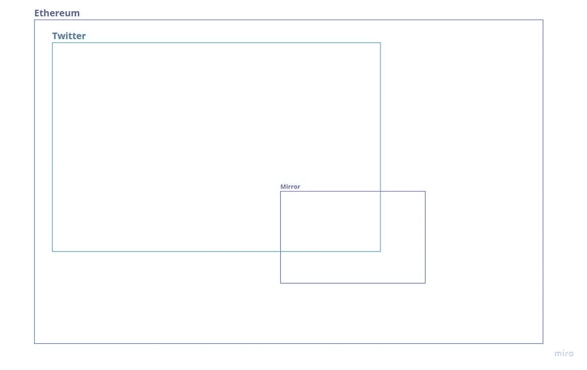
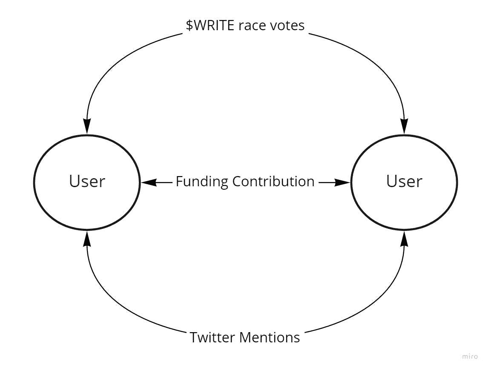
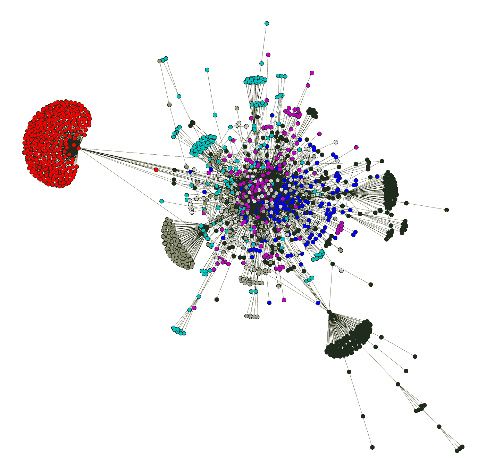
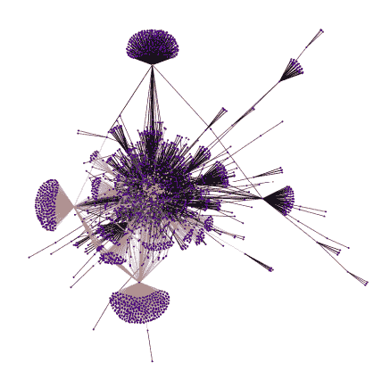
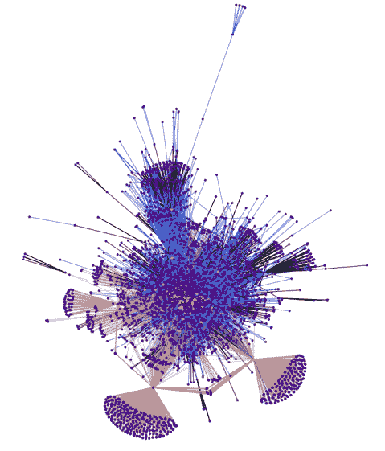
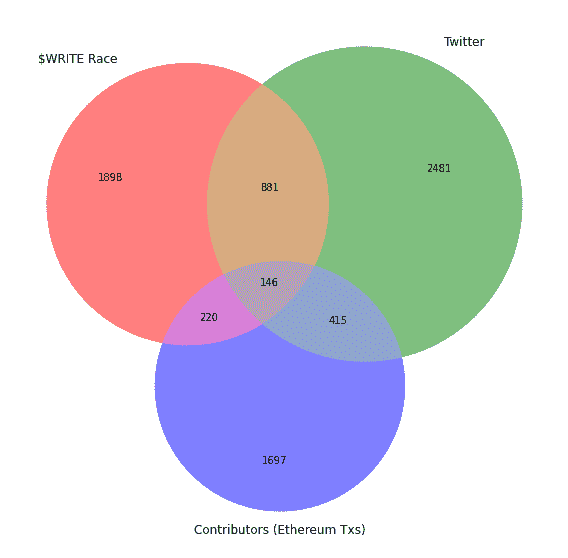
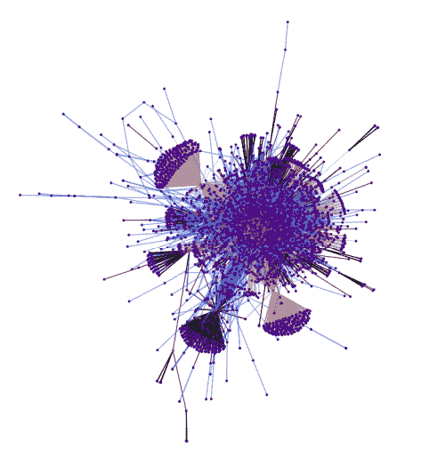

# 为 Web3 平台 Mirror.xyz 的用户创建特定于社区的信誉分数

> 原文：<https://towardsdatascience.com/creating-a-community-specific-reputation-score-for-users-of-web3-platform-mirror-xyz-14d494a25ea8?source=collection_archive---------28----------------------->

## [思想和理论](https://towardsdatascience.com/tagged/thoughts-and-theory)

## 使用图形数据科学计算 Twitter、治理和以太坊交易中镜像用户交互的信誉分数(中间中心性)

*本帖首次发表于*[*ath . mirror . XYZ*](https://ath.mirror.xyz/aYOJc8pihb9wxI___QR9qmM5mQ4caUyQhHJIlevspjw)*，请务必订阅并关注我的*[*Twitter*](https://twitter.com/andrewhong5297)*以获取我的最新加密和数据科学内容。后来，这种方法被用于第一个$WRITE 令牌空投，你可以* [*在这里*](https://ath.mirror.xyz/CdU80CItQr-qTZgTzymfFDEBSnz2YbgnwXGYgkQJfCs) *阅读。*

在我之前关于数字身份的文章中，我提到过“这些图碎片的标记化可以有多种形式，并且很可能被证明标记所覆盖。”我认为，分片图身份方法需要提出一个特定于社区的声誉得分，以衡量某个人在扩展特定网络方面的影响力。虽然一些信誉分数可能更多地是根据必须完成 X 或 Y 动作来设置的，但是该分数以更灵活的方式捕获其他用户上下文中的用户信誉— **表现得像一个信号而不是徽章**。

通常在 Web2 中，用户会得到一种算法的“奖励”，这种算法会根据他们给平台带来的参与度和关注度来突出显示他们。因此，他们的声誉得分仅仅是他们拥有的喜欢或追随者的数量——不管这些虚荣指标来自谁。在 Web3 中，我们通常会奖励代表协议或产品价值的代币。这些代币还以投票和其他特权的形式承载着很大的权力。因此，随着时间的推移，**不仅表明影响力，还表明用户与社区其他成员的支持度或联盟度的分数将变得越来越重要。**

在这篇文章中，我们将重点关注为镜像用户(投票者、作者、贡献者)创建一个信誉分数，这个分数是基于每个用户在以太坊、Twitter 和镜像数据的基于交互的社交图上的位置。我选择镜子有三个原因:

1.  我已经非常熟悉他们的社区和产品
2.  他们在他们的平台(以太坊<> Twitter)上有可验证的身份整合，允许我将社交图分层在一起。
3.  他们的产品和治理非常注重用户对用户的交互，这是以太坊上的大多数产品目前不具备的(我们主要与池或市场协议进行交互)。

社交图本身并不新鲜，但是有选择地将它们分层将会打开相当多的可用性和意义的新大门。这有两个主要原因:

1.  **启用新应用:**我们可以使用该图表数据来创建依赖于上下文的特定于社区的信誉评分，该评分可应用于许多情况。
2.  **数据代表什么:**建立在稀缺性基础上的代表性网络的创建创建了一个社交图，它代表了用户如何相互支持。

**支持新应用:**我们理解分层的方式会影响我们对数据的处理。在我看来，以太坊是一个基础层社交图，其他一切都建立在它的基础上。像 Mirror 和 Twitter 这样的平台是*上下文*，位于这个基础层之上，改变了我们如何看待用户在空间中的联系。

作者图片

我没有设计能力，但想象一下在 3D 中，每个盒子都是从不同角度穿过球体的一部分。

因为我只想分析 Mirror 的用户，所以我只取了可用以太坊和 Twitter 数据的一个子集。那些具有高的特定于社区的信誉分数的人可以获得更大的令牌空投，被委派财政管理中的角色(或更多选票)，或者获得对新协议特征的优先访问。还有更多的类似 Mirror 的环境建立在 Web2 + Web3 平台之上，比如 NFT 社区(Cryptopunks，BAYC，Blitmaps)和游戏社区(Axie Infinity，Darkforest)。

随着 Dao 开始更多地合作，元宇宙变得更加互联，我们将看到更多的社区(和环境)重叠。我想，研究人们和社区如何在社交图的不同背景下互动*可以产生混合社区声誉得分，这可以应用于相当多的不同情况。例如，这个分数可以用于多令牌或协作 NFT 空投，以及选择合作伙伴和项目的领导者，如 [rabbithole 的探路者计划](https://rabbithole.gg/pathfinder)。*

**数据代表什么:**收集和使用的数据种类也会影响社交图谱。使用来自$WRITE 投票、资金贡献(跨版本、拆分、众筹和拍卖)和 Twitter 提及的数据，我想代表三种稀缺(分别):信仰、资本和关注。

作者图片

是的，从技术上来说，这应该被视为一个自引用循环，但这可能会让人感到困惑

我相信，分析互动如何将不同的人联系到这三个方面*会给我们一个代理，显示他们相互支持的程度*。我也相信*的支持网络给了我们一个在社交图中更准确的社区表现*。这两个假设让我有信心使用一个叫做“中间性中心性”的概念作为声誉得分的原始值。

数据表示和上下文的选择是社交图最终形式的关键。如果我只是想代理贡献的意愿，那么我可能会创建一个完全基于不同种类的产品/类别的创建者的创建节点模式，而不是一个纯用户到用户的图。这可能会彻底改变社交图谱的形状。

# 使用图数据科学创建社区声誉得分:中间中心性

让我们尝试定位并量化种族参与者、作家和贡献者的社交图的强连接点。我选择使用一个叫做“中间中心性”的概念来表示每个节点的得分。使用为所有节点计算所有节点之间的最短路径的算法来计算中间中心性[。](http://www.inf.uni-konstanz.de/algo/publications/b-fabc-01.pdf)

对于 Mirror 来说，谁投票给谁的基本社交图是这样的:

作者图片

金点是赢家，紫点仍在比赛中竞争。上面有 2130 个节点，其中 2041 个节点至少投了一票。

作者图片

这是细胞核的放大图，使用莱顿社区检测方法对每个社区进行了颜色编码。从这个和上面的图，我们可以看到有相当多的社区，但几乎所有的赢家都坐在中间。

然而，这还没有一个种族外的社会背景。让我们将以太坊交易级数据分层——这仅限于参与者之间的镜像相关交易，如**发送分割、众筹融资以及购买版本或保留拍卖。**

作者图片

粉红色表示以太坊 tx，请注意，有一些节点只是以太坊地址，没有相关的 Twitter 数据，因为它们没有在比赛中注册。

现在，我们还将添加 Twitter 数据，这将基于在最近 2000 条推文中提到另一个参与者的**来链接节点。**

作者图片

蓝色现在代表节点间的 Twitter 提及

以更清晰的方式显示交互(边缘)，社交图中的交互组合如下所示:

作者图片

计算在每个方面已经相互交互的用户的数量。

现在回到最初的观点，预期是大型集群之间的一些节点将获得比其他节点更高的权重，因为它们已经连接了跨越大多数其他节点的路径。

作者图片

前 300 名中间用户以红色突出显示，我们可以看到他们开始从图表的中心向外扩散。

这被称为“中间性”，我认为这是一个非常重要的因素，当试图积极发展一个社区。这里的基本思想是，一个人的“中间性”因素越高，他们就越有可能建立联系和分支，从而建立一个更加多样化的社区。已经有一些研究论文强调了具有高介数的节点对社区的扩散以及建立网络弹性的有益影响。

你们中的一些人可能会奇怪，为什么我选择了中间中心性，而不是亲密度或程度中心性。后两个指标强调的是纯粹的影响力，我认为一个社区中的声誉不应该仅仅基于那些已经拥有这种影响力的人。Neo4j 的[图算法](https://www.google.com/books/edition/Graph_Algorithms/z4WZDwAAQBAJ?hl=en&gbpv=0)教科书很好地解释了中间性背后的概念:

> 有时系统中最重要的齿轮并不是权力最大或地位最高的。有时是中间人连接着各个团体，或者是对资源或信息流动拥有最大控制权的经纪人。中间中心性是一种检测图中节点对信息流或资源的影响程度的方法。它通常用于查找作为从图的一部分到另一部分的桥梁的节点。

很多 Web2 都是关于集中影响力和回音室的，我认为 Web3 应该尽可能地支持和激励创造桥梁。

任何想看分数的人都可以在这里查看[表格](https://docs.google.com/spreadsheets/d/1XiX8b7KkvtfBE2KLJWv-mCPtphrQxjt1-g4wKCa4JwE/edit?usp=sharing)。请注意，这些值没有基于数据/边缘类型进行加权，因此一些用户可能由于 Twitter 交互而不是镜像/以太坊交互而具有更高的介数。

# 为什么这种方法对分数很重要？

我们已经讨论了这个分数的一些应用，但我使用的解决方案可能仍然显得不必要的复杂或过度工程化。我认为需要这种方法来提供可组合性，同时也以一种更难游戏的方式来衡量声誉。

**可组合性:**如前所述，这个图是逐层构建的。数据元素都可以公开收集，模型遵循一种搜索算法，对选择的任何节点或边(用户或交互)都是灵活的，一旦构建了管道，就可以重复使用或分支进行任何调整。希望在未来，所有可用的数据组件都在一个用户界面中，这种模式变成了拖放。从那里我想象你可以输出分数或者直接连接到类似 [disperse.app](https://disperse.app/) 或者[银河落点](https://galaxy.eco/)的东西。

**持久性:**很多分数和度量的问题在于，一旦它们被公开使用过一次，那么人们就可以开始琢磨如何博弈系统了。对于任何仅仅基于`user <> protocol`互动的事情来说，这一点尤其正确。创建一个依赖于`user <> user <> user`的模型更难，因为当前社区中的用户不一定会与坏人互动。行动也是复合的，所以只有一种互动(或一种类型的互动)不足以获得更高的分数。即使他们找到了一些游戏的方法，那么恭喜你现在有了另一个对社区有贡献的积极参与者。

*这两个要素允许一个整体上更强大的信誉评分机制，我相信这证明了我们为实现这一目标所付出的努力是值得的。*

# 总之:

我想继续重复这项研究，并可能对协议和社区的具体用例使用这种评分(如果感兴趣，请联系)。如果你已经做到了这一步，并希望以想法或技术专长为这一分析做出贡献，我邀请你[加入 ImagDAO](https://discord.gg/jEm2UgBpXu) 进一步研究社交图数据和分散身份。

接下来的步骤包括更多的数据收集，建立一个 Neo4j 仪表板供其他人使用，当然还包括应用更多的数据科学算法。随着我们试图预测社交图将如何增长或试图瞄准特定的子社区，机器学习和社区检测可能会在未来发挥更大的作用。

我之前提到过，这种分析之所以可能，是因为 Mirror 的平台(以太坊<> Twitter)对身份的可验证巩固。这项工作的继续也很大程度上依赖于身份巩固 API，所以任何在这方面工作的人也请与我联系(看看你的陶瓷和 Gitcoin👀).

*一旦我重构并找出如何保护这个社交图中用户的隐私，这些数据和脚本可能会在以后公开共享。*

*特别感谢本·谢克特在评论这篇文章时给予的所有帮助和想法*