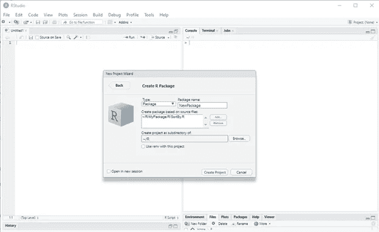
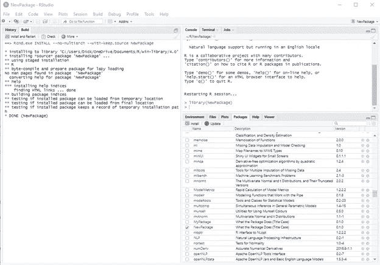
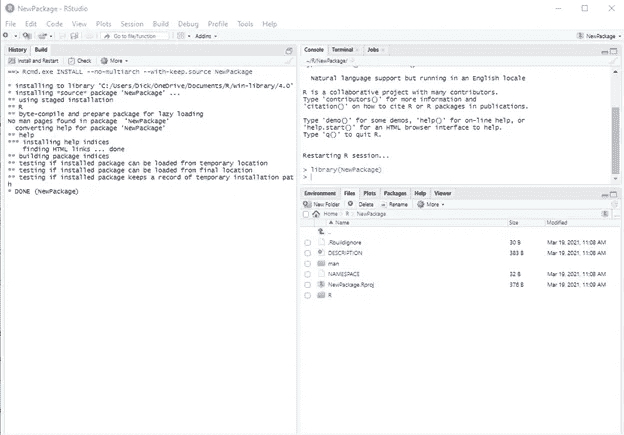
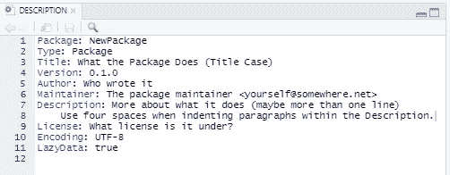
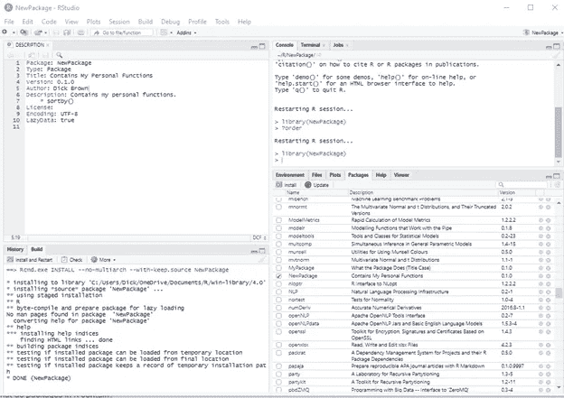
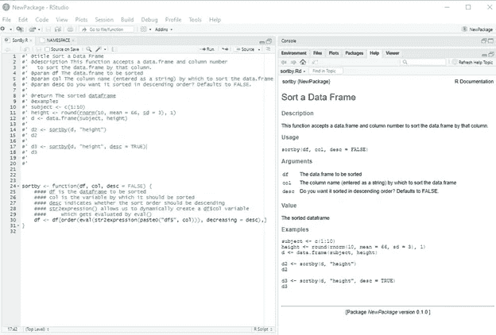

# 创建自定义的 R 包

> 原文：<https://towardsdatascience.com/creating-a-custom-r-package-9a2e303d3332?source=collection_archive---------12----------------------->

## 为所有用户定义的函数创建一个中心位置。


作者图片

我不知道你怎么想，但是我发现 R 用来排序数据帧的方法非常不直观。每当我想对一个数据帧进行排序时，我都不得不绞尽脑汁，通常是通过在网上查找别人是如何做到的，然后复制并修改他们的代码。最后，我决定创建一个易于使用的函数，它可以为我排序数据帧。这是我想到的函数的最新版本:

```
sortby <- function(df, col, desc = FALSE) { #### df is the dataframe to be sorted
    #### col is the variable by which it should be sorted
    #### desc indicates whether the sort order should be descending
    #### str2expression() allows us to dynamically create a df$col
    ####     variable which gets evaluated by eval()
    df[order(
            eval(
                str2expression(paste0("df$", col))
             ), 
            decreasing = desc
        ),]
}
```

我当时的问题是，当我想使用这个功能时，如何找到它。答案是创建我自己的包。现在，有很多关于如何创建 R 包的教程，但是它们都缺少一些东西。有些是不完整的或分成多页。有些令人困惑。有些已经过时了。本文的目的是从头到尾详细介绍我结合许多教程得出的过程。

首先，我应该提到我在所有的 R 编程中都使用 RStudio。我的一个要求是，它必须在那个环境中是可行的。虽然没有任何教程实际上排除了 RStudio 的使用，但许多教程完全忽略了它。

在 R 中创建可用包的过程有几个部分:

*   编写要包含在包中的函数。
*   为包中的功能创建文档。
*   构建包。
*   (可选，不在此讨论)发布包。

我的 sortby()函数已经涵盖了第一步。我将这个函数存储在一个名为 sortby.R 的脚本中。

在我们继续之前，我们需要做一些设置。要在 Windows 中创建 R 包，需要安装 RTools 4.0。这是作为一个普通的 Windows 程序安装的，而不是作为 r 中的一个包。你可以在[https://cran.r-project.org/bin/windows/Rtools/](https://cran.r-project.org/bin/windows/Rtools/)找到安装程序。我应该说，我在尝试让 RTools 工作时遇到了问题。安装进行得很顺利，但是安装出错了。当我创建。Renviron 文件编辑路径，我无法再安装软件包。我尝试了一些事情，包括重置窗口。经过大量的研究，我发现有人提到在试图安装包之前以管理员身份运行 R。这似乎解决了所有问题，我不再需要以管理员身份运行了。

一旦 RTools 设置好了，您就可以着手创建这个包了。在 RStudio 中，选择文件>新建项目>新建目录> R 包。在弹出的对话框中，给包起一个名字，并输入你希望包驻留的目录。如果您已经像我一样创建了 R 脚本，那么您可以将它添加到“基于源文件创建包:”下的框中。



作者截图

然后点击<create project="">。</create>

此时，您应该在某处看到一个“Build”选项卡。我把它放在左下方我的“历史”标签旁边。(我相信默认是在右上角窗口。)选择“Build”选项卡，然后单击“Install and Restart”来安装您的软件包。一旦你这样做了，这个包应该出现在你的“包”标签中，如下所示。



作者截图

注意，包的描述仍然写着“包做什么(标题格)”。我们稍后会解决这个问题。接下来，查看“文件”选项卡。您将看到 RStudio 为您的项目创建的一系列文件和目录。脚本文件将位于“R”目录中，而帮助文件将位于“man”目录中。



作者截图

要解决上述描述问题，请打开描述文件。这个必需的文件存储关于包的元数据。



作者截图，显示默认描述文件

现在，让我们只改变显而易见的东西。如果你的包有任何依赖项(比如 dplyr 等等。)，它应该包含在这个文件中，但不是默认设置的一部分。



作者截图

我已经编辑了标题、作者和描述行，并删除了维护行。请注意，标题行变成了右下方窗口中软件包列表中的描述。

## **帮助文件**

创建帮助文件最简单的方法是使用 roxygen2 包。

```
install.packages("roxygen2")
library(roxygen2)
```

现在，我们转到 R 脚本，在开头添加一些 roxygen 注释。每个 oxygen 注释行都以# '开头。您应该添加几个项目:

```
#' @title 
#' @description
#' @param
#' @return
#' @example
#' @examples
```

*   标题—用于向帮助页面添加标题(使用标题大小写)
*   描述—用于添加简短描述
*   Param 为函数中的每个参数添加其中一行
*   return——函数会给你什么
*   示例-添加一行或多行示例。如果你要添加一行以上的例子，用复数。在完成之前仔细检查这些例子，确保在你没注意的时候没有错误。

添加完 roxygen 注释后，运行以下命令:

```
roxygenize()
```

(和往常一样，R 允许命令的美式英语或英式英语版本，所以 roxygenise()也能很好地工作。)

此命令创建。man 文件夹中的 Rd 文件。的。RD 文件是用来创建实际的帮助文件的。我最终的 R 脚本和生成的帮助文件如下所示。



作者截图

## **结论**

这就是创建 R 包的基础。您可以做更多的微调，尤其是如果您想要发布您的包。想了解更多关于软件包创建的信息，请在 https://r-pkgs.org/[查看哈德利·威克姆的书 *R 软件包*。](https://r-pkgs.org/)