# 创建数据驱动的零售扩张框架

> 原文：<https://towardsdatascience.com/creating-a-data-driven-retail-expansion-framework-2229fef33a17?source=collection_archive---------53----------------------->

## [现实世界中的 DS](https://towardsdatascience.com/data-science-in-the-real-world/home)

## 所以你想开一家冰淇淋店…

你开了一家公司，它已经成长起来了。你在你认为合适的地方又开了一两个分店；也许你是星巴克，已经开了上千家。零售企业家或企业面临的最重要的问题之一是在哪里开设下一个位置。一些较大的企业有位置侦察兵，他们的唯一职责是发展业务；许多人不知道。

我之前写的一篇关于[预测星巴克未来地点的文章](/analyzing-and-predicting-starbucks-location-strategy-3c5026d31c21)促使一位正在经历这一挑战的企业家伸出援手——他们应该在大匹兹堡地区的哪里开设他们优质冰淇淋产品的下一个地点？他们如何利用数据来提高成功选址的几率？

[*点击此处*](https://public.tableau.com/profile/jordan8097#!/vizhome/PittsburghMapping/MasterDashboard?publish=yes) *查看将在本文其余部分呈现的仪表盘。*

想象一下，你是一个企业家，已经为你的优质冰淇淋品牌开了几家成功的分店。在选项的世界里，哪些变量对你来说是重要的？在与他们谈论这个问题后，我想到了几件事:

*   **人口**:当地居民和游客的步行交通至关重要。在该地区服务的人越多，你的潜在客户就越多。此外，一个有价值的区别是由家庭组成的人口，因为他们的购买集体比个人更有价值。
*   **餐厅密度**:引发去冰淇淋店的一个重要时间是晚饭后。人们已经承诺外出，他们已经付了饭钱，冰淇淋是结束一夜外出的一种令人欣慰的方式。
*   **位置，位置，位置**:如果你离主街区只有一个街区，人流量就会减少。商店需要能见度高，方便，并且在一个步行区域。
*   **竞争对手**:这个区域已经挤满竞争对手了吗？如果有人抢在你前面，而且它无法支持多项(或更多)业务，那么其他基本面看起来有多强也没用。

我们如何利用这些变量和更多数据来帮助解决这个问题？

这个项目有三个关键步骤:*收集、分析、交流:*

*   **收集**:收集关于人口、收入、餐馆密度、竞争对手和位置的相关数据。处理数据以匹配所需的格式。
*   **分析**:使用汇总的数据对地点进行客观评分和优先排序。平衡数据与人工筛选，以减少对评分算法的过度依赖。
*   **沟通**:建立一个自助式 [Tableau 仪表盘](https://public.tableau.com/profile/jordan8097#!/vizhome/PittsburghMapping/MasterDashboard?publish=yes)和一个有效沟通结果的演示。

# 聚集

我们不会花太多时间来讨论实际的数据收集过程——如果您想了解更多信息，请随时联系我们——但它的要点是在邮政编码级别获取和汇总美国政府、地方政府和商业数据，以生成一个包含每个地方邮政编码及其相关指标的主文件。

# 分析

我们首先看一些数据是如何按邮政编码在整个地区分布的。人口集中在哪里？哪些邮政编码的餐厅密度最高？哪个邮政编码倾向于在冰淇淋上花费更多？

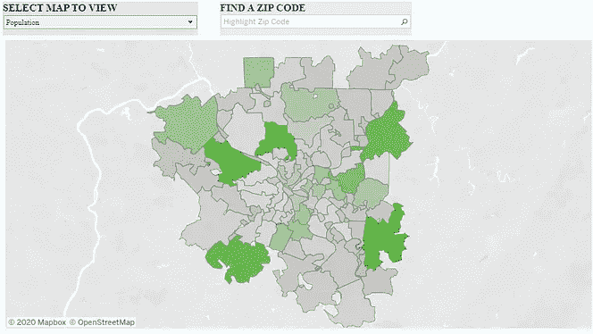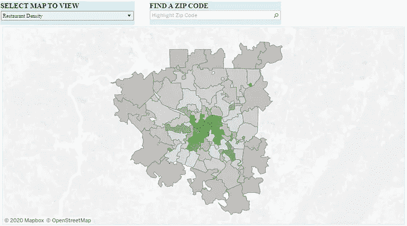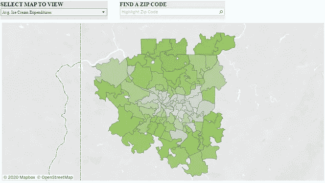

人口，餐馆密度和平均。按邮政编码分列的冰淇淋支出。深绿色表示较高的值。

上面的地图开始让我们了解我们可能面临的权衡。总人口(最左边的地图)主要集中在市中心以外的 5-6 个邮政编码区。然而，市中心有最大的餐馆集群和餐馆密度(中间的地图),而在市中心外，平均冰淇淋消费趋于相当一致，但更高。我们优先考虑哪个？我们应该如何衡量每个变量的重要性？

这就是企业主的经验发挥作用的地方。能够认识到自己的局限性是很重要的。我擅长的一件事是收集、分析和展示数据。我做得不好的一件事是对每一个主题都有专业知识。

为了弥补这一点，我用自助输入构建了一个评分算法。你认为餐厅密度和总人口最重要吗？通过在框中输入较高的分数，为他们分配最大的权重。你想要更高的行走分数还是家庭的存在(K-12 注册)？增加这些分数，减少其他分数。可切换的变量有:

*   **步行评分**:小区步行可达吗？这是一个可能会导致高客流量的地区吗？
*   **餐厅密度**:附近有多少家餐厅？它是吸引潜在顾客的活动中心吗？
*   **竞争存在**:是否有人已经“垄断”了这个位置？还有空间开更多商店吗？
*   **总人口**:有足够多的人给一个大的潜在客户群吗？
*   **K-12 入学**:家庭与个人的代表——家庭人口多吗？

在左侧输入您的分数后，地图和表格会更新。每个邮政编码都有 0-1 分(0 分最差；1 最好)。

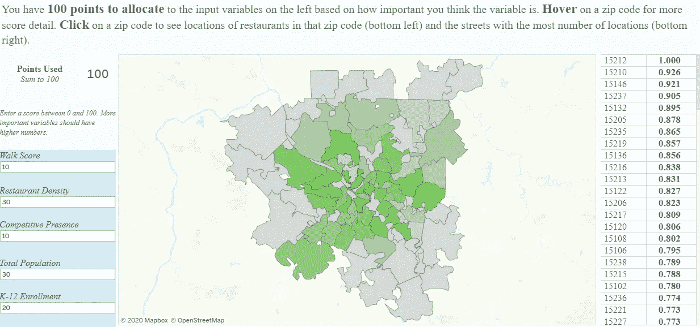

假设 100 分分配给我们最重要的变量。深绿色表示邮政编码得分较高。

我们现在已经定义了我们的重要变量，并有一种方法来优先考虑哪些邮政编码具有最有吸引力的人口统计信息。尽管该企业目前的大部分位置都在市中心核心区，但我们可以看到，有几个排名较高的邮政编码延伸到了郊区，我们可以根据这一初始优先级进一步考虑。

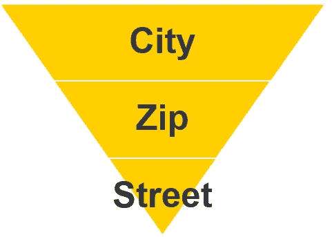

位置映射是从较大区域缩小到特定建议的连续过程

现在，假设您已经决定采用得分最高的邮政编码—高于 15212。你如何处理这些信息？邮政编码可以很大和/或多种多样，因此需要有一种方法比邮政编码更具体。

对我来说，我有兴趣知道的是大多数餐馆在邮政编码的什么地方。我们最有可能成功地将自己定位在客流量最大的区域或其附近。

在仪表板中，当您点击一个邮政编码时，它下面的地图会自动更新该邮政编码下的所有餐馆位置。对于邮政编码 15212，结果如下所示。第一个图像表示被单击的邮政编码中的所有餐馆，第二个图像在表中有更多的细节。该表标识了该邮政编码中餐馆位置最多的街道，当鼠标悬停在该街道上时，餐馆位置会在地图上高亮显示。

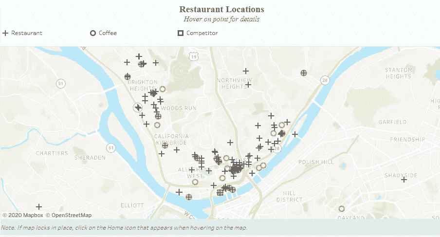

邮政编码为 15212 的所有餐厅位置

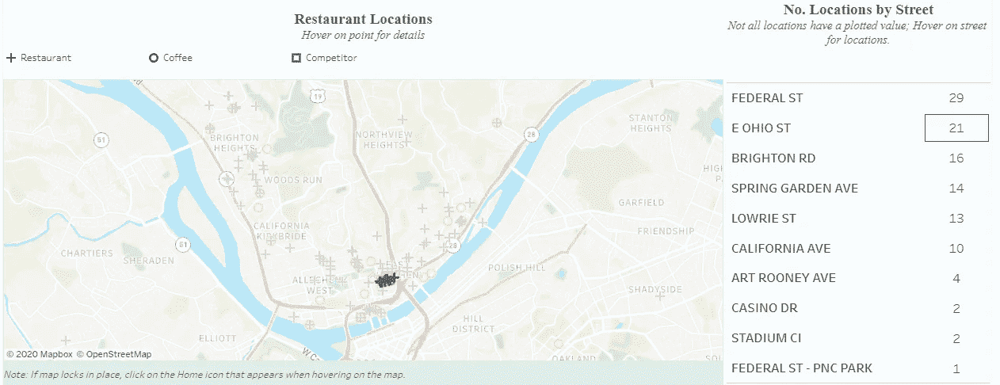

该邮政编码中位置最多的街道；悬停时，该位置会在地图上高亮显示。

综上所述，该控制面板允许我们:

1.  确定我们的重要变量在数据中的分布位置
2.  使用我们的主题专业知识对邮政编码进行排名和优先排序，同时保持更改可变重要性权重的灵活性
3.  选择我们想要查看的邮政编码，并查看该邮政编码中的“活动”在哪里
4.  找到值得实地调查的具体街道

我们的建议可以足够精细和具体，以便采取行动，同时也有足够的灵活性来适应不断变化的时间或用户偏好。

# 推荐

最终，我选择为扩展选项创建一个三管齐下的框架:

*   **现状**:找一个与当前位置有相似特征的位置，并且靠近市中心
*   **地理扩张:**寻找一个与当前人口统计数据相似但不在市中心核心区域的位置
*   **投机取巧:**用直觉平衡数据，找到一个可能排名不是最高，但代表一个有希望考虑的机会的位置

每种方法的优点和注意事项如下所示。

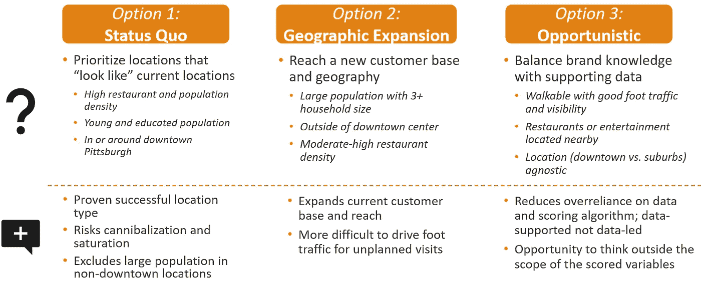

对于这些扩展选项中的每一个，Tableau 工具——与谷歌地图中的“实地”研究相结合——导致了以下三个推荐的位置。

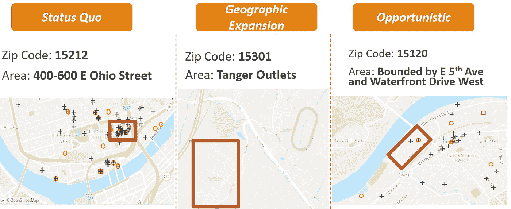

我的建议是，短期的方法应该是**保持现状**，而中长期的**地理扩张**选项应该进一步探索。

我觉得现状选项几乎没有自相残杀的风险(目前所有的商店都在河的南面)，具有最高的自然客流量潜力(靠近足球场和棒球场外加一个儿童博物馆)，并且在当前的零售状况下具有最小的不确定性。

从中长期来看，我觉得地域扩张是最好的选择，因为它覆盖了高收入地区的全新人群。我还认为，谨慎的做法是等待地理扩张，看看“城市人口外流”是永久的还是暂时的人口流动。

# 替代考虑因素:竞争分析和 COVID 影响

我将简要介绍的另一种方法是，我们可以使用该工具进行竞争分析。如果我们对市区感兴趣，我们可以突出显示这些邮政编码，并过滤底部的地图，只显示竞争对手。我们可以看到在河的北面很少有冰淇淋店。从这里，我们可以决定这是否代表机会(有吸引力的选择，还没有竞争对手继续前进)，或者是否有合理的理由(分区、商业房地产的定价，或其他可用数据之外的原因使其成为无吸引力的选择)。

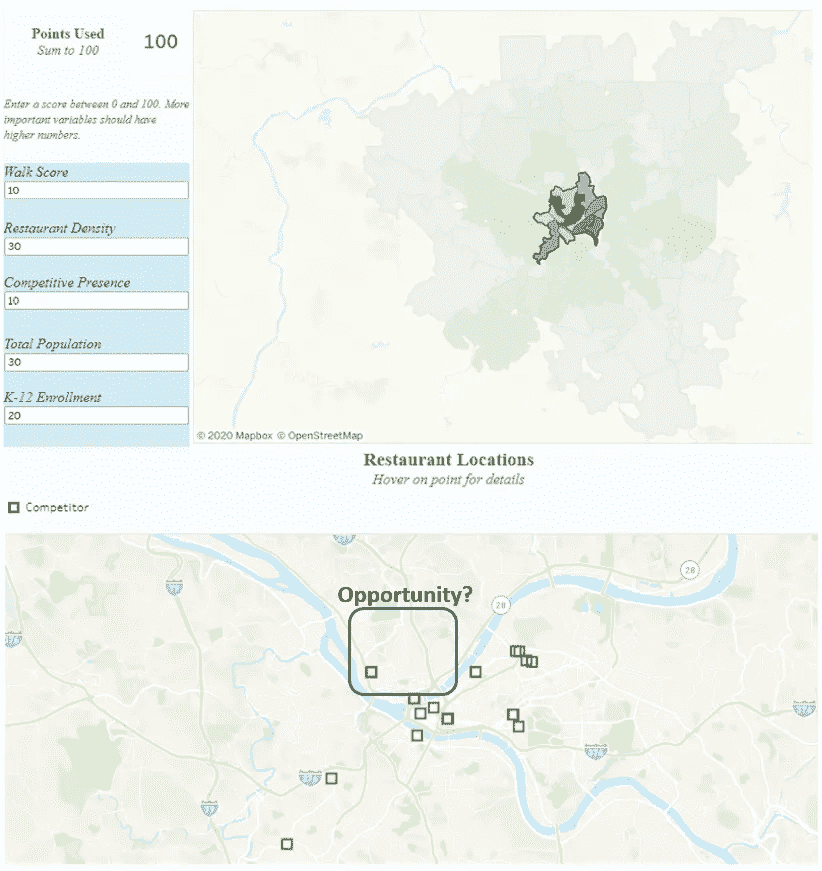

使用仪表板进行竞争分析的示例

从 COVID 的角度来看，很明显，任何新的位置都代表着不确定性，可能在短期内不可行。资本支出较低的替代方案可以是通过零售合作伙伴进行分销，例如便利店和杂货店。

该公司目前有零售合作伙伴关系，其逻辑延伸是尝试与他们目前的合作伙伴一起成长，因为这比寻找和建立新的合作伙伴更容易。从他们的网站上，我们可以汇总当前合作伙伴的所有潜在位置，并将其绘制在地图上。

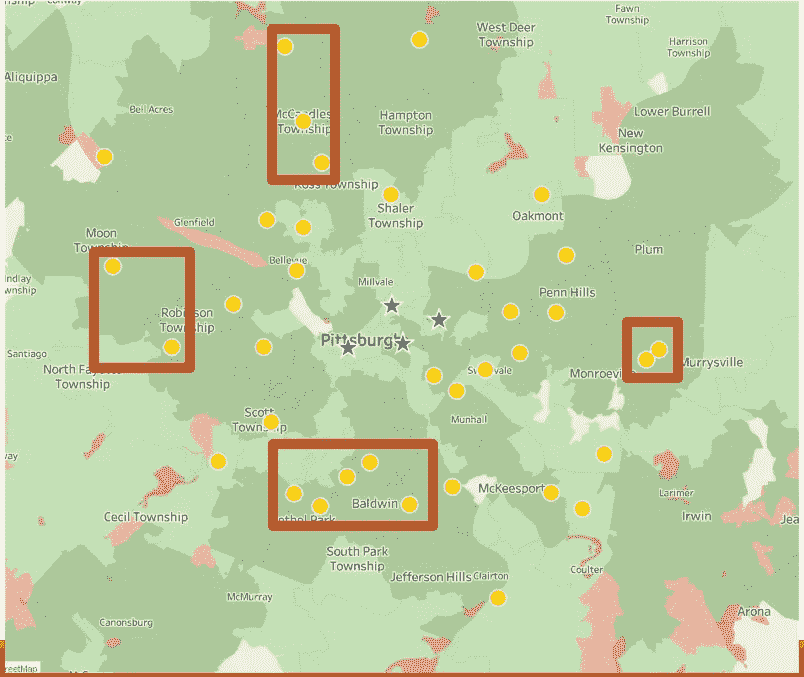

黄点代表所有潜在的合作伙伴。星星是当前位置。家庭数量越多(人口越多)，地图阴影越暗，家庭数量越少，地图阴影越暗。

同样有意义的是，任何分销渠道的扩张都应该发生在远离当前零售点的地方(在那里有人已经可以很容易地获得产品)，以最大限度地扩大客户范围。左边的地图突出显示了他们当前合作伙伴的所有位置(不管产品当前是否在那里；该信息当前不可访问)以及他们当前的店面位置。红框代表最适合分销扩张的商店“集群”。

这种方法的另一个好处是它是郊区扩张的试验场。市中心位置以南的方框代表当前店面和之前确定的**地理扩张**选项之间的便利中点。如果产品在这些商店销售良好，我们可以更有信心，该位置可能会取得长期成功。如果销售不理想，这是一个低成本的测试，我们可以重新考虑市场是否可以维持我们的产品零售足迹。

同样值得注意的是，上述分析是在没有访问内部数据的情况下完成的；所有信息都是从公开的第三方来源收集的。

不幸的是，这一过程和合作关系在 COVID 之前就已经开始了，因此，随着保持业务的需要突然成为一个更为紧迫的问题，这一过程和合作关系就变得不那么重要了。然而，总有一天，企业会找到自己的立足点，到那时，随着一波租赁承诺到期，将会有一个数据驱动的框架向前发展，企业可能会看到机会。

*有兴趣谈论位置策略和分析吗？请随时在 LinkedIn* *上与我联系，或者在 jordan@jordanbean.com 与我联系。*