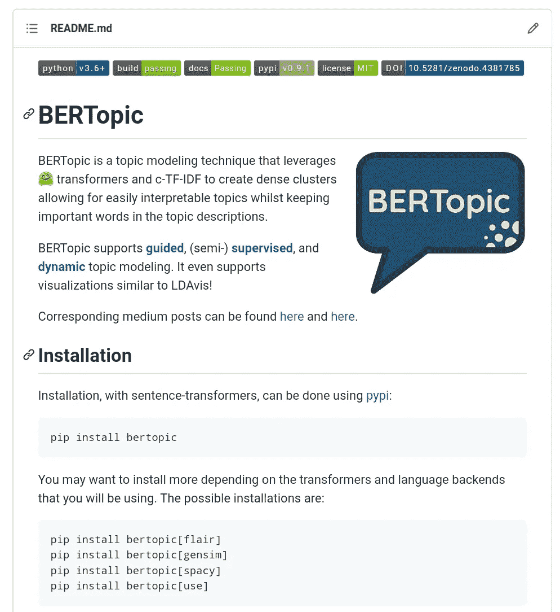

# 创建数据科学产品组合

> 原文：<https://towardsdatascience.com/creating-a-data-science-portfolio-bd485382f49?source=collection_archive---------3----------------------->

## [办公时间](https://towardsdatascience.com/tagged/office-hours)

## 建立投资组合的技巧和例子

找一份数据科学家的工作越来越难了。在数据科学被称为*“21 世纪最性感的工作”*之后，许多人都加入了这股潮流，开始在这个领域找工作。

现在，数据科学就业市场对刚从大学毕业的大三学生来说已经相当饱和了。空缺职位吸引了数百名初级数据科学家，有时甚至是高级数据科学家。

> 数据科学职位招聘中相互矛盾的要求让初级求职者日子不好过

问题是，你怎么做才能把自己从数百名申请者中脱颖而出？

虽然有很多方法可以做到这一点，比如额外的实习、课程、MOOCs 等。对我帮助很大的一件事就是创建一个投资组合。

构建数据科学组合有两个目标。首先，它可以让你向招聘经理展示你的技术专长。如果你是这个领域的新手，这尤其有用。第二，积极建立投资组合是一个很好的学习机会。你需要花时间构建算法，部署解决方案，并以有意义的方式交流结果。

这篇文章将告诉你我对这个问题的看法:

> *“创建可靠的数据科学产品组合需要什么？”*

数据科学项目组合可以包含许多内容，但通常围绕您(数据科学专业人员)已经创建的内容。例如从头开始构建算法、研究新方法、进行有意义的分析等。

我的项目的几个例子。完整的概述可以在[这里](https://www.maartengrootendorst.com/projects/)或者[这里](https://github.com/MaartenGr/projects)找到。背景由[卢卡斯布拉塞克](https://unsplash.com/@goumbik?utm_source=unsplash&utm_medium=referral&utm_content=creditCopyText)。

它还可以让你展示你在过去的工作经历中没有发展出来，但在个人项目中集中了的专业技能。

这也意味着作品集不是主要用来弥补工作经验差距的工具。它还能帮助你在这个领域更受欢迎的职位中获得优势。

在建立你的投资组合时，我相信一个人从专注于发展一个 [T 形轮廓](https://en.wikipedia.org/wiki/T-shaped_skills)中获益匪浅:

t 型轮廓。图片由作者提供。

T 形轮廓代表了两件事。首先，单杠代表通才。数据科学家应该具备统计学、编程、部署、业务等方面的基础知识。第二，竖条代表一种专门的技能。这可以是对 NLP、计算机视觉、时间序列等的关注。

换句话说，尽管数据科学家可以专注于某个特定领域，但不应该忽略基础知识。在这两者之间找到平衡应该对你的职业生涯和个人发展都有帮助。

# **1。创建您的项目**

投资组合的基础由许多项目组成。这些项目可以成就你的投资组合，也可以毁掉你的投资组合，因为它们是你工作的门面。

因此，这些项目应该被仔细选择，并且需要传达许多东西:分析的质量、沟通技巧、代码质量、业务相关性等等。

> 再进行一次泰坦尼克号分析不会让你与众不同。

在这里，我将详细介绍这些方面，并展示如果我要创建一个新的方面，我将如何在我的投资组合中处理它们。

## 这个想法

当创建一个项目时，我建议不要从一个数据集开始，而是从一个想法开始。没有目的的分析通常是没有意义的，应该尽可能避免。

尝试回答以下问题:

*   我想解决什么问题？
*   谁将从我的分析和/或产品中受益？
*   有没有我可以改进的技术？

即使你自己想不出什么，也有很多资源可以帮助你开始:

*   [12 个数据科学项目创意](/12-cool-data-science-projects-ideas-for-beginners-and-experts-fc75b5498e03)
*   例如，在 PyTorch 中复制以前仅在 Tensorflow 中提供的流行论文
*   创建一个包来填补一定的空白，比如 [AutoScraper](https://github.com/alirezamika/autoscraper) 或 [DrawData](https://calmcode.io/labs/drawdata.html)

但最重要的是:

> 选择你感兴趣的项目，否则它们会变得太繁琐

有时，我们不需要数据来创建与数据相关的项目。你可以开始构建算法，复制论文，或者创建一个包来填补特定的空白。

[Autoscraper](https://github.com/alirezamika/autoscraper) 是优雅而简单的包装的一个很好的例子，巧妙地填补了一个空白。由[像素完美](https://www.flaticon.com/authors/pixel-perfect)从[平面图标](https://www.flaticon.com/)制作的图标。

举个例子，在过去的几年里，我一直专注于开发像[伯托皮](https://github.com/MaartenGr/BERTopic)、[基伯特](https://github.com/MaartenGr/KeyBERT)、 [c-TF-IDF](https://github.com/MaartenGr/ctfidf) 和 [VLAC](https://github.com/MaartenGr/vlac) 这样的算法。这些帮助我证明了我可以把分析带到下一个层次。

## **数据来源**

尽管你可以在 [Kaggle](https://www.kaggle.com/) 上找到很多有趣的数据集，我还是建议你在数据集的选择上更有创意一点。例如，您可以分析来自当地政府的数据([荷兰](https://data.overheid.nl/en)、[美国](https://www.data.gov/)、[法国](https://www.data.gouv.fr/en/)等)。)、[世卫组织数据](https://www.who.int/data)，或者在[大型孟德尔数据库](https://data.mendeley.com/research-data/)中搜索数据。

换句话说，试着自己收集数据。在许多组织中，在获得一种清晰的格式之前，通常有相当多的困难需要克服。展示你可以自己找到并处理数据，这展示了你非凡的技能。

使用 [BeautifulSoup](https://www.crummy.com/software/BeautifulSoup/bs4/doc/) 、 [Scrapy](https://github.com/scrapy/scrapy) 、 [AutoScraper](https://github.com/alirezamika/autoscraper) 或任何其他方法来抓取你的数据，肯定会给创意加分。它还表明您可以处理真实世界的数据，因为生成的数据通常是杂乱的。

## **储存库**

在 Github 这样的公共场所分享你的作品。这是展示诸如版本控制、OOP、模型评估、文档等技能的好方法。

这些存储库应该有足够的文档，让不熟悉您的项目的人了解如何使用或解释它。试着清晰有效地交流项目是关于什么的，结果是什么，尤其是你的分析的含义。

尽管招聘经理不太可能会运行你的代码，但它很好地概述了你通常交付的工作质量。

提供清晰直观的自述文件大有帮助！[伯托博](https://github.com/MaartenGr/BERTopic)的自述。图片由作者提供。

以下是一些好的自述文件页面示例:

*   [丛生](https://github.com/koaning/clumper/)，在 [calmcode.io](https://calmcode.io/) 上的视频系列的一部分。
*   高质量自述文件页面的精彩概述

**注意**:如果你对质量文档的例子感兴趣，我强烈建议你浏览一下[https://github.com/koaning](https://github.com/koaning)的项目。正确记录的技能被严重低估了。

## **部署**

展示您的技能能够产生影响的最佳方式之一是部署您的代码。对拥有软件工程技能的数据科学家的需求似乎正在迅速增加。

有几种方法可以解决这个问题:

首先，您可以从已经创建的分析中创建一个应用程序。例如，如果您要创建一个[关键词提取工具](https://share.streamlit.io/charlywargnier/bert-keyword-extractor/main/app.py)，那么您可以创建一个 [Streamlit](https://docs.streamlit.io/en/stable/) 应用程序来展示您的应用程序的可用性。

第二，通过 [Pypi](https://packaging.python.org/tutorials/packaging-projects/) 或 [Anaconda](https://conda-forge.org/docs/maintainer/adding_pkgs.html) 提供你的 python 包。如果为了使用你的 python 包，你必须做的唯一一件事就是`pip install my_package`，那该有多好？这表明你了解生产前和生产过程。

> 展示软件工程技能是让你脱颖而出的关键

认识到数据科学不仅仅是创建模型，这一点很重要。用户打算怎么用？需要如何部署？应该是什么样子？等等。

# **2。教程&博客**

除了项目，你可以开始在你的文件夹中添加教程和博客文章。这些对于证明你能够以不熟悉内容的人可以理解的方式解释技术问题是至关重要的。

每当您创建一个分析、模型、包或任何感兴趣的东西时，您都可以将其打包在一篇博客文章中，使您的工作更加公开。

> 如果你能把某样东西教给别人，你就真正理解了它

类似地，写教程是帮助你理解材料的一个神奇的方法。每当我学习一个新的话题时，我会确保我能向别人解释它。

举个例子，我在下面写的这篇文章展示了用简单的方式呈现复杂的材料是多么重要:

</9-distance-measures-in-data-science-918109d069fa>  

磨练你的写作技巧会帮助你成为一个更好的沟通者。你将慢慢开始对你的利益相关者的需求和愿望有一种直觉，这是一种令人惊奇的技能。

因为你很可能是在媒体上阅读这篇文章，所以我建议从这里开始也就不足为奇了。Medium，具体来说是 [TowardsDataScience](https://towardsdatascience.com/) 出版物，是一个张贴你的技术教程和人工智能领域想法的好地方。

[我在 TowardsDataScience 的工作](https://medium.com/@maartengrootendorst)并没有被忽视，而且在过去几年我参加的几乎所有面试中都有很大帮助。

<https://medium.com/@maartengrootendorst>  

似乎不仅仅是我从写作中受益。梅根·迪布尔解释了在媒体上写作是如何让她的[在数据分析](/writing-on-medium-got-me-a-job-in-data-analytics-586564d29264)部门找到工作的。同样，Dario rade ci[写了作为数据科学家拥有博客的好处](/how-having-a-blog-can-advance-your-career-as-a-data-scientist-245270cc281e)。作为最后一个例子，大卫·罗宾逊解释了开博客的好处。

还有几个地方可以让你开始写作:

*   [黑客月](https://hackernoon.com/)
*   商务化人际关系网
*   Reddit—[r/机器学习](https://www.reddit.com/r/MachineLearning/)或[r/数据科学](https://www.reddit.com/r/datascience/)
*   个人网站— [以我的](https://www.maartengrootendorst.com/)为例

# 3.社交媒体存在

你可能已经猜到了，如今你的社交媒体越来越重要。

公开你的工作有助于社区了解你的技能。对于招聘经理来说，除非他们能亲眼看到，否则很难真正知道你的能力。

虽然有很多方法可以达到这个目的，但是我相信选择你喜欢的事情是最有效的。话虽如此，下面是一些有趣的社区添加到您的投资组合。

## 卡格尔

竞争让 [Kaggle](https://www.kaggle.com/) 变得伟大。它们是练习你的建模技巧的极好方法。赢得比赛并展示你能深入预测建模是对你简历的一个很好的加分。

个人认为，用户提供的内核和笔记本才是让 Kaggle 保持伟大的原因。通过提供无价的 EDA 来帮助他人的机会是一项被严重低估的任务。

> B 成为 Kaggle 的讨论专家被严重低估了

编写和发布内核有很大的价值。回答问题，开始讨论，开发内核，对训练你的沟通能力至关重要。

一个很好的例子是[安德鲁·卢克扬科](https://www.kaggle.com/artgor)，他是笔记本和讨论大师，这是你在那个平台上能得到的最高级别。[在一次采访](https://www.analyticsvidhya.com/blog/2020/12/exclusive-interview-with-andrey-lukyanenko/)中，他谈到了从事内核和讨论的挑战和好处。

## Stackoverflow

在 Stackoverflow 上回答问题是一次很棒的经历。当涉及到交流复杂的主题时，你不仅会学到很多东西，而且它还为你提供了一个进一步发展技能的机会。

Jon Skeet 是 Stackoverflow 上最知名的用户之一，他解释了他如何在平台和[上成名，以及为什么在编码](https://codeblog.jonskeet.uk/2013/09/21/career-and-skills-advice/)时沟通是如此重要。这再次证明了沟通技巧不应该被忽视。

对这个 StackOverflow 问题的回答表明，良好的声誉有助于你在面试中“脱颖而出”。招聘经理不太可能询问你的简历，但拥有一份简历可能会给你带来竞争优势。

> 任何有助于证明你专业知识的东西都是有用的。

这表明你很好地理解了材料，尤其是如果你在平台上获得了声誉。假设您经常在 StackOverflow 上回答特定的基于 NLP 的问题。如果我是招聘委员会的一员，我肯定会认为这是一个优势。

## Twitter 和 LinkedIn

每当你创建一个开源包或完成一项分析，通过 Twitter 或 LinkedIn 分享它。通过在这些平台上推广你的内容，你创造了一个有趣的机会与你所在领域的人合作和互动。

在这里，它主要是关于网络和建立你的个人“品牌”。为了给你一些提示，阿德蒙德·李讲述了为什么建立你的个人品牌很重要，以及它将如何影响你的职业生涯。

> 数据科学不仅仅是机器学习…统计、评估、理论、实验、模型服务、部署等等。

[Philip Vollet](https://www.linkedin.com/in/philipvollet/) 是一个很好的例子，他基于这些平台建立了一个庞大的追随者。他在 LinkedIn 上有 80，000 多名粉丝，作为开源倡导者，他为自己赢得了名声。我强烈建议跟随他学习更多有趣的开源项目。

因此，使用这些平台主要是为了让你的工作公开，并与他人联系。分享你的 Twitter 和 LinkedIn 账户不太可能给你带来梦想中的工作。

## 开源代码库

Github 是一个展示你的技能、与同行交流以及向导师学习的绝佳场所。和大多数事情一样，如果你有时间，我强烈建议要么创建一些你自己的库，要么贡献给开源。

当你创建自己的知识库时，它会迫使你考虑受众和用户。他们能理解我想要达到的目标吗？他们能轻松地使用代码库吗？这意味着在创建存储库时，您的自述文件应该是一个很大的焦点。

有许多文章介绍了如何建立你的 Github 组合(这里是，[这里是](https://www.youtube.com/watch?v=SM28m5gpATs)，这里是)，应该有足够的资源可以开始。

> 花大量时间在你的**自述**上，第一印象会持续很久！

积极参与开源社区不仅是一种很好的学习方式，而且真正表明你可以深入这项工作的某些技术方面。它展示了良好的编码实践、深厚的算法知识和协同工作的能力。

首先，搜索您经常使用的包，如 [scikit-learn](https://github.com/scikit-learn/scikit-learn) ，并搜索 CONTRIBUTING.md 文件。在这里，您通常会找到关于如何为软件包做贡献的详细说明。Scikit-learn 有一个优秀的[教程，教你如何为这个包做出贡献](https://scikit-learn.org/dev/developers/contributing.html)。确保专注于一个简单的问题，并以此为基础。

[这次对 Sebastian Raschka](https://www.youtube.com/watch?v=beSLA-wO2T4) 的采访，他是 [mlxtend](https://github.com/rasbt/mlxtend) 包和流行的“ [Python 机器学习](https://sebastianraschka.com/books/)”书的作者，很好地概述了从事开源项目对你职业生涯的好处。

和大多数事情一样，[雇主是否会看你的 Github 简介](https://www.quora.com/Do-employers-look-at-data-science-students-GitHub-profiles)取决于你如何在简历中定位它。如果你把它放在简历上，很有可能有人会浏览你的 Github 简介。

# 4.投资组合是什么样的？

在创建了一组项目、包、博客文章和/或教程之后，是时候把它们放在一起了。完整的投资组合是什么样的？

幸运的是，这个问题没有单一的答案！这让你在开发的时候更有创造力。无论是通过个人网站还是 Github，都由你决定。

## 开源代码库

Github 是一个创建和分享你的作品集的优秀平台。有几种方法可以解决这个问题:

首先，花些时间优化你的个人资料的自述页。当有人打开你的 Github 档案时，他们首先看到的是 README 页面。这是一个讲述你自己、你做过的项目和你的经历的好方法。

我强烈建议从这篇[优秀的投资组合阅读概述](https://github.com/abhisheknaiidu/awesome-github-profile-readme)中寻找灵感。

我的 [Github 作品集页面](https://github.com/MaartenGr/projects)预览。图片由作者提供。

其次，您可以为您的投资组合创建一个链接到您的存储库的特定页面。这允许你创建一个你已经完成的所有项目的概览，而不需要在你的个人资料中浏览所有不相关的分支。

一个例子是 Andrey Lukynenko，他的 Github 投资组合通常被视为项目的清晰概述。

## 商务化人际关系网

不要忘记把你的项目和经验放到 LinkedIn 上。如今，它是你职业关系网的核心。试着建立你的关系网，这样每次你分享一个完成的项目时，它都会出现在正确的地方。

有很多[方法可以提高你在 LinkedIn 上的个人资料](https://www.quora.com/How-can-I-improve-my-LinkedIn-profile-to-get-a-data-scientist-job)，但它们都归结为一件事，沟通。用这样一种方式来交流你的技能，让读者明白，而不需要仔细阅读经验。

> 言简意赅，切中要害，注重结果。

你也可以把你的项目放在你的 LinkedIn 个人资料上。确保您关注技能、指标，但最重要的是关注影响。

你在数据科学上所做的一切都意味着会产生一些影响。确保阅读您正在处理的所有内容。

## 个人网站

创建个人网站对发展你的个人品牌大有帮助。您可以轻松管理想要发布的内容，并专注于对您来说重要的事情。

个人网站的伟大之处在于，你可以更容易地控制自己生活故事的叙述。关注你认为有趣的内容，比如项目、帖子，甚至是公开演讲。

一个著名的例子是大卫·罗宾逊的个人网站[方差解释](http://varianceexplained.org/)。他的开源网站建立在使用[最小错误](https://github.com/mmistakes/minimal-mistakes)的基础上，这是一个 Jekyll 主题，用于轻松部署个人网站。

如果你不熟悉 Jekyll，我建议你从一个简单的 Github 页面站点开始。您只需要一个带有自述文件的存储库就可以开始了！

## 简历

在所有的项目陈述中，最受关注的是你的简历。这是一个所有事情都汇集在一起的地方，通常也是面试中判断的主要来源。

因此，在你的简历中充分展示你的项目并得到应有的关注是至关重要的。

简洁的简历格式示例。从背面的[中检索。](https://www.overleaf.com/articles/peter-rasmussens-resume-data-scientist/bphkfprrcnwv)

我强烈推荐以下关于撰写简历的指南:

*   [数据科学简历综述](https://www.youtube.com/watch?v=Ft4GVkQQtgk&list=PL2zq7klxX5AQU-VdQ2_EM4E3VY5KDs7M8)系列，作者 Ken Jee
*   [如何构建引人注目的数据科学组合](https://www.youtube.com/watch?v=xrhPjE7wHas&t=163s)威廉·陈(Kaggle)
*   乔纳森·贾维尔在 Snap Inc .的第一份工作后，他的简历一步一步地分解到了 T4
*   蒂娜黄(Tina Huang)的一段视频，描述了她如何凭借这份简历在 FAANG 获得一份数据科学的入门工作。

通过关注技术、结果和影响，你可以传达你工作的重要性。

> 关注你工作的影响

背面是简历模板的一个很好的来源。不仅简历质量很好，而且这也是一个学习学术界常用的 [LaTeX](https://en.wikipedia.org/wiki/LaTeX) 的好机会。

没有一种格式是最有效的，因为招聘人员可能对应该在哪里提到什么有不同的看法。不过，似乎有一个共同点，那就是你会想把重点放在工具、技术和结果上

# 感谢您的阅读！

希望上面的提示能帮助你创建一个展示你专业知识的坚实的投资组合。你可能已经听我说过太多次了:

> ***沟通是关键*** *！*

如果你和我一样，对人工智能、数据科学或心理学充满热情，请随时在[**LinkedIn**](https://www.linkedin.com/in/mgrootendorst/)**上添加我，或者在 [**Twitter**](https://twitter.com/MaartenGr) 上关注我。**