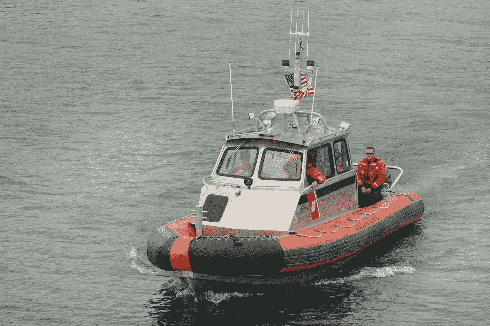
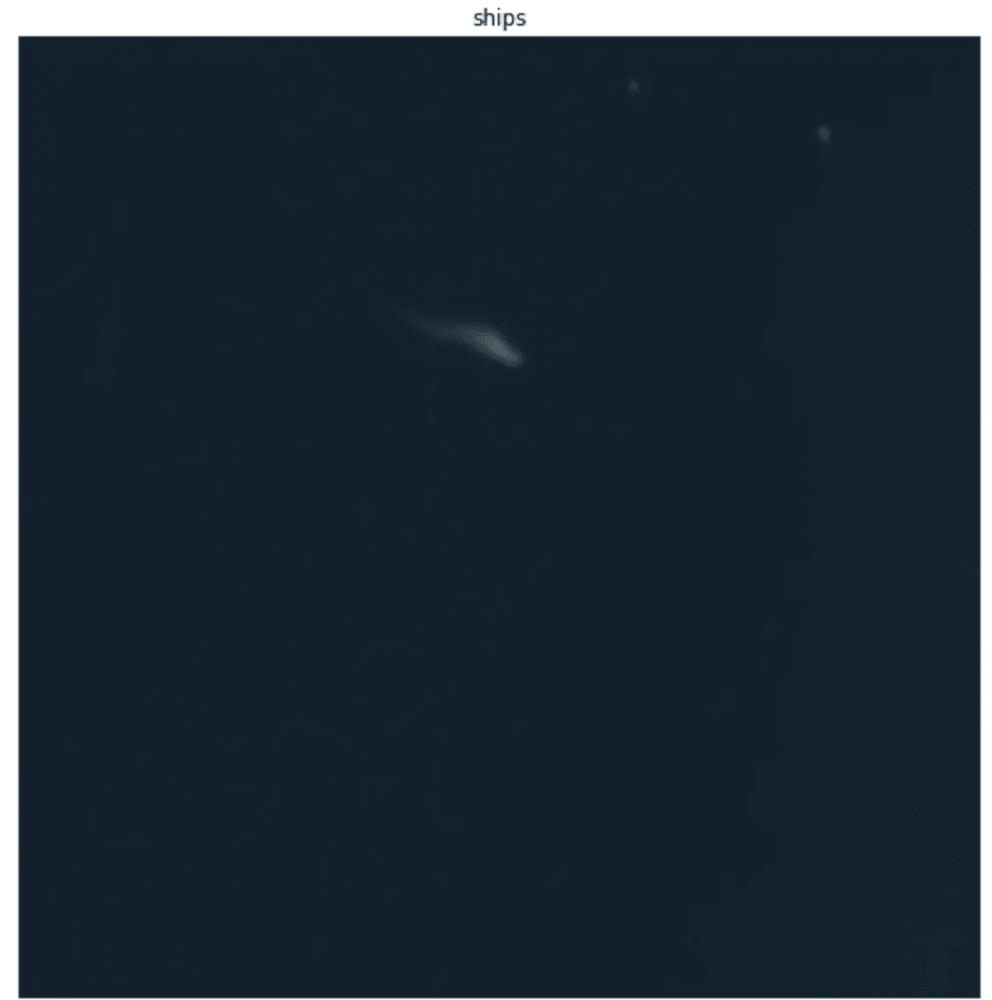
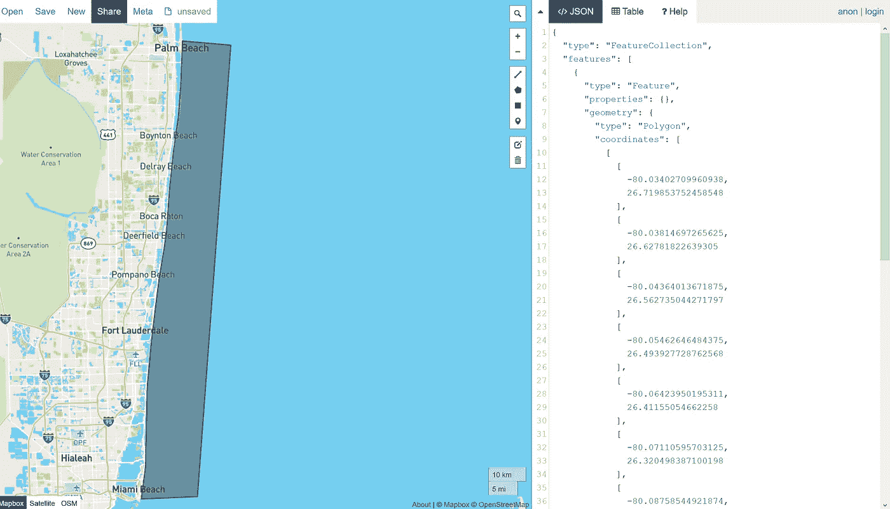
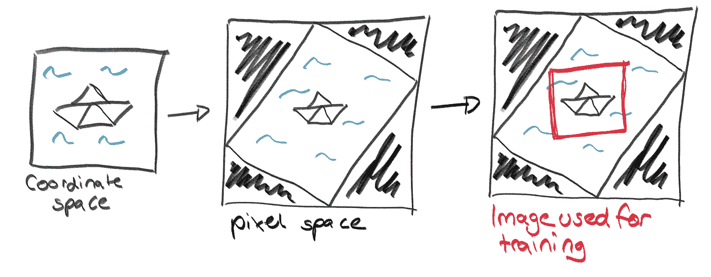

# 创建一个数据集来发现地中海的难民船

> 原文：<https://towardsdatascience.com/creating-a-dataset-to-spot-refugee-boats-in-the-mediteranean-449e86e2d4b2?source=collection_archive---------38----------------------->

## [变更数据](https://towardsdatascience.com/tagged/data-for-change)



照片由[珍·西奥多](https://unsplash.com/@jentheodore?utm_source=medium&utm_medium=referral)在 [Unsplash](https://unsplash.com?utm_source=medium&utm_medium=referral) 上拍摄

大约半年前，我开始了一项非常有趣的探索:利用卫星数据寻找难民船。我与非政府组织太空眼合作，这是一个致力于这一探索的非营利组织。许多其他倡议也对这个主题感兴趣并正在努力。我有 ML 背景和一些编程经验，但是从一开始就解决这样的问题是一个相当大的挑战，同时也很有趣。

一开始，我们思考了很多问题——对于大多数问题，我们每隔一段时间就会回头来看——比如:有什么样的卫星数据可用？分辨率是否足以探测到船只？我们如何验证我们的预测？系统可扩展吗？

经过大量的研究和非常有趣的讨论，我们意识到我们需要先做一个可行性研究。雷根斯堡的团队选择了来自 planet.com 的可视卫星图像。柏林的佩德罗正在为雷达图像做类似的工作，并取得了一些很好的成果。奥格斯堡的 SearchWing 正在为他们自己的无人机研究探测算法。但是行星数据似乎更适合我们非地球科学的眼睛和我在计算机视觉方面的经验。除了雷达数据，它看起来就像我们习惯的普通图像和图片。

在这篇文章中，我将描述我们为可行性研究创建船舶数据集的过程。重建这个的代码可以在我的 github 上找到——你需要自己访问 planet.com 来查询图片。

## 阶段 1——概念化

我们决定使用的卫星图像来自 PlanetScope 4 波段卫星，该卫星提供 3m*3m 分辨率的 4 通道图像(RGB+NIR)。我们选择了这个，因为它有最好的覆盖范围和分辨率的权衡。他们确实提供 0.8 米* 0.8 米分辨率的图像，但这必须为某个位置提前订购，成本要高得多。行星镜卫星已经在那里有一段时间了，所以我们有一些历史数据要看。《星球日报》几乎只公布了海岸的卫星图像——也就是说，陆地上和海洋中 7 公里处的一切。这部分是因为海洋相当广阔，没有多少人对它的图像感兴趣(至少没有陆地图片那么多)。另一方面，planet 在定位他们在海洋上拍摄的卫星图像时遇到了一些问题。虽然在陆地上，他们可以使用地标来定位自己和他们的照片，但这些在海洋图像中是不可用的。这导致定位误差，从而降低质量。但是今年的某个时候，他们改进了他们的算法，现在提供了更高质量的海洋图像。



星球图像中的一艘船的例子——使用 planet.com 数据创建了我自己

有了这些信息，我们仍然没有参考系统的解决方案。我们不知道那些难民船在哪里——这就是我们开始整件事的原因。

为了训练和验证我们的船只检测模型，我们需要一些地面真实数据——至少对于监督模型来说是这样。我们可能无法通过目测找到足够多的难民船来训练任何东西。所以我们寻找其他探测飞船的可能性。我们发现了明显的 [kaggle 飞船探测数据集](https://www.kaggle.com/c/airbus-ship-detection)，但是那些飞船比我们需要的要大得多。它们通常跨越几百个像素，而行星数据上的难民船仅测量大约 3 个像素。他们没有对我们来说非常有价值的 NIR 频道。所以我们决定去寻找一个基于原始 PlanetScope 数据的模型，但是是在非难民船上。但是如何在图片上找到正常的船呢？这将牵涉到大量的手工工作…

在和一些更有经验的船民在一起后，我了解了 AIS。AIS 是一个所有超过一定规模的船只都必须注册的系统。他们船上有一个发射机，不断广播他们的位置，他们还有一个接收机，告诉他们周围所有其他船只的位置。这基本上是一个确保它们不会相互碰撞的系统——至少我是这么理解的。这些数据通常对机器学习非常有用。有一些很棒的可视化项目和船舶跟踪应用程序。例如，世界自然基金会目前正在开发一种跟踪系统，利用人工智能系统来防止非法石油泄漏。我们的难民船没有 AIS 发送器。但这仍然可以帮助我们为我们的应用程序创建一个基本的训练集。

有一些网站可以让你自己请求当前的 AIS 数据来记录，但是这看起来太麻烦了。美国提供 marinecadastre.com[海岸旧的 AIS 日志文件。其他一些国家也有类似的东西，但我们发现没有一个符合美国数据的分辨率。他们的文件中有一分钟的分辨率，这对我们的应用程序来说应该足够了。](https://marinecadastre.gov/ais/)

所以现在我们有了一切，通过将 AIS 日志文件与行星卫星图像交叉，可以自动创建美国某个地方的船只/非船只数据集。概念阶段已经结束，我们终于可以开始实现数据集创建了。开始时，它看起来相当简单。

## 步骤 2 —交叉两个数据源

首先，我们需要交叉这两个数据源。我选择了迈阿密和棕榈滩之间的地区作为我感兴趣的地区。为此，我必须创建一个. geojson 文件(使用 [geojson.io](http://geojson.io/#map=2/20.0/0.0) 并不难)。



来自 geojson.io 的截图，带有示例区域-我自己创建的

由于来自 marinecadastre 的 AIS 文件非常大，我想删除所有不在我感兴趣的区域内的条目。Geopandas 给了我很大的帮助，尽管它有时会让我发疯。这个代码可以在顶部链接的 jupyter 笔记本中的函数 reduce_ais_csv()中找到。

现在我们需要找出卫星在哪里拍的照片。没有全天覆盖，但卫星每天只通过一到三次来拍照。为了与 planet 通信，我使用了 porder API，这在本文的[中有详细解释。我向 planet 索要了我的 geojson 中的图片 id 列表，这些图片的云层覆盖率不到 50%，与我感兴趣的区域至少有 80%的重叠。从 id 列表中，我们可以提取图像拍摄的准确时间。现在，从我们的 AIS 数据帧中，我们可以选择那些显示与相应卫星图像相同时间的条目。(不完全相同，但是+/- 30 秒，因为 AIS 文件的记录速度是每分钟。)](https://medium.com/@samapriyaroy/order-up-using-and-building-with-planet-s-new-ordersv2-api-ba2fe14eac8e)

```
porder idlist --input "\infile.gejson" --start "day.month.year" --end "day.month.year" --item "PSScene4Band" --asset "analytic" --cmax 0.5 --outfile "\outfile.csv" --overlap 80
```

现在我们有了一个候选船只的列表，我们可以尝试下载卫星图像文件。

## 步骤 3-下载船舶图像

这一步听起来很容易，但它花费了我们几个下午和大量的脑细胞。对于在地质数据方面有经验的人来说，这可能并不难。但是我们遇到了一个大问题，地球是圆的。

**是的，地球是圆的。**因此，坐标空间中的简单矩形在卫星图像中不是矩形，反之亦然。长话短说，最后的结论是下载围绕坐标中预期船只位置的小片段。这些被指定为矩形。传回的图像是镶嵌在黑色未定义像素中的扭曲菱形。但是，如果我们指定矩形足够大，我们可以在这个混乱的中间切割一个矩形(在像素空间中),用于我们的训练系统。



船舶管道的可视化——如何获得一个中间有一艘船的矩形图像——创造了我自己

使用 [porder API](https://medium.com/@samapriyaroy/order-up-using-and-building-with-planet-s-new-ordersv2-api-ba2fe14eac8e) ，我们能够简单地在船的位置周围排序小的(坐标方向)矩形片段并下载这些图像。

哦，你知道有上百个坐标系统吗？正常人使用的一个叫做 EPSG-4326，还有一个特别为地中海人准备的…因为地球是圆的，转换并不简单。—这一发现又花了几个小时，但对这个项目来说是不必要的。

## 步骤 4-找到相应的非船只图像

我们现在已经成功地创建了我们的阳性样本。包含一艘船的那些。现在我们也需要反面的例子。不包含任何船只的卫星图像。这应该不会太复杂，因为海洋非常广阔。但是我不想只拍摄任何卫星图像，而是想要一个尽可能平衡的数据集。

所以我试着从我使用的包含一艘船的同一张卫星图像中获取一张不包含船的图像。这将自动平衡天气和闪电条件以及云和海洋条件。听起来很不错，不是吗？

为了找到一个满足我要求的片段，我创建了一个搜索半径，围绕着我目前想要补充的船。我从这个搜索半径中随机选择了一个区域，并使用 AIS 数据检查了这个区域内没有船只。接下来，我尝试使用 porder API 下载图像。我重复这个过程几次，希望得到每一个船只图像的非船只图像。有时它会失败——要么是因为当时有太多的船只在该区域航行，要么是因为它靠近我定义的 geojson 的边界。如果发生这种情况，我只是在一艘已经被用来创建非船的船上重做这个过程。因为只有大约百分之一的图像是这种情况，我认为这是一个好方法。

## 第五步——把所有东西放在一起

在我成功下载了 2016 年所选地区的所有数据后，我只需要更好地组织它。我把所有的船归入一艘。csv 文件和所有非船舶在另一个。它们包含 AIS 数据库中可用的所有元数据，如速度、名称等。接下来，我将所有的船图片放入一个基本文件夹，将所有的非船图片放入另一个文件夹(同时记住它们原来的名字和 AIS 条目！).最后，我们添加了一些文档，这样无论是谁，都不会完全迷路。所以数据集上有些闪亮；)

毕竟这是一个相当长的旅程，我非常期待进入创建模型和在这个数据集上评估它们的有趣部分。让我们希望我们能找到小到 3 个像素的船，这样我们就能最终开始处理真正的任务了！

声明:这不仅是我的工作。同事和其他组织提供了很多帮助。仅举几个例子:斯蒂芬、西蒙和佩德罗尽可能地帮助了我。谢谢大家！

我将在介质上发布数据集上的实验更新(如果有效，甚至可能在其他地方)。:)所以保持关注！

已知问题:目测显示我们有相当多的假阴性——所以很多非船图片包括船…