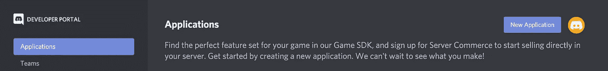
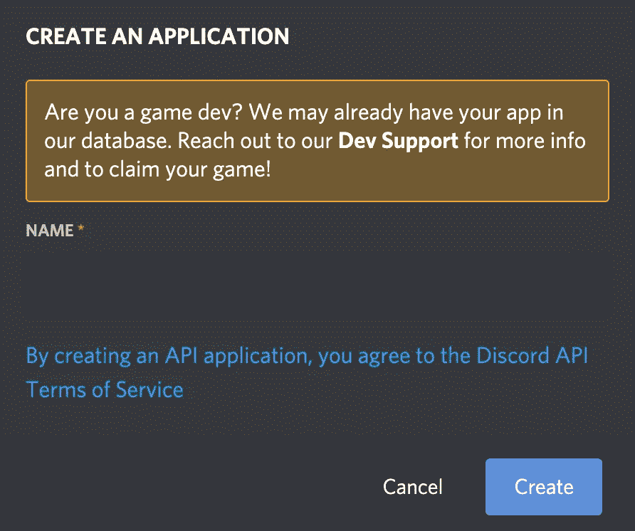
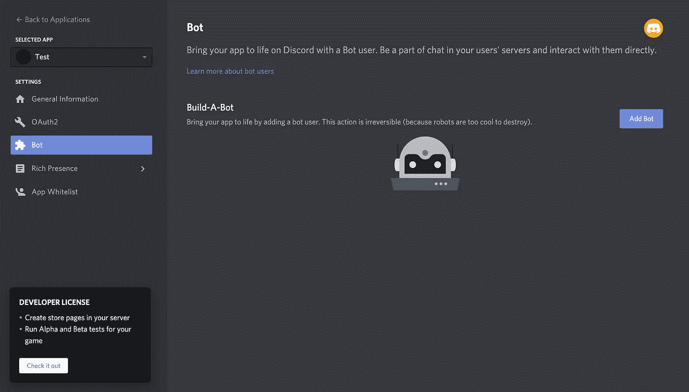
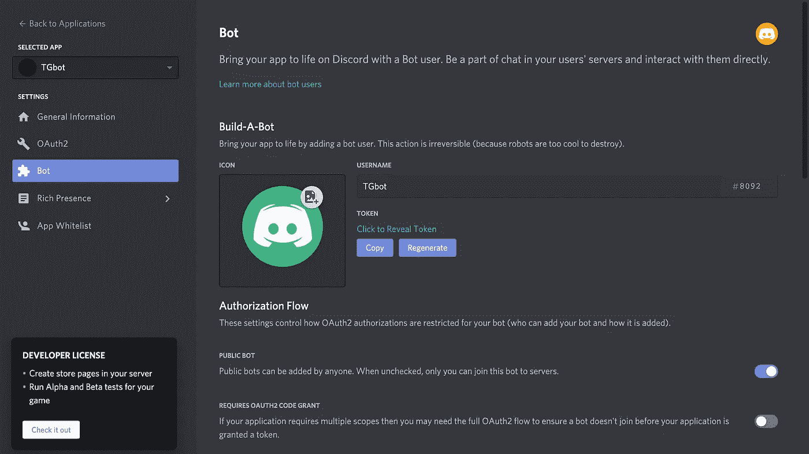
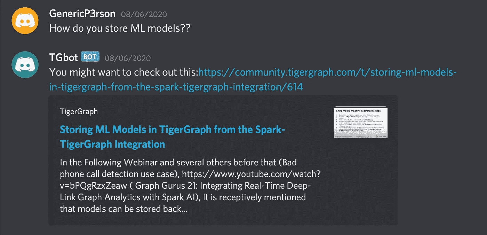

# 用 pyTigerGraph 创建不和谐聊天机器人

> 原文：<https://towardsdatascience.com/creating-a-discord-chat-bot-with-pytigergraph-8439f1ea9774?source=collection_archive---------48----------------------->

## 创建一个聊天机器人，用 Discord.py 和 pyTigerGraph 回答 TigerGraph 的问题

# 什么是项目，为什么要完成它？

一个潜在的热门话题是用图形技术创建聊天机器人。虽然这绝不是一个高级聊天机器人，但它是一种结合 TigerGraph 和 Discord 的力量为 Discord 服务器创建响应机器人的方式。

# 第一步:创建不和谐的机器人

首先，您需要在 Discord 上创建机器人本身。对于这个项目，我们将使用 [Discord.py](https://discordpy.readthedocs.io/en/latest/) 。要创建机器人，你需要一个不和谐的帐户，并启用开发模式。然后你应该可以进入申请页面:【https://discord.com/developers/applications 

从这里，在右上角，单击“新建应用程序”



单击蓝色的“新建应用程序”按钮。

接下来，在提示符下命名您的应用程序。



命名后，您应该重定向到该机器人的页面。在这里，在左侧栏，切换到“机器人”，然后点击“添加机器人。”



切换到“机器人”，然后点击“添加机器人”

确认后，你就有你的机器人了！最终，你会需要机器人的令牌。要复制它，只需按蓝色的“复制”按钮。



用蓝色的复制按钮复制你的机器人令牌

# 第二步:创建图表

## 步骤 2a:导入库

图表将在 pyTigerGraph 中创建。首先，确保你已经安装了 pyTigerGraph 和 Discord.py。

```
pip install pyTigerGraph
pip install discord.py
```

## 步骤 2b:开始解决方案

然后，创建一个名为 createGraph.py 或类似的文档。首先，在[http；//tgcloud.io/](http://tgcloud.io/) 创建一个帐户，然后完成以下步骤:

1.  转到“我的解决方案”,然后单击“创建解决方案”
2.  单击“空白 v3 ”,然后按下一步两次。
3.  根据需要编辑解决方案名称、标签和子域，然后按下一步。
4.  按提交并等待解决方案启动。

## 步骤 2c:创建连接

一旦解决方案启动，您就可以在您的文档中使用以下内容创建一个连接。首先，导入 pyTigerGraph，然后使用它来创建连接，使用您在第三步中提交的信息作为主机名、用户名和密码。

```
import pyTigerGraph as tgconn = tg.TigerGraphConnection(host="https://HOST_NAME.i.tgcloud.io", username="USERNAME", version="3.0.5", password="PASSWORD", useCert=True)
```

## 步骤 2d:创建模式

接下来，我们将创建一个模式。这种情况下的模式很简单:顶点 Message 和 Word 用一个 MESSAGE_WORD 顶点连接。

```
conn.gsql('''CREATE VERTEX Word(primary_id word STRING) with primary_id_as_attribute="true"
CREATE VERTEX Message(primary_id id INT, message STRING, url STRING)
CREATE UNDIRECTED EDGE WORD_MESSAGE(FROM Message, To Word)
CREATE GRAPH ChatBot(Word, Message, WORD_MESSAGE)''')
```

运行此程序后，您将已经在 TigerGraph 中创建了您的图形！恭喜你。接下来，您需要调整连接细节，然后加载数据并编写查询。

```
conn.graphname = "ChatBot"
conn.apiToken = conn.getToken(conn.createSecret())
```

# 步骤三:从 API 中提取数据

为了得到我的数据，我从 https://community.tigergraph.com/的文章中提取。为此，我使用端点 https://community.tigergraph.com/posts.json.从论坛中提取了最近的消息。使用 JSON 库，我加载了“latest_posts”

```
import requests
import json

x = requests.get("https://community.tigergraph.com/posts.json")
data = json.loads(x.text)["latest_posts"] 
```

数据有几个重要的部分:raw(整个消息)、id、“topic_slug”和“topic_id”。“topic_slug”和“topic_id”一起可以检索原始 url。

```
print(data[0]["raw"]) # Message
print(data[0]["id"]) # ID
print("https://community.tigergraph.com/t/" + data[0]["topic_slug"] + "/" + str(data[0]["topic_id"])) # Url
```

接下来，我们需要将数据加载到图表中。在加载数据之前，我们需要清理数据，删除所有停用词或标点符号。接下来，我们将把它插入图表。

```
from nltk.corpus import stopwords
from nltk.tokenize import word_tokenizestop_words = set(stopwords.words('english'))for msg in data:  
   raw_msg="<br>".join(("".join(msg["raw"].split(","))).split("\n")) 
   individual_words = raw_msg.split()    
   word_tokens = word_tokenize(raw_msg.lower())    
   filtered_sentence = [w for w in word_tokens if not w in stop_words]    
   filtered_sentence = [w for w in filtered_sentence if not w in [        '.', ',', '!', '?', ':', ';']]
   url = "https://community.tigergraph.com/t/" + msg["topic_slug"] + "/" + str(msg["topic_id"])
   conn.upsertVertex("Message", msg["id"], attributes={"id": msg["id"], "message": msg["raw"], "url": url}) for word in filtered_sentence:        
       conn.upsertVertex("Word", word, attributes = {"word": word})
       conn.upsertEdge("Word", word, "WORD_MESSAGE", "Message", msg["id"])
```

太好了！现在，您已经将所有数据加载到图表中。接下来，让我们创建机器人！

# 第四步:创建机器人

现在创建一个新文件。还记得您在第一步中生成的令牌吗？你现在需要它。

我们将首先创建一个不和谐机器人的轮廓。

```
import discord
import pyTigerGraph as tg
from nltk.corpus import stopwords
from nltk.tokenize import word_tokenizeclient = discord.Client()conn = tg.TigerGraphConnection(host="https://HOST_NAME.i.tgcloud.io", username="USERNAME", version="3.0.5", password="PASSWORD", useCert=True)conn.graphname = "ChatBot"
conn.apiToken = conn.getToken(conn.createSecret())@client.event
async def on_message(msg):
    print(msg.content)@client.event
async def on_ready():
    print(f"We have logged in as {client.user}")client.run("YOUR_DISCORD_TOKEN")
```

我们要做的所有工作都在 on_message 中。首先，我们将看看消息是否以“？?"这个特殊机器人的触发器。接下来，我们将执行与步骤 III 中相同的数据清理步骤。最后，我们将找到消息最相似的帖子并返回它。

现在你可以运行你的机器人，看看结果！



机器人对不和谐的结果

# 第五步:下一步

恭喜你。你创造了一个基本的问答机器人与 TigerGraph 不和！接下来，把这个修改成你自己的。

如果你有任何问题或需要帮助，请加入 TigerGraph Discord。

[](https://discord.gg/7ft9PNZAM6) [## 加入 TigerGraph Discord 服务器！

### 在 Discord 上查看 TigerGraph 社区-与 382 名其他成员一起闲逛，享受免费语音和文本聊天。

不和谐. gg](https://discord.gg/7ft9PNZAM6) 

祝你好运！

注:所有图片，除特别注明外，均为作者所有。