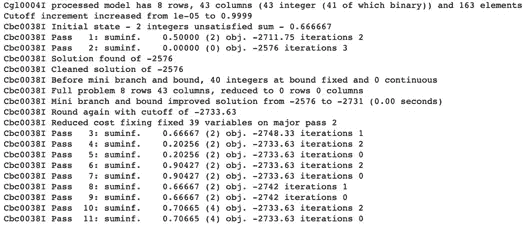

# 幻想板球——线性规划的应用

> 原文：<https://towardsdatascience.com/creating-a-fantasy-cricket-team-application-of-linear-programming-4b60c261702d?source=collection_archive---------4----------------------->

## 使用 Python(纸浆包)的分步指南

印度超级联赛(IPL)是全球最大的国内板球联赛。2020 年，IPL 冠名赞助商是 Dream11。Dream11 是一个基于印度的梦幻运动平台。它允许用户玩梦幻板球、曲棍球、足球、卡巴迪和篮球。

在本文中，我们将把规定性分析应用到体育运动中，我们将重点选择一个梦幻板球队，以其中一场比赛为例。

图片来自 Unsplash: [来源](https://unsplash.com/photos/I27kjbkwlAo)

# 简而言之，梦幻蟋蟀

如果你是幻想板球的新手，那么这就是它是如何工作的

*   用户需要创建一个幻想板球队
*   然后，用户可以与这支队伍一起参加竞赛。
*   每个玩家被分配一个信用值。一个团队总积分是有上限的。
*   每个球员将属于以下类别之一:击球手，守门员，投球手，全才
*   在比赛中，分数是根据运动员的表现和类别来分配的。
*   在比赛结束时，根据得分，遵守所有规则的得分最高的球队将是最佳 11 名球员的获胜组合。

# 游戏规则

建立一个梦幻团队需要遵循一套规则。

不同的幻想平台的规则可能会有所不同，需要相应地调整。

*   一个队总共应该有 11 名队员
*   队里应该有 1 到 3 名全才
*   队里应该有 1 到 3 名守门人
*   队里应该有 3 到 6 名击球手
*   该队应该有 3 到 6 名投球手
*   每一方应该有 4 到 7 名队员
*   团队的总积分不应超过 100 分

# 如何挑选球员

此外，对于每场比赛，每个球员都可以获得以下信息:

1.  玩家在同一锦标赛的前几场比赛中的得分
2.  玩家每场比赛的平均得分
3.  球员在同一赛事的过去比赛中进入前 11 名球队的次数
4.  球员在过去进入最佳 11 队的次数百分比

以上任何一个指标都可以用来挑选最好的团队。

# 线性规划

运筹学中的线性规划是一种科学技术，用于通过考虑资源稀缺和约束来获得给定商业问题的最优解决方案。

线性规划允许我们将现实生活中的问题建模成由线性关系表示的数学模型。它涉及一个目标函数，该目标函数基于必须实现的目标和作为线性不等式的约束的创建来定义。顾名思义，目标函数和约束之间的关系本质上应该是线性的(一次方程)。

# 线性规划的快速回顾

这里有一个简单的例子来快速回顾线性编程。

## 线性规划中的基本术语

> **目标函数:**目标函数是我们试图求解的线性函数。基于我们试图解决的问题，这个函数的值需要最小化或最大化。
> 
> **决策变量:**作为输入来决定最终输出的变量称为决策变量。它也被称为目标变量。
> 
> **约束:**约束是对决策变量的限制。

最终的目标函数必须在应用了所有约束的决策变量上实现。这是一个简单的线性规划问题的例子。

## 简单的例子

比方说，我们想要最大化 z，给定两个变量 x & y，它们需要遵循给定的约束。

> **目标函数:**最大化 z，其中 *z= 2x + 3y*
> 
> **决策变量:** *x* & *y*
> 
> **约束:** *x>= 0
> y>= 1
> x+2y<= 15
> -2x+4y>=-7
> -2x+y<= 4*

绘制上述约束条件的所有线条，可得到如下图表。这里，阴影区域是所有上述约束都成立的公共区域。

线性规划的目标是在这个阴影区域内确定 x 和 y 的值，这将提供 z 的最大可能值。

**简单的例子——线性规划**(图片由作者提供)

解这个线性程序给出了 z 的最大值，在 x=9 & y=3 时为 27。

**注**:参考文末提供的 git repo 访问 Python 代码生成上图也是用 PuLP 解决这个线性规划问题。

# 幻想板球&线性编程

线性规划可以用来解决许多现实生活中的问题，幻想板球就是其中之一。

要创建一个梦幻团队，你需要根据目标选择最好的球员。最终形成的团队应该遵循平台规定的所有规则或约束。

这使得它成为一个可以用线性规划解决的完美问题。我们需要在尊重给定的预算(学分)和团队组成约束的同时，最大化团队的选择度量投影。

**用一个简单的例子理解线性规划，并用 Fantasy Team Generation 进行映射(图片由作者提供)**

上面的映射说明了线性规划的每个基本组成部分是如何与一个简单的例子和这个组建梦幻团队的案例研究联系起来的。

# 什么是纸浆？

PuLP 是一个解决优化问题的开源 python 包。它提供了将数学程序转换成可以输入解算器的形式的接口。

通过提供代表优化问题和决策变量的 Python 对象，并允许以与原始数学表达式非常相似的方式表达约束，PuLP 完全在 Python 语言的语法内工作。

为了保持语法尽可能简单和直观，PuLP 专注于支持线性和混合整数模型。

纸浆支持像 GLPK，CPLE，硬币，古罗比解决方案。默认情况下，纸浆使用 CBC 解算器(硬币或分支切割解算器)。

有关纸浆的更多详情，请参考以下链接:[https://pypi.org/project/PuLP/](https://pypi.org/project/PuLP/)

# 使用 PuLP 解决 Python 中的线性问题

我们将使用 python 包 PuLP 来创建线性问题并解决它。

除了所提供的规则之外，还可以为用户添加额外的约束来进行游戏并创建最适合的团队。

一旦确定了一个最佳解决方案，它将产生一个梦幻团队以及一些概要细节。此外，我们将使用 ipywidgets 包来构建 Jupyter 笔记本中的用户界面，这样我们就可以处理约束了。

下面的代码片段是完整代码的一部分，有助于读者理解逻辑流程。

# 软件包安装

除了像 NumPy，pandas，sklearn 这样的常规包，这个代码还需要安装纸浆。如果您正在使用 pip，所有的软件包都可以用“pip install pulp”命令安装。

# 输入数据

这个程序需要两种输入。一个是玩家细节，另一个是用户配置来构建线性问题。

球员的详细资料是在 CSV 文件中创建的，该文件被读入熊猫数据帧。该文件的示例内容如下所示。

该数据目前无法在网上获得，并且是针对本案例研究手工整理的。

**输入数据的样本内容**(图片由作者提供)

# 创建线性规划问题

解决线性规划问题的第一步是创建问题。这可以使用纸浆包装来完成。

# 创建决策变量

准备创建目标函数和约束所需的决策变量。

应该为每个约束条件创建类似的变量。上面显示的是一个例子。同样的方法可以用来创建所有需要的变量。

# 定义目标函数

这里，目标函数可以基于以下之一来定义:

*   基于每个玩家的点数最大化
*   根据玩家过去在最佳 11 队的次数最大化
*   基于每场比赛的平均分数最大化
*   根据玩家在最佳 11 队中的百分比次数最大化

这种选择可以交给用户来配置，基于这种选择可以设置目标函数。

# 添加约束

一旦创建了线性规划问题并定义了目标函数，我们现在就可以为问题添加约束了。

## **基于玩家数量的限制**

最终的队伍中应该正好有 11 名队员。这个条件可以用下面的约束来设置。

## **基于第 1 队**队员的约束

每个队可以有 4 到 7 名队员。如果需要，用户可以进一步配置。

## 基于阵容中球员的约束

由于只有在掷硬币时(通常在比赛开始前 30 分钟)才知道比赛 11，所以可以对要挑选的运动员增加限制。

*   从所有玩家中选择(默认)
*   只选择参加过最后一场比赛的球员
*   只选择至少打过一场比赛的球员
*   只选择比赛中的 11 名球员

以上是不同约束的一些例子。类似地，可以设置所有需要的约束。

# 准备解决？

既然已经添加了约束条件并定义了目标函数，我们就可以解决这个问题了。

既然目标是目标最大化，那就相应地给问题设置客观细节，让纸浆去解决。

# 数学程序的纸浆表示

一旦向纸浆提供了要解决什么的细节，我们就可以通过打印问题对象来显示问题细节。

打印问题的输出示例如下。为了便于说明，这里我们只考虑了 3 个约束。请参考 git repo 查看所有约束的结果。

**纸浆问题表述样本输出**(图片由作者提供)

解决线性规划问题主要有三种类型的信息:

1.  必须最大化或最小化的目标函数
2.  最大化/最小化时需要遵循的**约束**或规则
3.  必须应用目标函数和约束的输入**变量**

现在让我们试着去理解纸浆的内部表现。

## **目标函数的纸浆表示**

**纸浆中目标函数的表示**(图片由作者提供)

*   记住，我们创建了目标二进制变量来决定每个玩家是否会在幻想队中
*   每个玩家都有一个唯一的玩家号，用于创建该玩家的标识符
*   我们已经将目标函数设置为基于玩家点数最大化
*   纸浆使用这些信息来导出目标函数，该函数是每个玩家的加权分数总和。
*   这个线性规划问题的目标是找到一个组合的球员，将最大化这个总和。

## 纸浆对约束的表示

**纸浆中约束**的表示(图片由作者提供)

*   因为我们在这里处理的是二元目标变量，所以考虑了所有匹配约束的玩家的总和
*   例如，对于检票口看守人的约束，只考虑 WK 类型的玩家号码。类似的其他类型如击球手和投球手。
*   PuLP 将在内部保存添加到 LPProblem 的所有约束。最终的最优解将只考虑满足所有约束的组合。

## 变量的纸浆表示

**纸浆中的决策/目标变量表示**(图片由作者提供)

*   将为数据集中的所有玩家创建决策/目标变量。
*   目标函数和约束仅应用于这组变量

# 解释结果

纸浆将试图通过确定最佳选择来解决问题，该最佳选择将最大化目标函数，并且还满足所有已设置的约束。

如果在给定的约束条件下找不到任何可行的解决方案，那么它将返回不可行的状态。在这种情况下，PuLP 删除无法满足的约束，并返回一个输出。

# 抽样输出

作者图片

# 求解器的性能

由于数据很小，只有 46 个变量，因此求解器的性能不成问题。在我的本地系统(16 GB 内存)中，这一过程不到一秒钟。

求解器通过 32 次迭代找到一个最高得分为 2731 的最优解，以确定给定约束条件下的最终 11 名球员。

**来自 CBC 求解器的日志**(图片由作者提供)

**最终最优解日志**(图片作者提供)

# 摆弄数据

为了使应用程序更具交互性，使用了 ipywidgets，以便用户可以在 Jupyter 笔记本上选择配置值。

我们不会详细讨论在 Jupyter 笔记本上创建小部件的细节，因为已经有大量的文档可用，而且这也不是我们这里的重点。

作者图片

这些配置在内部被转换成目标函数或约束条件。

# 配置和创建团队—示例结果

给出你选择的约束条件，然后点击“创建梦幻团队”按钮。

作者图片

作者图片

**砰！！！你已经准备好和你的梦幻团队一起开始参加比赛了！！一切顺利:-)**

# 结论

本文是一个简单的例子，展示了如何将线性优化技术应用到板球比赛中来挑选最佳球员。线性优化的原则可以应用于许多有着简单目标的问题。

试试看，玩玩。为了探索更多，我们可以为每个玩家获取更多的历史数据，并将其添加到选择约束中。虽然这可能不会使精英队总是，但它肯定会指导用户选择球队。

**免责声明:**奇幻团队仅基于提供的数据和给出的约束条件进行提示。不能保证这些球员在比赛结束时会进入最佳 11 强。请在挑选团队时使用您自己的判断:-)