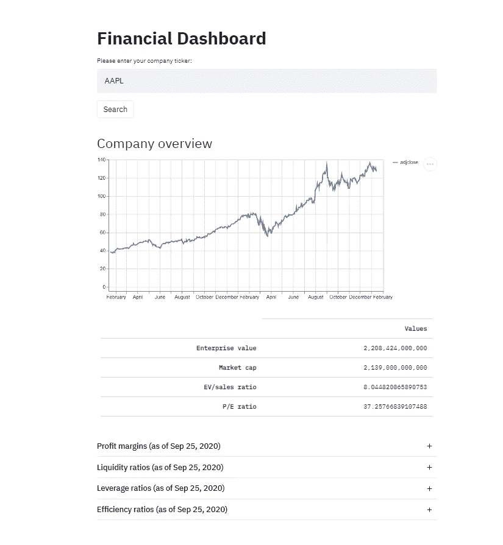
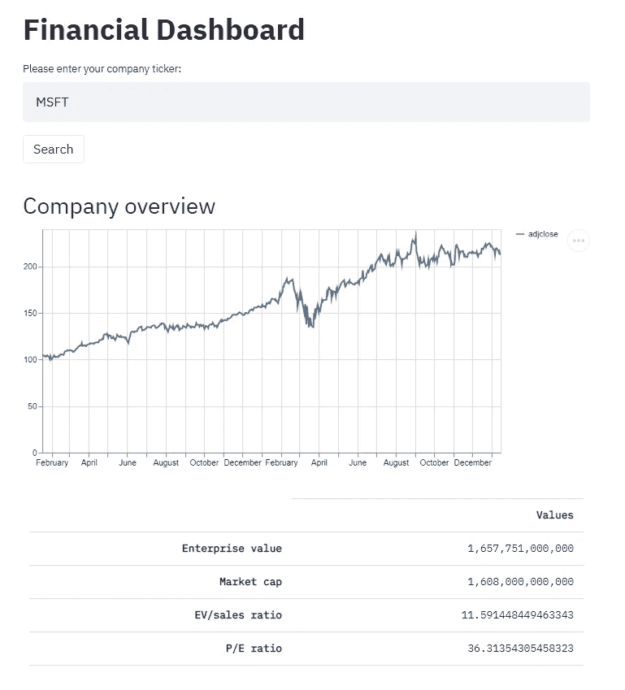
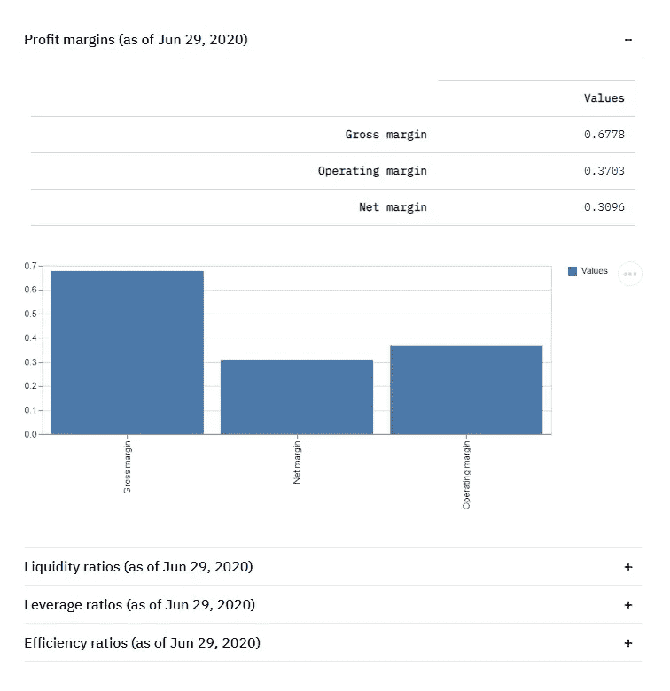

# 使用 Python 和 Streamlit 创建财务仪表板

> 原文：<https://towardsdatascience.com/creating-a-financial-dashboard-using-python-and-streamlit-cccf6c026676?source=collection_archive---------10----------------------->

## 使用 Streamlit 库显示来自 Yahoo Finance 的财务数据


***注来自《走向数据科学》的编辑:*** *虽然我们允许独立作者根据我们的* [*规则和指导方针*](/questions-96667b06af5) *发表文章，但我们不认可每个作者的贡献。你不应该在没有寻求专业建议的情况下依赖一个作者的作品。详见我们的* [*读者术语*](/readers-terms-b5d780a700a4) *。*

最近的轶事，日交易者在“深入”的价格图表分析后，用 OTM 看涨期权将他们的净值翻了三倍，导致了对一般投资尤其是股票的某种扭曲的看法。正是在这种乐观(或繁荣)的时期，向乔尔·格林布拉特这样的伟大投资者求助，可能会让我们对投资者在交易期权或买卖股票时最终押注的到底是什么有一个更有根据的理解。

> “股票……不是一张纸，你可以在上面标上夏普比率和索丁诺指数……它们是企业的所有权股份，你对其进行估值，并试图以折扣价购买。”—乔尔·格林布拉特[1]

这表明，想要在一段时间内跑赢市场的投资者不应该通过在期权市场上鲁莽交易来实现这一目标。相反，格林布拉特建议，任何积极投资的方法都应该基于对公司基本面数据的分析。

在这一点上，值得一提的是，关于市场对证券进行充分定价的能力，长期以来一直存在一个更为根本性的争论(例如，参见 Fama [2]和 Shiller [3])。这场辩论的最终结果，反过来，对最初参与积极的投资组合管理的优点有着重大的影响。然而，这种担心不应该是本文的主题，我将做出(可能不准确的)假设，即积极的投资组合管理是有价值的。

鉴于成功的积极投资需要对公司财务状况的详细了解，剩下的核心问题是从哪里获得这些信息以及如何解读这些信息。虽然存在像彭博终端这样的巨大信息源，但大多数散户投资者没有通过购买此类服务的年度订阅来破产的冲动。在初步研究的情况下，我个人使用雅虎财经(Yahoo Finance)这样的免费产品，这些产品可以汇总财务信息，无需翻查冗长的年度和季度报告。

虽然我认为雅虎财经在提供对公司基本面的初步了解方面做得很好，但它没有提供某些重要的指标，其他指标也很难找到。

为了获得简明、易于理解的上市公司快照，我使用了一些 Python 自动化来编写一个财务仪表板应用程序。在这里，可能需要注意的是，我的编程技能肯定是不合格的，我确信有一种更好的方法来解决我的问题。因此，下面的文章应该是对 Python 和 Streamlit 潜力的证明，而绝不是编程教程。

# 财务仪表板应用程序

[Streamlit](https://www.streamlit.io/) 是一个 Python 包，它使得创建仪表板和数据应用程序变得非常容易，而不需要任何前端编程专业知识。该库可用于创建如下所示的应用程序，该应用程序允许用户输入公司股票代码，并根据公司最新的财务数据获得财务比率:



最终仪表板的预览

# 收集数据

为了收集作为应用程序输入的数据，使用 yahoo_fin 包非常有用。这个包从 Yahoo Finance 中抓取信息，并以 pandas DataFrames 的形式返回，而 pandas data frames 又可以很好地与 Streamlit 集成。

```
class Company:
    def __init__(self, ticker):
        price_df = si.get_data(ticker, dt.datetime.now()-           dt.timedelta(days=2*365), dt.datetime.date(dt.datetime.now()))
        overview_df = si.get_stats(ticker)
        overview_df = overview_df.set_index('Attribute')
        overview_dict = si.get_quote_table(ticker)
        income_statement = si.get_income_statement(ticker)
        balance_sheet = si.get_balance_sheet(ticker)
        cash_flows = si.get_cash_flow(ticker)
```

由此产生的数据框架可用于提取所需的信息，如公司市值或损益表指标，如 EBIT 或净收入。

```
self.year_end = overview_df.loc['Fiscal Year Ends'][0]
self.market_cap = get_integer(overview_dict['Market Cap'])
self.market_cap_cs = '{:,d}'.format(int(self.market_cap))
self.prices = price_df['adjclose']

self.sales = income_statement.loc['totalRevenue'][0]
self.gross_profit = income_statement.loc['grossProfit'][0]
self.ebit = income_statement.loc['ebit'][0]
self.interest = - income_statement.loc['interestExpense'][0]
self.net_profit = income_statement.loc['netIncome'][0]
```

最后，这些数据可以用来计算估值倍数或利润率等指标。此外，我计算了我的应用程序的流动性、杠杆和效率比率。

```
def get_overview(self):
        self.price_earnings_ratio = self.market_cap/self.net_profit
        self.ev_sales_ratio = self.ev/self.sales
        self.overview_dict = {
            'Values' : [self.ev_cs, self.market_cap_cs, self.ev_sales_ratio, self.price_earnings_ratio]
            }

def get_profit_margins(self):
        self.gross_margin = self.gross_profit/self.sales
        self.operating_margin = self.ebit/self.sales
        self.net_margin = self.net_profit/self.sales
        self.profit_margin_dict = {
            'Values' : [self.gross_margin, self.operating_margin, self.net_margin]
            }
```

# 显示数据

如前所述，Streamlit 使得以结构化的方式显示这些信息变得非常容易，只需很少的额外工作。在我的例子中，我只是添加了应用程序的标题和一个允许用户输入公司股票的文本字段。通过单击“Search”按钮，执行上面显示的代码行并收集数据。

```
st.title('Financial Dashboard')
ticker_input = st.text_input('Please enter your company ticker:')
search_button = st.button('Search')

if search_button:
    company = Company(ticker_input)
    company.get_overview()
    company.get_profit_margins()
    company.get_liquidity_ratios()
    company.get_leverage_ratios()
    company.get_efficiency_ratios()
```

Streamlit 提供了强大的功能，有助于通过折线图、表格或条形图等方式显示数据。

```
st.header('Company overview')
    overview_index = ['Enterprise value', 'Market cap', 'EV/sales ratio', 'P/E ratio']
    overview_df = pd.DataFrame(company.overview_dict, index = overview_index)
    st.line_chart(company.prices)
    st.table(overview_df)

    with st.beta_expander('Profit margins (as of {})'.format(company.year_end)):
        profit_margin_index = ['Gross margin', 'Operating margin', 'Net margin']
        profit_margin_df = pd.DataFrame(company.profit_margin_dict, index = profit_margin_index)
        st.table(profit_margin_df)
        st.bar_chart(profit_margin_df)
```

在我的例子中，结果如下所示:



最终控制面板，左侧是公司概况，右侧是更多指标

# 结束语

在我看来，Streamlit 非常容易使用，并且有很好的文档记录，使得显示和解释数据变得简单明了。我承认我的应用程序仍然相当有限，并且有许多额外的功能，一个更熟练的程序员可以集成。

总的来说，我认为增加基本指标的可用性和可访问性，如利润率或杠杆率，可以更好地了解公司的财务状况。这反过来可能会导致更明智的投资决策，这可能有助于投资者长期跑赢市场。

# 放弃

上面提供的代码只是将 Python 编程应用于金融领域的一个练习。本文包含的信息不应用于投资决策。此外，从雅虎财经收集的信息不应用于任何商业目的。

[1][https://www.youtube.com/watch?v=V8Zuw8Mnc-I](https://www.youtube.com/watch?v=V8Zuw8Mnc-I)
【2】法玛，E. F. (1970)。有效资本市场:理论与实证研究综述。*《财经杂志》*， *25* (2)，383–417 页。
[3]希勒，R.J. (1981 年)。股票价格波动太大，以至于不能用随后的股息变化来解释吗？*《美国经济评论》，第 71 期* (3)，第 421–436 页。