# 在 Python 中创建创新的自定义损失函数

> 原文：<https://towardsdatascience.com/creating-a-innovative-custom-loss-function-in-python-using-tensorflow-and-fitting-a-lstm-model-ded222efbc89?source=collection_archive---------20----------------------->

## 在 python 中使用 Tensorflow 包并使用 LSTM 模型进行测试

这里我想介绍一个创新的新损失函数。我将这个新的损失函数定义为 MSE-MAD。使用指数加权移动平均框架并结合使用 MSE 和 MAD 来构建损失函数。MSE-MAD 的结果将使用适合太阳黑子数据的 LSTM 模型进行比较。

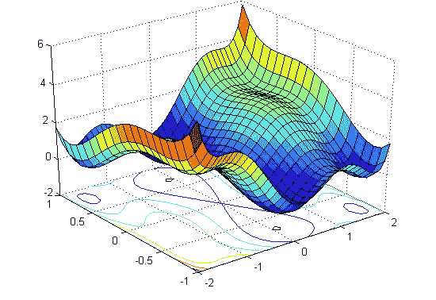

图片来源【https://algorithm ia . com/blog/introduction-to-loss-functions】经作者允许编辑。

# 介绍

在我们进入新的损失函数之前，让我先介绍一下什么是损失函数，以及它如何应用于机器学习。损失函数的目的是衡量模型对输入数据的解释程度。换句话说，损失函数是我们的预测与响应变量之间距离的度量。在几乎所有的应用中，我们都有一个固定的模型，目标是在给定一些数据的情况下估计模型的参数。

在我介绍这个新的损失函数之前，我将首先介绍一些基本的损失函数以及它们在模型拟合期间的表现。

# 均方误差

均方差是我要介绍的第一个损失函数。均方误差(MSE)的计算公式如下

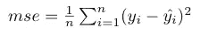

均方误差

根据 MSE 公式，hat 表示变量 y 的预测值或估计值。在数学中，变量上方的 hat 表示给定随机变量的估计值。n 代表我们估计的总数据点的数量。从某种意义上说，MSE 公式所做的只是测量每个预测与响应变量之间的距离，并对距离求平方，然后对所有测量值求平均值。下图用虚线显示了模型，每个数据点用绿色显示。

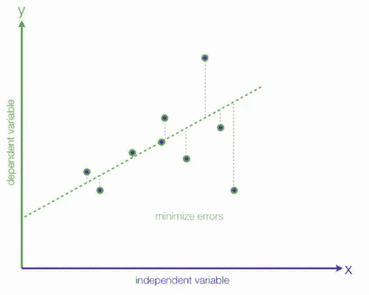

误差测量

python 中 MSE 的实现如下。

```
def MSE(y_predicted, y):
  squared_error = (y_predicted - y) ** 2
  sum_squared_error = np.sum(squared_error)
  mse = sum_squared_error / y.size
  return(mse)
```

# 平均绝对偏差

下一个损失函数是平均绝对偏差(MAD)。MAD 的公式如下所示

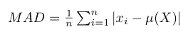

平均绝对偏差

在 MAD 函数的实现中，我使用 TensorFlow 包来计算平均值。

```
def MAD(y_true, y_pred):   
   mean =  tf.reduce_mean((y_true - y_pred))
   mad = tf.reduce_mean((y_true - mean)
   return(mad)
```

# MSE-MAD 损失函数

这里我介绍一下自定义损失函数。这个损失函数的背景使用 EWMA 框架，其中我们的阿尔法项固定在 0.5。简单地说，损失函数是 MSE 和 MAD 公式的组合。

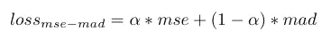

MSE-MAD 损失函数

```
def custom_loss_function(y_true, y_pred):
   squared_difference = tf.square((y_true - y_pred))
   mse = tf.reduce_mean(squared_difference, axis=-1)
   mean =  tf.reduce_mean((y_true - y_pred))
   mad = tf.reduce_mean((y_true - y_pred) - mean)
   return 0.5*mse + (1-0.5)*mad
```

# 使用 LSTM 模型的损失函数比较

首先，我介绍用于比较的数据集和机器学习模型。正在使用的数据集太阳黑子数据集和 LSTM 模型将用于预测太阳黑子时间序列。

# LSTM 模式介绍

递归神经网络是用于建模时间序列数据的人工神经网络家族的一部分。递归神经网络结合先前的信息来预测当前的时间步长。给定一个输入向量 x = (x1，.。。，xn)，我们假设每个 xi 独立于 x 中的每个其他观察值。但是，对于资产数据，这可能不成立，需要创建一个模型来说明某些给定时间序列数据的动态行为。对于给定数量的先前时间步骤，使用人工神经网络来构建递归神经网络的结构。在这篇论文中，我们探讨了 RNN 在预测未来股票价格中的应用。使用 RNN 的主要缺点是在尝试将模型参数拟合到数据时渐变会消失和爆炸

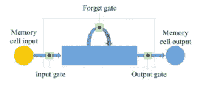

LSTM 门

每个块 A 代表具有输入 xt 和输出 ht 的神经网络。LSTM 背后的主要思想是遗忘之门，信息可以通过它传递给下一个神经网络。

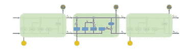

LSTM 建筑

LSTM 模型成为时间序列预测的有力工具。

# 黑子数据集游戏攻略

该数据集包含太阳黑子数量的月度数据(从 1749 年到 2013 年)。有 3000 多个数据点。我们演示数据集的前几行。

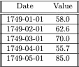

从上表中我们可以看到，我们得到了包含太阳黑子数量的每月数据。当拟合 LSTM 模型来预测时间序列数据时，我们将要求值限制在 0 和 1 之间。

对于 LSTM 模型，模型结构由输入数据的结构和预测特征决定。取决于在拟合时有多少个月用于回顾，特征的数量将决定需要权重和偏差的神经元的数量。

为了在比较每个损失函数时保持一致，将使用相同的 LSTM 模型结构，如下所示。

```
# Initializing the LSTM
regressor = Sequential()
# Adding the first LSTM layer and some Dropout regularisation
regressor.add(LSTM(units = nodes, return_sequences = True, input_shape = (new.shape[1], new.shape[2])))
regressor.add(Dropout(0.2))
# Adding a second LSTM layer and some Dropout regularisation
regressor.add(LSTM(units = nodes, return_sequences = True))
regressor.add(Dropout(0.2))
# Adding a third LSTM layer and some Dropout regularisation
regressor.add(LSTM(units = nodes, return_sequences = True))
regressor.add(Dropout(0.2))
regressor.add(LSTM(units = nodes))
regressor.add(Dropout(0.2))
# Adding the output layer
regressor.add(Dense(units = t)) # this is the output layer so this represents a single node with our output value
```

既然我们已经编译了模型。我首先测试 MSE 损失函数作为基线。

```
# Compiling the RNN
regressor.compile(optimizer = 'adam', loss = 'mean_squared_error')
# Fitting the RNN to the Training set
model = regressor.fit(new, y_train, epochs = 50, batch_size = 22)
```

损失函数在编译步骤中设置。

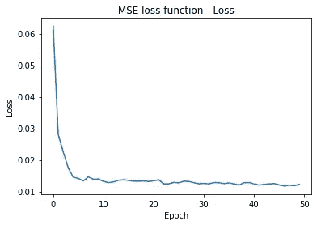

接下来我研究了 Huber 损失函数。我测试 Huber 损失函数的原因是它遵循与 MSE-MAD 相似的结构，其中 Huber 函数充当组合函数或分段函数。

```
# Compiling the RNN
regressor.compile(optimizer = 'adam', loss = "huber_loss")
# Fitting the RNN to the Training set
model = regressor.fit(new, y_train, epochs = 50, batch_size = 22)
```

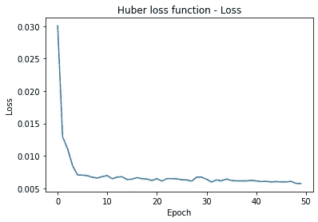

胡伯损失函数

最后我给出了 MSE-MAD 损失函数的结果。实现是简单地将损失函数定义为 python 函数，然后在编译模型时以下面的方式调用它。

```
# Compiling the RNN
regressor.compile(optimizer='adam', loss=custom_loss_function)
# Fitting the RNN to the Training set
model = regressor.fit(new, y_train, epochs = 50, batch_size = 22)
```

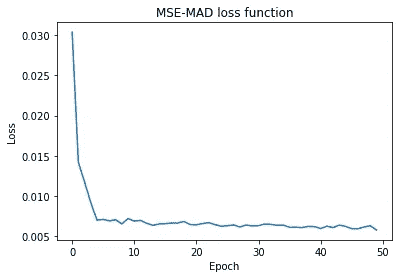

MSE-MAD 损失函数

当比较 MSE-MAD 和 MSE 时，我们发现收敛大约是一半快，然而当我们比较 MSE-MAD 和 huber 损失函数时，我发现非常相似的结果。

# LSTM 预言

下面使用自定义损失函数给出了 LSTM 的最终预测。使用覆盖速度更快的损失函数的主要好处是运行时间更短，并且可以更快地求解模型的最佳参数。

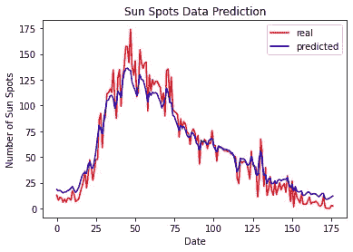

# 关于我自己的一点点

我最近在加拿大多伦多的瑞尔森大学获得了应用数学硕士学位。我是金融数学组的一员，专业是统计学。我深入研究了波动建模和算法交易。

我之前在庞巴迪宇航公司担任工程专业人员，负责与飞机维护相关的生命周期成本建模。

本人积极训练铁人三项，热爱健身。

 [## 伊森·约翰逊-斯金纳-数学导师-夏普 Minds 学院| LinkedIn

### 我最近在瑞尔森大学获得了应用数学硕士学位。我是财务的一部分…

www.linkedin.com](https://www.linkedin.com/in/ethanjohnsonskinner/) 

推特:@Ethan_JS94