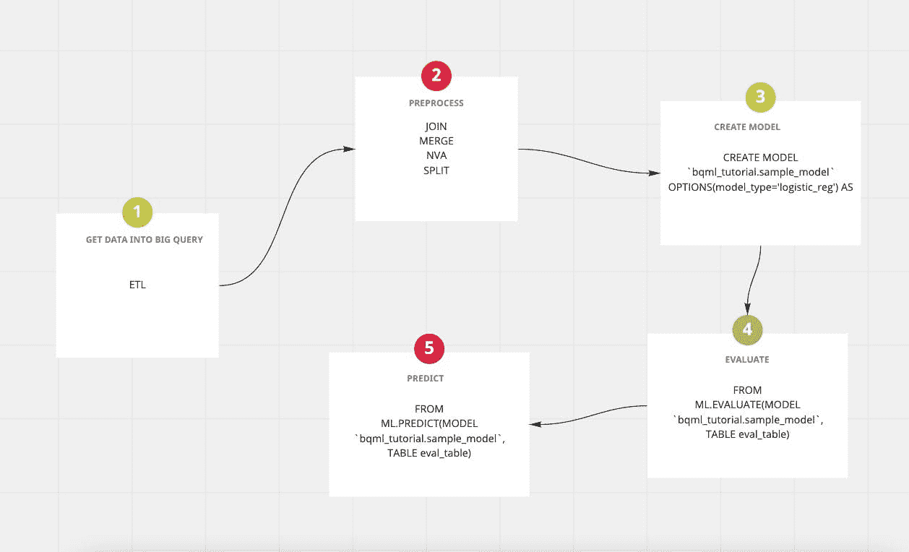

# 使用 SQL 创建机器学习模型

> 原文：<https://towardsdatascience.com/creating-a-machine-learning-model-with-sql-81d843a5307c?source=collection_archive---------20----------------------->

## 在 Google Big Query 上使用 SQL 构建 ML 模型


迈克尔·泽兹奇在 [Unsplash](https://unsplash.com/@lazycreekimages?utm_source=unsplash&utm_medium=referral&utm_content=creditCopyText) 上的照片

尽管机器学习已经非常先进了，但是它有一些弱点，让你很难使用它。

# 当前机器学习工作流及其问题

*   如果你曾经使用过 ml 模型，你可能会意识到结构和准备它们是非常耗时的。
*   对于典型的信息，研究人员最初应该将有限数量的信息从存储在 I-Python 便笺簿中的信息交换到负责结构的信息中，比如 Python 的 pandas。
*   如果您正在装配一个定制模型，您首先需要更改和预处理所有信息，并在处理模型信息之前完成所有组件设计。
*   然后，在那一点上，最后在你制作了你的模型并且说 TensorFlow 是另一个可比较的库之后，然后你在你的 PC 或 VM 上用一个小模型本地地训练它，然后，在那一点上，期望你返回并且制造所有更多的新信息包括并且进一步开发执行，你反复反复反复反复此外，这很难，所以你在几个周期之后停止

但是嘿，别担心！即使您不是团队的数据科学家，您也可以构建模型。

# Google BigQuery 简介


*照片由* [*帕特里克*](https://unsplash.com/@heapdump?utm_source=unsplash&utm_medium=referral&utm_content=creditCopyText) *上* [*下*](https://unsplash.com/s/photos/storage?utm_source=unsplash&utm_medium=referral&utm_content=creditCopyText)

BigQuery 是一个完全托管的 Pb 级企业数据仓库。它基本上由两个关键部分组成

*   快速 SQL 查询引擎
*   完全托管的数据存储

> Big Query 支持用大家都习惯的标准 SQL 查询 Pb 级的数据。

示例:

```
#standardSQL
SELECT
COUNT(*) AS total_trips
FROM
`bigquery-public-data.san_francisco_bikeshare.bikeshare_trips`
```

# 其他主要查询功能

1.  无服务器
2.  灵活的定价模式
3.  标准 GCP 数据加密和安全
4.  非常适合 BI 和 AI 用例
5.  ML 和使用 BigQuery 的预测建模
6.  非常便宜的存储—与谷歌云存储桶一样
7.  使用 BigQuery BI 引擎进行交互式数据分析—连接到 tableau、data studio、looker 等

## 大查询及其 ml 特性

作为主要功能之一的一部分，big query 允许仅使用简单的 SQL 语法来构建预测性的机器学习模型。借助 google cloud 的 Pb 级处理能力，您可以在仓库中轻松创建模型。创建模型的示例语法如下所示

```
CREATE OR REPLACE MODEL `dataset.classification_model`
OPTIONS
(
model_type='logistic_reg',
labels = ['y']
)
AS
```

# 使用大查询 ML 的典型工作流程[5 个步骤]



作者提供的流程图

# 教程:使用大查询 ML(简单 SQL 语法)构建分类模型

你可以打开一个[大的查询控制台](https://console.cloud.google.com/bigquery)，开始复制下面的步骤:

## **或**

## **你可以在 youtube 上观看视频教程**

Anuj Syal[用 SQL(谷歌大查询)创建机器学习模型](https://www.youtube.com/channel/UCO8XsgcjqArk_mAd1VGBMfg?sub_confirmation=1)

## 资料组

我正在使用一个公共的大型查询数据集 [google_analytics_sample](https://console.cloud.google.com/marketplace/product/obfuscated-ga360-data/obfuscated-ga360-data) 。该数据集提供了 12 个月(2016 年 8 月至 2017 年 8 月)来自谷歌商品商店的模糊谷歌分析 360 数据。数据包括电子商务网站会看到的典型数据，包括以下信息:

流量来源数据:关于网站访问者来源的信息，包括关于有机流量、付费搜索流量和显示流量内容数据:关于用户在网站上的行为的信息，如访问者查看的页面的 URL，他们如何与内容进行交互等。交易数据:谷歌商品商店网站上的交易信息。

**数据集许可:**公共数据集是指存储在 BigQuery 中并通过 Google Cloud 公共数据集计划向公众开放的任何数据集。公共数据集是 BigQuery 托管的数据集，供您访问并集成到应用程序中。谷歌为这些数据集的存储付费，并通过一个项目提供对数据的公共访问。您只需为对数据执行的查询付费。每月第一个 1 TB 是免费的，具体价格视查询情况而定。在知识共享署名 4.0 许可下

## 我们将尝试解决的机器学习问题

我们将尝试预测用户是否会在回访时购买产品，因此我们将我们的标签命名为`will_buy_on_return_visit`

# 步骤 1:探索数据集

*   检查兑换率

```
WITH visitors AS(
SELECT
COUNT(DISTINCT fullVisitorId) AS total_visitors
FROM `bigquery-public-data.google_analytics_sample.ga_sessions_20170801`
),
purchasers AS(
SELECT
COUNT(DISTINCT fullVisitorId) AS total_purchasers
FROM `bigquery-public-data.google_analytics_sample.ga_sessions_20170801`
WHERE totals.transactions IS NOT NULL
)
SELECT
  total_visitors,
  total_purchasers,
  total_purchasers / total_visitors AS conversion_rate
FROM visitors, purchasers
```

*   销量前 5 的产品是什么？

```
SELECT
  p.v2ProductName,
  p.v2ProductCategory,
  SUM(p.productQuantity) AS units_sold,
  ROUND(SUM(p.localProductRevenue/1000000),2) AS revenue
FROM `bigquery-public-data.google_analytics_sample.ga_sessions_20170801`,
UNNEST(hits) AS h,
UNNEST(h.product) AS p
GROUP BY 1, 2
ORDER BY revenue DESC
LIMIT 5;
```

*   有多少访问者在随后的访问中购买了该网站？

```
WITH all_visitor_stats AS (
SELECT
  fullvisitorid, # 741,721 unique visitors
  IF(COUNTIF(totals.transactions > 0 AND totals.newVisits IS NULL) > 0, 1, 0) AS will_buy_on_return_visit
  FROM `bigquery-public-data.google_analytics_sample.ga_sessions_20170801`
  GROUP BY fullvisitorid
)
SELECT
  COUNT(DISTINCT fullvisitorid) AS total_visitors,
  will_buy_on_return_visit
FROM all_visitor_stats
GROUP BY will_buy_on_return_visit
```

# 第二步。选择要素并创建训练数据集

现在我们对数据有了更多的了解，让我们最终确定并创建一个用于训练的最终数据集

```
SELECT
  * EXCEPT(fullVisitorId)
FROM
  # features
  (SELECT
    fullVisitorId,
    IFNULL(totals.bounces, 0) AS bounces,
    IFNULL(totals.timeOnSite, 0) AS time_on_site
  FROM
    `bigquery-public-data.google_analytics_sample.ga_sessions_20170801`
  WHERE
    totals.newVisits = 1)
  JOIN
  (SELECT
    fullvisitorid,
    IF(COUNTIF(totals.transactions > 0 AND totals.newVisits IS NULL) > 0, 1, 0) AS will_buy_on_return_visit
  FROM
      `bigquery-public-data.google_analytics_sample.ga_sessions_20170801`
  GROUP BY fullvisitorid)
  USING (fullVisitorId)
ORDER BY time_on_site DESC
LIMIT 10;
```

# 步骤 3:创建一个模型

此步骤对上一步中创建的数据集使用 create model 语句

```
CREATE OR REPLACE MODEL `ecommerce.classification_model`
OPTIONS
(
model_type='logistic_reg',
labels = ['will_buy_on_return_visit']
)
AS
#standardSQL
SELECT
  * EXCEPT(fullVisitorId)
FROM
  # features
  (SELECT
    fullVisitorId,
    IFNULL(totals.bounces, 0) AS bounces,
    IFNULL(totals.timeOnSite, 0) AS time_on_site
  FROM
    `bigquery-public-data.google_analytics_sample.ga_sessions_20170801`
  WHERE
    totals.newVisits = 1)
  JOIN
  (SELECT
    fullvisitorid,
    IF(COUNTIF(totals.transactions > 0 AND totals.newVisits IS NULL) > 0, 1, 0) AS will_buy_on_return_visit
  FROM
      `bigquery-public-data.google_analytics_sample.ga_sessions_20170801`
  GROUP BY fullvisitorid)
  USING (fullVisitorId)
;
```

# 步骤 4:评估分类模型性能

使用 SQL 评估您刚刚创建的模型的性能

```
SELECT
  roc_auc,
  CASE
    WHEN roc_auc > .9 THEN 'good'
    WHEN roc_auc > .8 THEN 'fair'
    WHEN roc_auc > .7 THEN 'not great'
  ELSE 'poor' END AS model_quality
FROM
  ML.EVALUATE(MODEL ecommerce.classification_model,  (
SELECT
  * EXCEPT(fullVisitorId)
FROM
  # features
  (SELECT
    fullVisitorId,
    IFNULL(totals.bounces, 0) AS bounces,
    IFNULL(totals.timeOnSite, 0) AS time_on_site
  FROM
    `bigquery-public-data.google_analytics_sample.ga_sessions_20170801`
  WHERE
    totals.newVisits = 1
    AND date BETWEEN '20170501' AND '20170630') # eval on 2 months
  JOIN
  (SELECT
    fullvisitorid,
    IF(COUNTIF(totals.transactions > 0 AND totals.newVisits IS NULL) > 0, 1, 0) AS will_buy_on_return_visit
  FROM
      `bigquery-public-data.google_analytics_sample.ga_sessions_20170801`
  GROUP BY fullvisitorid)
  USING (fullVisitorId)
));
```

## 未来步骤和特征工程

如果您对提高模型的性能更感兴趣，可以随时选择向数据集添加更多要素

# 结论

像谷歌的 Big Query ML 这样的产品让更多人可以建立机器学习模型。有了简单的 SQL 语法和谷歌的处理能力，生产现实生活中的大数据模型真的很容易。

*最初发表于*[*【https://anujsyal.com】*](https://anujsyal.com/creating-a-machine-learning-model-with-sql)*。*