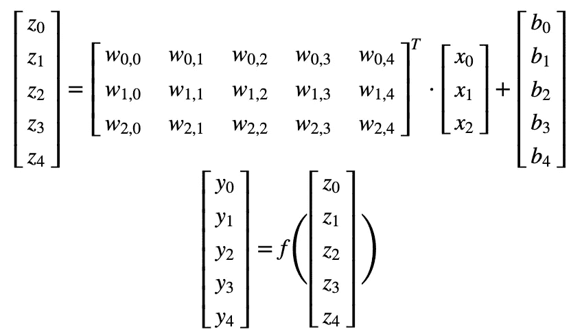
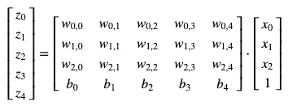
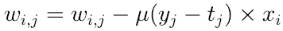
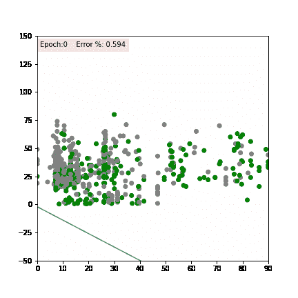

# 创建感知器网络:从零到英雄

> 原文：<https://towardsdatascience.com/creating-a-perceptron-network-from-zero-to-hero-64acfbd7c7ef?source=collection_archive---------38----------------------->

## [神经网络系列](https://towardsdatascience.com/tagged/neural-networks-series)

## 神经网络系列—第 1 章，第 2 部分


## 序言注释

这个故事是我正在创作的关于神经网络系列的一部分，也是专门讨论感知机网络的一章的第二部分(你可以在这里阅读第一部分)。在这篇文章中，我将应用上一篇文章中解释的所有概念，并用 Python 实现一个感知器网络。

## 简而言之，感知器

我们在我以前的文章中已经看到，感知器是一种使用阈值函数作为激活函数的神经网络。获得输出 ***y*** 的方法是将一组权重 ***W*** 乘以一组输入*，加上偏置节点( ***b*** )，然后对这个结果应用阈值函数***【f(z)***。*

*回顾我的上一篇文章，我们也看到了具有更复杂架构的*矩阵是什么样子，具有 ***m*** 输入节点和 ***n*** 神经元。然而，在用于前馈方程以获得网络预测的符号中，我们还没有看到更复杂的体系结构的影响。**

**(**注:**如果接下来的内容对你没有太大意义，建议你看一看基本的线性代数概念，即矩阵的转置和乘法。)**

**让我们像上一篇文章一样假设 *m* =3、 *n* =5。这意味着我们的 W 矩阵将有 3 行 5 列。如果我们将标量运算转换成矩阵符号，我们的前馈方程就变成这样:**

****

**前馈方程的矩阵符号**

**从这个“新”前馈方程中，可以突出一些变化:**

*   **输入 ***X*** 现在是一个 3 行一列的矩阵。它有 3 行，因为我们假设 *m* =3 ( *m* 是输入神经元的数量)。一列代表数据集中的一个示例，但是可以将所有示例注入到 ***X*** 中，并通过使用每一列来放置数据集中的每个样本，一次性获得所有预测；**
*   **偏置节点 **b** 现在是一个 5 行 1 列的矩阵。这是因为我们每个神经元需要一个偏置节点，我们将神经元的数量 *n* 定义为 5；**
*   *****y*** 将必须与 ***b*** 的大小相同，因为如果有 5 个神经元，也将有 5 个输出。**

**上面描述的整个等式通常以一种更简单的方式表示为:*y =f(wᵀx+b)*。然而，通过将 **b** 作为 **W** 的额外一行，并将一个特殊的输入节点添加到常数值为 1 的*中，这两个操作可以简化为一个操作，因为这是一个数学上等价的表达式:***

******

## ***前馈机制***

***为了实现前馈机制，我们需要三个组件:***

*   ***偏置节点加法器。它应该向 X 添加额外的行(值为 1 ),以容纳权重矩阵中偏差的额外行；***
*   ***激活功能。它应该接收输入 ***z*** 并应用阈值函数以提供***y****；****
*   **前馈功能。它应该接收一个或多个示例(我们的 ***X*** )，每个示例填充网络输入层的 ***m*** 条目，以及描述连接权重的权重矩阵。其输出应该是 ***y*** *。***

```
**def **activation**(z):
    return np.where(z>=0, 1, 0)def **add_bias_node**(X):
    return np.vstack([X, np.ones(X.shape[1])])def **feed_forward**(W, X):
    return **activation**(np.dot(np.transpose(W), **add_bias_node**(X)))**
```

## **训练感知器**

**感知器训练算法是一个迭代过程，旨在找到使网络整体误差最小化的网络连接权重集。网络的单个权重可以通过使用以下等式来更新:**

****

**在每次迭代(也称为历元)中，我们通过计算预测输出和实际输出之间的差异来评估误差(***【e】***)，并使用它们以及输入和学习率()系数来计算我们将改变每个权重多少(也称为δ，或δ)**

**下面的示例描述了训练过程的伪代码:**

```
**W = initialize weight matrix with dimensions (M+1,N)
for each epoch (e):
    for each example (x):
        y = calculate network prediction using W and x
        error = calculate deviation between y and target (t)
        delta = calculate weight variations based on the error and learning rate
        update W with deltas
return W**
```

**在将其具体化为 Python 代码后，我们得到了类似这样的东西:**

```
**def **train**(W, inputs, targets, epochs, lr):
    for epoch in range(epochs):
        for x, t in zip(inputs.transpose(), targets):
            y = **feed_forward**(W, x.reshape(1, -1).transpose())
            errors = np.subtract(y, t)
            x_with_bias = **add_bias_node**(x.reshape(-1,1))
            deltas = lr * np.dot(x_with_bias, errors.transpose())
            W = np.subtract(W, deltas)
    return W**
```

## **感知器在最大似然问题中的应用**

**既然我们已经为感知器神经元建立了基础，我们可以将其应用于[大型数据集](https://www.kaggle.com/c/titanic)，这是一个众所周知的数据集，主要用于介绍机器学习基础知识。目标是根据数据集中描述的一组特征来预测泰坦尼克号灾难中的幸存者。**

**在本文的上下文中，我只使用了两个特征来训练模型:乘客支付的**票价**和其**年龄**，因为这使得数据集和模型更容易可视化。使用两个特征意味着在 2D 空间中工作，这也意味着我们的神经网络架构由单个神经元( ***n*** =1)和两个条目( ***m*** =2)组成(如果我们包括偏差节点，则为三个)。**

```
**import seaborn as snstitanic = sns.load_dataset('titanic')M = 2
N = 1X = np.asarray(titanic[features]).transpose()
W = np.random.rand(M + 1, N) # + 1 because of the bias node
t = titanic['survived'].to_numpy()**
```

**在上面这段代码中，我们收集了 ***X*** ， ***W*** 和 **t** ，以便计算*y 并比较训练过程前后的错误率。 ***W*** 的初始化以随机方式进行，遵循 0 和 1 之间的均匀分布，因为这是初始化网络权重的一种可能方式。请记住，这是培训中一个非常重要的主题，因为初始化过程会对培训速度产生很大影响。但是，这个主题将在本系列的后面详细介绍，并且超出了本文的范围。
现在我们已经有了形状正确的所有矩阵，让我们在训练前后应用前馈机制:***

```
**y = feed_forward(W, X)
error_rate(y.flatten().tolist(), t.tolist()) # 0.59383W_trained = train(W, X, t, 20, 0.1)y = feed_forward(W_trained, X)
error_rate(y.flatten().tolist(), t.tolist()) # 0.31512**
```

**我们设法将神经网络错误预测的例子数量从 0.59 减少到 0.31，这意味着我们的模型准确性大约为 69%。但是神经网络预测我们样本的能力在整个训练过程中是如何变化的呢？为了回答这个问题，我们可以简单地得到每个时期的预测，并画出分类器的决策边界。在 2D 上下文中，该边界是给定乘客生还或不生还的概率相等的线。**

**在下面的 gif 中，你可以看到网络的预测以及分类器的决策边界。橙色样本是被正确预测为幸存者的乘客，绿色样本是被正确预测为非幸存者的乘客，灰色样本是被感知机错误预测的乘客。**

****

**使用泰坦尼克号数据集训练的感知机**

## **最后意见**

**虽然我们设法提高了网络的准确性，但通过观察上面动画中的训练过程，我们可以记下一些想法:**

*   **问题不是线性可分的
    我们已经看到，感知器收敛定理证明，如果存在线性可分性，就有可能达到最优解。异或问题也说明了感知器的局限性。在这个问题中，我们可以看到感知器努力寻找一条线，将消极和积极的类别完全分开……因为这条线是不可能画出来的，因为在图中总会有灰色的点，也就是错误的预测。**
*   **添加更多功能可能有助于提高性能
    我们挑选了两个功能来解决这个问题。然而，如果我们添加更多的功能，会发生什么呢？也许线性可分性将通过有一个超平面来分离这两个类来实现，或者至少我们将更接近于此。我在我的[感知机笔记本](https://nbviewer.jupyter.org/github/adrianovinhas/neural_networks_series/blob/master/perceptron.ipynb)中做了这个小体验。**

**感谢阅读！你喜欢这篇文章吗？非常感谢你的反馈，🗣。你可以随时在 [**Twitter**](https://twitter.com/adrianovinhas) 或 [**LinkedIn**](https://www.linkedin.com/in/adrianovinhas/) 上联系我，或者如果你对下一章的最新消息感兴趣，就在 Medium 上关注我😀。**

**一些相关阅读:**

*   **关于感知器的完整笔记本可以在[这里](https://nbviewer.jupyter.org/github/adrianovinhas/neural_networks_series/blob/master/perceptron.ipynb)找到**
*   **有关如何探索泰坦尼克号数据集和应用其他模型的更多想法，请查看由 [Benedikt Droste](https://medium.com/u/93813b47e030?source=post_page-----64acfbd7c7ef--------------------------------) 编写的[泰坦尼克号数据集的机器学习](/machine-learning-with-the-titanic-dataset-7f6909e58280)**