# 为空间分析创造一个平台

> 原文：<https://towardsdatascience.com/creating-a-playground-for-spatial-analytics-c7b8a867ff34?source=collection_archive---------52----------------------->

## 如何在不到 30 分钟的时间内通过 SAP HANA 云设置和使用 QGIS

*您对空间分析感兴趣，并且正在寻找一些入门内容？*SAP HANA Cloud Trial 与 QGIS 的结合为您提供了大规模空间数据处理的低门槛。基于 SAP HANA 构建的空间工作流最终可以在业务应用程序中重用，以将位置维度注入到您的业务流程中。

不管你是第一次接触 **QGIS** 还是第一次接触**SAP HANA**——或者两者都是。这个博客的目标是在不到 30 分钟的时间里为你提供一个免费的工作场所。所以——把它加到你的书签里，在你的日历里划出一些时间！


照片由[蒂姆·阿特伯里](https://unsplash.com/@tim_arterbury?utm_source=unsplash&utm_medium=referral&utm_content=creditCopyText)在 [Unsplash](https://unsplash.com/?utm_source=unsplash&utm_medium=referral&utm_content=creditCopyText) 上拍摄

该教程将包含以下任务:

*   ⏳5m | **创建 HANA 云试用实例**
*   ⏳2m | **安装 SAP HANA ODBC 驱动**
*   ⏳3m | **安装 QGIS**
*   ⏳5m | **将 QGIS 连接到 SAP HANA 云**
*   ⏳5m | **上传您的第一个空间数据集**
*   ⏳5m | **在底图上可视化数据**
*   ⏳5m | **将空间工作负载下推到 SAP HANA 云**

另外，我建议在开始前喝杯咖啡。这不是 30 分钟的一部分，因为准备时间因准备方法而异。所以，你可以看到这是开始这个宏观研讨会的先决条件。

另一个先决条件是在[https://download.qgis.org](https://download.qgis.org)上下载适用于您的操作系统的 QGIS 安装包。我在 Mac 上工作，QGIS 3.18 的相应安装包大小为 1.2GB。根据服务器速度，此下载可能会持续一段时间…

准备好你的☕️了吗？

# ⏳5m👉创建 HANA 云试用实例

这里我应该承认，5 分钟是净努力。SAP HANA 云试用实例的实际创建时间各不相同。好的一面是，当您的新实例启动时，您可以并行执行其他安装步骤。这样，我们应该仍然能够保持 30 分钟的目标。

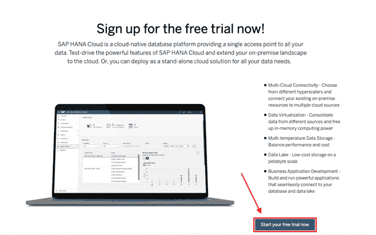

*⏯演练:创建 SAP HANA 云试用实例*

遵循以下步骤:

1.  前往[https://www.sap.com/cmp/td/sap-hana-cloud-trial.html](https://www.sap.com/cmp/td/sap-hana-cloud-trial.html)并点击*立即开始免费试用*。
2.  输入您的数据并选择您的首选地区(即美国东部、欧洲或新加坡)。
3.  创建您的全球帐户、子帐户、组织和开发空间需要一两分钟。喝一口你的咖啡，然后等着。
4.  您将自动收到一封电子邮件，其中包含您的试用链接。点击链接 [*进入您的试用*](https://account.hanatrial.ondemand.com/register) 。
5.  现在，你需要进入你的“空间”。为此:
    ➲点击*进入你的试用账户* ➲点击子账户*试用*。相应的区域也会显示您之前选择的区域。
    ➲点击名为 *dev* 的空间。
    ➲点击左侧的 *SAP HANA Cloud* 。
6.  接下来，我们将开始实际的 HANA 云试用实例。因此，点击右上角的*创建*。
7.  在下面的对话框中，需要注意这些配置:
    ➲ *实例名*。本教程我会选择 *hctrial* 。
    ➲ *管理员密码* ➲ 允许的连接应该设置为*允许所有 IP 地址*为了简单(和安全的代价！).
    ➲ *创建数据湖*可以关闭，因为您不需要数据湖来执行这里概述的步骤。
8.  将创建您的实例。继续其他步骤，我们稍后回来。

# ⏳2m👉安装 SAP HANA ODBC 驱动程序

在这里，2 分钟通常是慷慨的。要安装 SAP HANA ODBC 驱动程序，它是 SAP HANA 客户端的**部分，您只需从 [SAP 开发工具](https://tools.hana.ondemand.com/#hanatools)下载并执行操作系统特定的安装程序。**

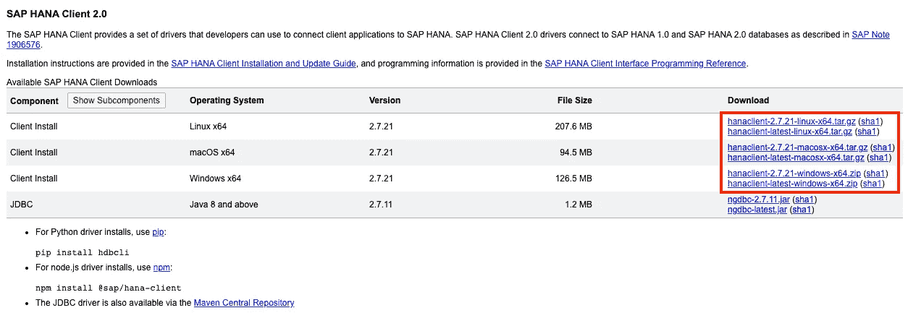

这里没有太多要考虑的，因为这是一个下下一个完成安装者*(这是一个正式的表达吗？嗯，应该是。)*。有适用于 [Windows](https://tools.hana.ondemand.com/additional/hanaclient-latest-windows-x64.zip) 、 [macOS](https://tools.hana.ondemand.com/additional/hanaclient-latest-macosx-x64.tar.gz) 和 [Linux](https://tools.hana.ondemand.com/additional/hanaclient-latest-linux-x64.tar.gz) 的安装包。

# ⏳3m👉安装 QGIS

同样，这本质上是一个下一个完成的安装程序，没有具体的考虑。如上所述，Windows、macOS 和 Linux 的操作系统特定安装包可在 [QGIS 下载页面](https://download.qgis.org/)上获得。您至少需要 3.18 版才能使用 SAP HANA。

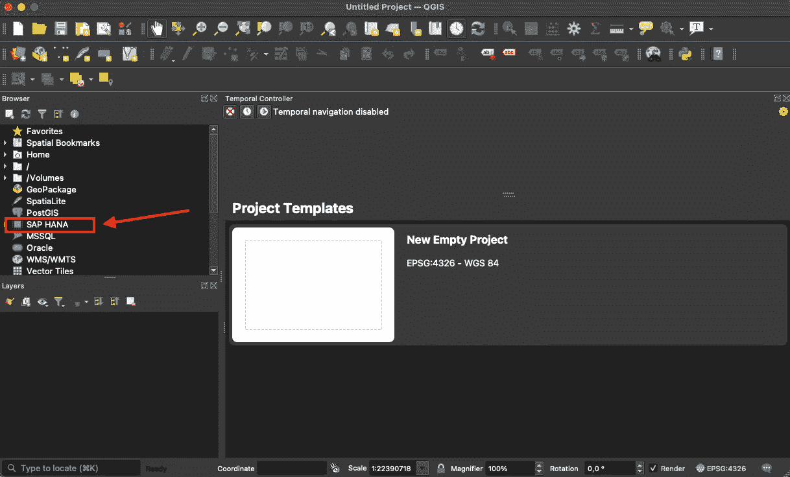

一旦您下载并安装了 QGIS 3.18，您就可以启动客户端。确保您在左侧的数据浏览器中将 SAP HANA 视为数据提供商。

# ⏳5m👉将 QGIS 连接到 SAP HANA 云

关于如何将 QGIS 连接到 SAP HANA 的一般说明可以在 [QGIS 文档](https://docs.qgis.org/testing/en/docs/user_manual/managing_data_source/opening_data.html#connecting-to-sap-hana)中找到。此外，还有一个描述这一过程的[短片](https://youtu.be/Akjh9IixLlQ)。

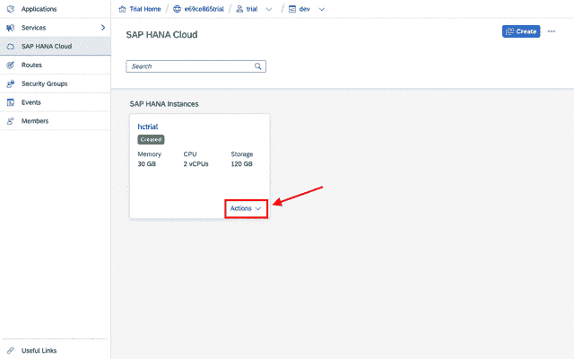

*⏯演练:将 QGIS 连接到 SAP HANA 云试用版*

**但是，让我们来详细了解一下如何获得必要的证书:**

1.  如果您不在 SAP BTP 驾驶舱内查看带有 SAP HANA 云实例的图块，请重复上述*“创建 HANA 云试用实例”*中的步骤 4 和 5。您应该看到您的*创建的*和*运行的*实例。
2.  点击*动作*和*复制 SQL 端点*。端点将被复制到您的剪贴板。保持在那里。
3.  打开 QGIS，在左侧窗格的浏览器中找到 *SAP HANA* 条目。
4.  右键点击 *SAP HANA* ，选择*新建连接*。
5.  将会打开连接对话框。填写以下字段:
    ➲ *名称*:填写连接的名称。我会用 *hctrial* 。
    ➲ *主持人*:粘贴你的剪贴板，最后去掉 *":443"* 。SQL 端点的格式为 *<主机> : <端口>* ，字段期望 *<主机>* 。
    ➲ *标识符*:将下拉菜单切换到*端口*并在文本字段中输入 *443* 。
    ➲ *认证*:选择*基本*认证，输入*用户名*和*密码*。如果这只是一个游戏场，DBADMIN 用户将完成这项工作。请注意，建议仍然是创建一个具有有限访问权限的专用用户。
    *(注意:旧版本的 ODBC 驱动程序要求您在连接属性中显式启用 SSL。确保使用最新的客户端版本)*
6.  在连接对话框中点击*测试连接*，如果我们两个都做对了工作，你应该会看到一次成功的连接尝试。
7.  点击 *OK* 并检查您的连接(在我的例子中是 *hctrial* )是否列在左侧窗格的浏览器中。

# ⏳5m👉上传您的第一个空间数据集

到目前为止，我们取得了什么成就？我们已经创建了一个 SAP HANA 云试用实例，并通过 ODBC 连接了 QGIS。不幸的是，我们的数据库仍然是空的，我们应该改变这一点。好消息是，我们不需要任何数据库工具来上传我们的第一个数据集。我们将简单地使用 QGIS。

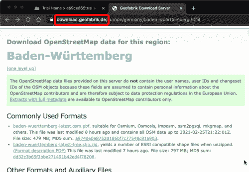

*⏯演练:上传您的第一个空间数据集*

正如我在[之前的博客](https://blogs.sap.com/2021/02/23/qgis-3.18-supports-sap-hana-cloud/)中所建议的，我们可以使用[Geofabrik](https://www.openstreetmap.org/)提供的 [OpenStreetMap](https://www.openstreetmap.org/) 数据。我们将从位于德国沃尔多夫的 SAP 总部区域的兴趣点数据开始。

**让我们这样做:**

1.  下载“Regierungsbezirk Karlsruhe”的 [Shapefile](https://de.wikipedia.org/wiki/Shapefile) (.shp.zip)。您可以将 Shapefile 视为基于文件的地理空间数据数据库。
    [下载页面](https://download.geofabrik.de/europe/germany/baden-wuerttemberg.html) | [直接链接](https://download.geofabrik.de/europe/germany/baden-wuerttemberg/karlsruhe-regbez-latest-free.shp.zip)
2.  打开 QGIS 并找到下载的文件(不要解压缩！)在浏览器左侧。在我的 Mac 上，我必须导航到*主页>下载*。您经常使用的文件夹也可以添加到*收藏夹*中。
3.  该文件可以在浏览器中进一步展开。这样做，并找到名为 *gis_osm_pois_free_1* 的图层。
4.  在浏览器中找到您的 SAP HANA 连接，并将其展开两次，这样您就可以看到该模式了(如果您遵循了上面的步骤，则为 *DBADMIN* )。
5.  神奇的是:将 *gis_osm_pois_free_1* 层拖放到您的 *DBADMIN* 模式上。
6.  您已成功将首个空间数据集导入 SAP HANA Cloud 试用版！

如果您需要证据，您可以打开数据库浏览器或 [DBeaver](https://blogs.sap.com/2020/01/08/good-things-come-together-dbeaver-sap-hana-spatial-beer/) 并检查已经创建的表。但请注意，这不会是我们 30 分钟交易的一部分！

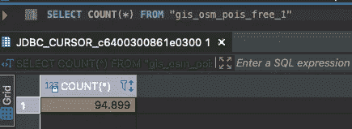

# ⏳5m👉在底图上可视化数据

现在，我们已经在数据库中存储了*个兴趣点*(poi)及其坐标。这类数据(即点、线、多边形等。)给出的坐标称为[矢量数据](https://en.wikipedia.org/wiki/GIS_file_formats#Vector)。矢量数据可以打印到地图甚至卫星图像上(这被认为是[栅格数据](https://en.wikipedia.org/wiki/GIS_file_formats#Raster))。

所以我们需要添加两个不同的*层*到我们的 QGIS 项目中:

1.  基础地图(例如街道地图或卫星图像)
2.  绘制在该地图上的数据(由 SAP HANA 管理的矢量数据)

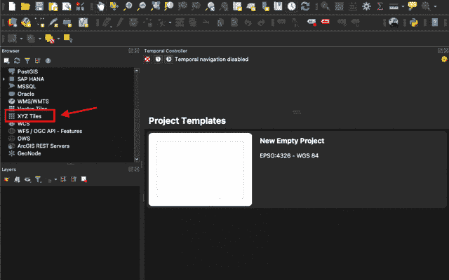

*⏯演练:使用卫星图像添加基础层*

**如何添加基层:**

1.  在浏览器中左键点击 *XYZ 瓷砖*并选择*新建连接*。
2.  一个新的磁贴服务对话框打开了:
    ➲输入“*谷歌地图卫星”*作为*名字*。
    ➲输入*' https://mt1 . Google . com/vt/lyrs = s&x = { x }&y = { y }&z = { z } '*作为 *URL* 。
    ➲设定了*最大值。缩放级别*至 19。
    ➲用*确认*正常。
3.  在浏览器的 *XYZ 磁贴*下找到*谷歌卫星*。
4.  双击*谷歌地图卫星*添加带有卫星图像的基础图层。

如果您想添加不同的服务(如 OpenStreetMap)，您可以查看[本博客](https://www.spatialbias.com/2018/02/qgis-3.0-xyz-tile-layers/)获取更多网址。

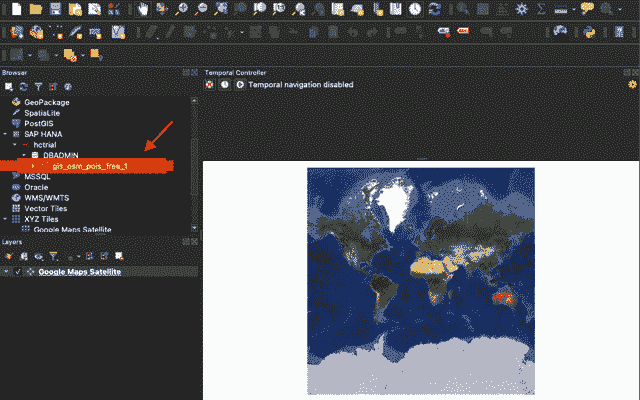

*⏯走查:在 SAP HANA 中可视化数据*

**如何添加 SAP 总部周围的所有喷泉:**

1.  在浏览器中找到我们之前上传到 SAP HANA 的数据集。(*SAP HANA>HC trial>db admin>GIS _ osm _ pois _ free _ 1*)
2.  双击 *gis_osm_pois_free_1* 在底图上添加另一个图层
3.  在左下方的可见图层列表中，右击新添加的图层，选择*缩放至图层*。这将确定相应数据的边界框，并相应地缩放地图。
4.  我们现在可以在地图上看到卡尔斯鲁厄地区的所有 poi。我们只想过滤掉喷泉。因此，我们再次右击图层，选择*滤镜…*
5.  滤镜对话框打开:
    ➲作为*滤镜表达式*输入 *"fclass" = '喷泉'* ➲ 确认 *OK*
6.  放大到 SAP 总部。你会看到两个喷泉——东边的一个是 3 号楼前的喷泉。花些时间——这是一项探索性的任务😉
7.  在窗口的顶栏上选择*识别特征*工具。当光标悬停在地图上时，它会改变并包含一个小的*信息*图标。
8.  单击喷泉的点，您将在右侧的数据库中看到相应的记录。

现在，您已经了解了如何在 QGIS 中可视化 SAP HANA 中的数据。如果你喜欢，你可以玩一点过滤器，改变基本地图。同样，这种热情不计入我们的 30 分钟！

# ⏳5m👉将空间工作负载下推到 SAP HANA 云

最后但同样重要的是，让我们看看如何在数据库级别执行一些空间工作负载，并将结果发送到 QGIS。由于 SAP HANA 上的所有空间处理功能都是 SQL 语法的一部分，因此最好的方法是创建一个 SQL 视图，可以在 QGIS 中使用。

因此，我们需要打开 SAP HANA 数据库浏览器，创建一个 SQL 视图并在 QGIS 中使用它。

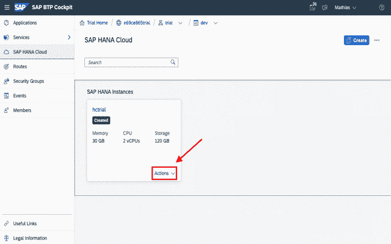

*⏯演练:为空间聚类创建视图*

**创建一个 SQL 视图，进行六边形聚类并计算每个聚类的兴趣点数量:**

1.  如果您不在 SAP BTP 驾驶舱内查看带有 SAP HANA 云实例的图块，请重复上面*“创建 HANA 云试用实例”*中的步骤 4 和 5。您应该看到您的*创建的*和*运行的*实例。
2.  点击*操作*并在 *SAP HANA 数据库浏览器*中打开
3.  可能会提示您输入用户凭据。使用在 QGIS 中设置的同一用户(即 DBADMIN)。
4.  点击左上角的 *SQL* 符号*打开一个新的 SQL 控制台*。
5.  将以下 SQL 语句复制到 SQL 控制台并执行:

```
CREATE VIEW POI_DENSITY AS
(
	SELECT 
		ST_ClusterId() AS cluster_id,
		ST_ClusterCell() AS cluster_cell,
		COUNT(*) AS count_pois
	FROM "gis_osm_pois_free_1"
	GROUP CLUSTER BY "geom" USING HEXAGON X CELLS 100
)
```

您可以在 [SAP HANA 空间参考](https://help.sap.com/viewer/bc9e455fe75541b8a248b4c09b086cf5/2020_04_QRC/en-US/e1c934157bd14021a3b43b5822b2cbe9.html)中找到关于[空间聚类](https://help.sap.com/viewer/bc9e455fe75541b8a248b4c09b086cf5/2020_04_QRC/en-US/7eb3c0e6bbf04fc6bcb9809d81533e6f.html)的更多信息。

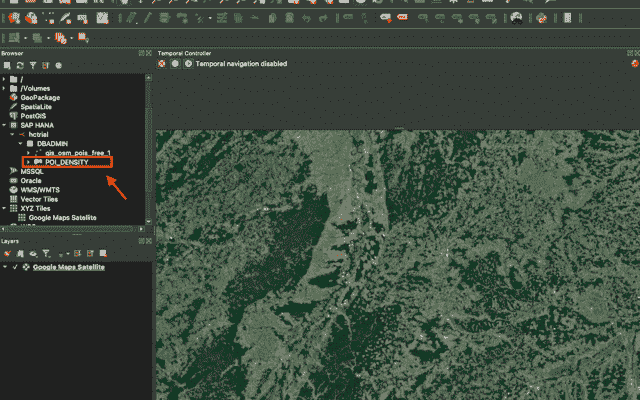

*⏯穿行:QGIS 中的基本符号系统*

**将数据放入 QGIS 并应用一些基本样式:**

1.  打开 QGIS 并通过双击添加底图(类似于上一步)。
2.  在浏览器中找到 SQL 视图*POI _ DENSITY*(*SAP HANA>HC trial>db admin>POI _ DENSITY*)并双击将其添加到地图中。
3.  右键点击 *POI_DENSITY* 图层，选择*属性*。(确保在*图层*选项卡中而不是在浏览器中完成此操作！)
4.  在下面的对话框中，你可以调整图层样式:
    ➲选择左侧的*符号*。
    最上面的➲将下拉值从*单个符号*更改为*分级* ➲ 作为*值*选择我们的数据库字段*count _ pois* ➲*选择合适的*颜色渐变*(即*红色* )
    ➲将模式从*相等计数(分位数即 8)
    ➲点击*分类*按钮创建颜色范围。
    ➲用*确认 OK***
5.  *现在，您应该会在地图上看到类似热图的可视化效果。六边形单元根据单元中 poi 的数量进行着色。*

*这种类似热图的可视化方式可以很容易地发现 SAP 总部周围的主要城市:卡尔斯鲁厄、曼海姆和海德堡。*

*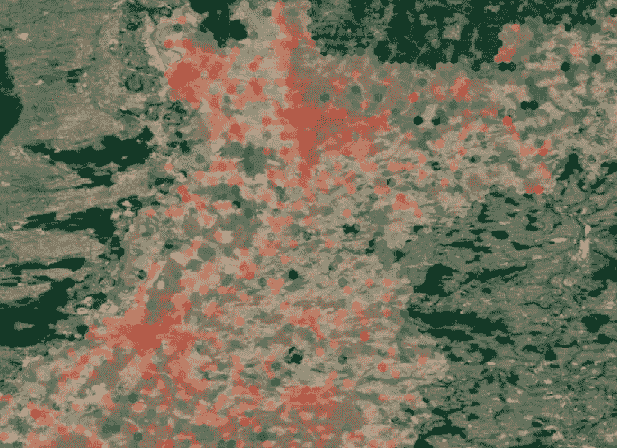*

**拉伸任务:给六边形单元格添加一些透明度**

# *🏁下一步是什么？*

*恭喜你。您已经完成了空间分析运动场的设置。我很想知道您对设置好一切所需时间的反馈——请使用下面的评论部分。我承认，如果你第一次看到 SAP HANA 和 QGIS，30 分钟可能是一个具有挑战性的时间表，但我真的希望即使有这样或那样的复杂情况，你也能坚持不到 1 小时。*

*如果您想深入更复杂的场景，我建议您查看一些关于空间数据科学以及如何将地理空间维度添加到机器学习模型中的材料。一个很好的起点是我关于走向数据科学的文章。请注意，这是一个高层次的概述。文章中有更详细说明的博客链接。*

*[**走向数据科学:地理空间特征对机器学习的影响**](/the-impact-of-geospatial-features-on-machine-learning-3a71c99f080a?source=friends_link&sk=c38d7707eb88f853ffe19486e6aa3dd4)*

*为了了解更多关于 SAP HANA Spatial 和 Graph 的细节，我建议观看 Youtube 上 SAP Devtoberfest 的视频记录。这一系列 11 个视频是我能想到的网上最完整的记录。*

*[**Youtube: SAP HANA 多模型@ Devtoberfest**](https://www.youtube.com/playlist?list=PL6RpkC85SLQA8za7iX9FRzewU7Vs022dl)*

*此外，我还定期维护一个资源博客，收集围绕 SAP HANA Spatial 的所有社区内容。值得一看，并可能找到这样或那样的宝石:*

*[**SAP HANA 空间资源:https://cutt.ly/saphanaspatial**](https://cutt.ly/saphanaspatial)*

# *结论*

*您已经学习了如何将空间数据上传到 SAP HANA 云，并使用 QGIS 对其进行可视化。您还创建了一个 SQL 视图，它在数据库级别应用了一个聚类算法。现在，您应该能够根据自己的空间数据构建自己的空间分析。*

*您在本博客中看到的是一个技术性很强的演练，旨在快速了解 SAP HANA Spatial。如果您有 GIS 背景，您可能会问，为什么首先要使用 SAP HANA？我所描述的基本任务可以通过任何 GIS 客户端轻松完成，无论有无数据库持久性或空间工作负载的下推。*

*我想引用我亲爱的同事[汤姆·图尔奇奥](https://people.sap.com/tom.turchioe)的话，他概述了在 SAP HANA 上运行 GIS 的主要优势是 [**生产力、敏捷性、加速和集成**](https://blogs.sap.com/2020/02/12/the-four-advantages-of-arcgis-on-hana/) (重点强调集成😊).虽然 Tom 的博客是专门为 Arcg is 定制的，但无论实际的 GIS 客户端是什么，概述的质量都是有效的。*

**原载于 2021 年 3 月 1 日 https://blogs.sap.com*<https://blogs.sap.com/2021/03/01/creating-a-playground-for-spatial-analytics/>**。***