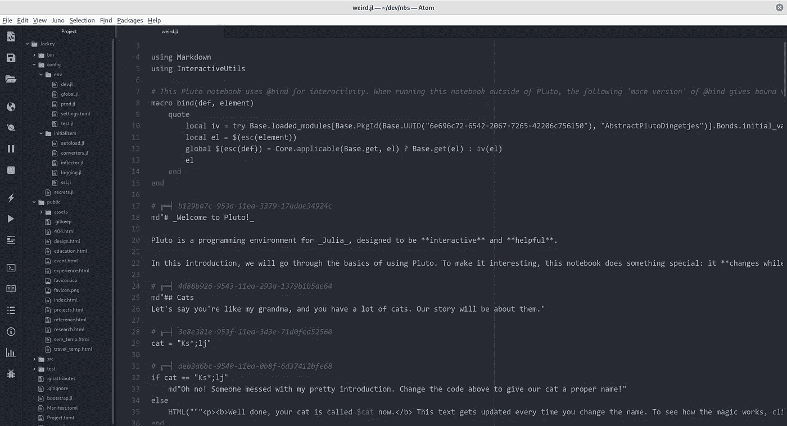
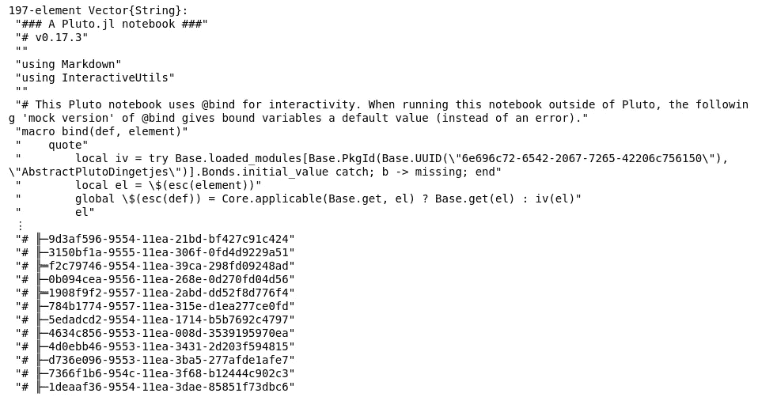
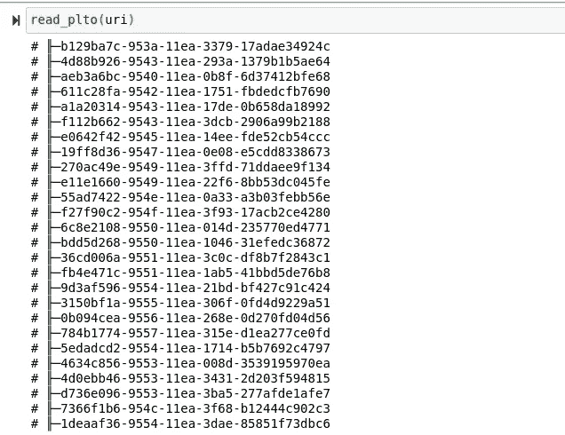
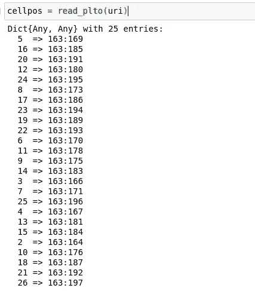
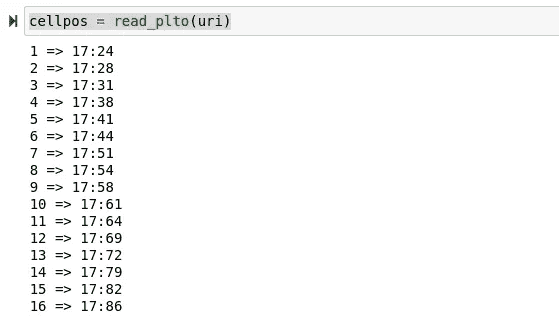
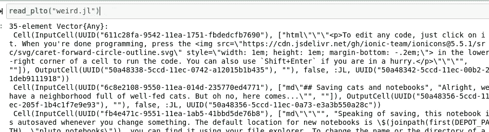

# 在 Julia 中创建 Pluto.jl 笔记本阅读器

> 原文：<https://towardsdatascience.com/creating-a-pluto-jl-notebook-reader-in-julia-da1c152db184?source=collection_archive---------26----------------------->

## Jockey.jl

## 逆向工程冥王星笔记本读入我的自定义笔记本会话


(图片由 [geralt](https://pixabay.com/illustrations/binary-code-binary-binary-system-63529/) 在 [Pixabay](http://Pixabay.com) 上提供)

# 介绍

Pluto.jl 是一个相当新的 IDE 开发，用于处理 Julia 编程语言中的笔记本文件。虽然 Pluto.jl 有一些很棒的功能，但这些功能肯定不符合我的个人偏好——我不是唯一一个这样想的人。我写了一整篇文章，详细介绍了我使用 Pluto.jl 的经历，我喜欢这个包的什么，不喜欢什么，你可以在这里阅读:

[](/could-pluto-be-a-real-jupyter-replacement-6574bfb40cc6) [## 冥王星有可能真正取代木星吗？

### 对 Pluto.jl 笔记本和 Julia 编程的其他开发解决方案的简要概述和比较…

towardsdatascience.com](/could-pluto-be-a-real-jupyter-replacement-6574bfb40cc6) 

然后是海王星。Neptune 是 Pluto.jl 的一个分支，它修改了 Pluto.jl，排除了最初的创建者打算在每个笔记本会话中使用的所有有趣的东西。我最后还写了一篇关于 Neptune.jl 的文章，你可以在这里看到:

[](/could-neptune-really-replace-jupyter-9a90d6432325) [## 海王星真的能取代木星吗？

### 非交互式笔记本 Neptune 包的简要概述。

towardsdatascience.com](/could-neptune-really-replace-jupyter-9a90d6432325) 

我认为 Pluto.jl 和 Neptune.jl 实际上向我展示了这是**非常可能的**。您可以拥有一台基于 Julia 的笔记本服务器，笔记本服务器提供的所有功能都可以通过 Julia 的全部功能进行定制和发挥。不管你是否使用 Julia，你都必须承认, **IJulia** 可能不是最好的解决方案。也就是说，所有这一切让我真的想创建自己的笔记本服务器，并在它下面设计自己的应用程序。

在这个项目的发布画布上有很多想法，一旦这个项目实际上处于常规开发阶段并有了可靠的发布，我会有更多的想法。如果你想了解更多关于这个新的 IDE jockey . JL 的信息，你可以在这里查看这个项目的 Github:

[](https://github.com/ChifiSource/Jockey.jl) [## GitHub-chifi source/Jockey . JL:Jockey IDE/笔记本服务器

### 骑师 IDE/笔记本服务器。在 GitHub 上创建一个帐户，为 ChifiSource/Jockey.jl 的开发做出贡献。

github.com](https://github.com/ChifiSource/Jockey.jl) 

还有一件事！在另一篇文章中，我初步研究了这种格式，并创建了一些新的类型来处理这种数据。考虑到这一点，为了给这里的总体目标提供更多的上下文，这可能是值得研究的。

[](/building-a-cell-data-format-for-my-custom-notebook-server-aaa963c858) [## 为我的定制笔记本服务器构建单元数据格式

### 在 Jockey.jl 中为我的单元格构建新的数据格式

towardsdatascience.com](/building-a-cell-data-format-for-my-custom-notebook-server-aaa963c858) 

# Pluto.jl 文件格式

在我们开始制作文件阅读器之前，我们当然需要了解一下 Pluto.jl 文件格式实际上是如何工作的，我在上一篇讨论 Jockey 的文章中已经这样做了，这就是我所看到的:



(图片由作者提供)

恰当地说，我的反应是对他们实际上是如何做的感到惊讶。今天，我们将尝试读取这种文件格式，并将其放入我们的单元格对象中。像这样一个项目的一个伟大之处在于它需要大量的调试，也就是说，我将在笔记本中编写这些代码。这将使我编写的代码更容易与我所有的读者分享——这是更容易解释的额外好处——因为我不会在文件间跳来跳去。话虽如此，笔记本可在此处获得:

[](https://github.com/emmettgb/Emmetts-DS-NoteBooks/blob/master/Julia/Reading%20Pluto.jl.ipynb) [## Emmetts-DS-NoteBooks/Reading Pluto . JL . ipynb at master emmett GB/Emmetts-DS-NoteBooks

### 各种项目的随机笔记本。通过创建帐户，为 emmettgb/Emmetts-DS 笔记本电脑的开发做出贡献…

github.com](https://github.com/emmettgb/Emmetts-DS-NoteBooks/blob/master/Julia/Reading%20Pluto.jl.ipynb) 

```
[emmac@fedora ~]$ cd dev/nbs && jupyter-notebook
```

我已将 Cd 放入我们的笔记本目录，现在将创建一个新的 Jupyter 会话。不需要包含，因为这里的整个目标是让这些适合我们的类型。我们所需要做的就是读取这些数据的行，并想出某种加载算法来将其转换成我们的新类型。同样的事情也要用. IPYNB 来做，我知道，我明白；目前这有点无聊，但结果值得我们在后端做所有的工作。

总之，我创建了一个新的笔记本——因此，添加了我们的第一点代码。这段代码只是 Jockey Cells.jl 文件中的代码。您可以在 Github 上查看该文件，网址是:

[](https://github.com/ChifiSource/Jockey.jl/blob/cells_v1/src/ServerController/Cells.jl) [## Jockey.jl/Cells.jl 在 cells_v1 ChifiSource/Jockey.jl

### 此文件包含双向 Unicode 文本，其解释或编译可能与下面显示的不同…

github.com](https://github.com/ChifiSource/Jockey.jl/blob/cells_v1/src/ServerController/Cells.jl) 

```
using UUIDs, TOMLabstract type AbstractCell end
mutable struct InputCell <: AbstractCell
    ID::UUID
    Text::String
    env::Dict
endmutable struct OutputCell <: AbstractCell
    ID::UUID
    output::String
endmutable struct Cell <: AbstractCell
    input::Cell
    output::Cell
    hidden::Bool
    lang::Symbol
    env::UUID
end
```

接下来，我将把文件作为字符串读入。

```
uri = "weird.jl"
input = readlines(uri)
```



(图片由作者提供)

好消息是这个字符串包含了很多关于 Pluto.jl 文件类型以及为什么使用这种类型的信息。我计划在我自己的版本中使用一些元素，我们还需要考虑这里加载的依赖关系。虽然我不完全确定我们是否需要使用 interact，因为这两个服务器在本质上非常不同，但我们肯定会利用这个 UUID 场。我做了一个新的小函数，可以让我们更详细地看到所有这些工作:

```
function showsome(x::UnitRange, uri::String)
    f = readlines(uri)
    for i in x
       println(f[i]) 
    end
end
```

使用这个函数，我可以更好地查看文件中的文本。在我的方法中，我的第一个测试是编写一个函数来获取所有的 UUIDs，我认为这很容易，因为它们肯定有很多特定的字符。

```
function read_plto(uri::String)
    cells = Dict()
    celluuids = []
    for line in readlines(uri)
        if occursin('╟', line)
            println(line)
        end
    end
endread_plto(uri)
```



(图片由作者提供)

没什么疯狂的，但是朝着正确的方向迈出了一步。从这里开始，我们需要扫描下一个单元格。当我们点击该单元格时，我们将认为这两个单元格定义之间的所有行都是单元格内容。在我让这个功能工作之后，我要把这个函数提取出来，简单地通过重命名这个方法，然后写另一个调用它的方法。这将有助于保持“功能为步骤”的心态，并使这个包更容易看。下面是我的初始函数:

```
function read_plto(uri::String)
    # We need file lines for each cell UUID
    cellpos = Dict()
    first = 0
    ccount = 0
    for (count, line) in enumerate(readlines(uri))
        if occursin('╟', line)
            ccount += 1
            if first == 0
                first = count
            else
                push!(cellpos, ccount => first:count)
            end   
        end
    end
    return(cellpos)
end
```

这个 for 循环很粗糙，但是它可以作为我们需要做的事情的大纲。我们可以让它看起来更好，并在以后改变一些循环语法。首先，我们用 count 枚举我们的读取行。这些行被存储为变量行。变量 first、ccount(单元格计数)和 cellpos(一个字典)都在此之前初始化。我们要做的第一件事是看看这一行是否有 char `‘╟’` 我们之前已经看到这是如何获取所有 UUIDs 的。无论何时找到该行，首先会发生的是填充细胞计数。

这最终是为骑师，因为骑师将有一个关键的 UUID 和他们各自的号码。但是，每个单元格之后可以有不同的行数，这就是范围的来源。该范围将是单元格计数的值对。基本上，我将能够积累哪些线包含哪些环境。让我们快速运行一下:

```
cellpos = read_plto(uri)
```



(图片由作者提供)

> 奇怪。

首先，我们现在知道这个笔记本文件中有 25 个单元格——但是很明显单元格区域是不正确的。第一个也是最明显的错误是如何添加单元计数器。这需要移动到条件中，实际上是计数细胞。这就给了我一个规则有序的字典，它实际上有一个 1 值和类似的东西。然后我意识到我传递的字符只在文件的最底部。很快，我把它改成了包含整个开头的字符串。下面是最终的细胞定位功能:

```
function read_plto(uri::String)
    # We need file lines for each cell UUID
    cellpos = Dict()
    first = 0
    ccount = 0
    for (count, line) in enumerate(readlines(uri))
        if occursin("# ╔═╡", line)
            if first == 0
                first = count
            else
                ccount += 1
                push!(cellpos, ccount => first:count)
                println(ccount => first:count)
            end   
        end
    end
    return(cellpos)
end
```

我将把它重命名为 plto_cell_lines()方法，这只是开发人员 API 的一部分，所以除了我之外，没有人真的需要担心它。这将是对提取方法的公然使用，我使用这种方法是为了通过简单地使用更多的函数使我的代码看起来更简洁和漂亮。如果你感兴趣的话，我有一整篇关于这个主题的文章，还有一些做同样事情的其他技术。我认为这些技能对于数据科学工作来说是绝对必要的:

[](/5-fabulous-refactoring-methods-for-prettier-code-e3bc3447c0b2) [## 更漂亮的代码的 5 个惊人的重构方法

towardsdatascience.com](/5-fabulous-refactoring-methods-for-prettier-code-e3bc3447c0b2) 

现在看看每当我运行这个函数时会发生什么:

```
cellpos = read_plto(uri)
```



(图片由作者提供)

> 如此接近…

好消息是，使用我编写的打印函数，我们可以断言第一个值是正确的(因为它从第一个单元格开始，到第二个单元格结束。):

```
showsome(17:24, uri)
```

然而，我们需要改变一些事情，因为首先；所有这些细胞都是从 17 开始的，这有点违背了我们的初衷。这只是归结为在使用第一个变量后缺少对它的重新赋值。

```
if occursin("# ╔═╡", line)
            if first == 0
                first = count
            else
                ccount += 1
                push!(cellpos, ccount => first:count)
                println(ccount => first:count)
                first = count
            end   
        end
```

我接下来要做的另一件事是，对于被推送到字典的范围，从计数中减去 1。这是因为我们不想包含下一个传入单元的头部。我也不确定这里的输入/输出结构，因为它可能是 8 个输入单元和 8 个输出单元，或者 16 个输入单元——一旦我们使用该算法，我们就会弄清楚所有这些。

```
cellpos = plto_cell_lines(uri)Dict{Any, Any} with 35 entries:
  5  => 38:40
  16 => 82:85
  20 => 99:103
  35 => 157:161
  12 => 64:68
  24 => 114:116
  28 => 131:133
  8  => 51:53
  17 => 86:88
  30 => 137:139
  1  => 17:23
  19 => 96:98
  22 => 108:110
  23 => 111:113
  6  => 41:43
  32 => 148:150
  11 => 61:63
  9  => 54:57
  31 => 140:147
  14 => 72:78
  3  => 28:30
  29 => 134:136
  7  => 44:50
  25 => 117:120
  33 => 151:153
```

好像这本字典突然有了新的价值。现在让我们在一个新函数中调用这个函数。

```
function read_plto(uri::String)

end
```

我还冒昧地通过查看细胞数据来了解更多的信息。为此，我使用了我们古老的 showsome()方法。幸运的是，它需要一个单位范围，所以我可以按部分查看数据:

```
showsome(cellpos[1], uri)# ╔═╡ b129ba7c-953a-11ea-3379-17adae34924c
md"# _Welcome to Pluto!_

Pluto is a programming environment for _Julia_, designed to be **interactive** and **helpful**. 

In this introduction, we will go through the basics of using Pluto. To make it interesting, this notebook does something special: it **changes while you work on it**. Computer magic ✨" showsome(cellpos[2], uri)# ╔═╡ 4d88b926-9543-11ea-293a-1379b1b5ae64
md"## Cats
Let's say you're like my grandma, and you have a lot of cats. Our story will be about them."
```

看完这个材料，我才知道这些都是输入细胞。我认为这很有道理，Pluto.jl 笔记本不是普通的笔记本——它们是主动的，或者说是“被动的”。我认为这绝对是一个很酷的特性和很好的实现，然而像这样的反应式会话确实给研究带来了一些问题。笔记本保存输出是有原因的，那就是为了可复制的代码。我当然同意这可能会导致国家和诸如此类的问题——但我不认为像这样消除产出是必要的。有了对 Pluto.jl 数据格式的新认识，我们可以通过调用新的单元格数据测距仪来继续我们的函数:

```
function read_plto(uri::String)
    cellpos = plto_cell_lines(uri)
    cells = Array{AbstractCell}()    
end
```

该过程的最后一步是将所有这些数据适当地放入我们的 Jockey 结构中，并确定我们正在内联处理哪种类型的单元。幸运的是，对于这次阅读，我相信我们将只需要处理输入单元！让我们回头看看我们的类型:

```
abstract type AbstractCell end
mutable struct InputCell <: AbstractCell
    ID::UUID
    Text::String
    env::Dict
endmutable struct OutputCell <: AbstractCell
    ID::UUID
    output::String
endmutable struct Cell <: AbstractCell
    input::AbstractCell
    output::AbstractCell
    hidden::Bool
    lang::Symbol
    env::UUID
end
```

现在，我们可以非常容易地创建我们的函数，它将调用我们刚刚编写的函数来获取有效的行位置，以及我们必须编写的一些新函数。看一看:

```
function read_plto(uri::String)
    cellpos = plto_cell_lines(uri)
    cells = []
    x = readlines(uri)
    for cell in values(cellpos)
        unprocessed_uuid = x[cell[1]]
        text_data = x[cell[2:end]]
        identifier = process_uuid(unprocessed_uuid)
        inp = InputCell(identifier, text_data)
        out = OutputCell(UUIDs.uuid1(), "")
        cl = Cell(inp, out, false, :JL, UUIDs.uuid1())
        push!(cells, cl)
    end
    return(cells)
end
```

我相信这个新方法会起作用，我们只需要创建一个函数来处理我们的 UUIDs，然后创建另一个函数来处理文本数据——这是比较困难的部分。在我们的第一次尝试中，让我们看看这个 UUID 实际上会是什么样子，这样我们就可以确保正确地分割每个字符串。此外，应该注意的是，输出也被分配了新的 id。

```
function process_uuid(text::String)
    println(text)
    uuid = UUID(id)
    return(uuid)
end8# ╔═╡ 611c28fa-9542-11ea-1751-fbdedcfb7690
```

我简单地把这个字符串分成三份，抓住第三个元素，然后把它变成 UUID 类型。

```
function process_uuid(text::String)
    dims = split(text, ' ')
    uuid = UUID(dims[3])
    return(uuid)
end
```

# 结论

我现在意识到我们已经结束了。不需要编写数据算法，因为最终大部分都将由 Java 来处理，无论如何我都需要编写解析器。将数据解析到 Julia 中，然后发送给 JavaScript，再次变得完全无法解析，这是没有用的。首先，我要说——这是一项很好的工作，但我很高兴它完成了。我们现在唯一需要做的就是测试代码:

```
read_plto("weird.jl")MethodError: Cannot `convert` an object of type InputCell to an object of type Cell
Closest candidates are:
  convert(::Type{T}, ::T) where T at essentials.jl:205
  Cell(::Any, ::Any, ::Any, ::Any, ::Any) at In[1]:15
```

有趣的是，我认为我对类型的更改需要内核重启。为了确保这些更改都在这里，下面是更新的类型:

```
using UUIDs, TOML, Markdownabstract type AbstractCell end
mutable struct InputCell <: AbstractCell
    ID::UUID
    Text::Any
endmutable struct OutputCell <: AbstractCell
    ID::UUID
    output::Any
endmutable struct Cell <: AbstractCell
    input::AbstractCell
    output::AbstractCell
    hidden::AbstractBool
    lang::Symbol
    env::UUID
end
```

这些当然只是它们未来类型的骨架，但是让我们通过重新运行我的笔记本来解决这个问题。

> 开始了。

```
read_plto("weird.jl")
```



(图片由作者提供)

现在这个问题已经解决了，我已经朝着完成这个计划迈出了重要的一步。然而，仍有大量工作要做。我很兴奋能继续写博客！感谢您的阅读，鉴于这篇文章中有很多很酷的算法内容，我希望它是有帮助的，或者至少是很酷的！在未来，我计划重申这些功能，使它们更流畅，并添加一些文档，但现在我将沉浸在数据加载的荣耀中。谢谢你看我的文章，祝你学习愉快！