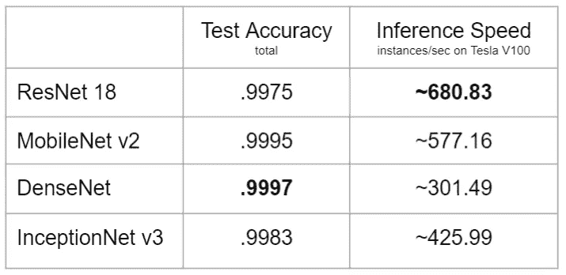

# 用 PyTorch 创建一个强大的新冠肺炎面具检测工具

> 原文：<https://towardsdatascience.com/creating-a-powerful-covid-19-mask-detection-tool-with-pytorch-d961b31dcd45?source=collection_archive---------23----------------------->

## 快速建立小而精确的图像分类模型的实例研究


马修·韦林在 [Unsplash](https://unsplash.com?utm_source=medium&utm_medium=referral) 上的照片

在过去的一年里，新冠肺炎给世界带来了社会、经济和人类的损失。人工智能工具可以**识别正确的面具佩戴，以帮助重新打开世界，防止未来的大流行。**

当然，这有更深层的社会含义，比如隐私和安全的权衡。这些将在随附的 arXiv 研究论文[中讨论。](https://arxiv.org/pdf/2105.01816.pdf)

在这篇文章中，我将带你浏览我们创建的项目。

读完这篇文章*，你将有知识创建一个类似的管道，不仅用于遮罩检测，也用于任何类型的图像识别*。

# 特征工程


我们的数据集

使用 [MaskedFace-Net](https://github.com/cabani/MaskedFace-Net) 和 [Flickr Faces](https://github.com/NVlabs/ffhq-dataset) 数据集，我们将图像大小调整为 128x128 以节省空间。我们将图像移动到三个文件夹中(train、val 和 test)。每个文件夹都有三个子目录(正确/不正确/无掩码)。这使得他们很容易装载 PyTorch 的火炬视觉。

```
batch = 16 train_dataset = torchvision.datasets.ImageFolder('./Data_Sample/train', transform = train_transform)val_dataset = torchvision.datasets.ImageFolder('./Data_Sample/val', transform = test_transform)test_dataset = torchvision.datasets.ImageFolder('./Data_Sample/test', transform = test_transform)train_dataset_loader = torch.utils.data.DataLoader(
train_dataset, batch_size=batch, shuffle=True)val_dataset_loader = torch.utils.data.DataLoader(
val_dataset, batch_size=batch, shuffle=True)test_dataset_loader = torch.utils.data.DataLoader(
test_dataset, batch_size=batch, shuffle=False)
```

如果您查看代码片段，您会发现我们使用了 torchvision 的内置参数来对我们的图像进行转换。

对于所有数据，我们将图像转换为张量，并使用一些标准值对其进行归一化。对于训练和验证数据，我们应用了额外的转换。例如，随机对图像进行重新着色、调整大小和模糊处理。这些是应用于每一批的**，意味着模型试图学习一个移动目标**:每次应用不同噪声的训练图像。

```
import torchvision.transforms as transformstest_transform = transforms.Compose([
transforms.ToTensor(),
transforms.Normalize(mean=[0.485, 0.456, 0.406], std=[0.229, 0.224, 0.225]),
])
```

变换使您的模型规范化，使其更好地一般化。因此，它将在真实世界的数据上表现得更好。

# 基线模型

对于像实时图像分类这样的目标，准确性和速度都是关键。这些通常有一个权衡，因为较大的模型可能具有较高的准确性。为了获得基线，我们从应用更快的机器学习模型开始。

好家伙，我们会大吃一惊的！我们意识到，我们的数据集使用合成模型使得预测变得有些琐碎。在时间压力下，并且在我们使用的 180，000 张图像附近没有数据集，我们**继续研究如何进一步提高性能**。


基线模型精度

对于这些更简单的模型，我们使用 LeakyReLU 和 AdamW 训练了 scikit-learn 的随机森林、cv2 的 Haar 级联分类器和自定义 CNN。

# 高级模型

接下来，我们开始使用最先进的模型。顶级研究人员使用数百万美元的计算来训练和微调这些模型。对于一般问题，它们往往工作得最好。

我们可以用我们的数据训练它们，看看它们在我们的面具分类任务中表现如何。这种**转移学习**比从头开始训练要快得多，因为权重已经接近最优。我们的训练会使他们变得更好。

下面的函数用于不同的 torchvision 模型，看看它们的性能如何。

```
# Takes the model and applies transfer learning
# Returns the model and an array of validation accuracies
def train_model(model, dataloaders, optimizer, criterion, scheduler, device, num_epochs=20):
 startTime = time.time()
 top_model = copy.deepcopy(model.state_dict())
 top_acc = 0.0 for epoch in range(num_epochs): for data_split in ['Train', 'Validation']: if data_split == 'Train':
    scheduler.step()
    model.train() else:
    model.eval() # Track running loss and correct predictions
   running_loss = 0.0
   running_correct = 0 # Move to device
   for inputs, labels in dataloaders[data_split]:
    inputs = inputs.to(device)
    labels = labels.to(device) # Zero out the gradient
    optimizer.zero_grad()# Forward pass
   # Gradient is turned on for train
    with torch.set_grad_enabled(data_split == "Train"):
    outputs = model(inputs)
    loss = criterion(outputs, labels)
    _, preds = torch.max(outputs, 1)
    if data_split == "Train":
     loss.backward()
     optimizer.step()
    # Update running loss and correct predictions
    running_loss += loss.item() * inputs.size(0)
    running_correct += torch.sum (labels.data == preds)

   epoch_loss = running_loss / dataloader_sizes[data_split]
   epoch_acc = running_correct.double() / dataloader_sizes[data_split]
   print('{} Loss: {:.2f}, Accuracy: {:.2f}'.format(data_split,     epoch_loss, epoch_acc))
   # If this the top model, deep copy it
   if data_split == "Validation" and epoch_acc > top_acc:
   top_acc = epoch_acc
   top_model = copy.deepcopy(model.state_dict()) print("Highest validation accuracy: {:.2f}".format(top_acc)) # Load best model's weights
 model.load_state_dict(top_model)
 return model;
```

由于我们的重点是速度，我们选择了四个较小但性能良好的神经网络，并取得了以下结果:



迁移学习模型的准确性

大幅提升！**但是我们能做得更好吗？**

# 蒸馏

这是**的第一步。**


Jan Ranft 在 [Unsplash](https://unsplash.com?utm_source=medium&utm_medium=referral) 上拍摄的照片

蒸馏是一项前沿技术，它训练更小的模型来做出更快的预测。它从网络中提取知识。这非常适合我们的用例。

在蒸馏中，你从教师模型中训练学生。不是根据你的数据训练你的模型，**而是根据另一个模型的预测训练它**。因此，您可以用更小的网络来复制结果。

蒸馏的实施可能具有挑战性且需要大量资源。幸运的是， [KD_Lib](https://github.com/SforAiDl/KD_Lib) for PyTorch 提供了可作为库访问的研究论文的实现。下面的代码片段用于香草蒸馏。

```
import torchimport torch.optim as optimfrom torchvision import datasets, transforms
from KD_Lib.KD import VanillaKD# Define models
teacher_model = resnet
student_model = inception# Define optimizers
teacher_optimizer = optim.SGD(teacher_model.parameters(), 0.01)
student_optimizer = optim.SGD(student_model.parameters(), 0.01)# Perform distillation
distiller = VanillaKD(teacher_model, student_model, train_dataset_loader, val_dataset_loader,
teacher_optimizer, student_optimizer, device = 'cuda')
distiller.train_teacher(epochs=5, plot_losses=True, save_model=True)
distiller.train_student(epochs=5, plot_losses=True, save_model=True)
distiller.evaluate(teacher=False)
distiller.get_parameters()
```

在我们的 DenseNet 模型上使用香草蒸馏，我们**用我们的基线 CNN 达到了 99.85%的准确率**。在 V100 上，CNN **以每秒 775 次推理的速度超过了所有最先进型号的速度**。CNN 用 15%的参数做到了这一点。

***更加赫然，*** 再次运行蒸馏继续提高精度。例如，NoisyTeacher、SelfTraining 和 MessyCollab 的组合提高了结果。

*边注:* [*自我训练*](https://arxiv.org/abs/1909.11723) *把你的模型既当老师又当学生，多爽！*

# 结束语

创建一个正确使用面具的分类器既及时又紧迫。

构建这条管道的**课程对你想做的任何图像分类任务**都是有用的。希望这个管道有助于理解和解决你想要做的任何图像分类任务。*祝你好运！*

> 相关论文:【https://arxiv.org/pdf/2105.01816.pdf】
> 
> 相关演示:[https://www.youtube.com/watch?v=iyf4uRWgkaI](https://www.youtube.com/watch?v=iyf4uRWgkaI)


掩模分类器(单独的 YOLOv5 管道，在[纸](https://arxiv.org/pdf/2105.01816.pdf)中)